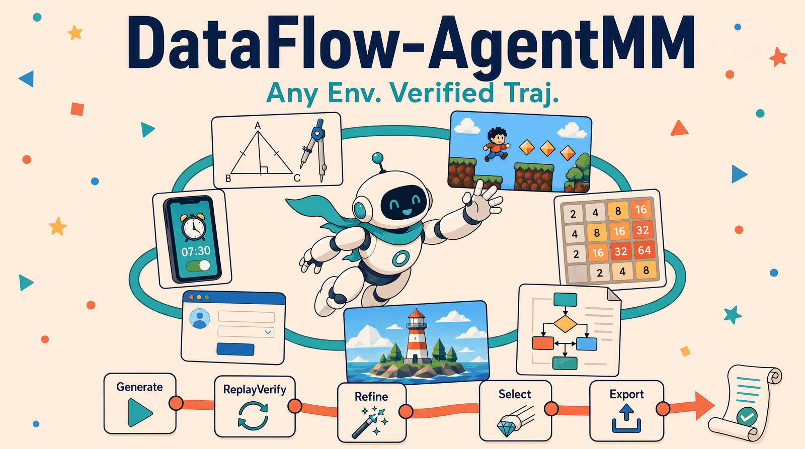
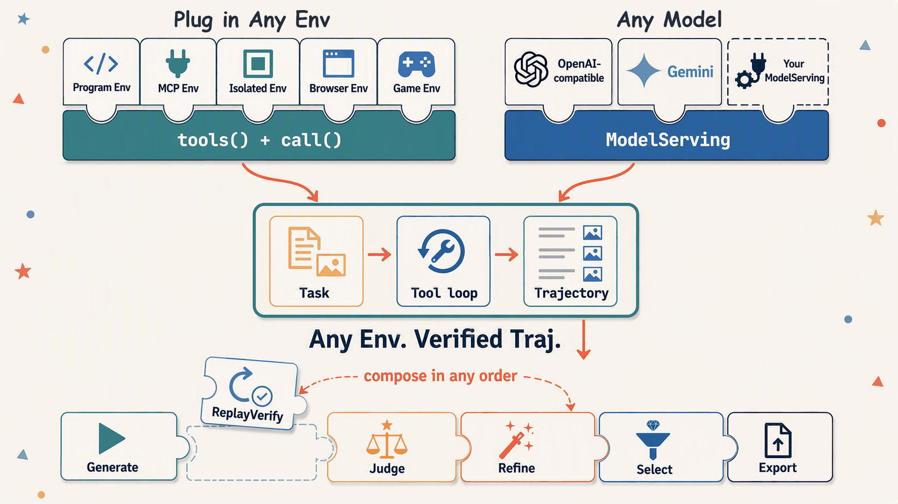

<h1 align="center">DataFlow-AgentMM</h1>

<p align="center"></p>

<p align="center">
  <a href="pyproject.toml"></a>
  <a href="dataflow_agentmm/version.py"></a>
  <a href="https://github.com/OpenDCAI/DataFlow"></a>
  <a href="LICENSE"></a>
</p>

**Run multimodal agents in visual environments and get every run back as a
structured, replayable `Trajectory`.**

- **Watch agents act on pixels** — a task, an Env, and one tool loop; every
  action and rendered observation is recorded.
- **Synthesize trajectory data** — generate at scale, then verify, judge,
  repair, and select trajectories for downstream use.
- **Trust what you keep** — deterministic replay in a fresh Env answers whether
  the recorded actions really produce the final state.

Python package: `dataflow_agentmm`. Text and image are the canonical content
types today; the contracts leave room for more modalities without making every
Env stateful.

<p align="center">
  <strong>English</strong> | <a href="README.zh-CN.md">简体中文</a>
</p>
<p align="center">
  <a href="#showcases">Showcases</a> | <a href="#framework">Framework</a> | <a href="#pipeline">Pipeline</a> | <a href="#contract">Contract</a> | <a href="#further-reading">Further reading</a>
</p>

<a name="showcases"></a>

<a name="what-can-this-package-do"></a>

## 🎨 What can this package do?

<div align="center">
<table align="center">
  <tr>
    <td align="center" width="33%" valign="top">
      <a href="examples/showcases/01_geometry_proof.md"></a><br>
      <sub>Mathematical reasoning · geometry proofs</sub>
    </td>
    <td align="center" width="33%" valign="top">
      <a href="examples/showcases/02_pixel_game.md"></a><br>
      <sub>Pyxel game · visual planning</sub>
    </td>
    <td align="center" width="33%" valign="top">
      <a href="examples/showcases/03_pptx.md"></a><br>
      <sub>PowerPoint · editable reconstruction</sub>
    </td>
  </tr>
  <tr>
    <td align="center" width="33%" valign="top">
      <a href="examples/showcases/05_mobile_weekly_alarms.md"></a><br>
      <sub>Mobile use · Android alarms</sub>
    </td>
    <td align="center" width="33%" valign="top">
      <a href="examples/showcases/07_blender_lighthouse.md"></a><br>
      <sub>Blender · 3D scene construction</sub>
    </td>
    <td align="center" width="33%" valign="top">
      <a href="examples/showcases/08_vlmgym_2048.md"></a><br>
      <sub>2048 · planning from pixels</sub>
    </td>
  </tr>
</table>
</div>

1. **Image-grounded mathematical reasoning** —
   [watch an agent construct and prove an olympiad geometry problem](examples/showcases/01_geometry_proof.md).
2. **Visual planning in planar games** —
   [follow a Pyxel agent collecting five gems under a move budget](examples/showcases/02_pixel_game.md).
3. **Editable visual reconstruction** —
   [recreate a three-page reference deck as an editable PowerPoint](examples/showcases/03_pptx.md).
4. **Document-to-diagram synthesis** —
   [turn two incident-runbook pages into an editable operational flow](examples/showcases/04_diagram.md).
5. **Mobile UI automation** —
   [set weekday, weekend, and reading alarms on an isolated Android device](examples/showcases/05_mobile_weekly_alarms.md).
6. **Browser-based planning and form interaction** —
   [save an activity-day schedule under time and budget constraints](examples/showcases/06_playwright_studio_day.md).
7. **3D scene construction** —
   [build a low-poly island lighthouse in Blender, with the step-limit outcome preserved](examples/showcases/07_blender_lighthouse.md).
8. **Visual game planning: 2048** —
   [read tile values from G1 VLM-Gym frames and build a 64 tile from a fresh board](examples/showcases/08_vlmgym_2048.md).
9. **Visual path planning: Shisen-Sho** —
   [connect identical tiles on G1's 12x12 board with at most two turns](examples/showcases/09_vlmgym_shisensho.md).
10. **Class-level visual matching** —
   [clear a Shisen-Sho board whose tiles are CIFAR-10 photos](examples/showcases/10_vlmgym_shisensho_cifar10.md).
11. **Match-3 with cascades** —
   [reach 150 points on G1's Swap board through reshuffles](examples/showcases/11_vlmgym_swap.md).
12. **Why a deterministic verifier is necessary** —
   [inspect a trajectory that received Judge 1.0 but failed exact state verification](examples/showcases/12_why_deterministic_verifier.md).

The showcase pages use GitHub-native Markdown, full-trajectory GIF previews,
ordinary image assets under every corresponding tool step, and compact JSON.
They do not require JavaScript or embed images as base64 inside a large HTML file. See the
[showcase index](examples/showcases/README.md) for artifacts and run metadata.

<a name="quickstart"></a>

## 🚀 Quickstart

With Python 3.10+ and Git available, install the package and its Python dependencies:

```bash
python -m pip install --upgrade pip
python -m pip install \
  "git+https://github.com/OpenDCAI/DataFlow-MM.git@155253460f6f2e50705a3e779f259b382a382822" \
  "git+https://github.com/OpenDCAI/DataFlow-Agent.git@mm-agent"
python -m pip check
```

Next, configure an OpenAI-compatible model endpoint and register an Env.
Continue with [From installation to your first trajectory](QUICKSTART.md)
for environment setup, your first rollout, trajectory inspection, and export.

<a name="framework"></a>

<a name="framework-design"></a>

## 🧩 Framework design

DataFlow-AgentMM connects environment interaction, trajectory recording, and
data processing through shared contracts. This lets new Envs reuse the same
rollout and evaluation components.

- **Lightweight environment integration.** An Env exposes its tools through
  `tools()` and executes them through `call()`, with optional `start()` and
  `close()` hooks. Integration code and application dependencies live in
  separate Env packs, which can run in their own Python processes.
- **Structured multimodal trajectories.** A `Trajectory` records model messages,
  actions, and observations, with text and images as explicit content blocks.
  The same record supports visualization, action replay in a fresh Env, and
  conversion to ms-swift format.
- **Separate verification and quality evaluation.** ReplayVerify replays actions
  and checks the task's deterministic conditions; Judge evaluates the recorded
  evidence against a rubric and provides repair suggestions. Their results
  remain separate so pipelines can use the checks appropriate to each task.
- **Composable data processing.** Generation, search, verification, judging,
  refinement, selection, and export are independent operators or utilities.
  Pipelines can combine them as needed; Refine produces a new trajectory while
  preserving the original attempt for comparison.

<a name="pipeline"></a>

<a name="trajectory-pipeline"></a>

## 🔄 Trajectory pipeline

A `Task` names an Env and carries the messages the model sees. `AgentRollout`
creates a fresh Env, runs one tool loop, and records every action and
observation as a `Trajectory`. Operators then compose around that record:

<p align="center"></p>

| Stage | Operator | What it does |
| --- | --- | --- |
| Generate | `AgentMMExploreGenerator` | Runs the tool loop and records unscored trajectories; resumable per sample. |
| Search | `AgentMMExploreTreeGenerator` | Branches several actions per node, each child replayed from a fresh Env. |
| ReplayVerify | `AgentMMReplayVerifier` | Replays stored actions in a fresh Env and runs the task's deterministic verifier. |
| Judge | `AgentMMTrajectoryQualityEvaluator` | Scores the task rubric from the real observations and reports which steps failed. |
| Refine | `AgentMMTrajectoryRefiner` | Re-explores with the verifier findings, the reviewer suggestion, and the flagged steps. |
| Select | `AgentMMTrajectorySelector` | Keeps trajectories meeting declarative quality conditions, then ranks, de-duplicates, and caps them. |
| Export | `dataflow_agentmm.export` | Converts trajectories to ms-swift `messages` JSONL format. |

Judge and ReplayVerify answer different questions: one reviews the process, the
other reproduces the actions and checks exact state. Open-ended authoring tasks
report `not_applicable` for replay rather than pretending to have a verifier.

<a name="lightweight-env-design"></a>

## 🪶 Lightweight Env design

An Env is a tool catalog plus a dispatcher. That is the complete mandatory
surface:

```python
def tools(self) -> Sequence[ToolSpec]: ...
def call(self, tool_name: str, args: Mapping[str, Any]) -> ToolResult: ...
```

```python
class EchoEnv:
    def tools(self):
        return (ToolSpec(
            name="echo",
            description="Echo one string.",
            operation_type="query",
            input_schema={"type": "object", "properties": {"text": {"type": "string"}},
                          "required": ["text"], "additionalProperties": False},
        ),)

    def call(self, tool_name, args):
        if tool_name != "echo":
            return ToolResult.failure("unknown_tool", tool_name)
        return ToolResult.success((TextContent(args["text"]),))


register_env("echo", EchoEnv, description="A stateless echo service.", modalities=("text",))
```

Stateful Envs may additionally expose `start(init, workspace)` and `close()`.
They never implement a task provider, Scenario, snapshot, or verifier, and the
runner supplies `finish` itself. Rollout and replay share one startup order:

```text
create Env -> optional start(init, workspace) -> tools() -> tool loop -> close()
```

An MCP server attaches through the same surface: map `list_tools()` to
`ToolSpec`, map `call_tool()` to `ToolResult`, and register the adapter factory.
A session-based server connects in `start()`, discovers its catalog through that
session, and releases it in `close()`; the MCP SDK stays in the Env package.

The bundled [`create-env` workspace skill](dataflow_agentmm/skills/create-env/SKILL.md)
documents catalog discovery, lifecycle rules, the adapter workflow, and the
validation gates in full.

<a name="contract"></a>

<a name="core-contracts"></a>

## 📐 Core contracts

```text
Task ──> AgentRollout ──> Trajectory
 │           │
 │           └── fresh Env selected by task.env_id
 │
 └── optional Scenario(init)

Trajectory + TaskResolver + optional VerifierResolver
                              └──> ReplayVerify ──> ReplayVerification
```

- A runner always receives a `Task`; a Task and its trajectories have a
  one-to-many relationship.
- `Scenario` exists only when private initialization data must enter a fresh Env.
- The registry owns Env factories and solver-facing metadata, not tasks.
- Verification is resolved independently and never forces a Scenario.
- `Trajectory` contains actions and observations, not a verifier score or
  private Scenario data.

<a name="repository-layout"></a>

## 📁 Repository layout

```text
dataflow-agentmm/
├── dataflow_agentmm/
│   ├── contracts/          # Task, Env, messages, tools, trajectory
│   ├── env/                # registry, plugins, process-isolated adapters
│   ├── runtime_components/ # rollout, tool loop, context policy, ReplayVerify
│   ├── operators/          # Generate, Judge, Refine, Select
│   ├── export/             # ms-swift format conversion
│   ├── prompts.py          # built-in English and Chinese prompt text
│   ├── serving/            # OpenAI-compatible and Gemini multimodal serving
│   ├── visualization/      # offline trajectory HTML exporter and viewer
│   ├── skills/create-env/  # workspace skill for Env and MCP adoption
│   └── storage/            # task and trajectory stores
├── examples/showcases/     # GitHub-native trajectory walkthroughs
├── QUICKSTART.md
├── LICENSE
└── pyproject.toml
```

Concrete Envs are outside the core distribution so installing one integration
does not force every rendering or game dependency into `dataflow-agentmm`.
An integration may use the package's process proxy when it needs a dedicated
interpreter or dependency boundary.

<a name="scope"></a>

## 🎯 Scope

- Text and image are the canonical content types today; audio and video are not
  part of the contracts yet.
- This package ships the runtime, operators, and contracts. Concrete Envs, their
  dependencies, and their tasks live in separate Env packs.
- Deterministic replay requires an Env whose actions reproduce the same state;
  Envs backed by unseeded randomness or external live services cannot be
  verified this way.
- Process isolation is optional: use it when an Env needs its own interpreter or
  dependency boundary.

<a name="further-reading"></a>

## 📚 Further reading

- [From installation to your first trajectory](QUICKSTART.md)
- [Showcase index](examples/showcases/README.md)
- [Offline trajectory HTML reports](dataflow_agentmm/visualization/README.md)
- [Create an Env or MCP adapter](dataflow_agentmm/skills/create-env/SKILL.md)
- [Env contracts and package layout](dataflow_agentmm/skills/create-env/references/contracts-and-layout.md)
- [Task generation](dataflow_agentmm/skills/create-env/references/task-generation.md)
- [Validation strategy](dataflow_agentmm/skills/create-env/references/validation.md)

<a name="license"></a>

## 📄 License

Apache-2.0. See [LICENSE](LICENSE).

<a name="acknowledgements"></a>

## 🙏 Acknowledgements

- [DataFlow-MM](https://github.com/OpenDCAI/DataFlow) for the operator, storage,
  and registry conventions this package builds on.
- The Env packs and upstream projects behind the bundled showcases; each pack
  documents its own sources and licenses.
