# Weekly alarms on Android

[← All showcases](README.md)

> **Recorded outcome:** Original-only rollout: Kimi K3 set the alarms from an empty Clock state. The result was captured before the operator restored the emulator baseline; this is not a change to a personal phone. No Refine or deterministic verifier was run.

> **Complete trajectory imagery:** the animation is a compressed overview of every rendered observation. Every original image is also preserved inside its corresponding tool-call section.

The agent configures three recurring alarms through the Clock UI on a dedicated Android emulator, preserving default sound and vibration settings. It discovers the installed app after an initial package-name error and finishes on step 80.

| Env | Task | Branch | Steps | ReplayVerify | Judge |
| --- | --- | --- | ---: | --- | ---: |
| `mobile_mcp` | `mobile-weekly-alarms-001` | initial | 80 | not_applicable | 1.00 |

## Recorded run

- Rollout model: `kimi-k3`; independent Judge: `kimi-k2.6`.
- Termination: **`finish`**; 80 actions, 60 recorded images.
- Scores are task-owned rubric judgments, not deterministic verification results.
- Host-local path prefixes are replaced with `<LOCAL_DF>/`; no system prompt or provider-private reasoning is exported.

## Task

> 帮我把时钟里的作息闹钟设一下：工作日早上7:20起床，周末改成9:10，分别叫「工作日起床」和「周末慢慢来」，这两个都开启。
>
> 再加一个每天晚上22:45的「睡前阅读」，这个先关着，等我想用的时候再打开。铃声和振动保持默认就好。设好以后告诉我最后的安排。

[Open compact trajectory JSON](trajectories/mobile_weekly_alarms.json).

## Visual checkpoints

 Full trajectory — every rendered observation in chronological order

## Trajectory

Action mix: `mobile_click_on_screen_at_coordinates` × 38, `mobile_take_screenshot` × 17, `mobile_list_elements_on_screen` × 16, `mobile_type_keys` × 4, `mobile_launch_app` × 2, `mobile_list_available_devices` × 1, `mobile_list_apps` × 1, `finish` × 1.

<code>01 · mobile_list_available_devices</code> — 首先需要列出可用设备，然后打开时钟应用设置闹钟。

**Reasoning**

首先需要列出可用设备，然后打开时钟应用设置闹钟。

**Arguments**

<pre><code>{}</code></pre>

**Observation**

<pre><code>{&quot;devices&quot;:[{&quot;id&quot;:&quot;local_df_clock&quot;,&quot;name&quot;:&quot;local df clock&quot;,&quot;platform&quot;:&quot;android&quot;,&quot;type&quot;:&quot;emulator&quot;,&quot;version&quot;:&quot;15&quot;,&quot;state&quot;:&quot;online&quot;,&quot;model&quot;:&quot;Android SDK built for arm64&quot;}]}</code></pre>

<code>02 · mobile_launch_app</code> — 找到一台 Android 模拟器 local_df_clock。现在启动时钟应用（Google 时钟包名通常是 com.google.android.deskclock）。

**Reasoning**

找到一台 Android 模拟器 local_df_clock。现在启动时钟应用（Google 时钟包名通常是 com.google.android.deskclock）。

**Arguments**

<pre><code>{
  &quot;device&quot;: &quot;local_df_clock&quot;,
  &quot;packageName&quot;: &quot;com.google.android.deskclock&quot;
}</code></pre>

**Observation**

<pre><code>ERROR [mcp_tool_error]: Error: Command failed: &lt;LOCAL_DF&gt;/mcps/mobile-mcp/node_modules/@mobilenext/mobilecli-darwin-arm64/mobilecli-darwin-arm64 apps launch com.google.android.deskclock --device local_df_clock
failed to launch app on device local_df_clock: no launcher activity found for com.google.android.deskclock (is it installed?)</code></pre>

<code>03 · mobile_list_apps</code> — Google 时钟未安装。列出设备上的应用，找到时钟应用的包名。

**Reasoning**

Google 时钟未安装。列出设备上的应用，找到时钟应用的包名。

**Arguments**

<pre><code>{
  &quot;device&quot;: &quot;local_df_clock&quot;
}</code></pre>

**Observation**

<pre><code>Found these apps on device: Files (com.android.documentsui), Search (com.android.quicksearchbox), Messaging (com.android.messaging), Contacts (com.android.contacts), Camera (com.android.camera2), SIM Toolkit (com.android.stk), Calendar (com.android.calendar), Phone (com.android.dialer), Gallery (com.android.gallery3d), WebView Shell (org.chromium.webview_shell), Settings (com.android.settings), Clock (com.android.deskclock)</code></pre>

<code>04 · mobile_launch_app</code> — 设备上的时钟应用是 com.android.deskclock，启动它。

**Reasoning**

设备上的时钟应用是 com.android.deskclock，启动它。

**Arguments**

<pre><code>{
  &quot;device&quot;: &quot;local_df_clock&quot;,
  &quot;packageName&quot;: &quot;com.android.deskclock&quot;
}</code></pre>

**Observation**

<pre><code>Launched app com.android.deskclock</code></pre>

<code>05 · mobile_list_elements_on_screen</code> — 时钟应用已打开，当前没有闹钟。先列出屏幕元素，找到「+」按钮的 ref。

**Reasoning**

时钟应用已打开，当前没有闹钟。先列出屏幕元素，找到「+」按钮的 ref。

**Arguments**

<pre><code>{
  &quot;device&quot;: &quot;local_df_clock&quot;
}</code></pre>

**Observation**

<pre><code>One element per line: @ref Type text= label= name= value= id= at=x,y size=WxH [focused] [selected] [checked] [disabled]
@e1 FrameLayout id=&quot;com.android.launcher3:id/taskbar_container&quot; at=0,2208 size=1080x132
@e2 View id=&quot;com.android.launcher3:id/taskbar_scrim&quot; at=0,2208 size=1080x132
@e3 FrameLayout id=&quot;com.android.launcher3:id/navbuttons_view&quot; at=0,2208 size=1080x132
@e4 FrameLayout id=&quot;com.android.launcher3:id/start_contextual_buttons&quot; at=72,2208 size=93x132
@e5 LinearLayout id=&quot;com.android.launcher3:id/end_nav_buttons&quot; at=165,2208 size=748x132
@e6 ImageView label=&quot;Back&quot; id=&quot;com.android.launcher3:id/back&quot; at=166,2213 size=187x121
@e7 ImageView label=&quot;Home&quot; id=&quot;com.android.launcher3:id/home&quot; at=429,2213 size=220x121
@e8 ImageView label=&quot;Recents&quot; id=&quot;com.android.launcher3:id/recent_apps&quot; at=725,2213 size=187x121
@e9 FrameLayout id=&quot;com.android.launcher3:id/end_contextual_buttons&quot; at=915,2208 size=93x132
@e10 FrameLayout id=&quot;com.android.systemui:id/status_bar_launch_animation_container&quot; at=0,0 size=1080x66
@e11 FrameLayout id=&quot;com.android.systemui:id/container&quot; at=0,0 size=1080x66
@e12 FrameLayout id=&quot;com.android.systemui:id/status_bar_container&quot; at=0,0 size=1080x66
@e13 FrameLayout id=&quot;com.android.systemui:id/status_bar&quot; at=0,0 size=1080x66
@e14 LinearLayout id=&quot;com.android.systemui:id/status_bar_contents&quot; at=136,0 size=889x66
@e15 FrameLayout id=&quot;com.android.systemui:id/status_bar_start_side_container&quot; at=147,6 size=433x60
@e16 FrameLayout id=&quot;com.android.systemui:id/status_bar_start_side_content&quot; at=147,6 size=170x60
@e17 LinearLayout id=&quot;com.android.systemui:id/status_bar_start_side_except_heads_up&quot; at=147,6 size=170x60
@e18 TextView text=&quot;3:05&quot; label=&quot;3:05 PM&quot; id=&quot;com.android.systemui:id/clock&quot; at=147,48 size=109x18
@e19 FrameLayout id=&quot;com.android.systemui:id/notification_icon_area&quot; at=256,6 size=61x60
@e20 ViewGroup id=&quot;com.android.systemui:id/notificationIcons&quot; at=256,6 size=61x60
@e21 ImageView label=&quot;Android System notification: &quot; at=256,38 size=61x28
@e22 FrameLayout id=&quot;com.android.systemui:id/status_bar_end_side_container&quot; at=580,6 size=434x60
@e23 LinearLayout id=&quot;com.android.systemui:id/status_bar_end_side_content&quot; at=868,6 size=146x60
@e24 LinearLayout id=&quot;com.android.systemui:id/system_icons&quot; at=868,40 size=146x26
@e25 LinearLayout id=&quot;com.android.systemui:id/statusIcons&quot; at=876,40 size=106x26
@e26 FrameLayout id=&quot;com.android.systemui:id/wifi_combo&quot; at=876,40 size=48x26
@e27 LinearLayout id=&quot;com.android.systemui:id/wifi_group&quot; at=883,40 size=41x26
@e28 FrameLayout id=&quot;com.android.systemui:id/wifi_combo&quot; at=883,50 size=41x16
@e29 ImageView label=&quot;Wifi signal full.,No internet&quot; id=&quot;com.android.systemui:id/wifi_signal&quot; at=883,50 size=41x16
@e30 FrameLayout label=&quot;Phone signal full.&quot; id=&quot;com.android.systemui:id/mobile_combo&quot; at=924,40 size=41x26
@e31 LinearLayout id=&quot;com.android.systemui:id/mobile_group&quot; at=924,40 size=41x26
@e32 ImageView id=&quot;com.android.systemui:id/mobile_signal&quot; at=924,50 size=41x16
@e33 LinearLayout label=&quot;Battery charging, 100 percent.&quot; id=&quot;com.android.systemui:id/battery&quot; at=982,52 size=21x14
@e34 LinearLayout id=&quot;com.android.deskclock:id/action_bar_root&quot; at=0,136 size=1080x2204
@e35 FrameLayout id=&quot;android:id/content&quot; at=0,136 size=1080x2204
@e36 ViewGroup id=&quot;com.android.deskclock:id/content&quot; at=0,136 size=1080x2204
@e37 ViewGroup id=&quot;com.android.deskclock:id/toolbar&quot; at=0,136 size=1080x198
@e38 HorizontalScrollView id=&quot;com.android.deskclock:id/tabs&quot; at=0,136 size=969x198
@e39 LinearLayout label=&quot;Alarm&quot; at=0,136 size=242x198 selected
@e40 TextView text=&quot;ALARM&quot; id=&quot;android:id/text1&quot; at=64,168 size=113x133 selected
@e41 LinearLayout label=&quot;Clock&quot; at=242,136 size=242x198
@e42 TextView text=&quot;CLOCK&quot; id=&quot;android:id/text1&quot; at=310,168 size=105x133
@e43 LinearLayout label=&quot;Timer&quot; at=484,136 size=242x198
@e44 TextView text=&quot;TIMER&quot; id=&quot;android:id/text1&quot; at=556,168 size=98x133
@e45 LinearLayout label=&quot;Stopwatch&quot; at=726,136 size=243x198
@e46 TextView text=&quot;STOPWATCH&quot; id=&quot;android:id/text1&quot; at=749,168 size=197x133
@e47 ImageView label=&quot;More options&quot; at=969,147 size=111x132
@e48 View id=&quot;com.android.deskclock:id/tab_hairline&quot; at=0,334 size=1080x3
@e49 ViewGroup id=&quot;com.android.deskclock:id/desk_clock_pager&quot; at=0,337 size=1080x1871
@e50 FrameLayout id=&quot;com.android.deskclock:id/main&quot; at=0,337 size=1080x1871
@e51 TextView text=&quot;No Alarms&quot; label=&quot;No Alarms&quot; id=&quot;com.android.deskclock:id/alarms_empty_view&quot; at=0,957 size=1080x631
@e52 ImageView id=&quot;com.android.deskclock:id/drop_shadow&quot; at=0,337 size=1080x22
@e53 ImageButton label=&quot;Add alarm&quot; id=&quot;com.android.deskclock:id/fab&quot; at=463,2010 size=154x154
@e54 View id=&quot;android:id/navigationBarBackground&quot; at=0,2208 size=1080x132</code></pre>

<code>06 · mobile_click_on_screen_at_coordinates</code> — 找到「Add alarm」按钮 @e53，点击它来新建第一个闹钟（工作日 7:20）。

**Reasoning**

找到「Add alarm」按钮 @e53，点击它来新建第一个闹钟（工作日 7:20）。

**Arguments**

<pre><code>{
  &quot;device&quot;: &quot;local_df_clock&quot;,
  &quot;ref&quot;: &quot;@e53&quot;
}</code></pre>

**Observation**

<pre><code>Clicked on element @e53</code></pre>

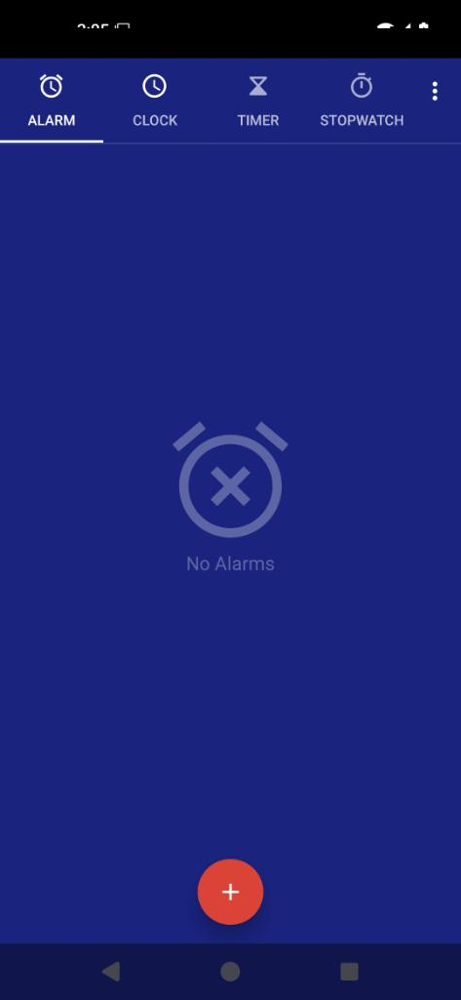

<code>07 · mobile_take_screenshot</code> — 点击后界面似乎还没变化，可能是响应延迟。截图确认当前状态。

**Reasoning**

点击后界面似乎还没变化，可能是响应延迟。截图确认当前状态。

**Arguments**

<pre><code>{
  &quot;device&quot;: &quot;local_df_clock&quot;
}</code></pre>

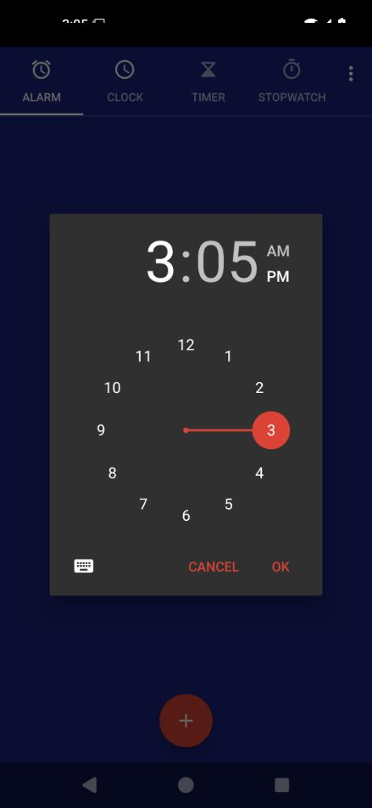

<code>08 · mobile_list_elements_on_screen</code> — 时间选择器已打开，当前显示 3:05。先列出元素，获取表盘数字和 AM/PM 的准确 ref。

**Reasoning**

时间选择器已打开，当前显示 3:05。先列出元素，获取表盘数字和 AM/PM 的准确 ref。

**Arguments**

<pre><code>{
  &quot;device&quot;: &quot;local_df_clock&quot;
}</code></pre>

**Observation**

<pre><code>One element per line: @ref Type text= label= name= value= id= at=x,y size=WxH [focused] [selected] [checked] [disabled]
@e1 FrameLayout id=&quot;com.android.launcher3:id/taskbar_container&quot; at=0,2208 size=1080x132
@e2 View id=&quot;com.android.launcher3:id/taskbar_scrim&quot; at=0,2208 size=1080x132
@e3 FrameLayout id=&quot;com.android.launcher3:id/navbuttons_view&quot; at=0,2208 size=1080x132
@e4 FrameLayout id=&quot;com.android.launcher3:id/start_contextual_buttons&quot; at=72,2208 size=93x132
@e5 LinearLayout id=&quot;com.android.launcher3:id/end_nav_buttons&quot; at=165,2208 size=748x132
@e6 ImageView label=&quot;Back&quot; id=&quot;com.android.launcher3:id/back&quot; at=166,2213 size=187x121
@e7 ImageView label=&quot;Home&quot; id=&quot;com.android.launcher3:id/home&quot; at=429,2213 size=220x121
@e8 ImageView label=&quot;Recents&quot; id=&quot;com.android.launcher3:id/recent_apps&quot; at=725,2213 size=187x121
@e9 FrameLayout id=&quot;com.android.launcher3:id/end_contextual_buttons&quot; at=915,2208 size=93x132
@e10 FrameLayout id=&quot;com.android.systemui:id/status_bar_launch_animation_container&quot; at=0,0 size=1080x66
@e11 FrameLayout id=&quot;com.android.systemui:id/container&quot; at=0,0 size=1080x66
@e12 FrameLayout id=&quot;com.android.systemui:id/status_bar_container&quot; at=0,0 size=1080x66
@e13 FrameLayout id=&quot;com.android.systemui:id/status_bar&quot; at=0,0 size=1080x66
@e14 LinearLayout id=&quot;com.android.systemui:id/status_bar_contents&quot; at=136,0 size=889x66
@e15 FrameLayout id=&quot;com.android.systemui:id/status_bar_start_side_container&quot; at=147,6 size=433x60
@e16 FrameLayout id=&quot;com.android.systemui:id/status_bar_start_side_content&quot; at=147,6 size=170x60
@e17 LinearLayout id=&quot;com.android.systemui:id/status_bar_start_side_except_heads_up&quot; at=147,6 size=170x60
@e18 TextView text=&quot;3:06&quot; label=&quot;3:06 PM&quot; id=&quot;com.android.systemui:id/clock&quot; at=147,48 size=109x18
@e19 FrameLayout id=&quot;com.android.systemui:id/notification_icon_area&quot; at=256,6 size=61x60
@e20 ViewGroup id=&quot;com.android.systemui:id/notificationIcons&quot; at=256,6 size=61x60
@e21 ImageView label=&quot;Android System notification: &quot; at=256,38 size=61x28
@e22 FrameLayout id=&quot;com.android.systemui:id/status_bar_end_side_container&quot; at=580,6 size=434x60
@e23 LinearLayout id=&quot;com.android.systemui:id/status_bar_end_side_content&quot; at=868,6 size=146x60
@e24 LinearLayout id=&quot;com.android.systemui:id/system_icons&quot; at=868,40 size=146x26
@e25 LinearLayout id=&quot;com.android.systemui:id/statusIcons&quot; at=876,40 size=106x26
@e26 FrameLayout id=&quot;com.android.systemui:id/wifi_combo&quot; at=876,40 size=48x26
@e27 LinearLayout id=&quot;com.android.systemui:id/wifi_group&quot; at=883,40 size=41x26
@e28 FrameLayout id=&quot;com.android.systemui:id/wifi_combo&quot; at=883,50 size=41x16
@e29 ImageView label=&quot;Wifi signal full.,No internet&quot; id=&quot;com.android.systemui:id/wifi_signal&quot; at=883,50 size=41x16
@e30 FrameLayout label=&quot;Phone signal full.&quot; id=&quot;com.android.systemui:id/mobile_combo&quot; at=924,40 size=41x26
@e31 LinearLayout id=&quot;com.android.systemui:id/mobile_group&quot; at=924,40 size=41x26
@e32 ImageView id=&quot;com.android.systemui:id/mobile_signal&quot; at=924,50 size=41x16
@e33 LinearLayout label=&quot;Battery charging, 100 percent.&quot; id=&quot;com.android.systemui:id/battery&quot; at=982,52 size=21x14
@e34 FrameLayout id=&quot;android:id/content&quot; at=144,619 size=792x1106
@e35 LinearLayout id=&quot;android:id/parentPanel&quot; at=144,619 size=792x1106
@e36 FrameLayout id=&quot;android:id/customPanel&quot; at=144,619 size=792x1106
@e37 FrameLayout id=&quot;android:id/custom&quot; at=144,619 size=792x1106
@e38 TimePicker id=&quot;android:id/timePicker&quot; at=144,619 size=792x1106
@e39 RelativeLayout id=&quot;android:id/time_header&quot; at=144,619 size=792x275
@e40 TextView text=&quot;3&quot; id=&quot;android:id/hours&quot; at=328,641 size=186x220
@e41 TextView text=&quot;:&quot; id=&quot;android:id/separator&quot; at=520,641 size=40x231
@e42 TextView text=&quot;05&quot; id=&quot;android:id/minutes&quot; at=566,641 size=186x220
@e43 RadioGroup id=&quot;android:id/ampm_layout&quot; at=774,679 size=67x170
@e44 RadioButton text=&quot;AM&quot; id=&quot;android:id/am_label&quot; at=774,679 size=67x96
@e45 RadioButton text=&quot;PM&quot; id=&quot;android:id/pm_label&quot; at=774,753 size=66x96 checked
@e46 View id=&quot;android:id/radial_picker&quot; at=188,938 size=704x616
@e47 RadialTimePickerView$RadialPickerTouchHelper label=&quot;1&quot; at=608,977 size=110x110
@e48 RadialTimePickerView$RadialPickerTouchHelper label=&quot;2&quot; at=698,1067 size=110x110
@e49 RadialTimePickerView$RadialPickerTouchHelper label=&quot;3&quot; at=732,1191 size=110x110
@e50 RadialTimePickerView$RadialPickerTouchHelper label=&quot;4&quot; at=698,1314 size=110x110
@e51 RadialTimePickerView$RadialPickerTouchHelper label=&quot;5&quot; at=608,1404 size=110x110
@e52 RadialTimePickerView$RadialPickerTouchHelper label=&quot;6&quot; at=485,1438 size=110x110
@e53 RadialTimePickerView$RadialPickerTouchHelper label=&quot;7&quot; at=361,1404 size=110x110
@e54 RadialTimePickerView$RadialPickerTouchHelper label=&quot;8&quot; at=271,1314 size=110x110
@e55 RadialTimePickerView$RadialPickerTouchHelper label=&quot;9&quot; at=238,1191 size=110x110
@e56 RadialTimePickerView$RadialPickerTouchHelper label=&quot;10&quot; at=271,1067 size=110x110
@e57 RadialTimePickerView$RadialPickerTouchHelper label=&quot;11&quot; at=361,977 size=110x110
@e58 RadialTimePickerView$RadialPickerTouchHelper label=&quot;12&quot; at=485,944 size=110x110
@e59 ImageButton label=&quot;Switch to text input mode for the time input.&quot; id=&quot;android:id/toggle_mode&quot; at=177,1573 size=132x132
@e60 ScrollView id=&quot;android:id/buttonPanel&quot; at=481,1554 size=455x171
@e61 Button text=&quot;CANCEL&quot; id=&quot;android:id/button2&quot; at=514,1565 size=213x149
@e62 Button text=&quot;OK&quot; id=&quot;android:id/button1&quot; at=727,1565 size=176x149</code></pre>

<code>09 · mobile_click_on_screen_at_coordinates</code> — 时间选择器已打开，当前是 3:05 PM。先点 AM（@e44），再点小时数字 7（@e53）。这两步有依赖（点 7 后会切到分钟表盘），先点 AM。

**Reasoning**

时间选择器已打开，当前是 3:05 PM。先点 AM（@e44），再点小时数字 7（@e53）。这两步有依赖（点 7 后会切到分钟表盘），先点 AM。

**Arguments**

<pre><code>{
  &quot;device&quot;: &quot;local_df_clock&quot;,
  &quot;ref&quot;: &quot;@e44&quot;
}</code></pre>

**Observation**

<pre><code>Clicked on element @e44</code></pre>

<code>10 · mobile_click_on_screen_at_coordinates</code> — AM 已选中。现在点击小时表盘上的 7（ref @e53，中心约 416,1459）。

**Reasoning**

AM 已选中。现在点击小时表盘上的 7（ref @e53，中心约 416,1459）。

**Arguments**

<pre><code>{
  &quot;device&quot;: &quot;local_df_clock&quot;,
  &quot;ref&quot;: &quot;@e53&quot;
}</code></pre>

**Observation**

<pre><code>Clicked on element @e53</code></pre>

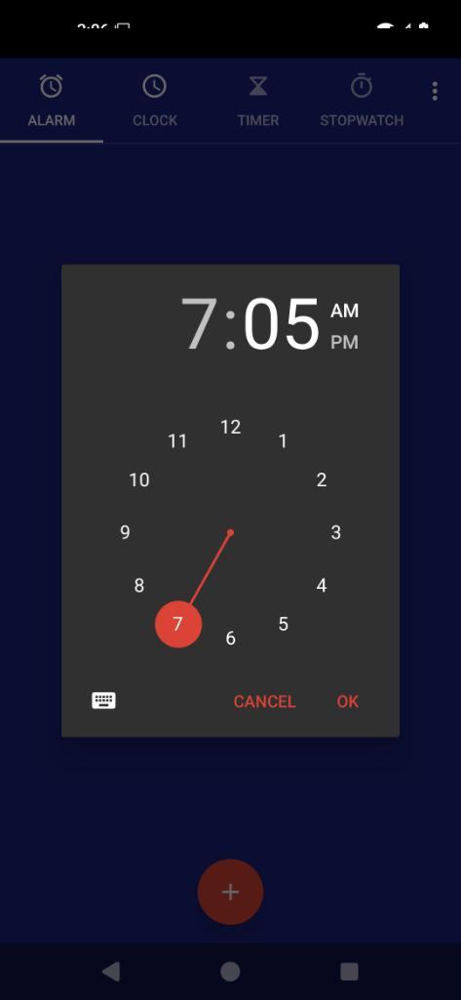

<code>11 · mobile_list_elements_on_screen</code> — 小时已设为 7 AM，表盘已切换到分钟模式（当前 05 分）。20 分钟对应表盘上数字 4 的位置。重新列出元素确认 ref。

**Reasoning**

小时已设为 7 AM，表盘已切换到分钟模式（当前 05 分）。20 分钟对应表盘上数字 4 的位置。重新列出元素确认 ref。

**Arguments**

<pre><code>{
  &quot;device&quot;: &quot;local_df_clock&quot;
}</code></pre>

**Observation**

<pre><code>One element per line: @ref Type text= label= name= value= id= at=x,y size=WxH [focused] [selected] [checked] [disabled]
@e1 FrameLayout id=&quot;com.android.launcher3:id/taskbar_container&quot; at=0,2208 size=1080x132
@e2 View id=&quot;com.android.launcher3:id/taskbar_scrim&quot; at=0,2208 size=1080x132
@e3 FrameLayout id=&quot;com.android.launcher3:id/navbuttons_view&quot; at=0,2208 size=1080x132
@e4 FrameLayout id=&quot;com.android.launcher3:id/start_contextual_buttons&quot; at=72,2208 size=93x132
@e5 LinearLayout id=&quot;com.android.launcher3:id/end_nav_buttons&quot; at=165,2208 size=748x132
@e6 ImageView label=&quot;Back&quot; id=&quot;com.android.launcher3:id/back&quot; at=166,2213 size=187x121
@e7 ImageView label=&quot;Home&quot; id=&quot;com.android.launcher3:id/home&quot; at=429,2213 size=220x121
@e8 ImageView label=&quot;Recents&quot; id=&quot;com.android.launcher3:id/recent_apps&quot; at=725,2213 size=187x121
@e9 FrameLayout id=&quot;com.android.launcher3:id/end_contextual_buttons&quot; at=915,2208 size=93x132
@e10 FrameLayout id=&quot;com.android.systemui:id/status_bar_launch_animation_container&quot; at=0,0 size=1080x66
@e11 FrameLayout id=&quot;com.android.systemui:id/container&quot; at=0,0 size=1080x66
@e12 FrameLayout id=&quot;com.android.systemui:id/status_bar_container&quot; at=0,0 size=1080x66
@e13 FrameLayout id=&quot;com.android.systemui:id/status_bar&quot; at=0,0 size=1080x66
@e14 LinearLayout id=&quot;com.android.systemui:id/status_bar_contents&quot; at=136,0 size=889x66
@e15 FrameLayout id=&quot;com.android.systemui:id/status_bar_start_side_container&quot; at=147,6 size=433x60
@e16 FrameLayout id=&quot;com.android.systemui:id/status_bar_start_side_content&quot; at=147,6 size=170x60
@e17 LinearLayout id=&quot;com.android.systemui:id/status_bar_start_side_except_heads_up&quot; at=147,6 size=170x60
@e18 TextView text=&quot;3:06&quot; label=&quot;3:06 PM&quot; id=&quot;com.android.systemui:id/clock&quot; at=147,48 size=109x18
@e19 FrameLayout id=&quot;com.android.systemui:id/notification_icon_area&quot; at=256,6 size=61x60
@e20 ViewGroup id=&quot;com.android.systemui:id/notificationIcons&quot; at=256,6 size=61x60
@e21 ImageView label=&quot;Android System notification: &quot; at=256,38 size=61x28
@e22 FrameLayout id=&quot;com.android.systemui:id/status_bar_end_side_container&quot; at=580,6 size=434x60
@e23 LinearLayout id=&quot;com.android.systemui:id/status_bar_end_side_content&quot; at=868,6 size=146x60
@e24 LinearLayout id=&quot;com.android.systemui:id/system_icons&quot; at=868,40 size=146x26
@e25 LinearLayout id=&quot;com.android.systemui:id/statusIcons&quot; at=876,40 size=106x26
@e26 FrameLayout id=&quot;com.android.systemui:id/wifi_combo&quot; at=876,40 size=48x26
@e27 LinearLayout id=&quot;com.android.systemui:id/wifi_group&quot; at=883,40 size=41x26
@e28 FrameLayout id=&quot;com.android.systemui:id/wifi_combo&quot; at=883,50 size=41x16
@e29 ImageView label=&quot;Wifi signal full.,No internet&quot; id=&quot;com.android.systemui:id/wifi_signal&quot; at=883,50 size=41x16
@e30 FrameLayout label=&quot;Phone signal full.&quot; id=&quot;com.android.systemui:id/mobile_combo&quot; at=924,40 size=41x26
@e31 LinearLayout id=&quot;com.android.systemui:id/mobile_group&quot; at=924,40 size=41x26
@e32 ImageView id=&quot;com.android.systemui:id/mobile_signal&quot; at=924,50 size=41x16
@e33 LinearLayout label=&quot;Battery charging, 100 percent.&quot; id=&quot;com.android.systemui:id/battery&quot; at=982,52 size=21x14
@e34 FrameLayout id=&quot;android:id/content&quot; at=144,619 size=792x1106
@e35 LinearLayout id=&quot;android:id/parentPanel&quot; at=144,619 size=792x1106
@e36 FrameLayout id=&quot;android:id/customPanel&quot; at=144,619 size=792x1106
@e37 FrameLayout id=&quot;android:id/custom&quot; at=144,619 size=792x1106
@e38 TimePicker id=&quot;android:id/timePicker&quot; at=144,619 size=792x1106
@e39 RelativeLayout id=&quot;android:id/time_header&quot; at=144,619 size=792x275
@e40 TextView text=&quot;7&quot; id=&quot;android:id/hours&quot; at=328,641 size=186x220
@e41 TextView text=&quot;:&quot; id=&quot;android:id/separator&quot; at=520,641 size=40x231
@e42 TextView text=&quot;05&quot; id=&quot;android:id/minutes&quot; at=566,641 size=186x220
@e43 RadioGroup id=&quot;android:id/ampm_layout&quot; at=774,679 size=67x170
@e44 RadioButton text=&quot;AM&quot; id=&quot;android:id/am_label&quot; at=774,679 size=67x96 checked
@e45 RadioButton text=&quot;PM&quot; id=&quot;android:id/pm_label&quot; at=774,753 size=66x96
@e46 View id=&quot;android:id/radial_picker&quot; at=188,938 size=704x616
@e47 RadialTimePickerView$RadialPickerTouchHelper label=&quot;0&quot; at=485,944 size=110x110
@e48 RadialTimePickerView$RadialPickerTouchHelper label=&quot;5&quot; at=608,977 size=110x110 selected
@e49 RadialTimePickerView$RadialPickerTouchHelper label=&quot;10&quot; at=698,1067 size=110x110
@e50 RadialTimePickerView$RadialPickerTouchHelper label=&quot;15&quot; at=732,1191 size=110x110
@e51 RadialTimePickerView$RadialPickerTouchHelper label=&quot;20&quot; at=698,1314 size=110x110
@e52 RadialTimePickerView$RadialPickerTouchHelper label=&quot;25&quot; at=608,1404 size=110x110
@e53 RadialTimePickerView$RadialPickerTouchHelper label=&quot;30&quot; at=485,1438 size=110x110
@e54 RadialTimePickerView$RadialPickerTouchHelper label=&quot;35&quot; at=361,1404 size=110x110
@e55 RadialTimePickerView$RadialPickerTouchHelper label=&quot;40&quot; at=271,1314 size=110x110
@e56 RadialTimePickerView$RadialPickerTouchHelper label=&quot;45&quot; at=238,1191 size=110x110
@e57 RadialTimePickerView$RadialPickerTouchHelper label=&quot;50&quot; at=271,1067 size=110x110
@e58 RadialTimePickerView$RadialPickerTouchHelper label=&quot;55&quot; at=361,977 size=110x110
@e59 ImageButton label=&quot;Switch to text input mode for the time input.&quot; id=&quot;android:id/toggle_mode&quot; at=177,1573 size=132x132
@e60 ScrollView id=&quot;android:id/buttonPanel&quot; at=481,1554 size=455x171
@e61 Button text=&quot;CANCEL&quot; id=&quot;android:id/button2&quot; at=514,1565 size=213x149
@e62 Button text=&quot;OK&quot; id=&quot;android:id/button1&quot; at=727,1565 size=176x149</code></pre>

<code>12 · mobile_click_on_screen_at_coordinates</code> — 分钟表盘已显示，点击 20（@e51）将分钟设为 20，即 7:20 AM。

**Reasoning**

分钟表盘已显示，点击 20（@e51）将分钟设为 20，即 7:20 AM。

**Arguments**

<pre><code>{
  &quot;device&quot;: &quot;local_df_clock&quot;,
  &quot;ref&quot;: &quot;@e51&quot;
}</code></pre>

**Observation**

<pre><code>Clicked on element @e51</code></pre>

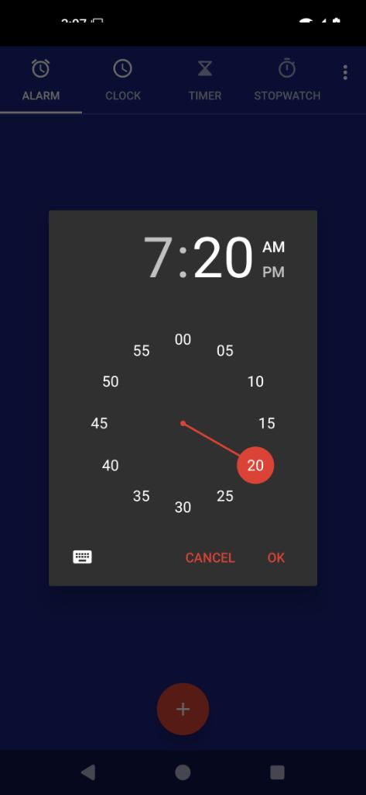

<code>13 · mobile_click_on_screen_at_coordinates</code> — 时间已设为 7:20 AM。点击 OK 确认。

**Reasoning**

时间已设为 7:20 AM。点击 OK 确认。

**Arguments**

<pre><code>{
  &quot;device&quot;: &quot;local_df_clock&quot;,
  &quot;ref&quot;: &quot;@e62&quot;
}</code></pre>

**Observation**

<pre><code>Clicked on element @e62</code></pre>

<code>14 · mobile_take_screenshot</code> — 截图似乎未更新（可能是延迟）。重新截图确认对话框是否已关闭、闹钟是否已创建。

**Reasoning**

截图似乎未更新（可能是延迟）。重新截图确认对话框是否已关闭、闹钟是否已创建。

**Arguments**

<pre><code>{
  &quot;device&quot;: &quot;local_df_clock&quot;
}</code></pre>

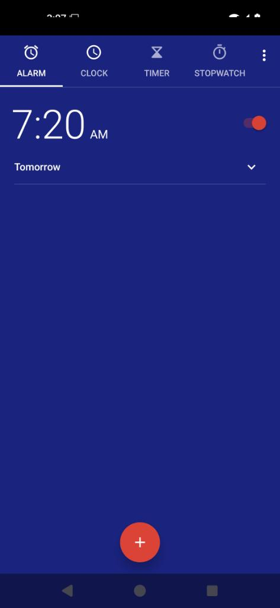

<code>15 · mobile_click_on_screen_at_coordinates</code> — 7:20 AM 闹钟已创建且开关处于开启状态（橙色），当前显示「Tomorrow」表示还未设重复。点击该闹钟卡片展开详细设置（重复日期和标签）。

**Reasoning**

7:20 AM 闹钟已创建且开关处于开启状态（橙色），当前显示「Tomorrow」表示还未设重复。点击该闹钟卡片展开详细设置（重复日期和标签）。

**Arguments**

<pre><code>{
  &quot;device&quot;: &quot;local_df_clock&quot;,
  &quot;x&quot;: 300,
  &quot;y&quot;: 500
}</code></pre>

**Observation**

<pre><code>Clicked on screen at coordinates: 300, 500</code></pre>

<code>16 · mobile_list_elements_on_screen</code> — 卡片没有展开，可能点击位置不对。列出元素，找到展开按钮（箭头）的准确 ref。

**Reasoning**

卡片没有展开，可能点击位置不对。列出元素，找到展开按钮（箭头）的准确 ref。

**Arguments**

<pre><code>{
  &quot;device&quot;: &quot;local_df_clock&quot;
}</code></pre>

**Observation**

<pre><code>One element per line: @ref Type text= label= name= value= id= at=x,y size=WxH [focused] [selected] [checked] [disabled]
@e1 FrameLayout id=&quot;com.android.launcher3:id/taskbar_container&quot; at=0,2208 size=1080x132
@e2 View id=&quot;com.android.launcher3:id/taskbar_scrim&quot; at=0,2208 size=1080x132
@e3 FrameLayout id=&quot;com.android.launcher3:id/navbuttons_view&quot; at=0,2208 size=1080x132
@e4 FrameLayout id=&quot;com.android.launcher3:id/start_contextual_buttons&quot; at=72,2208 size=93x132
@e5 LinearLayout id=&quot;com.android.launcher3:id/end_nav_buttons&quot; at=165,2208 size=748x132
@e6 ImageView label=&quot;Back&quot; id=&quot;com.android.launcher3:id/back&quot; at=166,2213 size=187x121
@e7 ImageView label=&quot;Home&quot; id=&quot;com.android.launcher3:id/home&quot; at=429,2213 size=220x121
@e8 ImageView label=&quot;Recents&quot; id=&quot;com.android.launcher3:id/recent_apps&quot; at=725,2213 size=187x121
@e9 FrameLayout id=&quot;com.android.launcher3:id/end_contextual_buttons&quot; at=915,2208 size=93x132
@e10 FrameLayout id=&quot;com.android.systemui:id/status_bar_launch_animation_container&quot; at=0,0 size=1080x66
@e11 FrameLayout id=&quot;com.android.systemui:id/container&quot; at=0,0 size=1080x66
@e12 FrameLayout id=&quot;com.android.systemui:id/status_bar_container&quot; at=0,0 size=1080x66
@e13 FrameLayout id=&quot;com.android.systemui:id/status_bar&quot; at=0,0 size=1080x66
@e14 LinearLayout id=&quot;com.android.systemui:id/status_bar_contents&quot; at=136,0 size=889x66
@e15 FrameLayout id=&quot;com.android.systemui:id/status_bar_start_side_container&quot; at=147,6 size=433x60
@e16 FrameLayout id=&quot;com.android.systemui:id/status_bar_start_side_content&quot; at=147,6 size=170x60
@e17 LinearLayout id=&quot;com.android.systemui:id/status_bar_start_side_except_heads_up&quot; at=147,6 size=170x60
@e18 TextView text=&quot;3:07&quot; label=&quot;3:07 PM&quot; id=&quot;com.android.systemui:id/clock&quot; at=147,48 size=109x18
@e19 FrameLayout id=&quot;com.android.systemui:id/notification_icon_area&quot; at=256,6 size=61x60
@e20 ViewGroup id=&quot;com.android.systemui:id/notificationIcons&quot; at=256,6 size=61x60
@e21 ImageView label=&quot;Android System notification: &quot; at=256,38 size=61x28
@e22 FrameLayout id=&quot;com.android.systemui:id/status_bar_end_side_container&quot; at=580,6 size=434x60
@e23 LinearLayout id=&quot;com.android.systemui:id/status_bar_end_side_content&quot; at=868,6 size=146x60
@e24 LinearLayout id=&quot;com.android.systemui:id/system_icons&quot; at=868,40 size=146x26
@e25 LinearLayout id=&quot;com.android.systemui:id/statusIcons&quot; at=876,40 size=106x26
@e26 FrameLayout id=&quot;com.android.systemui:id/wifi_combo&quot; at=876,40 size=48x26
@e27 LinearLayout id=&quot;com.android.systemui:id/wifi_group&quot; at=883,40 size=41x26
@e28 FrameLayout id=&quot;com.android.systemui:id/wifi_combo&quot; at=883,50 size=41x16
@e29 ImageView label=&quot;Wifi signal full.,No internet&quot; id=&quot;com.android.systemui:id/wifi_signal&quot; at=883,50 size=41x16
@e30 FrameLayout label=&quot;Phone signal full.&quot; id=&quot;com.android.systemui:id/mobile_combo&quot; at=924,40 size=41x26
@e31 LinearLayout id=&quot;com.android.systemui:id/mobile_group&quot; at=924,40 size=41x26
@e32 ImageView id=&quot;com.android.systemui:id/mobile_signal&quot; at=924,50 size=41x16
@e33 LinearLayout label=&quot;Battery charging, 100 percent.&quot; id=&quot;com.android.systemui:id/battery&quot; at=982,52 size=21x14
@e34 FrameLayout id=&quot;android:id/content&quot; at=144,619 size=792x1106
@e35 LinearLayout id=&quot;android:id/parentPanel&quot; at=144,619 size=792x1106
@e36 FrameLayout id=&quot;android:id/customPanel&quot; at=144,619 size=792x1106
@e37 FrameLayout id=&quot;android:id/custom&quot; at=144,619 size=792x1106
@e38 TimePicker id=&quot;android:id/timePicker&quot; at=144,619 size=792x1106
@e39 RelativeLayout id=&quot;android:id/time_header&quot; at=144,619 size=792x275
@e40 TextView text=&quot;7&quot; id=&quot;android:id/hours&quot; at=328,641 size=186x220
@e41 TextView text=&quot;:&quot; id=&quot;android:id/separator&quot; at=520,641 size=40x231
@e42 TextView text=&quot;20&quot; id=&quot;android:id/minutes&quot; at=566,641 size=186x220
@e43 RadioGroup id=&quot;android:id/ampm_layout&quot; at=774,679 size=67x170
@e44 RadioButton text=&quot;AM&quot; id=&quot;android:id/am_label&quot; at=774,679 size=67x96 checked
@e45 RadioButton text=&quot;PM&quot; id=&quot;android:id/pm_label&quot; at=774,753 size=66x96
@e46 View id=&quot;android:id/radial_picker&quot; at=188,938 size=704x616
@e47 RadialTimePickerView$RadialPickerTouchHelper label=&quot;1&quot; at=608,977 size=110x110
@e48 RadialTimePickerView$RadialPickerTouchHelper label=&quot;2&quot; at=698,1067 size=110x110
@e49 RadialTimePickerView$RadialPickerTouchHelper label=&quot;3&quot; at=732,1191 size=110x110
@e50 RadialTimePickerView$RadialPickerTouchHelper label=&quot;4&quot; at=698,1314 size=110x110
@e51 RadialTimePickerView$RadialPickerTouchHelper label=&quot;5&quot; at=608,1404 size=110x110
@e52 RadialTimePickerView$RadialPickerTouchHelper label=&quot;6&quot; at=485,1438 size=110x110
@e53 RadialTimePickerView$RadialPickerTouchHelper label=&quot;7&quot; at=361,1404 size=110x110 selected
@e54 RadialTimePickerView$RadialPickerTouchHelper label=&quot;8&quot; at=271,1314 size=110x110
@e55 RadialTimePickerView$RadialPickerTouchHelper label=&quot;9&quot; at=238,1191 size=110x110
@e56 RadialTimePickerView$RadialPickerTouchHelper label=&quot;10&quot; at=271,1067 size=110x110
@e57 RadialTimePickerView$RadialPickerTouchHelper label=&quot;11&quot; at=361,977 size=110x110
@e58 RadialTimePickerView$RadialPickerTouchHelper label=&quot;12&quot; at=485,944 size=110x110
@e59 ImageButton label=&quot;Switch to text input mode for the time input.&quot; id=&quot;android:id/toggle_mode&quot; at=177,1573 size=132x132
@e60 ScrollView id=&quot;android:id/buttonPanel&quot; at=481,1554 size=455x171
@e61 Button text=&quot;CANCEL&quot; id=&quot;android:id/button2&quot; at=514,1565 size=213x149
@e62 Button text=&quot;OK&quot; id=&quot;android:id/button1&quot; at=727,1565 size=176x149</code></pre>

<code>17 · mobile_take_screenshot</code> — 元素列表显示时间选择对话框又打开了——说明我刚才点在时间文本上重新触发了时间编辑。不需要改时间，先截图确认，然后点 CANCEL 关闭对话框。

**Reasoning**

元素列表显示时间选择对话框又打开了——说明我刚才点在时间文本上重新触发了时间编辑。不需要改时间，先截图确认，然后点 CANCEL 关闭对话框。

**Arguments**

<pre><code>{
  &quot;device&quot;: &quot;local_df_clock&quot;
}</code></pre>

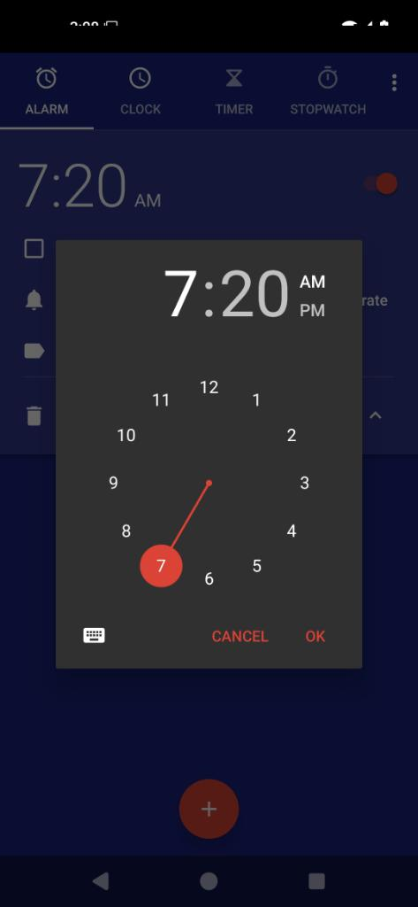

<code>18 · mobile_click_on_screen_at_coordinates</code> — 后台的闹钟卡片其实已经展开了（可见重复勾选框、铃声、标签、删除图标），只是点到了时间又弹出了时间选择器。时间保持 7:20 不变，点 CANCEL 关闭对话框。

**Reasoning**

后台的闹钟卡片其实已经展开了（可见重复勾选框、铃声、标签、删除图标），只是点到了时间又弹出了时间选择器。时间保持 7:20 不变，点 CANCEL 关闭对话框。

**Arguments**

<pre><code>{
  &quot;device&quot;: &quot;local_df_clock&quot;,
  &quot;ref&quot;: &quot;@e61&quot;
}</code></pre>

**Observation**

<pre><code>Clicked on element @e61</code></pre>

<code>19 · mobile_take_screenshot</code> — 截图可能未刷新。重新截图确认对话框是否已关闭。

**Reasoning**

截图可能未刷新。重新截图确认对话框是否已关闭。

**Arguments**

<pre><code>{
  &quot;device&quot;: &quot;local_df_clock&quot;
}</code></pre>

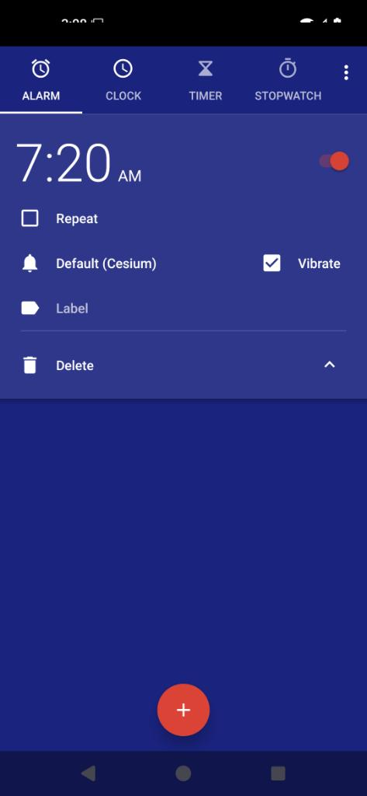

<code>20 · mobile_list_elements_on_screen</code> — 对话框已关闭，7:20 闹钟卡片已展开：Repeat 未勾选、铃声 Default (Cesium)、Vibrate 已勾选（默认状态，不动）。现在先点 Repeat 设置工作日重复。列出元素获取 ref。

**Reasoning**

对话框已关闭，7:20 闹钟卡片已展开：Repeat 未勾选、铃声 Default (Cesium)、Vibrate 已勾选（默认状态，不动）。现在先点 Repeat 设置工作日重复。列出元素获取 ref。

**Arguments**

<pre><code>{
  &quot;device&quot;: &quot;local_df_clock&quot;
}</code></pre>

**Observation**

<pre><code>One element per line: @ref Type text= label= name= value= id= at=x,y size=WxH [focused] [selected] [checked] [disabled]
@e1 FrameLayout id=&quot;com.android.launcher3:id/taskbar_container&quot; at=0,2208 size=1080x132
@e2 View id=&quot;com.android.launcher3:id/taskbar_scrim&quot; at=0,2208 size=1080x132
@e3 FrameLayout id=&quot;com.android.launcher3:id/navbuttons_view&quot; at=0,2208 size=1080x132
@e4 FrameLayout id=&quot;com.android.launcher3:id/start_contextual_buttons&quot; at=72,2208 size=93x132
@e5 LinearLayout id=&quot;com.android.launcher3:id/end_nav_buttons&quot; at=165,2208 size=748x132
@e6 ImageView label=&quot;Back&quot; id=&quot;com.android.launcher3:id/back&quot; at=166,2213 size=187x121
@e7 ImageView label=&quot;Home&quot; id=&quot;com.android.launcher3:id/home&quot; at=429,2213 size=220x121
@e8 ImageView label=&quot;Recents&quot; id=&quot;com.android.launcher3:id/recent_apps&quot; at=725,2213 size=187x121
@e9 FrameLayout id=&quot;com.android.launcher3:id/end_contextual_buttons&quot; at=915,2208 size=93x132
@e10 FrameLayout id=&quot;com.android.systemui:id/status_bar_launch_animation_container&quot; at=0,0 size=1080x66
@e11 FrameLayout id=&quot;com.android.systemui:id/container&quot; at=0,0 size=1080x66
@e12 FrameLayout id=&quot;com.android.systemui:id/status_bar_container&quot; at=0,0 size=1080x66
@e13 FrameLayout id=&quot;com.android.systemui:id/status_bar&quot; at=0,0 size=1080x66
@e14 LinearLayout id=&quot;com.android.systemui:id/status_bar_contents&quot; at=136,0 size=889x66
@e15 FrameLayout id=&quot;com.android.systemui:id/status_bar_start_side_container&quot; at=147,6 size=433x60
@e16 FrameLayout id=&quot;com.android.systemui:id/status_bar_start_side_content&quot; at=147,6 size=170x60
@e17 LinearLayout id=&quot;com.android.systemui:id/status_bar_start_side_except_heads_up&quot; at=147,6 size=170x60
@e18 TextView text=&quot;3:08&quot; label=&quot;3:08 PM&quot; id=&quot;com.android.systemui:id/clock&quot; at=147,48 size=109x18
@e19 FrameLayout id=&quot;com.android.systemui:id/notification_icon_area&quot; at=256,6 size=61x60
@e20 ViewGroup id=&quot;com.android.systemui:id/notificationIcons&quot; at=256,6 size=61x60
@e21 ImageView label=&quot;Android System notification: &quot; at=256,38 size=61x28
@e22 FrameLayout id=&quot;com.android.systemui:id/status_bar_end_side_container&quot; at=580,6 size=434x60
@e23 LinearLayout id=&quot;com.android.systemui:id/status_bar_end_side_content&quot; at=868,6 size=146x60
@e24 LinearLayout id=&quot;com.android.systemui:id/system_icons&quot; at=868,40 size=146x26
@e25 LinearLayout id=&quot;com.android.systemui:id/statusIcons&quot; at=876,40 size=106x26
@e26 FrameLayout id=&quot;com.android.systemui:id/wifi_combo&quot; at=876,40 size=48x26
@e27 LinearLayout id=&quot;com.android.systemui:id/wifi_group&quot; at=883,40 size=41x26
@e28 FrameLayout id=&quot;com.android.systemui:id/wifi_combo&quot; at=883,50 size=41x16
@e29 ImageView label=&quot;Wifi signal full.,No internet&quot; id=&quot;com.android.systemui:id/wifi_signal&quot; at=883,50 size=41x16
@e30 FrameLayout label=&quot;Phone three bars.&quot; id=&quot;com.android.systemui:id/mobile_combo&quot; at=924,40 size=41x26
@e31 LinearLayout id=&quot;com.android.systemui:id/mobile_group&quot; at=924,40 size=41x26
@e32 ImageView id=&quot;com.android.systemui:id/mobile_signal&quot; at=924,50 size=41x16
@e33 LinearLayout label=&quot;Battery charging, 100 percent.&quot; id=&quot;com.android.systemui:id/battery&quot; at=982,52 size=21x14
@e34 LinearLayout id=&quot;com.android.deskclock:id/action_bar_root&quot; at=0,136 size=1080x2204
@e35 FrameLayout id=&quot;android:id/content&quot; at=0,136 size=1080x2204
@e36 ViewGroup id=&quot;com.android.deskclock:id/content&quot; at=0,136 size=1080x2204
@e37 ViewGroup id=&quot;com.android.deskclock:id/toolbar&quot; at=0,136 size=1080x198
@e38 HorizontalScrollView id=&quot;com.android.deskclock:id/tabs&quot; at=0,136 size=969x198
@e39 LinearLayout label=&quot;Alarm&quot; at=0,136 size=242x198 selected
@e40 TextView text=&quot;ALARM&quot; id=&quot;android:id/text1&quot; at=64,168 size=113x133 selected
@e41 LinearLayout label=&quot;Clock&quot; at=242,136 size=242x198
@e42 TextView text=&quot;CLOCK&quot; id=&quot;android:id/text1&quot; at=310,168 size=105x133
@e43 LinearLayout label=&quot;Timer&quot; at=484,136 size=242x198
@e44 TextView text=&quot;TIMER&quot; id=&quot;android:id/text1&quot; at=556,168 size=98x133
@e45 LinearLayout label=&quot;Stopwatch&quot; at=726,136 size=243x198
@e46 TextView text=&quot;STOPWATCH&quot; id=&quot;android:id/text1&quot; at=749,168 size=197x133
@e47 ImageView label=&quot;More options&quot; at=969,147 size=111x132
@e48 View id=&quot;com.android.deskclock:id/tab_hairline&quot; at=0,334 size=1080x3
@e49 ViewGroup id=&quot;com.android.deskclock:id/desk_clock_pager&quot; at=0,337 size=1080x1871
@e50 FrameLayout id=&quot;com.android.deskclock:id/main&quot; at=0,337 size=1080x1871
@e51 RecyclerView id=&quot;com.android.deskclock:id/alarms_recycler_view&quot; at=0,337 size=1080x1871
@e52 ViewGroup label=&quot;7:20 AM Alarm&quot; at=0,337 size=1080x852
@e53 TextView text=&quot;7:20 AM&quot; label=&quot;7:20 AM&quot; id=&quot;com.android.deskclock:id/digital_clock&quot; at=44,370 size=373x205
@e54 Switch id=&quot;com.android.deskclock:id/onoff&quot; at=904,407 size=132x132 checked
@e55 CheckBox text=&quot;Repeat&quot; id=&quot;com.android.deskclock:id/repeat_onoff&quot; at=44,575 size=277x132
@e56 TextView text=&quot;Default (Cesium)&quot; label=&quot;Ringtone Default (Cesium)&quot; id=&quot;com.android.deskclock:id/choose_ringtone&quot; at=44,707 size=712x132
@e57 CheckBox text=&quot;Vibrate&quot; id=&quot;com.android.deskclock:id/vibrate_onoff&quot; at=756,707 size=280x132 checked
@e58 TextView label=&quot;No label specified&quot; id=&quot;com.android.deskclock:id/edit_label&quot; at=44,839 size=992x132
@e59 View id=&quot;com.android.deskclock:id/hairline&quot; at=61,971 size=958x3
@e60 Button text=&quot;Delete&quot; id=&quot;com.android.deskclock:id/delete&quot; at=44,1007 size=265x132
@e61 ImageButton label=&quot;Collapse alarm&quot; id=&quot;com.android.deskclock:id/arrow&quot; at=904,1007 size=132x132
@e62 ImageView id=&quot;com.android.deskclock:id/drop_shadow&quot; at=0,337 size=1080x22
@e63 ImageButton label=&quot;Add alarm&quot; id=&quot;com.android.deskclock:id/fab&quot; at=463,2010 size=154x154
@e64 View id=&quot;android:id/navigationBarBackground&quot; at=0,2208 size=1080x132</code></pre>

<code>21 · mobile_click_on_screen_at_coordinates</code> — 闹钟卡片已展开，开关 @e54 已勾选。点击 Repeat 复选框（@e55）以显示星期选择。

**Reasoning**

闹钟卡片已展开，开关 @e54 已勾选。点击 Repeat 复选框（@e55）以显示星期选择。

**Arguments**

<pre><code>{
  &quot;device&quot;: &quot;local_df_clock&quot;,
  &quot;ref&quot;: &quot;@e55&quot;
}</code></pre>

**Observation**

<pre><code>Clicked on element @e55</code></pre>

<code>22 · mobile_list_elements_on_screen</code> — 截图可能未刷新，Repeat 看起来仍未勾选。列出元素确认是否出现了星期选择按钮。

**Reasoning**

截图可能未刷新，Repeat 看起来仍未勾选。列出元素确认是否出现了星期选择按钮。

**Arguments**

<pre><code>{
  &quot;device&quot;: &quot;local_df_clock&quot;
}</code></pre>

**Observation**

<pre><code>One element per line: @ref Type text= label= name= value= id= at=x,y size=WxH [focused] [selected] [checked] [disabled]
@e1 FrameLayout id=&quot;com.android.launcher3:id/taskbar_container&quot; at=0,2208 size=1080x132
@e2 View id=&quot;com.android.launcher3:id/taskbar_scrim&quot; at=0,2208 size=1080x132
@e3 FrameLayout id=&quot;com.android.launcher3:id/navbuttons_view&quot; at=0,2208 size=1080x132
@e4 FrameLayout id=&quot;com.android.launcher3:id/start_contextual_buttons&quot; at=72,2208 size=93x132
@e5 LinearLayout id=&quot;com.android.launcher3:id/end_nav_buttons&quot; at=165,2208 size=748x132
@e6 ImageView label=&quot;Back&quot; id=&quot;com.android.launcher3:id/back&quot; at=166,2213 size=187x121
@e7 ImageView label=&quot;Home&quot; id=&quot;com.android.launcher3:id/home&quot; at=429,2213 size=220x121
@e8 ImageView label=&quot;Recents&quot; id=&quot;com.android.launcher3:id/recent_apps&quot; at=725,2213 size=187x121
@e9 FrameLayout id=&quot;com.android.launcher3:id/end_contextual_buttons&quot; at=915,2208 size=93x132
@e10 FrameLayout id=&quot;com.android.systemui:id/status_bar_launch_animation_container&quot; at=0,0 size=1080x66
@e11 FrameLayout id=&quot;com.android.systemui:id/container&quot; at=0,0 size=1080x66
@e12 FrameLayout id=&quot;com.android.systemui:id/status_bar_container&quot; at=0,0 size=1080x66
@e13 FrameLayout id=&quot;com.android.systemui:id/status_bar&quot; at=0,0 size=1080x66
@e14 LinearLayout id=&quot;com.android.systemui:id/status_bar_contents&quot; at=136,0 size=889x66
@e15 FrameLayout id=&quot;com.android.systemui:id/status_bar_start_side_container&quot; at=147,6 size=433x60
@e16 FrameLayout id=&quot;com.android.systemui:id/status_bar_start_side_content&quot; at=147,6 size=170x60
@e17 LinearLayout id=&quot;com.android.systemui:id/status_bar_start_side_except_heads_up&quot; at=147,6 size=170x60
@e18 TextView text=&quot;3:09&quot; label=&quot;3:09 PM&quot; id=&quot;com.android.systemui:id/clock&quot; at=147,48 size=109x18
@e19 FrameLayout id=&quot;com.android.systemui:id/notification_icon_area&quot; at=256,6 size=61x60
@e20 ViewGroup id=&quot;com.android.systemui:id/notificationIcons&quot; at=256,6 size=61x60
@e21 ImageView label=&quot;Android System notification: &quot; at=256,38 size=61x28
@e22 FrameLayout id=&quot;com.android.systemui:id/status_bar_end_side_container&quot; at=580,6 size=434x60
@e23 LinearLayout id=&quot;com.android.systemui:id/status_bar_end_side_content&quot; at=868,6 size=146x60
@e24 LinearLayout id=&quot;com.android.systemui:id/system_icons&quot; at=868,40 size=146x26
@e25 LinearLayout id=&quot;com.android.systemui:id/statusIcons&quot; at=876,40 size=106x26
@e26 FrameLayout id=&quot;com.android.systemui:id/wifi_combo&quot; at=876,40 size=48x26
@e27 LinearLayout id=&quot;com.android.systemui:id/wifi_group&quot; at=883,40 size=41x26
@e28 FrameLayout id=&quot;com.android.systemui:id/wifi_combo&quot; at=883,50 size=41x16
@e29 ImageView label=&quot;Wifi signal full.,No internet&quot; id=&quot;com.android.systemui:id/wifi_signal&quot; at=883,50 size=41x16
@e30 FrameLayout label=&quot;Phone signal full.&quot; id=&quot;com.android.systemui:id/mobile_combo&quot; at=924,40 size=41x26
@e31 LinearLayout id=&quot;com.android.systemui:id/mobile_group&quot; at=924,40 size=41x26
@e32 ImageView id=&quot;com.android.systemui:id/mobile_signal&quot; at=924,50 size=41x16
@e33 LinearLayout label=&quot;Battery charging, 100 percent.&quot; id=&quot;com.android.systemui:id/battery&quot; at=982,52 size=21x14
@e34 LinearLayout id=&quot;com.android.deskclock:id/action_bar_root&quot; at=0,136 size=1080x2204
@e35 FrameLayout id=&quot;android:id/content&quot; at=0,136 size=1080x2204
@e36 ViewGroup id=&quot;com.android.deskclock:id/content&quot; at=0,136 size=1080x2204
@e37 ViewGroup id=&quot;com.android.deskclock:id/toolbar&quot; at=0,136 size=1080x198
@e38 HorizontalScrollView id=&quot;com.android.deskclock:id/tabs&quot; at=0,136 size=969x198
@e39 LinearLayout label=&quot;Alarm&quot; at=0,136 size=242x198 selected
@e40 TextView text=&quot;ALARM&quot; id=&quot;android:id/text1&quot; at=64,168 size=113x133 selected
@e41 LinearLayout label=&quot;Clock&quot; at=242,136 size=242x198
@e42 TextView text=&quot;CLOCK&quot; id=&quot;android:id/text1&quot; at=310,168 size=105x133
@e43 LinearLayout label=&quot;Timer&quot; at=484,136 size=242x198
@e44 TextView text=&quot;TIMER&quot; id=&quot;android:id/text1&quot; at=556,168 size=98x133
@e45 LinearLayout label=&quot;Stopwatch&quot; at=726,136 size=243x198
@e46 TextView text=&quot;STOPWATCH&quot; id=&quot;android:id/text1&quot; at=749,168 size=197x133
@e47 ImageView label=&quot;More options&quot; at=969,147 size=111x132
@e48 View id=&quot;com.android.deskclock:id/tab_hairline&quot; at=0,334 size=1080x3
@e49 ViewGroup id=&quot;com.android.deskclock:id/desk_clock_pager&quot; at=0,337 size=1080x1871
@e50 FrameLayout id=&quot;com.android.deskclock:id/main&quot; at=0,337 size=1080x1871
@e51 RecyclerView id=&quot;com.android.deskclock:id/alarms_recycler_view&quot; at=0,337 size=1080x1871
@e52 ViewGroup label=&quot;7:20 AM Alarm&quot; at=0,337 size=1080x984
@e53 TextView text=&quot;7:20 AM&quot; label=&quot;7:20 AM&quot; id=&quot;com.android.deskclock:id/digital_clock&quot; at=44,370 size=373x205
@e54 Switch id=&quot;com.android.deskclock:id/onoff&quot; at=904,407 size=132x132 checked
@e55 CheckBox text=&quot;Repeat&quot; id=&quot;com.android.deskclock:id/repeat_onoff&quot; at=44,575 size=277x132 checked
@e56 LinearLayout id=&quot;com.android.deskclock:id/repeat_days&quot; at=44,707 size=992x132
@e57 CheckBox text=&quot;S&quot; label=&quot;Sunday&quot; id=&quot;com.android.deskclock:id/day_button_box&quot; at=44,707 size=132x132 checked
@e58 CheckBox text=&quot;M&quot; label=&quot;Monday&quot; id=&quot;com.android.deskclock:id/day_button_box&quot; at=185,707 size=132x132 checked
@e59 CheckBox text=&quot;T&quot; label=&quot;Tuesday&quot; id=&quot;com.android.deskclock:id/day_button_box&quot; at=326,707 size=132x132 checked
@e60 CheckBox text=&quot;W&quot; label=&quot;Wednesday&quot; id=&quot;com.android.deskclock:id/day_button_box&quot; at=468,707 size=132x132 checked
@e61 CheckBox text=&quot;T&quot; label=&quot;Thursday&quot; id=&quot;com.android.deskclock:id/day_button_box&quot; at=610,707 size=132x132 checked
@e62 CheckBox text=&quot;F&quot; label=&quot;Friday&quot; id=&quot;com.android.deskclock:id/day_button_box&quot; at=752,707 size=132x132 checked
@e63 CheckBox text=&quot;S&quot; label=&quot;Saturday&quot; id=&quot;com.android.deskclock:id/day_button_box&quot; at=894,707 size=132x132 checked
@e64 TextView text=&quot;Default (Cesium)&quot; label=&quot;Ringtone Default (Cesium)&quot; id=&quot;com.android.deskclock:id/choose_ringtone&quot; at=44,839 size=712x132
@e65 CheckBox text=&quot;Vibrate&quot; id=&quot;com.android.deskclock:id/vibrate_onoff&quot; at=756,839 size=280x132 checked
@e66 TextView label=&quot;No label specified&quot; id=&quot;com.android.deskclock:id/edit_label&quot; at=44,971 size=992x132
@e67 View id=&quot;com.android.deskclock:id/hairline&quot; at=61,1103 size=958x3
@e68 Button text=&quot;Delete&quot; id=&quot;com.android.deskclock:id/delete&quot; at=44,1139 size=265x132
@e69 ImageButton label=&quot;Collapse alarm&quot; id=&quot;com.android.deskclock:id/arrow&quot; at=904,1139 size=132x132
@e70 ImageView id=&quot;com.android.deskclock:id/drop_shadow&quot; at=0,337 size=1080x22
@e71 ImageButton label=&quot;Add alarm&quot; id=&quot;com.android.deskclock:id/fab&quot; at=463,2010 size=154x154
@e72 View id=&quot;android:id/navigationBarBackground&quot; at=0,2208 size=1080x132</code></pre>

<code>23 · mobile_click_on_screen_at_coordinates</code> — Repeat 已勾选，但星期一到星期日的所有天都被默认勾选了。工作日闹钟只需周一到周五，所以先取消勾选星期日（@e57）。

**Reasoning**

Repeat 已勾选，但星期一到星期日的所有天都被默认勾选了。工作日闹钟只需周一到周五，所以先取消勾选星期日（@e57）。

**Arguments**

<pre><code>{
  &quot;device&quot;: &quot;local_df_clock&quot;,
  &quot;ref&quot;: &quot;@e57&quot;
}</code></pre>

**Observation**

<pre><code>Clicked on element @e57</code></pre>

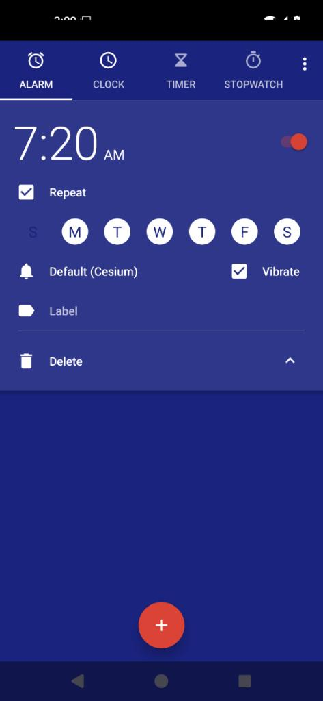

<code>24 · mobile_click_on_screen_at_coordinates</code> — 星期日已取消（左侧 S 变灰）。现在取消勾选星期六（@e63）。

**Reasoning**

星期日已取消（左侧 S 变灰）。现在取消勾选星期六（@e63）。

**Arguments**

<pre><code>{
  &quot;device&quot;: &quot;local_df_clock&quot;,
  &quot;ref&quot;: &quot;@e63&quot;
}</code></pre>

**Observation**

<pre><code>Clicked on element @e63</code></pre>

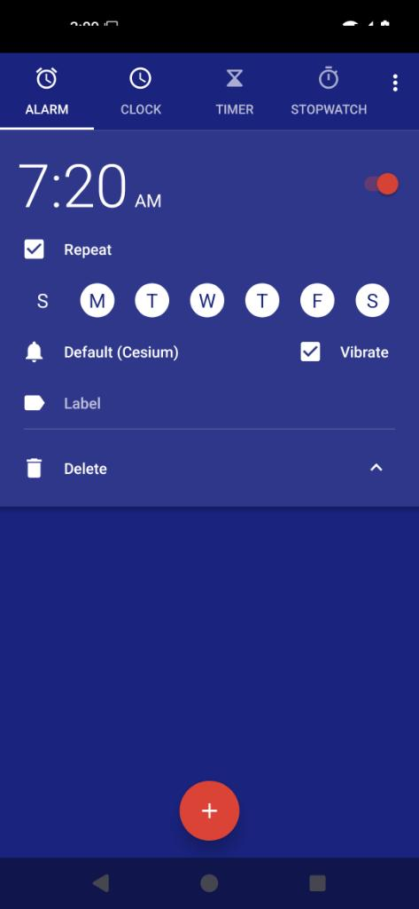

<code>25 · mobile_click_on_screen_at_coordinates</code> — 周六也已取消，现在只有周一到周五被选中。接下来点击 Label（@e66）设置标签「工作日起床」。

**Reasoning**

周六也已取消，现在只有周一到周五被选中。接下来点击 Label（@e66）设置标签「工作日起床」。

**Arguments**

<pre><code>{
  &quot;device&quot;: &quot;local_df_clock&quot;,
  &quot;ref&quot;: &quot;@e66&quot;
}</code></pre>

**Observation**

<pre><code>Clicked on element @e66</code></pre>

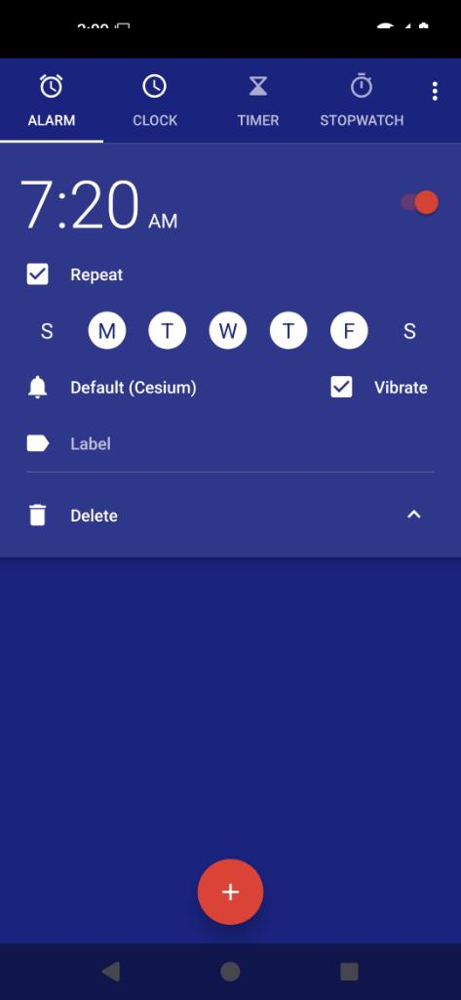

<code>26 · mobile_take_screenshot</code> — 截图可能又是未刷新的。重新截图查看标签输入对话框是否弹出。

**Reasoning**

截图可能又是未刷新的。重新截图查看标签输入对话框是否弹出。

**Arguments**

<pre><code>{
  &quot;device&quot;: &quot;local_df_clock&quot;
}</code></pre>

<code>27 · mobile_type_keys</code> — 标签对话框已打开，输入框处于聚焦状态。输入「工作日起床」，先不提交，随后点 OK。

**Reasoning**

标签对话框已打开，输入框处于聚焦状态。输入「工作日起床」，先不提交，随后点 OK。

**Arguments**

<pre><code>{
  &quot;device&quot;: &quot;local_df_clock&quot;,
  &quot;text&quot;: &quot;工作日起床&quot;,
  &quot;submit&quot;: false
}</code></pre>

**Observation**

<pre><code>Typed text: 工作日起床</code></pre>

<code>28 · mobile_take_screenshot</code> — 文本已输入但截图显示输入框仍为空（可能是截图延迟，也可能输入框未聚焦导致文本未进入）。先截图确认。

**Reasoning**

文本已输入但截图显示输入框仍为空（可能是截图延迟，也可能输入框未聚焦导致文本未进入）。先截图确认。

**Arguments**

<pre><code>{
  &quot;device&quot;: &quot;local_df_clock&quot;
}</code></pre>

<code>29 · mobile_list_elements_on_screen</code> — 输入框仍为空，说明文本没有进入——输入框未获得焦点。列出元素找到 EditText，先点击聚焦再输入。

**Reasoning**

输入框仍为空，说明文本没有进入——输入框未获得焦点。列出元素找到 EditText，先点击聚焦再输入。

**Arguments**

<pre><code>{
  &quot;device&quot;: &quot;local_df_clock&quot;
}</code></pre>

**Observation**

<pre><code>One element per line: @ref Type text= label= name= value= id= at=x,y size=WxH [focused] [selected] [checked] [disabled]
@e1 FrameLayout id=&quot;com.android.launcher3:id/taskbar_container&quot; at=0,2208 size=1080x132
@e2 View id=&quot;com.android.launcher3:id/taskbar_scrim&quot; at=0,2208 size=1080x132
@e3 FrameLayout id=&quot;com.android.launcher3:id/navbuttons_view&quot; at=0,2208 size=1080x132
@e4 FrameLayout id=&quot;com.android.launcher3:id/start_contextual_buttons&quot; at=72,2208 size=93x132
@e5 LinearLayout id=&quot;com.android.launcher3:id/end_nav_buttons&quot; at=165,2208 size=748x132
@e6 ImageView label=&quot;Back&quot; id=&quot;com.android.launcher3:id/back&quot; at=166,2213 size=187x121
@e7 ImageView label=&quot;Home&quot; id=&quot;com.android.launcher3:id/home&quot; at=429,2213 size=220x121
@e8 ImageView label=&quot;Recents&quot; id=&quot;com.android.launcher3:id/recent_apps&quot; at=725,2213 size=187x121
@e9 FrameLayout id=&quot;com.android.launcher3:id/end_contextual_buttons&quot; at=915,2208 size=93x132
@e10 FrameLayout id=&quot;com.android.systemui:id/status_bar_launch_animation_container&quot; at=0,0 size=1080x66
@e11 FrameLayout id=&quot;com.android.systemui:id/container&quot; at=0,0 size=1080x66
@e12 FrameLayout id=&quot;com.android.systemui:id/status_bar_container&quot; at=0,0 size=1080x66
@e13 FrameLayout id=&quot;com.android.systemui:id/status_bar&quot; at=0,0 size=1080x66
@e14 LinearLayout id=&quot;com.android.systemui:id/status_bar_contents&quot; at=136,0 size=889x66
@e15 FrameLayout id=&quot;com.android.systemui:id/status_bar_start_side_container&quot; at=147,6 size=433x60
@e16 FrameLayout id=&quot;com.android.systemui:id/status_bar_start_side_content&quot; at=147,6 size=170x60
@e17 LinearLayout id=&quot;com.android.systemui:id/status_bar_start_side_except_heads_up&quot; at=147,6 size=170x60
@e18 TextView text=&quot;3:10&quot; label=&quot;3:10 PM&quot; id=&quot;com.android.systemui:id/clock&quot; at=147,48 size=109x18
@e19 FrameLayout id=&quot;com.android.systemui:id/notification_icon_area&quot; at=256,6 size=61x60
@e20 ViewGroup id=&quot;com.android.systemui:id/notificationIcons&quot; at=256,6 size=61x60
@e21 ImageView label=&quot;Android System notification: &quot; at=256,38 size=61x28
@e22 FrameLayout id=&quot;com.android.systemui:id/status_bar_end_side_container&quot; at=580,6 size=434x60
@e23 LinearLayout id=&quot;com.android.systemui:id/status_bar_end_side_content&quot; at=868,6 size=146x60
@e24 LinearLayout id=&quot;com.android.systemui:id/system_icons&quot; at=868,40 size=146x26
@e25 LinearLayout id=&quot;com.android.systemui:id/statusIcons&quot; at=876,40 size=106x26
@e26 FrameLayout id=&quot;com.android.systemui:id/wifi_combo&quot; at=876,40 size=48x26
@e27 LinearLayout id=&quot;com.android.systemui:id/wifi_group&quot; at=883,40 size=41x26
@e28 FrameLayout id=&quot;com.android.systemui:id/wifi_combo&quot; at=883,50 size=41x16
@e29 ImageView label=&quot;Wifi signal full.,No internet&quot; id=&quot;com.android.systemui:id/wifi_signal&quot; at=883,50 size=41x16
@e30 FrameLayout label=&quot;Phone three bars.&quot; id=&quot;com.android.systemui:id/mobile_combo&quot; at=924,40 size=41x26
@e31 LinearLayout id=&quot;com.android.systemui:id/mobile_group&quot; at=924,40 size=41x26
@e32 ImageView id=&quot;com.android.systemui:id/mobile_signal&quot; at=924,50 size=41x16
@e33 LinearLayout label=&quot;Battery charging, 100 percent.&quot; id=&quot;com.android.systemui:id/battery&quot; at=982,52 size=21x14
@e34 FrameLayout id=&quot;com.android.deskclock:id/action_bar_root&quot; at=71,954 size=938x435
@e35 FrameLayout id=&quot;android:id/content&quot; at=71,954 size=938x435
@e36 LinearLayoutCompat id=&quot;com.android.deskclock:id/parentPanel&quot; at=71,954 size=938x435
@e37 FrameLayout id=&quot;com.android.deskclock:id/contentPanel&quot; at=71,954 size=938x132
@e38 ScrollView id=&quot;com.android.deskclock:id/scrollView&quot; at=71,954 size=938x109
@e39 View id=&quot;com.android.deskclock:id/textSpacerNoTitle&quot; at=71,954 size=938x50
@e40 TextView text=&quot;Label&quot; id=&quot;android:id/message&quot; at=71,1004 size=938x59
@e41 FrameLayout id=&quot;com.android.deskclock:id/customPanel&quot; at=71,1086 size=938x132
@e42 FrameLayout id=&quot;com.android.deskclock:id/custom&quot; at=71,1086 size=938x124
@e43 EditText at=129,1086 size=822x124
@e44 ScrollView id=&quot;com.android.deskclock:id/buttonPanel&quot; at=71,1218 size=938x171
@e45 Button text=&quot;CANCEL&quot; id=&quot;android:id/button2&quot; at=587,1229 size=213x149
@e46 Button text=&quot;OK&quot; id=&quot;android:id/button1&quot; at=800,1229 size=176x149</code></pre>

<code>30 · mobile_click_on_screen_at_coordinates</code> — 找到 EditText @e43。先点击它聚焦。

**Reasoning**

找到 EditText @e43。先点击它聚焦。

**Arguments**

<pre><code>{
  &quot;device&quot;: &quot;local_df_clock&quot;,
  &quot;ref&quot;: &quot;@e43&quot;
}</code></pre>

**Observation**

<pre><code>Clicked on element @e43</code></pre>

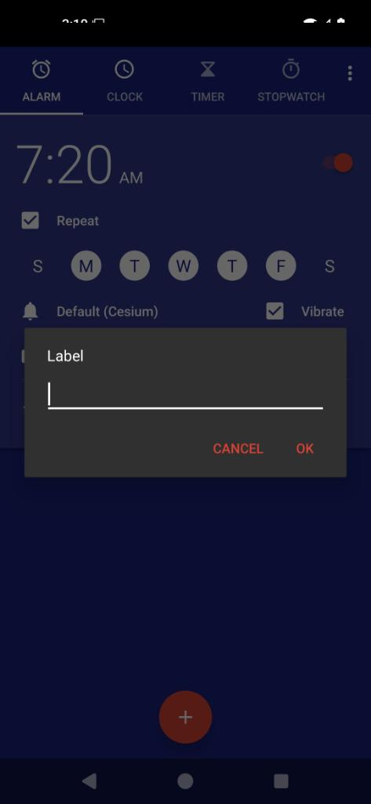

<code>31 · mobile_type_keys</code> — 输入框已聚焦（可见光标）。现在输入标签文本「工作日起床」。

**Reasoning**

输入框已聚焦（可见光标）。现在输入标签文本「工作日起床」。

**Arguments**

<pre><code>{
  &quot;device&quot;: &quot;local_df_clock&quot;,
  &quot;text&quot;: &quot;工作日起床&quot;,
  &quot;submit&quot;: false
}</code></pre>

**Observation**

<pre><code>Typed text: 工作日起床</code></pre>

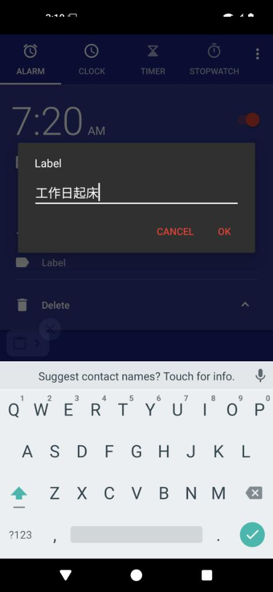

<code>32 · mobile_click_on_screen_at_coordinates</code> — 标签文本「工作日起床」已成功输入。键盘弹出导致对话框上移，OK 按钮位置变化。按截图比例换算 OK 在设备坐标约 (888, 910)，点击确认。

**Reasoning**

标签文本「工作日起床」已成功输入。键盘弹出导致对话框上移，OK 按钮位置变化。按截图比例换算 OK 在设备坐标约 (888, 910)，点击确认。

**Arguments**

<pre><code>{
  &quot;device&quot;: &quot;local_df_clock&quot;,
  &quot;x&quot;: 888,
  &quot;y&quot;: 910
}</code></pre>

**Observation**

<pre><code>Clicked on screen at coordinates: 888, 910</code></pre>

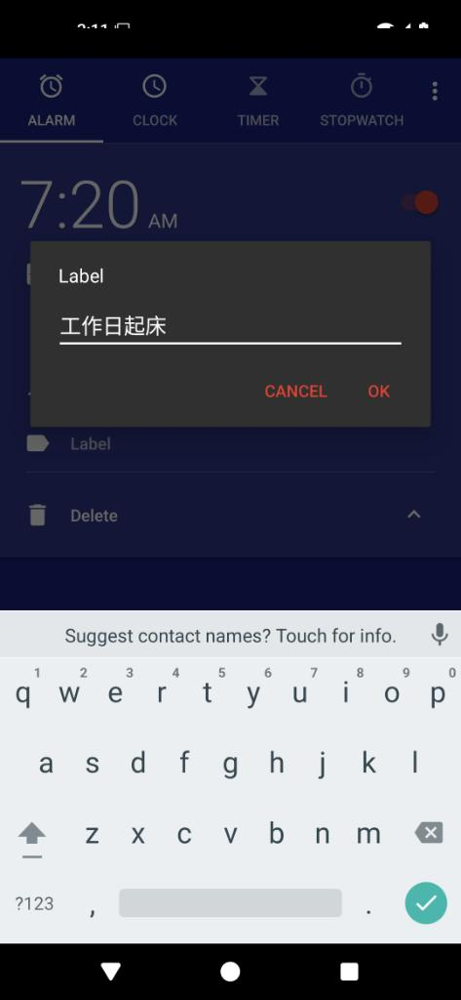

<code>33 · mobile_take_screenshot</code> — 点击 OK 后对话框仍显示，可能又是截图滞后。截图确认标签是否已保存、对话框是否关闭。

**Reasoning**

点击 OK 后对话框仍显示，可能又是截图滞后。截图确认标签是否已保存、对话框是否关闭。

**Arguments**

<pre><code>{
  &quot;device&quot;: &quot;local_df_clock&quot;
}</code></pre>

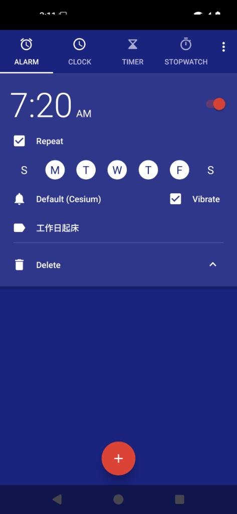

<code>34 · mobile_click_on_screen_at_coordinates</code> — 第一个闹钟完成：7:20 AM、周一到周五、标签「工作日起床」、已开启、铃声默认、振动默认。现在点「+」创建第二个闹钟（周末 9:10）。

**Reasoning**

第一个闹钟完成：7:20 AM、周一到周五、标签「工作日起床」、已开启、铃声默认、振动默认。现在点「+」创建第二个闹钟（周末 9:10）。

**Arguments**

<pre><code>{
  &quot;device&quot;: &quot;local_df_clock&quot;,
  &quot;x&quot;: 540,
  &quot;y&quot;: 2087
}</code></pre>

**Observation**

<pre><code>Clicked on screen at coordinates: 540, 2087</code></pre>

<code>35 · mobile_take_screenshot</code> — 点击「+」后截图未变化，可能又是截图滞后。截图确认时间选择器是否打开。

**Reasoning**

点击「+」后截图未变化，可能又是截图滞后。截图确认时间选择器是否打开。

**Arguments**

<pre><code>{
  &quot;device&quot;: &quot;local_df_clock&quot;
}</code></pre>

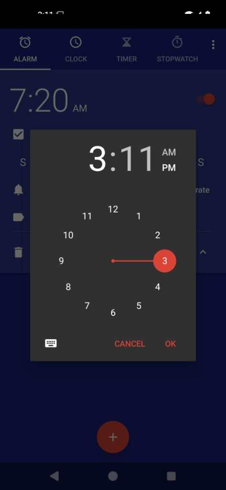

<code>36 · mobile_click_on_screen_at_coordinates</code> — 新闹钟的时间选择器已打开。先点小时 9（截图坐标 129,543，换算设备坐标约 294,1240）。

**Reasoning**

新闹钟的时间选择器已打开。先点小时 9（截图坐标 129,543，换算设备坐标约 294,1240）。

**Arguments**

<pre><code>{
  &quot;device&quot;: &quot;local_df_clock&quot;,
  &quot;x&quot;: 294,
  &quot;y&quot;: 1240
}</code></pre>

**Observation**

<pre><code>Clicked on screen at coordinates: 294, 1240</code></pre>

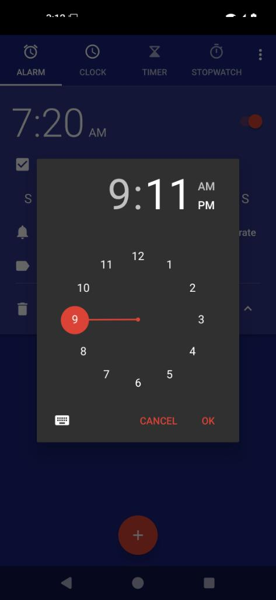

<code>37 · mobile_list_elements_on_screen</code> — 小时 9 已选中（显示 9:11），但还需确认表盘当前模式和 AM/PM 状态。列出元素查看。

**Reasoning**

小时 9 已选中（显示 9:11），但还需确认表盘当前模式和 AM/PM 状态。列出元素查看。

**Arguments**

<pre><code>{
  &quot;device&quot;: &quot;local_df_clock&quot;
}</code></pre>

**Observation**

<pre><code>One element per line: @ref Type text= label= name= value= id= at=x,y size=WxH [focused] [selected] [checked] [disabled]
@e1 FrameLayout id=&quot;com.android.launcher3:id/taskbar_container&quot; at=0,2208 size=1080x132
@e2 View id=&quot;com.android.launcher3:id/taskbar_scrim&quot; at=0,2208 size=1080x132
@e3 FrameLayout id=&quot;com.android.launcher3:id/navbuttons_view&quot; at=0,2208 size=1080x132
@e4 FrameLayout id=&quot;com.android.launcher3:id/start_contextual_buttons&quot; at=72,2208 size=93x132
@e5 LinearLayout id=&quot;com.android.launcher3:id/end_nav_buttons&quot; at=165,2208 size=748x132
@e6 ImageView label=&quot;Back&quot; id=&quot;com.android.launcher3:id/back&quot; at=166,2213 size=187x121
@e7 ImageView label=&quot;Home&quot; id=&quot;com.android.launcher3:id/home&quot; at=429,2213 size=220x121
@e8 ImageView label=&quot;Recents&quot; id=&quot;com.android.launcher3:id/recent_apps&quot; at=725,2213 size=187x121
@e9 FrameLayout id=&quot;com.android.launcher3:id/end_contextual_buttons&quot; at=915,2208 size=93x132
@e10 FrameLayout id=&quot;com.android.systemui:id/status_bar_launch_animation_container&quot; at=0,0 size=1080x66
@e11 FrameLayout id=&quot;com.android.systemui:id/container&quot; at=0,0 size=1080x66
@e12 FrameLayout id=&quot;com.android.systemui:id/status_bar_container&quot; at=0,0 size=1080x66
@e13 FrameLayout id=&quot;com.android.systemui:id/status_bar&quot; at=0,0 size=1080x66
@e14 LinearLayout id=&quot;com.android.systemui:id/status_bar_contents&quot; at=136,0 size=889x66
@e15 FrameLayout id=&quot;com.android.systemui:id/status_bar_start_side_container&quot; at=147,6 size=433x60
@e16 FrameLayout id=&quot;com.android.systemui:id/status_bar_start_side_content&quot; at=147,6 size=170x60
@e17 LinearLayout id=&quot;com.android.systemui:id/status_bar_start_side_except_heads_up&quot; at=147,6 size=170x60
@e18 TextView text=&quot;3:12&quot; label=&quot;3:12 PM&quot; id=&quot;com.android.systemui:id/clock&quot; at=147,48 size=109x18
@e19 FrameLayout id=&quot;com.android.systemui:id/notification_icon_area&quot; at=256,6 size=61x60
@e20 ViewGroup id=&quot;com.android.systemui:id/notificationIcons&quot; at=256,6 size=61x60
@e21 ImageView label=&quot;Android System notification: &quot; at=256,38 size=61x28
@e22 FrameLayout id=&quot;com.android.systemui:id/status_bar_end_side_container&quot; at=580,6 size=434x60
@e23 LinearLayout id=&quot;com.android.systemui:id/status_bar_end_side_content&quot; at=868,6 size=146x60
@e24 LinearLayout id=&quot;com.android.systemui:id/system_icons&quot; at=868,40 size=146x26
@e25 LinearLayout id=&quot;com.android.systemui:id/statusIcons&quot; at=876,40 size=106x26
@e26 FrameLayout id=&quot;com.android.systemui:id/wifi_combo&quot; at=876,40 size=48x26
@e27 LinearLayout id=&quot;com.android.systemui:id/wifi_group&quot; at=883,40 size=41x26
@e28 FrameLayout id=&quot;com.android.systemui:id/wifi_combo&quot; at=883,50 size=41x16
@e29 ImageView label=&quot;Wifi signal full.,No internet&quot; id=&quot;com.android.systemui:id/wifi_signal&quot; at=883,50 size=41x16
@e30 FrameLayout label=&quot;Phone signal full.&quot; id=&quot;com.android.systemui:id/mobile_combo&quot; at=924,40 size=41x26
@e31 LinearLayout id=&quot;com.android.systemui:id/mobile_group&quot; at=924,40 size=41x26
@e32 ImageView id=&quot;com.android.systemui:id/mobile_signal&quot; at=924,50 size=41x16
@e33 LinearLayout label=&quot;Battery charging, 100 percent.&quot; id=&quot;com.android.systemui:id/battery&quot; at=982,52 size=21x14
@e34 FrameLayout id=&quot;android:id/content&quot; at=144,619 size=792x1106
@e35 LinearLayout id=&quot;android:id/parentPanel&quot; at=144,619 size=792x1106
@e36 FrameLayout id=&quot;android:id/customPanel&quot; at=144,619 size=792x1106
@e37 FrameLayout id=&quot;android:id/custom&quot; at=144,619 size=792x1106
@e38 TimePicker id=&quot;android:id/timePicker&quot; at=144,619 size=792x1106
@e39 RelativeLayout id=&quot;android:id/time_header&quot; at=144,619 size=792x275
@e40 TextView text=&quot;9&quot; id=&quot;android:id/hours&quot; at=328,641 size=186x220
@e41 TextView text=&quot;:&quot; id=&quot;android:id/separator&quot; at=520,641 size=40x231
@e42 TextView text=&quot;11&quot; id=&quot;android:id/minutes&quot; at=566,641 size=186x220
@e43 RadioGroup id=&quot;android:id/ampm_layout&quot; at=774,679 size=67x170
@e44 RadioButton text=&quot;AM&quot; id=&quot;android:id/am_label&quot; at=774,679 size=67x96
@e45 RadioButton text=&quot;PM&quot; id=&quot;android:id/pm_label&quot; at=774,753 size=66x96 checked
@e46 View id=&quot;android:id/radial_picker&quot; at=188,938 size=704x616
@e47 RadialTimePickerView$RadialPickerTouchHelper label=&quot;0&quot; at=485,944 size=110x110
@e48 RadialTimePickerView$RadialPickerTouchHelper label=&quot;5&quot; at=608,977 size=110x110
@e49 RadialTimePickerView$RadialPickerTouchHelper label=&quot;10&quot; at=698,1067 size=110x110
@e50 RadialTimePickerView$RadialPickerTouchHelper label=&quot;11&quot; at=710,1090 size=110x110 selected
@e51 RadialTimePickerView$RadialPickerTouchHelper label=&quot;15&quot; at=732,1191 size=110x110
@e52 RadialTimePickerView$RadialPickerTouchHelper label=&quot;20&quot; at=698,1314 size=110x110
@e53 RadialTimePickerView$RadialPickerTouchHelper label=&quot;25&quot; at=608,1404 size=110x110
@e54 RadialTimePickerView$RadialPickerTouchHelper label=&quot;30&quot; at=485,1438 size=110x110
@e55 RadialTimePickerView$RadialPickerTouchHelper label=&quot;35&quot; at=361,1404 size=110x110
@e56 RadialTimePickerView$RadialPickerTouchHelper label=&quot;40&quot; at=271,1314 size=110x110
@e57 RadialTimePickerView$RadialPickerTouchHelper label=&quot;45&quot; at=238,1191 size=110x110
@e58 RadialTimePickerView$RadialPickerTouchHelper label=&quot;50&quot; at=271,1067 size=110x110
@e59 RadialTimePickerView$RadialPickerTouchHelper label=&quot;55&quot; at=361,977 size=110x110
@e60 ImageButton label=&quot;Switch to text input mode for the time input.&quot; id=&quot;android:id/toggle_mode&quot; at=177,1573 size=132x132
@e61 ScrollView id=&quot;android:id/buttonPanel&quot; at=481,1554 size=455x171
@e62 Button text=&quot;CANCEL&quot; id=&quot;android:id/button2&quot; at=514,1565 size=213x149
@e63 Button text=&quot;OK&quot; id=&quot;android:id/button1&quot; at=727,1565 size=176x149</code></pre>

<code>38 · mobile_click_on_screen_at_coordinates</code> — 表盘已切到分钟模式（当前 11 分），PM 仍处于选中。先点 10（@e49）把分钟设为 10。

**Reasoning**

表盘已切到分钟模式（当前 11 分），PM 仍处于选中。先点 10（@e49）把分钟设为 10。

**Arguments**

<pre><code>{
  &quot;device&quot;: &quot;local_df_clock&quot;,
  &quot;ref&quot;: &quot;@e49&quot;
}</code></pre>

**Observation**

<pre><code>Clicked on element @e49</code></pre>

<code>39 · mobile_click_on_screen_at_coordinates</code> — 分钟已设为 10，显示 9:10，但仍是 PM。点击 AM（@e44）切换为上午。

**Reasoning**

分钟已设为 10，显示 9:10，但仍是 PM。点击 AM（@e44）切换为上午。

**Arguments**

<pre><code>{
  &quot;device&quot;: &quot;local_df_clock&quot;,
  &quot;ref&quot;: &quot;@e44&quot;
}</code></pre>

**Observation**

<pre><code>Clicked on element @e44</code></pre>

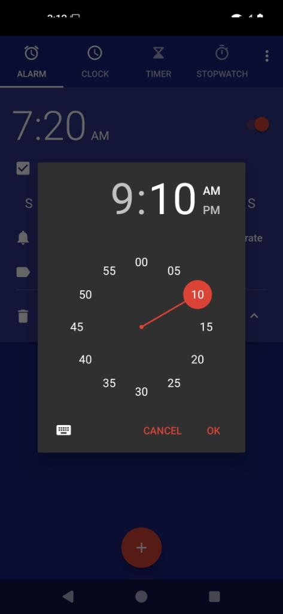

<code>40 · mobile_list_elements_on_screen</code> — 截图可能与之前相同（滞后）。列出元素确认 AM 是否已选中，再点 OK。

**Reasoning**

截图可能与之前相同（滞后）。列出元素确认 AM 是否已选中，再点 OK。

**Arguments**

<pre><code>{
  &quot;device&quot;: &quot;local_df_clock&quot;
}</code></pre>

**Observation**

<pre><code>One element per line: @ref Type text= label= name= value= id= at=x,y size=WxH [focused] [selected] [checked] [disabled]
@e1 FrameLayout id=&quot;com.android.launcher3:id/taskbar_container&quot; at=0,2208 size=1080x132
@e2 View id=&quot;com.android.launcher3:id/taskbar_scrim&quot; at=0,2208 size=1080x132
@e3 FrameLayout id=&quot;com.android.launcher3:id/navbuttons_view&quot; at=0,2208 size=1080x132
@e4 FrameLayout id=&quot;com.android.launcher3:id/start_contextual_buttons&quot; at=72,2208 size=93x132
@e5 LinearLayout id=&quot;com.android.launcher3:id/end_nav_buttons&quot; at=165,2208 size=748x132
@e6 ImageView label=&quot;Back&quot; id=&quot;com.android.launcher3:id/back&quot; at=166,2213 size=187x121
@e7 ImageView label=&quot;Home&quot; id=&quot;com.android.launcher3:id/home&quot; at=429,2213 size=220x121
@e8 ImageView label=&quot;Recents&quot; id=&quot;com.android.launcher3:id/recent_apps&quot; at=725,2213 size=187x121
@e9 FrameLayout id=&quot;com.android.launcher3:id/end_contextual_buttons&quot; at=915,2208 size=93x132
@e10 FrameLayout id=&quot;com.android.systemui:id/status_bar_launch_animation_container&quot; at=0,0 size=1080x66
@e11 FrameLayout id=&quot;com.android.systemui:id/container&quot; at=0,0 size=1080x66
@e12 FrameLayout id=&quot;com.android.systemui:id/status_bar_container&quot; at=0,0 size=1080x66
@e13 FrameLayout id=&quot;com.android.systemui:id/status_bar&quot; at=0,0 size=1080x66
@e14 LinearLayout id=&quot;com.android.systemui:id/status_bar_contents&quot; at=136,0 size=889x66
@e15 FrameLayout id=&quot;com.android.systemui:id/status_bar_start_side_container&quot; at=147,6 size=433x60
@e16 FrameLayout id=&quot;com.android.systemui:id/status_bar_start_side_content&quot; at=147,6 size=170x60
@e17 LinearLayout id=&quot;com.android.systemui:id/status_bar_start_side_except_heads_up&quot; at=147,6 size=170x60
@e18 TextView text=&quot;3:13&quot; label=&quot;3:13 PM&quot; id=&quot;com.android.systemui:id/clock&quot; at=147,48 size=109x18
@e19 FrameLayout id=&quot;com.android.systemui:id/notification_icon_area&quot; at=256,6 size=61x60
@e20 ViewGroup id=&quot;com.android.systemui:id/notificationIcons&quot; at=256,6 size=61x60
@e21 ImageView label=&quot;Android System notification: &quot; at=256,38 size=61x28
@e22 FrameLayout id=&quot;com.android.systemui:id/status_bar_end_side_container&quot; at=580,6 size=434x60
@e23 LinearLayout id=&quot;com.android.systemui:id/status_bar_end_side_content&quot; at=868,6 size=146x60
@e24 LinearLayout id=&quot;com.android.systemui:id/system_icons&quot; at=868,40 size=146x26
@e25 LinearLayout id=&quot;com.android.systemui:id/statusIcons&quot; at=876,40 size=106x26
@e26 FrameLayout id=&quot;com.android.systemui:id/wifi_combo&quot; at=876,40 size=48x26
@e27 LinearLayout id=&quot;com.android.systemui:id/wifi_group&quot; at=883,40 size=41x26
@e28 FrameLayout id=&quot;com.android.systemui:id/wifi_combo&quot; at=883,50 size=41x16
@e29 ImageView label=&quot;Wifi signal full.,No internet&quot; id=&quot;com.android.systemui:id/wifi_signal&quot; at=883,50 size=41x16
@e30 FrameLayout label=&quot;Phone three bars.&quot; id=&quot;com.android.systemui:id/mobile_combo&quot; at=924,40 size=41x26
@e31 LinearLayout id=&quot;com.android.systemui:id/mobile_group&quot; at=924,40 size=41x26
@e32 ImageView id=&quot;com.android.systemui:id/mobile_signal&quot; at=924,50 size=41x16
@e33 LinearLayout label=&quot;Battery charging, 100 percent.&quot; id=&quot;com.android.systemui:id/battery&quot; at=982,52 size=21x14
@e34 FrameLayout id=&quot;android:id/content&quot; at=144,619 size=792x1106
@e35 LinearLayout id=&quot;android:id/parentPanel&quot; at=144,619 size=792x1106
@e36 FrameLayout id=&quot;android:id/customPanel&quot; at=144,619 size=792x1106
@e37 FrameLayout id=&quot;android:id/custom&quot; at=144,619 size=792x1106
@e38 TimePicker id=&quot;android:id/timePicker&quot; at=144,619 size=792x1106
@e39 RelativeLayout id=&quot;android:id/time_header&quot; at=144,619 size=792x275
@e40 TextView text=&quot;9&quot; id=&quot;android:id/hours&quot; at=328,641 size=186x220
@e41 TextView text=&quot;:&quot; id=&quot;android:id/separator&quot; at=520,641 size=40x231
@e42 TextView text=&quot;10&quot; id=&quot;android:id/minutes&quot; at=566,641 size=186x220
@e43 RadioGroup id=&quot;android:id/ampm_layout&quot; at=774,679 size=67x170
@e44 RadioButton text=&quot;AM&quot; id=&quot;android:id/am_label&quot; at=774,679 size=67x96 checked
@e45 RadioButton text=&quot;PM&quot; id=&quot;android:id/pm_label&quot; at=774,753 size=66x96
@e46 View id=&quot;android:id/radial_picker&quot; at=188,938 size=704x616
@e47 RadialTimePickerView$RadialPickerTouchHelper label=&quot;0&quot; at=485,944 size=110x110
@e48 RadialTimePickerView$RadialPickerTouchHelper label=&quot;5&quot; at=608,977 size=110x110
@e49 RadialTimePickerView$RadialPickerTouchHelper label=&quot;10&quot; at=698,1067 size=110x110 selected
@e50 RadialTimePickerView$RadialPickerTouchHelper label=&quot;15&quot; at=732,1191 size=110x110
@e51 RadialTimePickerView$RadialPickerTouchHelper label=&quot;20&quot; at=698,1314 size=110x110
@e52 RadialTimePickerView$RadialPickerTouchHelper label=&quot;25&quot; at=608,1404 size=110x110
@e53 RadialTimePickerView$RadialPickerTouchHelper label=&quot;30&quot; at=485,1438 size=110x110
@e54 RadialTimePickerView$RadialPickerTouchHelper label=&quot;35&quot; at=361,1404 size=110x110
@e55 RadialTimePickerView$RadialPickerTouchHelper label=&quot;40&quot; at=271,1314 size=110x110
@e56 RadialTimePickerView$RadialPickerTouchHelper label=&quot;45&quot; at=238,1191 size=110x110
@e57 RadialTimePickerView$RadialPickerTouchHelper label=&quot;50&quot; at=271,1067 size=110x110
@e58 RadialTimePickerView$RadialPickerTouchHelper label=&quot;55&quot; at=361,977 size=110x110
@e59 ImageButton label=&quot;Switch to text input mode for the time input.&quot; id=&quot;android:id/toggle_mode&quot; at=177,1573 size=132x132
@e60 ScrollView id=&quot;android:id/buttonPanel&quot; at=481,1554 size=455x171
@e61 Button text=&quot;CANCEL&quot; id=&quot;android:id/button2&quot; at=514,1565 size=213x149
@e62 Button text=&quot;OK&quot; id=&quot;android:id/button1&quot; at=727,1565 size=176x149</code></pre>

<code>41 · mobile_click_on_screen_at_coordinates</code> — 确认 AM 已勾选、时间为 9:10 AM。点击 OK（@e62）创建该闹钟。

**Reasoning**

确认 AM 已勾选、时间为 9:10 AM。点击 OK（@e62）创建该闹钟。

**Arguments**

<pre><code>{
  &quot;device&quot;: &quot;local_df_clock&quot;,
  &quot;ref&quot;: &quot;@e62&quot;
}</code></pre>

**Observation**

<pre><code>Clicked on element @e62</code></pre>

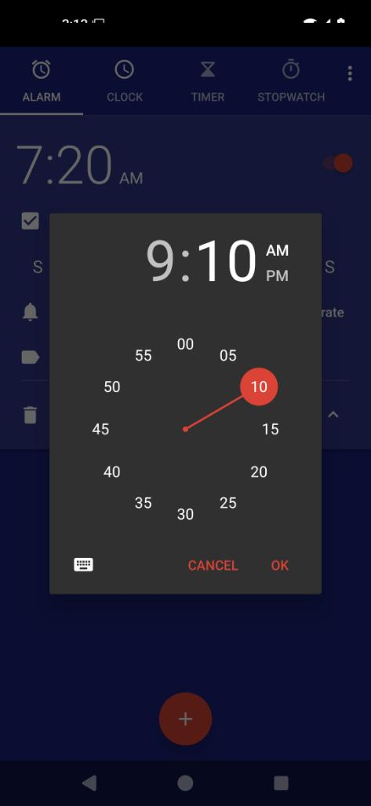

<code>42 · mobile_take_screenshot</code> — 截图可能仍滞后。重新截图确认 9:10 AM 闹钟是否已创建。

**Reasoning**

截图可能仍滞后。重新截图确认 9:10 AM 闹钟是否已创建。

**Arguments**

<pre><code>{
  &quot;device&quot;: &quot;local_df_clock&quot;
}</code></pre>

<code>43 · mobile_click_on_screen_at_coordinates</code> — 9:10 AM 闹钟已创建且开启，显示「Tomorrow」未设重复。点击该卡片的展开箭头（截图坐标约 424,712，换算设备坐标约 968,1627）。

**Reasoning**

9:10 AM 闹钟已创建且开启，显示「Tomorrow」未设重复。点击该卡片的展开箭头（截图坐标约 424,712，换算设备坐标约 968,1627）。

**Arguments**

<pre><code>{
  &quot;device&quot;: &quot;local_df_clock&quot;,
  &quot;x&quot;: 968,
  &quot;y&quot;: 1627
}</code></pre>

**Observation**

<pre><code>Clicked on screen at coordinates: 968, 1627</code></pre>

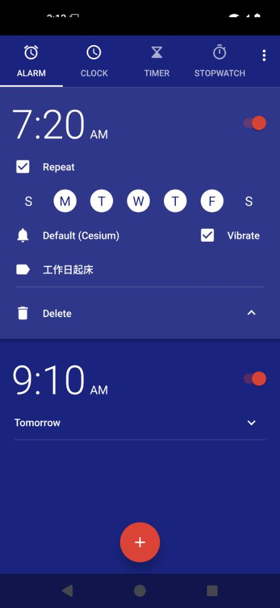

<code>44 · mobile_take_screenshot</code> — 截图可能滞后，确认 9:10 卡片是否已展开。

**Reasoning**

截图可能滞后，确认 9:10 卡片是否已展开。

**Arguments**

<pre><code>{
  &quot;device&quot;: &quot;local_df_clock&quot;
}</code></pre>

<code>45 · mobile_list_elements_on_screen</code> — 9:10 卡片已展开，7:20 卡片已折叠显示「工作日起床 Mon, Tue, Wed, Thu, Fri」。现在列出元素，点 9:10 卡片的 Repeat 复选框。

**Reasoning**

9:10 卡片已展开，7:20 卡片已折叠显示「工作日起床 Mon, Tue, Wed, Thu, Fri」。现在列出元素，点 9:10 卡片的 Repeat 复选框。

**Arguments**

<pre><code>{
  &quot;device&quot;: &quot;local_df_clock&quot;
}</code></pre>

**Observation**

<pre><code>One element per line: @ref Type text= label= name= value= id= at=x,y size=WxH [focused] [selected] [checked] [disabled]
@e1 FrameLayout id=&quot;com.android.launcher3:id/taskbar_container&quot; at=0,2208 size=1080x132
@e2 View id=&quot;com.android.launcher3:id/taskbar_scrim&quot; at=0,2208 size=1080x132
@e3 FrameLayout id=&quot;com.android.launcher3:id/navbuttons_view&quot; at=0,2208 size=1080x132
@e4 FrameLayout id=&quot;com.android.launcher3:id/start_contextual_buttons&quot; at=72,2208 size=93x132
@e5 LinearLayout id=&quot;com.android.launcher3:id/end_nav_buttons&quot; at=165,2208 size=748x132
@e6 ImageView label=&quot;Back&quot; id=&quot;com.android.launcher3:id/back&quot; at=166,2213 size=187x121
@e7 ImageView label=&quot;Home&quot; id=&quot;com.android.launcher3:id/home&quot; at=429,2213 size=220x121
@e8 ImageView label=&quot;Recents&quot; id=&quot;com.android.launcher3:id/recent_apps&quot; at=725,2213 size=187x121
@e9 FrameLayout id=&quot;com.android.launcher3:id/end_contextual_buttons&quot; at=915,2208 size=93x132
@e10 FrameLayout id=&quot;com.android.systemui:id/status_bar_launch_animation_container&quot; at=0,0 size=1080x66
@e11 FrameLayout id=&quot;com.android.systemui:id/container&quot; at=0,0 size=1080x66
@e12 FrameLayout id=&quot;com.android.systemui:id/status_bar_container&quot; at=0,0 size=1080x66
@e13 FrameLayout id=&quot;com.android.systemui:id/status_bar&quot; at=0,0 size=1080x66
@e14 LinearLayout id=&quot;com.android.systemui:id/status_bar_contents&quot; at=136,0 size=889x66
@e15 FrameLayout id=&quot;com.android.systemui:id/status_bar_start_side_container&quot; at=147,6 size=433x60
@e16 FrameLayout id=&quot;com.android.systemui:id/status_bar_start_side_content&quot; at=147,6 size=170x60
@e17 LinearLayout id=&quot;com.android.systemui:id/status_bar_start_side_except_heads_up&quot; at=147,6 size=170x60
@e18 TextView text=&quot;3:14&quot; label=&quot;3:14 PM&quot; id=&quot;com.android.systemui:id/clock&quot; at=147,48 size=109x18
@e19 FrameLayout id=&quot;com.android.systemui:id/notification_icon_area&quot; at=256,6 size=61x60
@e20 ViewGroup id=&quot;com.android.systemui:id/notificationIcons&quot; at=256,6 size=61x60
@e21 ImageView label=&quot;Android System notification: &quot; at=256,38 size=61x28
@e22 FrameLayout id=&quot;com.android.systemui:id/status_bar_end_side_container&quot; at=580,6 size=434x60
@e23 LinearLayout id=&quot;com.android.systemui:id/status_bar_end_side_content&quot; at=868,6 size=146x60
@e24 LinearLayout id=&quot;com.android.systemui:id/system_icons&quot; at=868,40 size=146x26
@e25 LinearLayout id=&quot;com.android.systemui:id/statusIcons&quot; at=876,40 size=106x26
@e26 FrameLayout id=&quot;com.android.systemui:id/wifi_combo&quot; at=876,40 size=48x26
@e27 LinearLayout id=&quot;com.android.systemui:id/wifi_group&quot; at=883,40 size=41x26
@e28 FrameLayout id=&quot;com.android.systemui:id/wifi_combo&quot; at=883,50 size=41x16
@e29 ImageView label=&quot;Wifi signal full.,No internet&quot; id=&quot;com.android.systemui:id/wifi_signal&quot; at=883,50 size=41x16
@e30 FrameLayout label=&quot;Phone signal full.&quot; id=&quot;com.android.systemui:id/mobile_combo&quot; at=924,40 size=41x26
@e31 LinearLayout id=&quot;com.android.systemui:id/mobile_group&quot; at=924,40 size=41x26
@e32 ImageView id=&quot;com.android.systemui:id/mobile_signal&quot; at=924,50 size=41x16
@e33 LinearLayout label=&quot;Battery charging, 100 percent.&quot; id=&quot;com.android.systemui:id/battery&quot; at=982,52 size=21x14
@e34 LinearLayout id=&quot;com.android.deskclock:id/action_bar_root&quot; at=0,136 size=1080x2204
@e35 FrameLayout id=&quot;android:id/content&quot; at=0,136 size=1080x2204
@e36 ViewGroup id=&quot;com.android.deskclock:id/content&quot; at=0,136 size=1080x2204
@e37 ViewGroup id=&quot;com.android.deskclock:id/toolbar&quot; at=0,136 size=1080x198
@e38 HorizontalScrollView id=&quot;com.android.deskclock:id/tabs&quot; at=0,136 size=969x198
@e39 LinearLayout label=&quot;Alarm&quot; at=0,136 size=242x198 selected
@e40 TextView text=&quot;ALARM&quot; id=&quot;android:id/text1&quot; at=64,168 size=113x133 selected
@e41 LinearLayout label=&quot;Clock&quot; at=242,136 size=242x198
@e42 TextView text=&quot;CLOCK&quot; id=&quot;android:id/text1&quot; at=310,168 size=105x133
@e43 LinearLayout label=&quot;Timer&quot; at=484,136 size=242x198
@e44 TextView text=&quot;TIMER&quot; id=&quot;android:id/text1&quot; at=556,168 size=98x133
@e45 LinearLayout label=&quot;Stopwatch&quot; at=726,136 size=243x198
@e46 TextView text=&quot;STOPWATCH&quot; id=&quot;android:id/text1&quot; at=749,168 size=197x133
@e47 ImageView label=&quot;More options&quot; at=969,147 size=111x132
@e48 View id=&quot;com.android.deskclock:id/tab_hairline&quot; at=0,334 size=1080x3
@e49 ViewGroup id=&quot;com.android.deskclock:id/desk_clock_pager&quot; at=0,337 size=1080x1871
@e50 FrameLayout id=&quot;com.android.deskclock:id/main&quot; at=0,337 size=1080x1871
@e51 RecyclerView id=&quot;com.android.deskclock:id/alarms_recycler_view&quot; at=0,337 size=1080x1871
@e52 ViewGroup label=&quot;7:20 AM 工作日起床&quot; at=0,337 size=1080x373
@e53 TextView text=&quot;7:20 AM&quot; label=&quot;7:20 AM&quot; id=&quot;com.android.deskclock:id/digital_clock&quot; at=44,370 size=373x205
@e54 Switch id=&quot;com.android.deskclock:id/onoff&quot; at=904,407 size=132x132 checked
@e55 TextView text=&quot;工作日起床&quot; label=&quot;Label 工作日起床&quot; id=&quot;com.android.deskclock:id/label&quot; at=44,614 size=217x53
@e56 TextView text=&quot;Mon, Tue, Wed, Thu, Fri&quot; label=&quot;Monday, Tuesday, Wednesday, Thursday, Friday&quot; id=&quot;com.android.deskclock:id/days_of_week&quot; at=261,614 size=431x53
@e57 ImageButton label=&quot;Expand alarm&quot; id=&quot;com.android.deskclock:id/arrow&quot; at=904,575 size=132x132
@e58 View id=&quot;com.android.deskclock:id/hairline&quot; at=55,707 size=970x3
@e59 ViewGroup label=&quot;9:10 AM Alarm&quot; at=0,710 size=1080x852
@e60 TextView text=&quot;9:10 AM&quot; label=&quot;9:10 AM&quot; id=&quot;com.android.deskclock:id/digital_clock&quot; at=44,743 size=373x205
@e61 Switch id=&quot;com.android.deskclock:id/onoff&quot; at=904,780 size=132x132 checked
@e62 CheckBox text=&quot;Repeat&quot; id=&quot;com.android.deskclock:id/repeat_onoff&quot; at=44,948 size=277x132
@e63 TextView text=&quot;Default (Cesium)&quot; label=&quot;Ringtone Default (Cesium)&quot; id=&quot;com.android.deskclock:id/choose_ringtone&quot; at=44,1080 size=712x132
@e64 CheckBox text=&quot;Vibrate&quot; id=&quot;com.android.deskclock:id/vibrate_onoff&quot; at=756,1080 size=280x132 checked
@e65 TextView label=&quot;No label specified&quot; id=&quot;com.android.deskclock:id/edit_label&quot; at=44,1212 size=992x132
@e66 View id=&quot;com.android.deskclock:id/hairline&quot; at=61,1344 size=958x3
@e67 Button text=&quot;Delete&quot; id=&quot;com.android.deskclock:id/delete&quot; at=44,1380 size=265x132
@e68 ImageButton label=&quot;Collapse alarm&quot; id=&quot;com.android.deskclock:id/arrow&quot; at=904,1380 size=132x132
@e69 ImageView id=&quot;com.android.deskclock:id/drop_shadow&quot; at=0,337 size=1080x22
@e70 ImageButton label=&quot;Add alarm&quot; id=&quot;com.android.deskclock:id/fab&quot; at=463,2010 size=154x154
@e71 View id=&quot;android:id/navigationBarBackground&quot; at=0,2208 size=1080x132</code></pre>

<code>46 · mobile_click_on_screen_at_coordinates</code> — 9:10 卡片已展开，Repeat 复选框为 @e62（未勾选）。点击它显示星期选择。

**Reasoning**

9:10 卡片已展开，Repeat 复选框为 @e62（未勾选）。点击它显示星期选择。

**Arguments**

<pre><code>{
  &quot;device&quot;: &quot;local_df_clock&quot;,
  &quot;ref&quot;: &quot;@e62&quot;
}</code></pre>

**Observation**

<pre><code>Clicked on element @e62</code></pre>

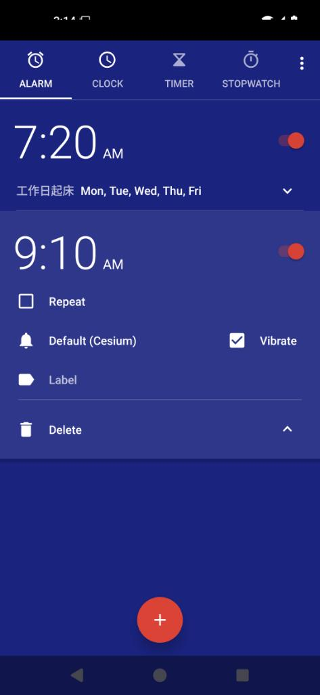

<code>47 · mobile_list_elements_on_screen</code> — 截图可能滞后。列出元素确认星期选择是否出现、各天勾选状态。

**Reasoning**

截图可能滞后。列出元素确认星期选择是否出现、各天勾选状态。

**Arguments**

<pre><code>{
  &quot;device&quot;: &quot;local_df_clock&quot;
}</code></pre>

**Observation**

<pre><code>One element per line: @ref Type text= label= name= value= id= at=x,y size=WxH [focused] [selected] [checked] [disabled]
@e1 FrameLayout id=&quot;com.android.launcher3:id/taskbar_container&quot; at=0,2208 size=1080x132
@e2 View id=&quot;com.android.launcher3:id/taskbar_scrim&quot; at=0,2208 size=1080x132
@e3 FrameLayout id=&quot;com.android.launcher3:id/navbuttons_view&quot; at=0,2208 size=1080x132
@e4 FrameLayout id=&quot;com.android.launcher3:id/start_contextual_buttons&quot; at=72,2208 size=93x132
@e5 LinearLayout id=&quot;com.android.launcher3:id/end_nav_buttons&quot; at=165,2208 size=748x132
@e6 ImageView label=&quot;Back&quot; id=&quot;com.android.launcher3:id/back&quot; at=166,2213 size=187x121
@e7 ImageView label=&quot;Home&quot; id=&quot;com.android.launcher3:id/home&quot; at=429,2213 size=220x121
@e8 ImageView label=&quot;Recents&quot; id=&quot;com.android.launcher3:id/recent_apps&quot; at=725,2213 size=187x121
@e9 FrameLayout id=&quot;com.android.launcher3:id/end_contextual_buttons&quot; at=915,2208 size=93x132
@e10 FrameLayout id=&quot;com.android.systemui:id/status_bar_launch_animation_container&quot; at=0,0 size=1080x66
@e11 FrameLayout id=&quot;com.android.systemui:id/container&quot; at=0,0 size=1080x66
@e12 FrameLayout id=&quot;com.android.systemui:id/status_bar_container&quot; at=0,0 size=1080x66
@e13 FrameLayout id=&quot;com.android.systemui:id/status_bar&quot; at=0,0 size=1080x66
@e14 LinearLayout id=&quot;com.android.systemui:id/status_bar_contents&quot; at=136,0 size=889x66
@e15 FrameLayout id=&quot;com.android.systemui:id/status_bar_start_side_container&quot; at=147,6 size=433x60
@e16 FrameLayout id=&quot;com.android.systemui:id/status_bar_start_side_content&quot; at=147,6 size=170x60
@e17 LinearLayout id=&quot;com.android.systemui:id/status_bar_start_side_except_heads_up&quot; at=147,6 size=170x60
@e18 TextView text=&quot;3:14&quot; label=&quot;3:14 PM&quot; id=&quot;com.android.systemui:id/clock&quot; at=147,48 size=109x18
@e19 FrameLayout id=&quot;com.android.systemui:id/notification_icon_area&quot; at=256,6 size=61x60
@e20 ViewGroup id=&quot;com.android.systemui:id/notificationIcons&quot; at=256,6 size=61x60
@e21 ImageView label=&quot;Android System notification: &quot; at=256,38 size=61x28
@e22 FrameLayout id=&quot;com.android.systemui:id/status_bar_end_side_container&quot; at=580,6 size=434x60
@e23 LinearLayout id=&quot;com.android.systemui:id/status_bar_end_side_content&quot; at=868,6 size=146x60
@e24 LinearLayout id=&quot;com.android.systemui:id/system_icons&quot; at=868,40 size=146x26
@e25 LinearLayout id=&quot;com.android.systemui:id/statusIcons&quot; at=876,40 size=106x26
@e26 FrameLayout id=&quot;com.android.systemui:id/wifi_combo&quot; at=876,40 size=48x26
@e27 LinearLayout id=&quot;com.android.systemui:id/wifi_group&quot; at=883,40 size=41x26
@e28 FrameLayout id=&quot;com.android.systemui:id/wifi_combo&quot; at=883,50 size=41x16
@e29 ImageView label=&quot;Wifi signal full.,No internet&quot; id=&quot;com.android.systemui:id/wifi_signal&quot; at=883,50 size=41x16
@e30 FrameLayout label=&quot;Phone signal full.&quot; id=&quot;com.android.systemui:id/mobile_combo&quot; at=924,40 size=41x26
@e31 LinearLayout id=&quot;com.android.systemui:id/mobile_group&quot; at=924,40 size=41x26
@e32 ImageView id=&quot;com.android.systemui:id/mobile_signal&quot; at=924,50 size=41x16
@e33 LinearLayout label=&quot;Battery charging, 100 percent.&quot; id=&quot;com.android.systemui:id/battery&quot; at=982,52 size=21x14
@e34 LinearLayout id=&quot;com.android.deskclock:id/action_bar_root&quot; at=0,136 size=1080x2204
@e35 FrameLayout id=&quot;android:id/content&quot; at=0,136 size=1080x2204
@e36 ViewGroup id=&quot;com.android.deskclock:id/content&quot; at=0,136 size=1080x2204
@e37 ViewGroup id=&quot;com.android.deskclock:id/toolbar&quot; at=0,136 size=1080x198
@e38 HorizontalScrollView id=&quot;com.android.deskclock:id/tabs&quot; at=0,136 size=969x198
@e39 LinearLayout label=&quot;Alarm&quot; at=0,136 size=242x198 selected
@e40 TextView text=&quot;ALARM&quot; id=&quot;android:id/text1&quot; at=64,168 size=113x133 selected
@e41 LinearLayout label=&quot;Clock&quot; at=242,136 size=242x198
@e42 TextView text=&quot;CLOCK&quot; id=&quot;android:id/text1&quot; at=310,168 size=105x133
@e43 LinearLayout label=&quot;Timer&quot; at=484,136 size=242x198
@e44 TextView text=&quot;TIMER&quot; id=&quot;android:id/text1&quot; at=556,168 size=98x133
@e45 LinearLayout label=&quot;Stopwatch&quot; at=726,136 size=243x198
@e46 TextView text=&quot;STOPWATCH&quot; id=&quot;android:id/text1&quot; at=749,168 size=197x133
@e47 ImageView label=&quot;More options&quot; at=969,147 size=111x132
@e48 View id=&quot;com.android.deskclock:id/tab_hairline&quot; at=0,334 size=1080x3
@e49 ViewGroup id=&quot;com.android.deskclock:id/desk_clock_pager&quot; at=0,337 size=1080x1871
@e50 FrameLayout id=&quot;com.android.deskclock:id/main&quot; at=0,337 size=1080x1871
@e51 RecyclerView id=&quot;com.android.deskclock:id/alarms_recycler_view&quot; at=0,337 size=1080x1871
@e52 ViewGroup label=&quot;7:20 AM 工作日起床&quot; at=0,337 size=1080x373
@e53 TextView text=&quot;7:20 AM&quot; label=&quot;7:20 AM&quot; id=&quot;com.android.deskclock:id/digital_clock&quot; at=44,370 size=373x205
@e54 Switch id=&quot;com.android.deskclock:id/onoff&quot; at=904,407 size=132x132 checked
@e55 TextView text=&quot;工作日起床&quot; label=&quot;Label 工作日起床&quot; id=&quot;com.android.deskclock:id/label&quot; at=44,614 size=217x53
@e56 TextView text=&quot;Mon, Tue, Wed, Thu, Fri&quot; label=&quot;Monday, Tuesday, Wednesday, Thursday, Friday&quot; id=&quot;com.android.deskclock:id/days_of_week&quot; at=261,614 size=431x53
@e57 ImageButton label=&quot;Expand alarm&quot; id=&quot;com.android.deskclock:id/arrow&quot; at=904,575 size=132x132
@e58 View id=&quot;com.android.deskclock:id/hairline&quot; at=55,707 size=970x3
@e59 ViewGroup label=&quot;9:10 AM Alarm&quot; at=0,710 size=1080x984
@e60 TextView text=&quot;9:10 AM&quot; label=&quot;9:10 AM&quot; id=&quot;com.android.deskclock:id/digital_clock&quot; at=44,743 size=373x205
@e61 Switch id=&quot;com.android.deskclock:id/onoff&quot; at=904,780 size=132x132 checked
@e62 CheckBox text=&quot;Repeat&quot; id=&quot;com.android.deskclock:id/repeat_onoff&quot; at=44,948 size=277x132 checked
@e63 LinearLayout id=&quot;com.android.deskclock:id/repeat_days&quot; at=44,1080 size=992x132
@e64 CheckBox text=&quot;S&quot; label=&quot;Sunday&quot; id=&quot;com.android.deskclock:id/day_button_box&quot; at=44,1080 size=132x132 checked
@e65 CheckBox text=&quot;M&quot; label=&quot;Monday&quot; id=&quot;com.android.deskclock:id/day_button_box&quot; at=185,1080 size=132x132 checked
@e66 CheckBox text=&quot;T&quot; label=&quot;Tuesday&quot; id=&quot;com.android.deskclock:id/day_button_box&quot; at=326,1080 size=132x132 checked
@e67 CheckBox text=&quot;W&quot; label=&quot;Wednesday&quot; id=&quot;com.android.deskclock:id/day_button_box&quot; at=468,1080 size=132x132 checked
@e68 CheckBox text=&quot;T&quot; label=&quot;Thursday&quot; id=&quot;com.android.deskclock:id/day_button_box&quot; at=610,1080 size=132x132 checked
@e69 CheckBox text=&quot;F&quot; label=&quot;Friday&quot; id=&quot;com.android.deskclock:id/day_button_box&quot; at=752,1080 size=132x132 checked
@e70 CheckBox text=&quot;S&quot; label=&quot;Saturday&quot; id=&quot;com.android.deskclock:id/day_button_box&quot; at=894,1080 size=132x132 checked
@e71 TextView text=&quot;Default (Cesium)&quot; label=&quot;Ringtone Default (Cesium)&quot; id=&quot;com.android.deskclock:id/choose_ringtone&quot; at=44,1212 size=712x132
@e72 CheckBox text=&quot;Vibrate&quot; id=&quot;com.android.deskclock:id/vibrate_onoff&quot; at=756,1212 size=280x132 checked
@e73 TextView label=&quot;No label specified&quot; id=&quot;com.android.deskclock:id/edit_label&quot; at=44,1344 size=992x132
@e74 View id=&quot;com.android.deskclock:id/hairline&quot; at=61,1476 size=958x3
@e75 Button text=&quot;Delete&quot; id=&quot;com.android.deskclock:id/delete&quot; at=44,1512 size=265x132
@e76 ImageButton label=&quot;Collapse alarm&quot; id=&quot;com.android.deskclock:id/arrow&quot; at=904,1512 size=132x132
@e77 ImageView id=&quot;com.android.deskclock:id/drop_shadow&quot; at=0,337 size=1080x22
@e78 ImageButton label=&quot;Add alarm&quot; id=&quot;com.android.deskclock:id/fab&quot; at=463,2010 size=154x154
@e79 View id=&quot;android:id/navigationBarBackground&quot; at=0,2208 size=1080x132</code></pre>

<code>48 · mobile_click_on_screen_at_coordinates</code> — 9:10 的 Repeat 已勾选，但所有 7 天都默认选中了。周末闹钟只需周六、周日，需取消周一到周五。先取消周一（@e65）。

**Reasoning**

9:10 的 Repeat 已勾选，但所有 7 天都默认选中了。周末闹钟只需周六、周日，需取消周一到周五。先取消周一（@e65）。

**Arguments**

<pre><code>{
  &quot;device&quot;: &quot;local_df_clock&quot;,
  &quot;ref&quot;: &quot;@e65&quot;
}</code></pre>

**Observation**

<pre><code>Clicked on element @e65</code></pre>

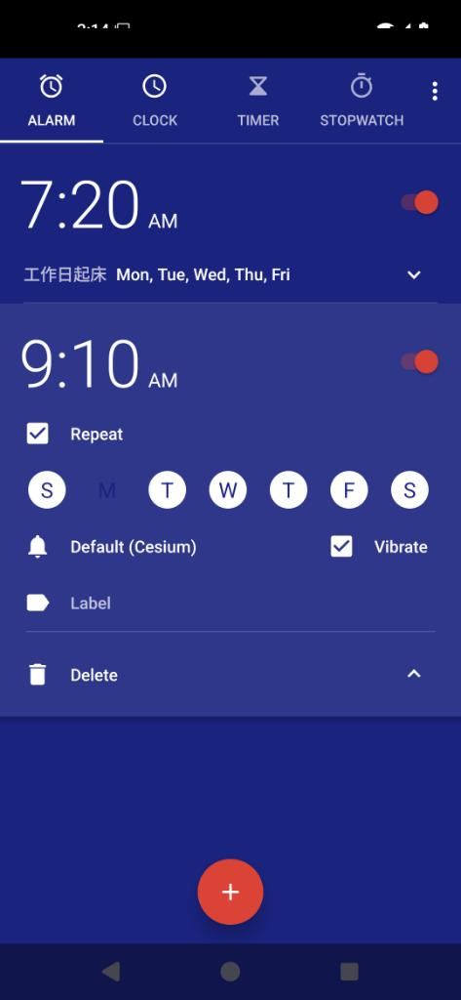

<code>49 · mobile_click_on_screen_at_coordinates</code> — 周一已取消（M 变灰）。继续取消周二（@e66）。

**Reasoning**

周一已取消（M 变灰）。继续取消周二（@e66）。

**Arguments**

<pre><code>{
  &quot;device&quot;: &quot;local_df_clock&quot;,
  &quot;ref&quot;: &quot;@e66&quot;
}</code></pre>

**Observation**

<pre><code>Clicked on element @e66</code></pre>

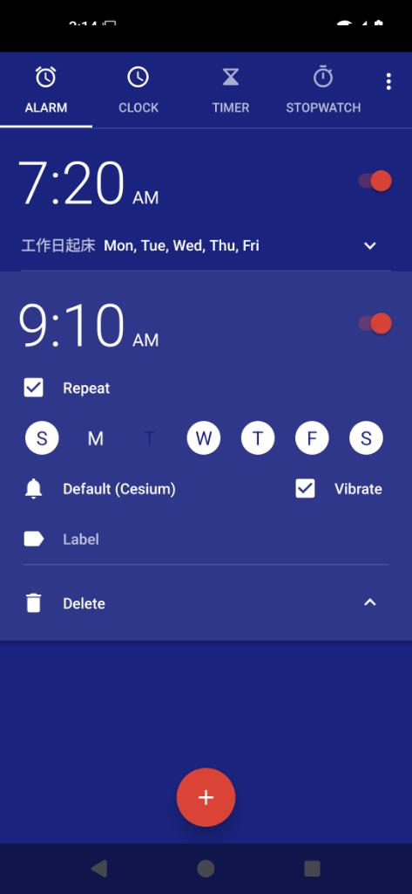

<code>50 · mobile_click_on_screen_at_coordinates</code> — 周二已取消。继续取消周三（@e67）。

**Reasoning**

周二已取消。继续取消周三（@e67）。

**Arguments**

<pre><code>{
  &quot;device&quot;: &quot;local_df_clock&quot;,
  &quot;ref&quot;: &quot;@e67&quot;
}</code></pre>

**Observation**

<pre><code>Clicked on element @e67</code></pre>

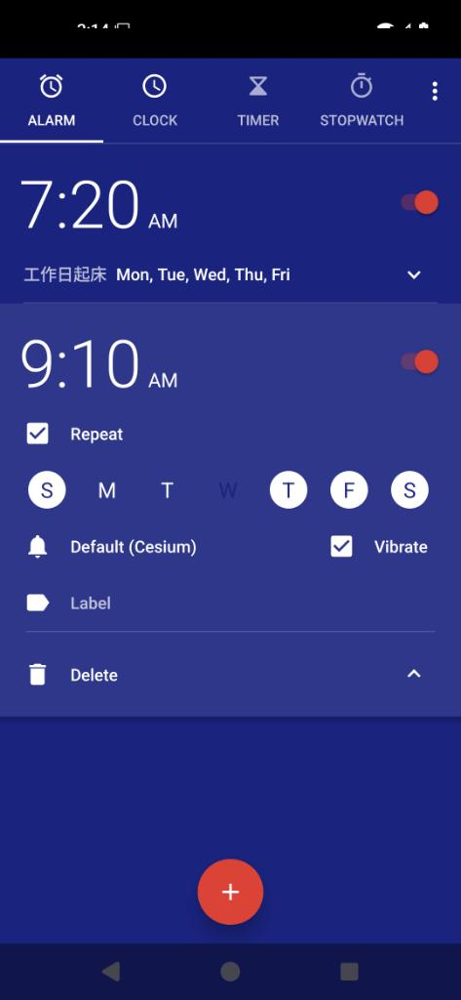

<code>51 · mobile_click_on_screen_at_coordinates</code> — 周三已取消。继续取消周四（@e68）。

**Reasoning**

周三已取消。继续取消周四（@e68）。

**Arguments**

<pre><code>{
  &quot;device&quot;: &quot;local_df_clock&quot;,
  &quot;ref&quot;: &quot;@e68&quot;
}</code></pre>

**Observation**

<pre><code>Clicked on element @e68</code></pre>

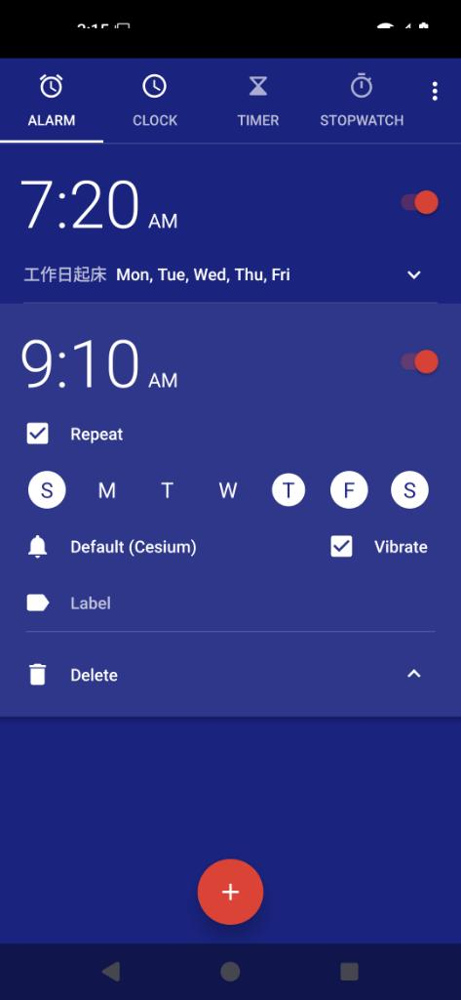

<code>52 · mobile_click_on_screen_at_coordinates</code> — 周四已取消。继续取消周五（@e69），之后就只剩周六、周日被选中。

**Reasoning**

周四已取消。继续取消周五（@e69），之后就只剩周六、周日被选中。

**Arguments**

<pre><code>{
  &quot;device&quot;: &quot;local_df_clock&quot;,
  &quot;ref&quot;: &quot;@e69&quot;
}</code></pre>

**Observation**

<pre><code>Clicked on element @e69</code></pre>

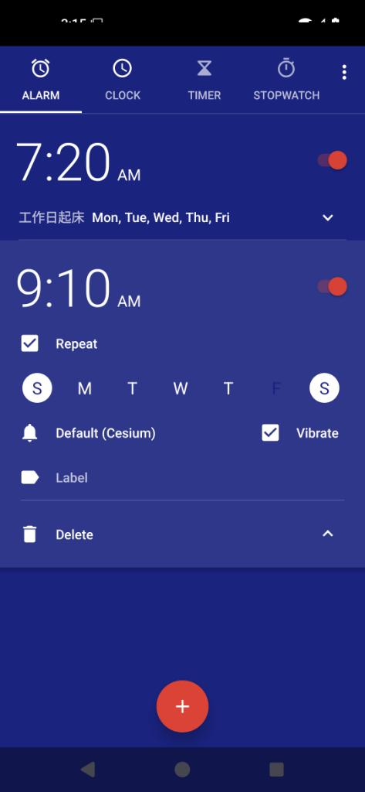

<code>53 · mobile_click_on_screen_at_coordinates</code> — 周五已取消，现在只剩周日和周六被选中（两个 S 白色高亮），周末重复设置正确。接下来点击 Label（@e73）设置标签「周末慢慢来」。

**Reasoning**

周五已取消，现在只剩周日和周六被选中（两个 S 白色高亮），周末重复设置正确。接下来点击 Label（@e73）设置标签「周末慢慢来」。

**Arguments**

<pre><code>{
  &quot;device&quot;: &quot;local_df_clock&quot;,
  &quot;ref&quot;: &quot;@e73&quot;
}</code></pre>

**Observation**

<pre><code>Clicked on element @e73</code></pre>

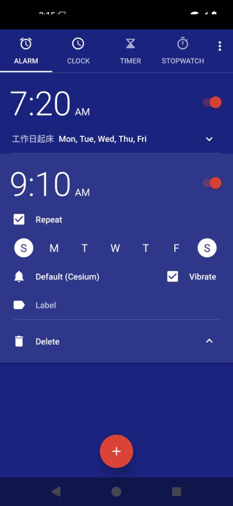

<code>54 · mobile_take_screenshot</code> — 截图可能滞后，确认标签对话框是否已打开。

**Reasoning**

截图可能滞后，确认标签对话框是否已打开。

**Arguments**

<pre><code>{
  &quot;device&quot;: &quot;local_df_clock&quot;
}</code></pre>

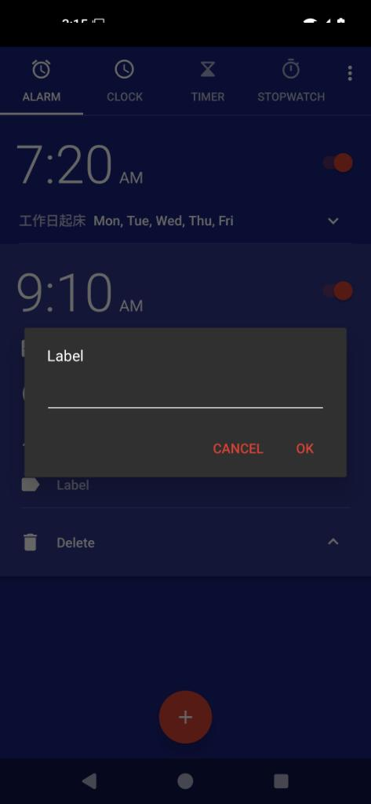

<code>55 · mobile_list_elements_on_screen</code> — 标签对话框已打开。根据之前的经验，输入框可能未聚焦。列出元素获取 EditText 的 ref，先点击聚焦。

**Reasoning**

标签对话框已打开。根据之前的经验，输入框可能未聚焦。列出元素获取 EditText 的 ref，先点击聚焦。

**Arguments**

<pre><code>{
  &quot;device&quot;: &quot;local_df_clock&quot;
}</code></pre>

**Observation**

<pre><code>One element per line: @ref Type text= label= name= value= id= at=x,y size=WxH [focused] [selected] [checked] [disabled]
@e1 FrameLayout id=&quot;com.android.launcher3:id/taskbar_container&quot; at=0,2208 size=1080x132
@e2 View id=&quot;com.android.launcher3:id/taskbar_scrim&quot; at=0,2208 size=1080x132
@e3 FrameLayout id=&quot;com.android.launcher3:id/navbuttons_view&quot; at=0,2208 size=1080x132
@e4 FrameLayout id=&quot;com.android.launcher3:id/start_contextual_buttons&quot; at=72,2208 size=93x132
@e5 LinearLayout id=&quot;com.android.launcher3:id/end_nav_buttons&quot; at=165,2208 size=748x132
@e6 ImageView label=&quot;Back&quot; id=&quot;com.android.launcher3:id/back&quot; at=166,2213 size=187x121
@e7 ImageView label=&quot;Home&quot; id=&quot;com.android.launcher3:id/home&quot; at=429,2213 size=220x121
@e8 ImageView label=&quot;Recents&quot; id=&quot;com.android.launcher3:id/recent_apps&quot; at=725,2213 size=187x121
@e9 FrameLayout id=&quot;com.android.launcher3:id/end_contextual_buttons&quot; at=915,2208 size=93x132
@e10 FrameLayout id=&quot;com.android.systemui:id/status_bar_launch_animation_container&quot; at=0,0 size=1080x66
@e11 FrameLayout id=&quot;com.android.systemui:id/container&quot; at=0,0 size=1080x66
@e12 FrameLayout id=&quot;com.android.systemui:id/status_bar_container&quot; at=0,0 size=1080x66
@e13 FrameLayout id=&quot;com.android.systemui:id/status_bar&quot; at=0,0 size=1080x66
@e14 LinearLayout id=&quot;com.android.systemui:id/status_bar_contents&quot; at=136,0 size=889x66
@e15 FrameLayout id=&quot;com.android.systemui:id/status_bar_start_side_container&quot; at=147,6 size=433x60
@e16 FrameLayout id=&quot;com.android.systemui:id/status_bar_start_side_content&quot; at=147,6 size=170x60
@e17 LinearLayout id=&quot;com.android.systemui:id/status_bar_start_side_except_heads_up&quot; at=147,6 size=170x60
@e18 TextView text=&quot;3:15&quot; label=&quot;3:15 PM&quot; id=&quot;com.android.systemui:id/clock&quot; at=147,48 size=109x18
@e19 FrameLayout id=&quot;com.android.systemui:id/notification_icon_area&quot; at=256,6 size=61x60
@e20 ViewGroup id=&quot;com.android.systemui:id/notificationIcons&quot; at=256,6 size=61x60
@e21 ImageView label=&quot;Android System notification: &quot; at=256,38 size=61x28
@e22 FrameLayout id=&quot;com.android.systemui:id/status_bar_end_side_container&quot; at=580,6 size=434x60
@e23 LinearLayout id=&quot;com.android.systemui:id/status_bar_end_side_content&quot; at=868,6 size=146x60
@e24 LinearLayout id=&quot;com.android.systemui:id/system_icons&quot; at=868,40 size=146x26
@e25 LinearLayout id=&quot;com.android.systemui:id/statusIcons&quot; at=876,40 size=106x26
@e26 FrameLayout id=&quot;com.android.systemui:id/wifi_combo&quot; at=876,40 size=48x26
@e27 LinearLayout id=&quot;com.android.systemui:id/wifi_group&quot; at=883,40 size=41x26
@e28 FrameLayout id=&quot;com.android.systemui:id/wifi_combo&quot; at=883,50 size=41x16
@e29 ImageView label=&quot;Wifi signal full.,No internet&quot; id=&quot;com.android.systemui:id/wifi_signal&quot; at=883,50 size=41x16
@e30 FrameLayout label=&quot;Phone signal full.&quot; id=&quot;com.android.systemui:id/mobile_combo&quot; at=924,40 size=41x26
@e31 LinearLayout id=&quot;com.android.systemui:id/mobile_group&quot; at=924,40 size=41x26
@e32 ImageView id=&quot;com.android.systemui:id/mobile_signal&quot; at=924,50 size=41x16
@e33 LinearLayout label=&quot;Battery charging, 100 percent.&quot; id=&quot;com.android.systemui:id/battery&quot; at=982,52 size=21x14
@e34 FrameLayout id=&quot;com.android.deskclock:id/action_bar_root&quot; at=71,954 size=938x435
@e35 FrameLayout id=&quot;android:id/content&quot; at=71,954 size=938x435
@e36 LinearLayoutCompat id=&quot;com.android.deskclock:id/parentPanel&quot; at=71,954 size=938x435
@e37 FrameLayout id=&quot;com.android.deskclock:id/contentPanel&quot; at=71,954 size=938x132
@e38 ScrollView id=&quot;com.android.deskclock:id/scrollView&quot; at=71,954 size=938x109
@e39 View id=&quot;com.android.deskclock:id/textSpacerNoTitle&quot; at=71,954 size=938x50
@e40 TextView text=&quot;Label&quot; id=&quot;android:id/message&quot; at=71,1004 size=938x59
@e41 FrameLayout id=&quot;com.android.deskclock:id/customPanel&quot; at=71,1086 size=938x132
@e42 FrameLayout id=&quot;com.android.deskclock:id/custom&quot; at=71,1086 size=938x124
@e43 EditText at=129,1086 size=822x124
@e44 ScrollView id=&quot;com.android.deskclock:id/buttonPanel&quot; at=71,1218 size=938x171
@e45 Button text=&quot;CANCEL&quot; id=&quot;android:id/button2&quot; at=587,1229 size=213x149
@e46 Button text=&quot;OK&quot; id=&quot;android:id/button1&quot; at=800,1229 size=176x149</code></pre>

<code>56 · mobile_click_on_screen_at_coordinates</code> — 标签对话框已打开，EditText 为 @e43。先点击聚焦。

**Reasoning**

标签对话框已打开，EditText 为 @e43。先点击聚焦。

**Arguments**

<pre><code>{
  &quot;device&quot;: &quot;local_df_clock&quot;,
  &quot;ref&quot;: &quot;@e43&quot;
}</code></pre>

**Observation**

<pre><code>Clicked on element @e43</code></pre>

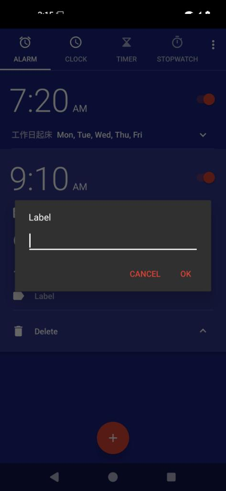

<code>57 · mobile_type_keys</code> — 输入框已聚焦（可见光标）。输入标签「周末慢慢来」。

**Reasoning**

输入框已聚焦（可见光标）。输入标签「周末慢慢来」。

**Arguments**

<pre><code>{
  &quot;device&quot;: &quot;local_df_clock&quot;,
  &quot;text&quot;: &quot;周末慢慢来&quot;,
  &quot;submit&quot;: false
}</code></pre>

**Observation**

<pre><code>Typed text: 周末慢慢来</code></pre>

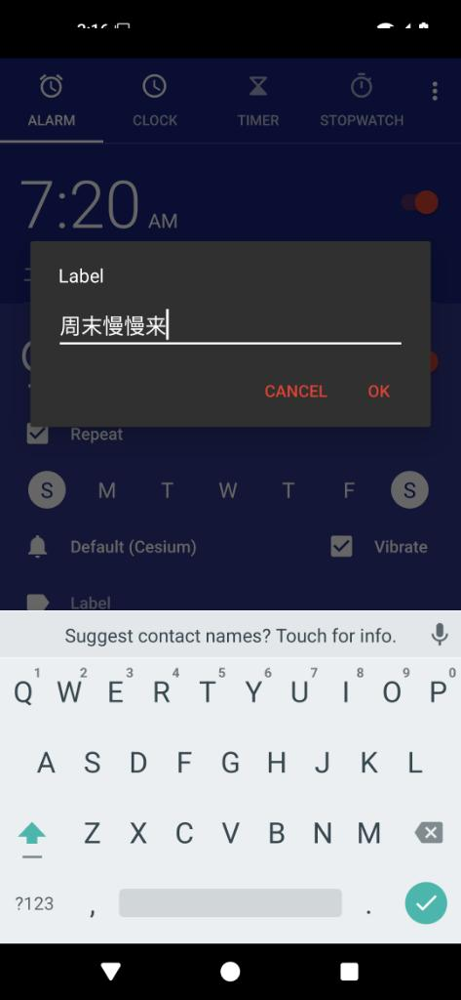

<code>58 · mobile_click_on_screen_at_coordinates</code> — 标签「周末慢慢来」已输入成功。点击 OK（截图坐标约 389,398，换算设备坐标约 888,909）保存标签。

**Reasoning**

标签「周末慢慢来」已输入成功。点击 OK（截图坐标约 389,398，换算设备坐标约 888,909）保存标签。

**Arguments**

<pre><code>{
  &quot;device&quot;: &quot;local_df_clock&quot;,
  &quot;x&quot;: 888,
  &quot;y&quot;: 909
}</code></pre>

**Observation**

<pre><code>Clicked on screen at coordinates: 888, 909</code></pre>

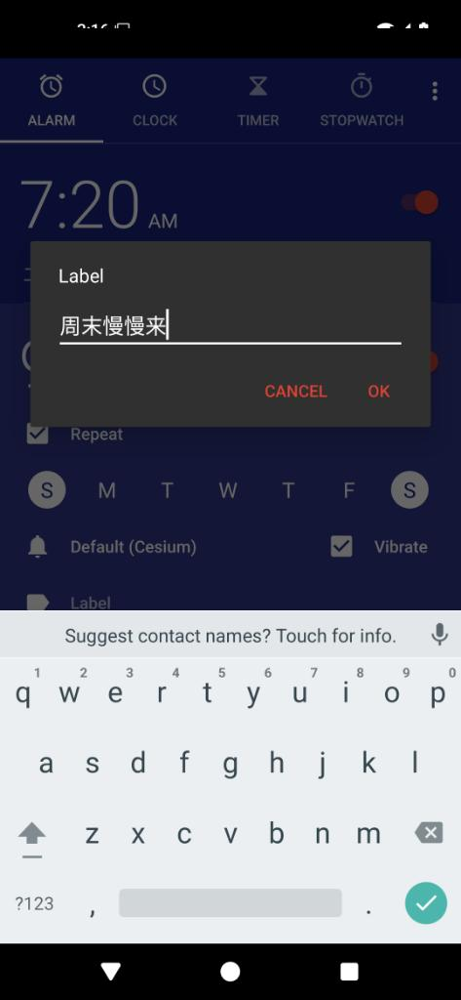

<code>59 · mobile_take_screenshot</code> — 截图可能又是滞后的。重新截图确认标签是否已保存、对话框是否关闭。

**Reasoning**

截图可能又是滞后的。重新截图确认标签是否已保存、对话框是否关闭。

**Arguments**

<pre><code>{
  &quot;device&quot;: &quot;local_df_clock&quot;
}</code></pre>

<code>60 · mobile_click_on_screen_at_coordinates</code> — 第二个闹钟完成：9:10 AM、仅周六日、标签「周末慢慢来」、已开启。现在点「+」创建第三个闹钟（每天 22:45「睡前阅读」，需关闭）。

**Reasoning**

第二个闹钟完成：9:10 AM、仅周六日、标签「周末慢慢来」、已开启。现在点「+」创建第三个闹钟（每天 22:45「睡前阅读」，需关闭）。

**Arguments**

<pre><code>{
  &quot;device&quot;: &quot;local_df_clock&quot;,
  &quot;x&quot;: 540,
  &quot;y&quot;: 2087
}</code></pre>

**Observation**

<pre><code>Clicked on screen at coordinates: 540, 2087</code></pre>

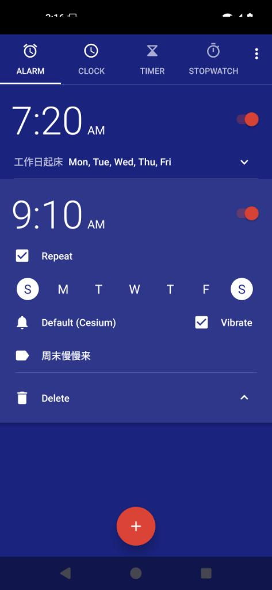

<code>61 · mobile_take_screenshot</code> — 截图可能滞后，确认时间选择器是否已打开。

**Reasoning**

截图可能滞后，确认时间选择器是否已打开。

**Arguments**

<pre><code>{
  &quot;device&quot;: &quot;local_df_clock&quot;
}</code></pre>

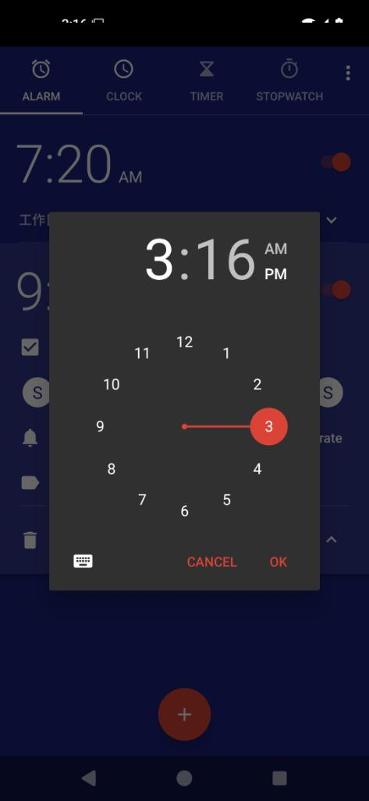

<code>62 · mobile_click_on_screen_at_coordinates</code> — 第三个闹钟的时间选择器已打开，显示 3:16。22:45 即 10:45 PM。先点小时 10（截图坐标约 136,489，换算设备坐标约 310,1117）。

**Reasoning**

第三个闹钟的时间选择器已打开，显示 3:16。22:45 即 10:45 PM。先点小时 10（截图坐标约 136,489，换算设备坐标约 310,1117）。

**Arguments**

<pre><code>{
  &quot;device&quot;: &quot;local_df_clock&quot;,
  &quot;x&quot;: 310,
  &quot;y&quot;: 1117
}</code></pre>

**Observation**

<pre><code>Clicked on screen at coordinates: 310, 1117</code></pre>

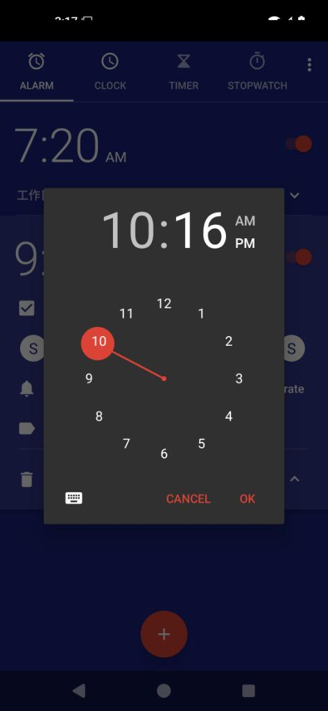

<code>63 · mobile_list_elements_on_screen</code> — 小时 10 已选中（显示 10:16）。列出元素确认当前表盘模式和 PM 的 ref。

**Reasoning**

小时 10 已选中（显示 10:16）。列出元素确认当前表盘模式和 PM 的 ref。

**Arguments**

<pre><code>{
  &quot;device&quot;: &quot;local_df_clock&quot;
}</code></pre>

**Observation**

<pre><code>One element per line: @ref Type text= label= name= value= id= at=x,y size=WxH [focused] [selected] [checked] [disabled]
@e1 FrameLayout id=&quot;com.android.launcher3:id/taskbar_container&quot; at=0,2208 size=1080x132
@e2 View id=&quot;com.android.launcher3:id/taskbar_scrim&quot; at=0,2208 size=1080x132
@e3 FrameLayout id=&quot;com.android.launcher3:id/navbuttons_view&quot; at=0,2208 size=1080x132
@e4 FrameLayout id=&quot;com.android.launcher3:id/start_contextual_buttons&quot; at=72,2208 size=93x132
@e5 LinearLayout id=&quot;com.android.launcher3:id/end_nav_buttons&quot; at=165,2208 size=748x132
@e6 ImageView label=&quot;Back&quot; id=&quot;com.android.launcher3:id/back&quot; at=166,2213 size=187x121
@e7 ImageView label=&quot;Home&quot; id=&quot;com.android.launcher3:id/home&quot; at=429,2213 size=220x121
@e8 ImageView label=&quot;Recents&quot; id=&quot;com.android.launcher3:id/recent_apps&quot; at=725,2213 size=187x121
@e9 FrameLayout id=&quot;com.android.launcher3:id/end_contextual_buttons&quot; at=915,2208 size=93x132
@e10 FrameLayout id=&quot;com.android.systemui:id/status_bar_launch_animation_container&quot; at=0,0 size=1080x66
@e11 FrameLayout id=&quot;com.android.systemui:id/container&quot; at=0,0 size=1080x66
@e12 FrameLayout id=&quot;com.android.systemui:id/status_bar_container&quot; at=0,0 size=1080x66
@e13 FrameLayout id=&quot;com.android.systemui:id/status_bar&quot; at=0,0 size=1080x66
@e14 LinearLayout id=&quot;com.android.systemui:id/status_bar_contents&quot; at=136,0 size=889x66
@e15 FrameLayout id=&quot;com.android.systemui:id/status_bar_start_side_container&quot; at=147,6 size=433x60
@e16 FrameLayout id=&quot;com.android.systemui:id/status_bar_start_side_content&quot; at=147,6 size=170x60
@e17 LinearLayout id=&quot;com.android.systemui:id/status_bar_start_side_except_heads_up&quot; at=147,6 size=170x60
@e18 TextView text=&quot;3:17&quot; label=&quot;3:17 PM&quot; id=&quot;com.android.systemui:id/clock&quot; at=147,48 size=109x18
@e19 FrameLayout id=&quot;com.android.systemui:id/notification_icon_area&quot; at=256,6 size=61x60
@e20 ViewGroup id=&quot;com.android.systemui:id/notificationIcons&quot; at=256,6 size=61x60
@e21 ImageView label=&quot;Android System notification: &quot; at=256,38 size=61x28
@e22 FrameLayout id=&quot;com.android.systemui:id/status_bar_end_side_container&quot; at=580,6 size=434x60
@e23 LinearLayout id=&quot;com.android.systemui:id/status_bar_end_side_content&quot; at=868,6 size=146x60
@e24 LinearLayout id=&quot;com.android.systemui:id/system_icons&quot; at=868,40 size=146x26
@e25 LinearLayout id=&quot;com.android.systemui:id/statusIcons&quot; at=876,40 size=106x26
@e26 FrameLayout id=&quot;com.android.systemui:id/wifi_combo&quot; at=876,40 size=48x26
@e27 LinearLayout id=&quot;com.android.systemui:id/wifi_group&quot; at=883,40 size=41x26
@e28 FrameLayout id=&quot;com.android.systemui:id/wifi_combo&quot; at=883,50 size=41x16
@e29 ImageView label=&quot;Wifi signal full.,No internet&quot; id=&quot;com.android.systemui:id/wifi_signal&quot; at=883,50 size=41x16
@e30 FrameLayout label=&quot;Phone three bars.&quot; id=&quot;com.android.systemui:id/mobile_combo&quot; at=924,40 size=41x26
@e31 LinearLayout id=&quot;com.android.systemui:id/mobile_group&quot; at=924,40 size=41x26
@e32 ImageView id=&quot;com.android.systemui:id/mobile_signal&quot; at=924,50 size=41x16
@e33 LinearLayout label=&quot;Battery charging, 100 percent.&quot; id=&quot;com.android.systemui:id/battery&quot; at=982,52 size=21x14
@e34 FrameLayout id=&quot;android:id/content&quot; at=144,619 size=792x1106
@e35 LinearLayout id=&quot;android:id/parentPanel&quot; at=144,619 size=792x1106
@e36 FrameLayout id=&quot;android:id/customPanel&quot; at=144,619 size=792x1106
@e37 FrameLayout id=&quot;android:id/custom&quot; at=144,619 size=792x1106
@e38 TimePicker id=&quot;android:id/timePicker&quot; at=144,619 size=792x1106
@e39 RelativeLayout id=&quot;android:id/time_header&quot; at=144,619 size=792x275
@e40 TextView text=&quot;10&quot; id=&quot;android:id/hours&quot; at=328,641 size=186x220
@e41 TextView text=&quot;:&quot; id=&quot;android:id/separator&quot; at=520,641 size=40x231
@e42 TextView text=&quot;16&quot; id=&quot;android:id/minutes&quot; at=566,641 size=186x220
@e43 RadioGroup id=&quot;android:id/ampm_layout&quot; at=774,679 size=67x170
@e44 RadioButton text=&quot;AM&quot; id=&quot;android:id/am_label&quot; at=774,679 size=67x96
@e45 RadioButton text=&quot;PM&quot; id=&quot;android:id/pm_label&quot; at=774,753 size=66x96 checked
@e46 View id=&quot;android:id/radial_picker&quot; at=188,938 size=704x616
@e47 RadialTimePickerView$RadialPickerTouchHelper label=&quot;0&quot; at=485,944 size=110x110
@e48 RadialTimePickerView$RadialPickerTouchHelper label=&quot;5&quot; at=608,977 size=110x110
@e49 RadialTimePickerView$RadialPickerTouchHelper label=&quot;10&quot; at=698,1067 size=110x110
@e50 RadialTimePickerView$RadialPickerTouchHelper label=&quot;15&quot; at=732,1191 size=110x110
@e51 RadialTimePickerView$RadialPickerTouchHelper label=&quot;16&quot; at=730,1216 size=110x110 selected
@e52 RadialTimePickerView$RadialPickerTouchHelper label=&quot;20&quot; at=698,1314 size=110x110
@e53 RadialTimePickerView$RadialPickerTouchHelper label=&quot;25&quot; at=608,1404 size=110x110
@e54 RadialTimePickerView$RadialPickerTouchHelper label=&quot;30&quot; at=485,1438 size=110x110
@e55 RadialTimePickerView$RadialPickerTouchHelper label=&quot;35&quot; at=361,1404 size=110x110
@e56 RadialTimePickerView$RadialPickerTouchHelper label=&quot;40&quot; at=271,1314 size=110x110
@e57 RadialTimePickerView$RadialPickerTouchHelper label=&quot;45&quot; at=238,1191 size=110x110
@e58 RadialTimePickerView$RadialPickerTouchHelper label=&quot;50&quot; at=271,1067 size=110x110
@e59 RadialTimePickerView$RadialPickerTouchHelper label=&quot;55&quot; at=361,977 size=110x110
@e60 ImageButton label=&quot;Switch to text input mode for the time input.&quot; id=&quot;android:id/toggle_mode&quot; at=177,1573 size=132x132
@e61 ScrollView id=&quot;android:id/buttonPanel&quot; at=481,1554 size=455x171
@e62 Button text=&quot;CANCEL&quot; id=&quot;android:id/button2&quot; at=514,1565 size=213x149
@e63 Button text=&quot;OK&quot; id=&quot;android:id/button1&quot; at=727,1565 size=176x149</code></pre>

<code>64 · mobile_click_on_screen_at_coordinates</code> — PM 已默认选中（符合 22:45 的需求），当前为分钟模式。点击 45（@e57）将分钟设为 45，即 10:45 PM。

**Reasoning**

PM 已默认选中（符合 22:45 的需求），当前为分钟模式。点击 45（@e57）将分钟设为 45，即 10:45 PM。

**Arguments**

<pre><code>{
  &quot;device&quot;: &quot;local_df_clock&quot;,
  &quot;ref&quot;: &quot;@e57&quot;
}</code></pre>

**Observation**

<pre><code>Clicked on element @e57</code></pre>

<code>65 · mobile_click_on_screen_at_coordinates</code> — 时间已设为 10:45 PM。点击 OK（@e63）创建该闹钟。

**Reasoning**

时间已设为 10:45 PM。点击 OK（@e63）创建该闹钟。

**Arguments**

<pre><code>{
  &quot;device&quot;: &quot;local_df_clock&quot;,
  &quot;ref&quot;: &quot;@e63&quot;
}</code></pre>

**Observation**

<pre><code>Clicked on element @e63</code></pre>

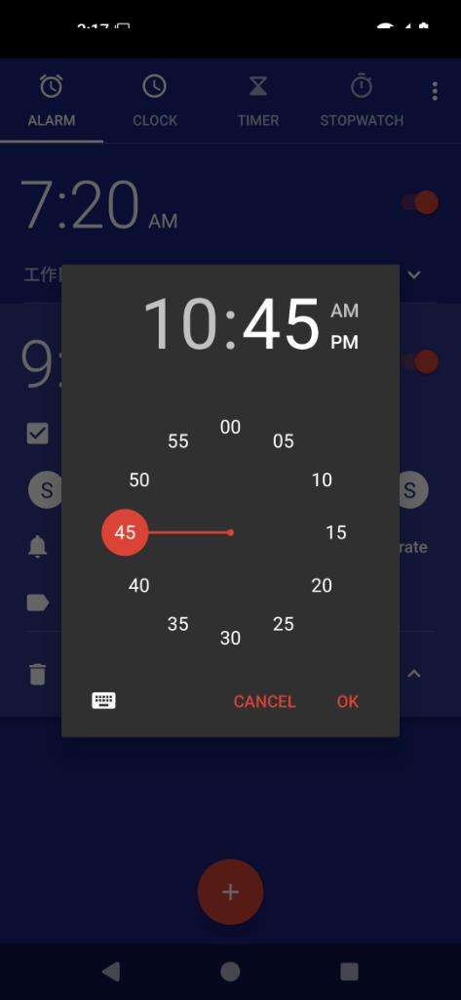

<code>66 · mobile_take_screenshot</code> — 截图可能滞后。重新截图确认 10:45 PM 闹钟是否已创建。

**Reasoning**

截图可能滞后。重新截图确认 10:45 PM 闹钟是否已创建。

**Arguments**

<pre><code>{
  &quot;device&quot;: &quot;local_df_clock&quot;
}</code></pre>

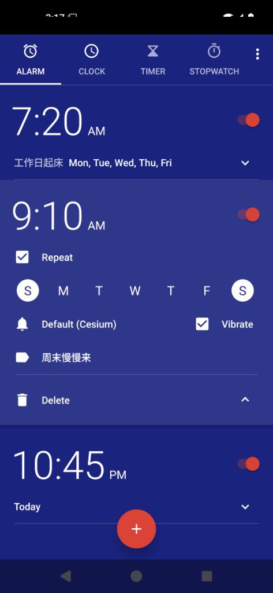

<code>67 · mobile_click_on_screen_at_coordinates</code> — 10:45 PM 闹钟已创建（默认开启，显示「Today」）。点击其展开箭头（截图坐标约 424,872，换算设备坐标约 968,1993）展开详细设置。

**Reasoning**

10:45 PM 闹钟已创建（默认开启，显示「Today」）。点击其展开箭头（截图坐标约 424,872，换算设备坐标约 968,1993）展开详细设置。

**Arguments**

<pre><code>{
  &quot;device&quot;: &quot;local_df_clock&quot;,
  &quot;x&quot;: 968,
  &quot;y&quot;: 1993
}</code></pre>

**Observation**

<pre><code>Clicked on screen at coordinates: 968, 1993</code></pre>

<code>68 · mobile_take_screenshot</code> — 截图可能又是滞后的。重新截图确认 10:45 卡片是否已展开。

**Reasoning**

截图可能又是滞后的。重新截图确认 10:45 卡片是否已展开。

**Arguments**

<pre><code>{
  &quot;device&quot;: &quot;local_df_clock&quot;
}</code></pre>

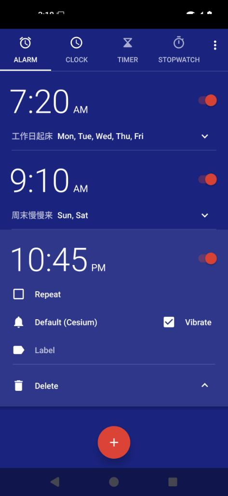

<code>69 · mobile_list_elements_on_screen</code> — 10:45 卡片已展开，三个闹钟都显示正确。现在列出元素，点击 10:45 的 Repeat 复选框（每天重复，默认会全选 7 天，正合适）。

**Reasoning**

10:45 卡片已展开，三个闹钟都显示正确。现在列出元素，点击 10:45 的 Repeat 复选框（每天重复，默认会全选 7 天，正合适）。

**Arguments**

<pre><code>{
  &quot;device&quot;: &quot;local_df_clock&quot;
}</code></pre>

**Observation**

<pre><code>One element per line: @ref Type text= label= name= value= id= at=x,y size=WxH [focused] [selected] [checked] [disabled]
@e1 FrameLayout id=&quot;com.android.launcher3:id/taskbar_container&quot; at=0,2208 size=1080x132
@e2 View id=&quot;com.android.launcher3:id/taskbar_scrim&quot; at=0,2208 size=1080x132
@e3 FrameLayout id=&quot;com.android.launcher3:id/navbuttons_view&quot; at=0,2208 size=1080x132
@e4 FrameLayout id=&quot;com.android.launcher3:id/start_contextual_buttons&quot; at=72,2208 size=93x132
@e5 LinearLayout id=&quot;com.android.launcher3:id/end_nav_buttons&quot; at=165,2208 size=748x132
@e6 ImageView label=&quot;Back&quot; id=&quot;com.android.launcher3:id/back&quot; at=166,2213 size=187x121
@e7 ImageView label=&quot;Home&quot; id=&quot;com.android.launcher3:id/home&quot; at=429,2213 size=220x121
@e8 ImageView label=&quot;Recents&quot; id=&quot;com.android.launcher3:id/recent_apps&quot; at=725,2213 size=187x121
@e9 FrameLayout id=&quot;com.android.launcher3:id/end_contextual_buttons&quot; at=915,2208 size=93x132
@e10 FrameLayout id=&quot;com.android.systemui:id/status_bar_launch_animation_container&quot; at=0,0 size=1080x66
@e11 FrameLayout id=&quot;com.android.systemui:id/container&quot; at=0,0 size=1080x66
@e12 FrameLayout id=&quot;com.android.systemui:id/status_bar_container&quot; at=0,0 size=1080x66
@e13 FrameLayout id=&quot;com.android.systemui:id/status_bar&quot; at=0,0 size=1080x66
@e14 LinearLayout id=&quot;com.android.systemui:id/status_bar_contents&quot; at=136,0 size=889x66
@e15 FrameLayout id=&quot;com.android.systemui:id/status_bar_start_side_container&quot; at=147,6 size=433x60
@e16 FrameLayout id=&quot;com.android.systemui:id/status_bar_start_side_content&quot; at=147,6 size=170x60
@e17 LinearLayout id=&quot;com.android.systemui:id/status_bar_start_side_except_heads_up&quot; at=147,6 size=170x60
@e18 TextView text=&quot;3:18&quot; label=&quot;3:18 PM&quot; id=&quot;com.android.systemui:id/clock&quot; at=147,48 size=109x18
@e19 FrameLayout id=&quot;com.android.systemui:id/notification_icon_area&quot; at=256,6 size=61x60
@e20 ViewGroup id=&quot;com.android.systemui:id/notificationIcons&quot; at=256,6 size=61x60
@e21 ImageView label=&quot;Android System notification: &quot; at=256,38 size=61x28
@e22 FrameLayout id=&quot;com.android.systemui:id/status_bar_end_side_container&quot; at=580,6 size=434x60
@e23 LinearLayout id=&quot;com.android.systemui:id/status_bar_end_side_content&quot; at=868,6 size=146x60
@e24 LinearLayout id=&quot;com.android.systemui:id/system_icons&quot; at=868,40 size=146x26
@e25 LinearLayout id=&quot;com.android.systemui:id/statusIcons&quot; at=876,40 size=106x26
@e26 FrameLayout id=&quot;com.android.systemui:id/wifi_combo&quot; at=876,40 size=48x26
@e27 LinearLayout id=&quot;com.android.systemui:id/wifi_group&quot; at=883,40 size=41x26
@e28 FrameLayout id=&quot;com.android.systemui:id/wifi_combo&quot; at=883,50 size=41x16
@e29 ImageView label=&quot;Wifi signal full.,No internet&quot; id=&quot;com.android.systemui:id/wifi_signal&quot; at=883,50 size=41x16
@e30 FrameLayout label=&quot;Phone signal full.&quot; id=&quot;com.android.systemui:id/mobile_combo&quot; at=924,40 size=41x26
@e31 LinearLayout id=&quot;com.android.systemui:id/mobile_group&quot; at=924,40 size=41x26
@e32 ImageView id=&quot;com.android.systemui:id/mobile_signal&quot; at=924,50 size=41x16
@e33 LinearLayout label=&quot;Battery charging, 100 percent.&quot; id=&quot;com.android.systemui:id/battery&quot; at=982,52 size=21x14
@e34 LinearLayout id=&quot;com.android.deskclock:id/action_bar_root&quot; at=0,136 size=1080x2204
@e35 FrameLayout id=&quot;android:id/content&quot; at=0,136 size=1080x2204
@e36 ViewGroup id=&quot;com.android.deskclock:id/content&quot; at=0,136 size=1080x2204
@e37 ViewGroup id=&quot;com.android.deskclock:id/toolbar&quot; at=0,136 size=1080x198
@e38 HorizontalScrollView id=&quot;com.android.deskclock:id/tabs&quot; at=0,136 size=969x198
@e39 LinearLayout label=&quot;Alarm&quot; at=0,136 size=242x198 selected
@e40 TextView text=&quot;ALARM&quot; id=&quot;android:id/text1&quot; at=64,168 size=113x133 selected
@e41 LinearLayout label=&quot;Clock&quot; at=242,136 size=242x198
@e42 TextView text=&quot;CLOCK&quot; id=&quot;android:id/text1&quot; at=310,168 size=105x133
@e43 LinearLayout label=&quot;Timer&quot; at=484,136 size=242x198
@e44 TextView text=&quot;TIMER&quot; id=&quot;android:id/text1&quot; at=556,168 size=98x133
@e45 LinearLayout label=&quot;Stopwatch&quot; at=726,136 size=243x198
@e46 TextView text=&quot;STOPWATCH&quot; id=&quot;android:id/text1&quot; at=749,168 size=197x133
@e47 ImageView label=&quot;More options&quot; at=969,147 size=111x132
@e48 View id=&quot;com.android.deskclock:id/tab_hairline&quot; at=0,334 size=1080x3
@e49 ViewGroup id=&quot;com.android.deskclock:id/desk_clock_pager&quot; at=0,337 size=1080x1871
@e50 FrameLayout id=&quot;com.android.deskclock:id/main&quot; at=0,337 size=1080x1871
@e51 RecyclerView id=&quot;com.android.deskclock:id/alarms_recycler_view&quot; at=0,337 size=1080x1871
@e52 ViewGroup label=&quot;7:20 AM 工作日起床&quot; at=0,337 size=1080x373
@e53 TextView text=&quot;7:20 AM&quot; label=&quot;7:20 AM&quot; id=&quot;com.android.deskclock:id/digital_clock&quot; at=44,370 size=373x205
@e54 Switch id=&quot;com.android.deskclock:id/onoff&quot; at=904,407 size=132x132 checked
@e55 TextView text=&quot;工作日起床&quot; label=&quot;Label 工作日起床&quot; id=&quot;com.android.deskclock:id/label&quot; at=44,614 size=217x53
@e56 TextView text=&quot;Mon, Tue, Wed, Thu, Fri&quot; label=&quot;Monday, Tuesday, Wednesday, Thursday, Friday&quot; id=&quot;com.android.deskclock:id/days_of_week&quot; at=261,614 size=431x53
@e57 ImageButton label=&quot;Expand alarm&quot; id=&quot;com.android.deskclock:id/arrow&quot; at=904,575 size=132x132
@e58 View id=&quot;com.android.deskclock:id/hairline&quot; at=55,707 size=970x3
@e59 ViewGroup label=&quot;9:10 AM 周末慢慢来&quot; at=0,710 size=1080x373
@e60 TextView text=&quot;9:10 AM&quot; label=&quot;9:10 AM&quot; id=&quot;com.android.deskclock:id/digital_clock&quot; at=44,743 size=373x205
@e61 Switch id=&quot;com.android.deskclock:id/onoff&quot; at=904,780 size=132x132 checked
@e62 TextView text=&quot;周末慢慢来&quot; label=&quot;Label 周末慢慢来&quot; id=&quot;com.android.deskclock:id/label&quot; at=44,987 size=217x53
@e63 TextView text=&quot;Sun, Sat&quot; label=&quot;Sunday, Saturday&quot; id=&quot;com.android.deskclock:id/days_of_week&quot; at=261,987 size=167x53
@e64 ImageButton label=&quot;Expand alarm&quot; id=&quot;com.android.deskclock:id/arrow&quot; at=904,948 size=132x132
@e65 View id=&quot;com.android.deskclock:id/hairline&quot; at=55,1080 size=970x3
@e66 ViewGroup label=&quot;10:45 PM Alarm&quot; at=0,1083 size=1080x852
@e67 TextView text=&quot;10:45 PM&quot; label=&quot;10:45 PM&quot; id=&quot;com.android.deskclock:id/digital_clock&quot; at=44,1116 size=457x205
@e68 Switch id=&quot;com.android.deskclock:id/onoff&quot; at=904,1153 size=132x132 checked
@e69 CheckBox text=&quot;Repeat&quot; id=&quot;com.android.deskclock:id/repeat_onoff&quot; at=44,1321 size=277x132
@e70 TextView text=&quot;Default (Cesium)&quot; label=&quot;Ringtone Default (Cesium)&quot; id=&quot;com.android.deskclock:id/choose_ringtone&quot; at=44,1453 size=712x132
@e71 CheckBox text=&quot;Vibrate&quot; id=&quot;com.android.deskclock:id/vibrate_onoff&quot; at=756,1453 size=280x132 checked
@e72 TextView label=&quot;No label specified&quot; id=&quot;com.android.deskclock:id/edit_label&quot; at=44,1585 size=992x132
@e73 View id=&quot;com.android.deskclock:id/hairline&quot; at=61,1717 size=958x3
@e74 Button text=&quot;Delete&quot; id=&quot;com.android.deskclock:id/delete&quot; at=44,1753 size=265x132
@e75 ImageButton label=&quot;Collapse alarm&quot; id=&quot;com.android.deskclock:id/arrow&quot; at=904,1753 size=132x132
@e76 ImageView id=&quot;com.android.deskclock:id/drop_shadow&quot; at=0,337 size=1080x22
@e77 ImageButton label=&quot;Add alarm&quot; id=&quot;com.android.deskclock:id/fab&quot; at=463,2010 size=154x154
@e78 View id=&quot;android:id/navigationBarBackground&quot; at=0,2208 size=1080x132</code></pre>

<code>70 · mobile_click_on_screen_at_coordinates</code> — 10:45 卡片已展开，Repeat 复选框为 @e69。点击它开启每天重复（默认会选中全部 7 天，正好符合「每天」）。

**Reasoning**

10:45 卡片已展开，Repeat 复选框为 @e69。点击它开启每天重复（默认会选中全部 7 天，正好符合「每天」）。

**Arguments**

<pre><code>{
  &quot;device&quot;: &quot;local_df_clock&quot;,
  &quot;ref&quot;: &quot;@e69&quot;
}</code></pre>

**Observation**

<pre><code>Clicked on element @e69</code></pre>

<code>71 · mobile_list_elements_on_screen</code> — 截图可能滞后。列出元素确认 Repeat 是否已勾选、7 天是否全选。

**Reasoning**

截图可能滞后。列出元素确认 Repeat 是否已勾选、7 天是否全选。

**Arguments**

<pre><code>{
  &quot;device&quot;: &quot;local_df_clock&quot;
}</code></pre>

**Observation**

<pre><code>One element per line: @ref Type text= label= name= value= id= at=x,y size=WxH [focused] [selected] [checked] [disabled]
@e1 FrameLayout id=&quot;com.android.launcher3:id/taskbar_container&quot; at=0,2208 size=1080x132
@e2 View id=&quot;com.android.launcher3:id/taskbar_scrim&quot; at=0,2208 size=1080x132
@e3 FrameLayout id=&quot;com.android.launcher3:id/navbuttons_view&quot; at=0,2208 size=1080x132
@e4 FrameLayout id=&quot;com.android.launcher3:id/start_contextual_buttons&quot; at=72,2208 size=93x132
@e5 LinearLayout id=&quot;com.android.launcher3:id/end_nav_buttons&quot; at=165,2208 size=748x132
@e6 ImageView label=&quot;Back&quot; id=&quot;com.android.launcher3:id/back&quot; at=166,2213 size=187x121
@e7 ImageView label=&quot;Home&quot; id=&quot;com.android.launcher3:id/home&quot; at=429,2213 size=220x121
@e8 ImageView label=&quot;Recents&quot; id=&quot;com.android.launcher3:id/recent_apps&quot; at=725,2213 size=187x121
@e9 FrameLayout id=&quot;com.android.launcher3:id/end_contextual_buttons&quot; at=915,2208 size=93x132
@e10 FrameLayout id=&quot;com.android.systemui:id/status_bar_launch_animation_container&quot; at=0,0 size=1080x66
@e11 FrameLayout id=&quot;com.android.systemui:id/container&quot; at=0,0 size=1080x66
@e12 FrameLayout id=&quot;com.android.systemui:id/status_bar_container&quot; at=0,0 size=1080x66
@e13 FrameLayout id=&quot;com.android.systemui:id/status_bar&quot; at=0,0 size=1080x66
@e14 LinearLayout id=&quot;com.android.systemui:id/status_bar_contents&quot; at=136,0 size=889x66
@e15 FrameLayout id=&quot;com.android.systemui:id/status_bar_start_side_container&quot; at=147,6 size=433x60
@e16 FrameLayout id=&quot;com.android.systemui:id/status_bar_start_side_content&quot; at=147,6 size=170x60
@e17 LinearLayout id=&quot;com.android.systemui:id/status_bar_start_side_except_heads_up&quot; at=147,6 size=170x60
@e18 TextView text=&quot;3:18&quot; label=&quot;3:18 PM&quot; id=&quot;com.android.systemui:id/clock&quot; at=147,48 size=109x18
@e19 FrameLayout id=&quot;com.android.systemui:id/notification_icon_area&quot; at=256,6 size=61x60
@e20 ViewGroup id=&quot;com.android.systemui:id/notificationIcons&quot; at=256,6 size=61x60
@e21 ImageView label=&quot;Android System notification: &quot; at=256,38 size=61x28
@e22 FrameLayout id=&quot;com.android.systemui:id/status_bar_end_side_container&quot; at=580,6 size=434x60
@e23 LinearLayout id=&quot;com.android.systemui:id/status_bar_end_side_content&quot; at=868,6 size=146x60
@e24 LinearLayout id=&quot;com.android.systemui:id/system_icons&quot; at=868,40 size=146x26
@e25 LinearLayout id=&quot;com.android.systemui:id/statusIcons&quot; at=876,40 size=106x26
@e26 FrameLayout id=&quot;com.android.systemui:id/wifi_combo&quot; at=876,40 size=48x26
@e27 LinearLayout id=&quot;com.android.systemui:id/wifi_group&quot; at=883,40 size=41x26
@e28 FrameLayout id=&quot;com.android.systemui:id/wifi_combo&quot; at=883,50 size=41x16
@e29 ImageView label=&quot;Wifi signal full.,No internet&quot; id=&quot;com.android.systemui:id/wifi_signal&quot; at=883,50 size=41x16
@e30 FrameLayout label=&quot;Phone signal full.&quot; id=&quot;com.android.systemui:id/mobile_combo&quot; at=924,40 size=41x26
@e31 LinearLayout id=&quot;com.android.systemui:id/mobile_group&quot; at=924,40 size=41x26
@e32 ImageView id=&quot;com.android.systemui:id/mobile_signal&quot; at=924,50 size=41x16
@e33 LinearLayout label=&quot;Battery charging, 100 percent.&quot; id=&quot;com.android.systemui:id/battery&quot; at=982,52 size=21x14
@e34 LinearLayout id=&quot;com.android.deskclock:id/action_bar_root&quot; at=0,136 size=1080x2204
@e35 FrameLayout id=&quot;android:id/content&quot; at=0,136 size=1080x2204
@e36 ViewGroup id=&quot;com.android.deskclock:id/content&quot; at=0,136 size=1080x2204
@e37 ViewGroup id=&quot;com.android.deskclock:id/toolbar&quot; at=0,136 size=1080x198
@e38 HorizontalScrollView id=&quot;com.android.deskclock:id/tabs&quot; at=0,136 size=969x198
@e39 LinearLayout label=&quot;Alarm&quot; at=0,136 size=242x198 selected
@e40 TextView text=&quot;ALARM&quot; id=&quot;android:id/text1&quot; at=64,168 size=113x133 selected
@e41 LinearLayout label=&quot;Clock&quot; at=242,136 size=242x198
@e42 TextView text=&quot;CLOCK&quot; id=&quot;android:id/text1&quot; at=310,168 size=105x133
@e43 LinearLayout label=&quot;Timer&quot; at=484,136 size=242x198
@e44 TextView text=&quot;TIMER&quot; id=&quot;android:id/text1&quot; at=556,168 size=98x133
@e45 LinearLayout label=&quot;Stopwatch&quot; at=726,136 size=243x198
@e46 TextView text=&quot;STOPWATCH&quot; id=&quot;android:id/text1&quot; at=749,168 size=197x133
@e47 ImageView label=&quot;More options&quot; at=969,147 size=111x132
@e48 View id=&quot;com.android.deskclock:id/tab_hairline&quot; at=0,334 size=1080x3
@e49 ViewGroup id=&quot;com.android.deskclock:id/desk_clock_pager&quot; at=0,337 size=1080x1871
@e50 FrameLayout id=&quot;com.android.deskclock:id/main&quot; at=0,337 size=1080x1871
@e51 RecyclerView id=&quot;com.android.deskclock:id/alarms_recycler_view&quot; at=0,337 size=1080x1871
@e52 ViewGroup label=&quot;7:20 AM 工作日起床&quot; at=0,337 size=1080x373
@e53 TextView text=&quot;7:20 AM&quot; label=&quot;7:20 AM&quot; id=&quot;com.android.deskclock:id/digital_clock&quot; at=44,370 size=373x205
@e54 Switch id=&quot;com.android.deskclock:id/onoff&quot; at=904,407 size=132x132 checked
@e55 TextView text=&quot;工作日起床&quot; label=&quot;Label 工作日起床&quot; id=&quot;com.android.deskclock:id/label&quot; at=44,614 size=217x53
@e56 TextView text=&quot;Mon, Tue, Wed, Thu, Fri&quot; label=&quot;Monday, Tuesday, Wednesday, Thursday, Friday&quot; id=&quot;com.android.deskclock:id/days_of_week&quot; at=261,614 size=431x53
@e57 ImageButton label=&quot;Expand alarm&quot; id=&quot;com.android.deskclock:id/arrow&quot; at=904,575 size=132x132
@e58 View id=&quot;com.android.deskclock:id/hairline&quot; at=55,707 size=970x3
@e59 ViewGroup label=&quot;9:10 AM 周末慢慢来&quot; at=0,710 size=1080x373
@e60 TextView text=&quot;9:10 AM&quot; label=&quot;9:10 AM&quot; id=&quot;com.android.deskclock:id/digital_clock&quot; at=44,743 size=373x205
@e61 Switch id=&quot;com.android.deskclock:id/onoff&quot; at=904,780 size=132x132 checked
@e62 TextView text=&quot;周末慢慢来&quot; label=&quot;Label 周末慢慢来&quot; id=&quot;com.android.deskclock:id/label&quot; at=44,987 size=217x53
@e63 TextView text=&quot;Sun, Sat&quot; label=&quot;Sunday, Saturday&quot; id=&quot;com.android.deskclock:id/days_of_week&quot; at=261,987 size=167x53
@e64 ImageButton label=&quot;Expand alarm&quot; id=&quot;com.android.deskclock:id/arrow&quot; at=904,948 size=132x132
@e65 View id=&quot;com.android.deskclock:id/hairline&quot; at=55,1080 size=970x3
@e66 ViewGroup label=&quot;10:45 PM Alarm&quot; at=0,1083 size=1080x984
@e67 TextView text=&quot;10:45 PM&quot; label=&quot;10:45 PM&quot; id=&quot;com.android.deskclock:id/digital_clock&quot; at=44,1116 size=457x205
@e68 Switch id=&quot;com.android.deskclock:id/onoff&quot; at=904,1153 size=132x132 checked
@e69 CheckBox text=&quot;Repeat&quot; id=&quot;com.android.deskclock:id/repeat_onoff&quot; at=44,1321 size=277x132 checked
@e70 LinearLayout id=&quot;com.android.deskclock:id/repeat_days&quot; at=44,1453 size=992x132
@e71 CheckBox text=&quot;S&quot; label=&quot;Sunday&quot; id=&quot;com.android.deskclock:id/day_button_box&quot; at=44,1453 size=132x132 checked
@e72 CheckBox text=&quot;M&quot; label=&quot;Monday&quot; id=&quot;com.android.deskclock:id/day_button_box&quot; at=185,1453 size=132x132 checked
@e73 CheckBox text=&quot;T&quot; label=&quot;Tuesday&quot; id=&quot;com.android.deskclock:id/day_button_box&quot; at=326,1453 size=132x132 checked
@e74 CheckBox text=&quot;W&quot; label=&quot;Wednesday&quot; id=&quot;com.android.deskclock:id/day_button_box&quot; at=468,1453 size=132x132 checked
@e75 CheckBox text=&quot;T&quot; label=&quot;Thursday&quot; id=&quot;com.android.deskclock:id/day_button_box&quot; at=610,1453 size=132x132 checked
@e76 CheckBox text=&quot;F&quot; label=&quot;Friday&quot; id=&quot;com.android.deskclock:id/day_button_box&quot; at=752,1453 size=132x132 checked
@e77 CheckBox text=&quot;S&quot; label=&quot;Saturday&quot; id=&quot;com.android.deskclock:id/day_button_box&quot; at=894,1453 size=132x132 checked
@e78 TextView text=&quot;Default (Cesium)&quot; label=&quot;Ringtone Default (Cesium)&quot; id=&quot;com.android.deskclock:id/choose_ringtone&quot; at=44,1585 size=712x132
@e79 CheckBox text=&quot;Vibrate&quot; id=&quot;com.android.deskclock:id/vibrate_onoff&quot; at=756,1585 size=280x132 checked
@e80 TextView label=&quot;No label specified&quot; id=&quot;com.android.deskclock:id/edit_label&quot; at=44,1717 size=992x132
@e81 View id=&quot;com.android.deskclock:id/hairline&quot; at=61,1849 size=958x3
@e82 Button text=&quot;Delete&quot; id=&quot;com.android.deskclock:id/delete&quot; at=44,1885 size=265x132
@e83 ImageButton label=&quot;Collapse alarm&quot; id=&quot;com.android.deskclock:id/arrow&quot; at=904,1885 size=132x132
@e84 ImageView id=&quot;com.android.deskclock:id/drop_shadow&quot; at=0,337 size=1080x22
@e85 ImageButton label=&quot;Add alarm&quot; id=&quot;com.android.deskclock:id/fab&quot; at=463,2010 size=154x154
@e86 View id=&quot;android:id/navigationBarBackground&quot; at=0,2208 size=1080x132</code></pre>

<code>72 · mobile_click_on_screen_at_coordinates</code> — 10:45 的 Repeat 已勾选，且全部 7 天都被选中——正好是「每天」。接下来点击 Label（@e80）设置标签「睡前阅读」。

**Reasoning**

10:45 的 Repeat 已勾选，且全部 7 天都被选中——正好是「每天」。接下来点击 Label（@e80）设置标签「睡前阅读」。

**Arguments**

<pre><code>{
  &quot;device&quot;: &quot;local_df_clock&quot;,
  &quot;ref&quot;: &quot;@e80&quot;
}</code></pre>

**Observation**

<pre><code>Clicked on element @e80</code></pre>

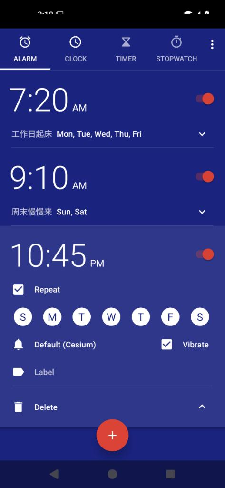

<code>73 · mobile_take_screenshot</code> — 截图显示 10:45 闹钟 7 天全选正确，但标签对话框可能还没显示（截图滞后）。重新截图确认。

**Reasoning**

截图显示 10:45 闹钟 7 天全选正确，但标签对话框可能还没显示（截图滞后）。重新截图确认。

**Arguments**

<pre><code>{
  &quot;device&quot;: &quot;local_df_clock&quot;
}</code></pre>

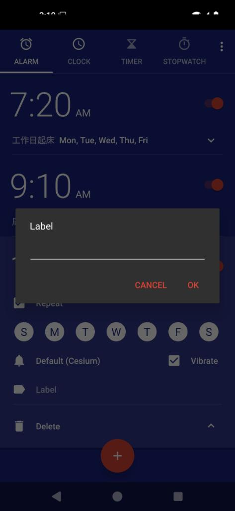

<code>74 · mobile_click_on_screen_at_coordinates</code> — 标签对话框已打开。先点击输入框聚焦（设备坐标约 540,1148），再输入文本。

**Reasoning**

标签对话框已打开。先点击输入框聚焦（设备坐标约 540,1148），再输入文本。

**Arguments**

<pre><code>{
  &quot;device&quot;: &quot;local_df_clock&quot;,
  &quot;x&quot;: 540,
  &quot;y&quot;: 1148
}</code></pre>

**Observation**

<pre><code>Clicked on screen at coordinates: 540, 1148</code></pre>

<code>75 · mobile_type_keys</code> — 输入框已聚焦（可见光标）。输入标签「睡前阅读」。

**Reasoning**

输入框已聚焦（可见光标）。输入标签「睡前阅读」。

**Arguments**

<pre><code>{
  &quot;device&quot;: &quot;local_df_clock&quot;,
  &quot;text&quot;: &quot;睡前阅读&quot;,
  &quot;submit&quot;: false
}</code></pre>

**Observation**

<pre><code>Typed text: 睡前阅读</code></pre>

<code>76 · mobile_click_on_screen_at_coordinates</code> — 标签「睡前阅读」已输入。点击 OK（截图坐标约 389,398，换算设备坐标约 888,909）保存。

**Reasoning**

标签「睡前阅读」已输入。点击 OK（截图坐标约 389,398，换算设备坐标约 888,909）保存。

**Arguments**

<pre><code>{
  &quot;device&quot;: &quot;local_df_clock&quot;,
  &quot;x&quot;: 888,
  &quot;y&quot;: 909
}</code></pre>

**Observation**

<pre><code>Clicked on screen at coordinates: 888, 909</code></pre>

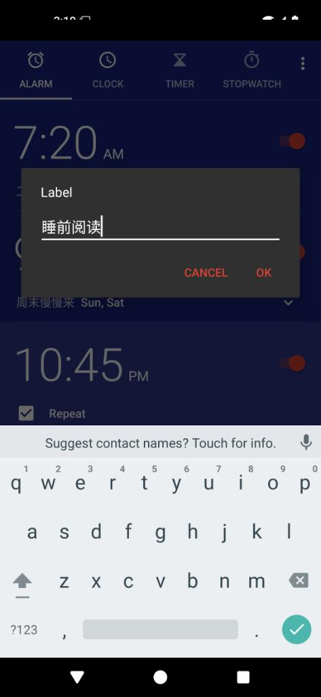

<code>77 · mobile_take_screenshot</code> — 截图可能又是滞后的。重新截图确认标签是否保存、对话框是否关闭。

**Reasoning**

截图可能又是滞后的。重新截图确认标签是否保存、对话框是否关闭。

**Arguments**

<pre><code>{
  &quot;device&quot;: &quot;local_df_clock&quot;
}</code></pre>

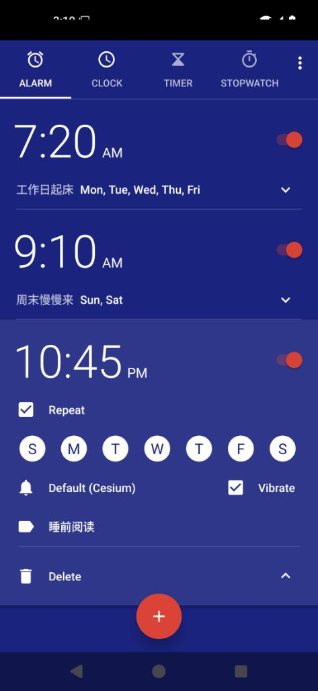

<code>78 · mobile_click_on_screen_at_coordinates</code> — 「睡前阅读」标签已保存，每天重复已设置。但该闹钟开关仍处于开启状态（橙色），用户要求先关闭。点击其开关（约 968,1219）将其关闭。

**Reasoning**

「睡前阅读」标签已保存，每天重复已设置。但该闹钟开关仍处于开启状态（橙色），用户要求先关闭。点击其开关（约 968,1219）将其关闭。

**Arguments**

<pre><code>{
  &quot;device&quot;: &quot;local_df_clock&quot;,
  &quot;x&quot;: 968,
  &quot;y&quot;: 1219
}</code></pre>

**Observation**

<pre><code>Clicked on screen at coordinates: 968, 1219</code></pre>

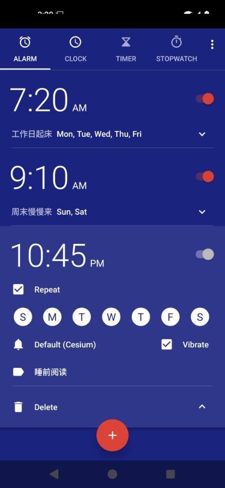

<code>79 · mobile_list_elements_on_screen</code> — 10:45 PM「睡前阅读」闹钟的开关已变为灰色（关闭）。做最后核对：列出元素确认三个闹钟的开关状态、重复日期和标签都正确。

**Reasoning**

10:45 PM「睡前阅读」闹钟的开关已变为灰色（关闭）。做最后核对：列出元素确认三个闹钟的开关状态、重复日期和标签都正确。

**Arguments**

<pre><code>{
  &quot;device&quot;: &quot;local_df_clock&quot;
}</code></pre>

**Observation**

<pre><code>One element per line: @ref Type text= label= name= value= id= at=x,y size=WxH [focused] [selected] [checked] [disabled]
@e1 FrameLayout id=&quot;com.android.launcher3:id/taskbar_container&quot; at=0,2208 size=1080x132
@e2 View id=&quot;com.android.launcher3:id/taskbar_scrim&quot; at=0,2208 size=1080x132
@e3 FrameLayout id=&quot;com.android.launcher3:id/navbuttons_view&quot; at=0,2208 size=1080x132
@e4 FrameLayout id=&quot;com.android.launcher3:id/start_contextual_buttons&quot; at=72,2208 size=93x132
@e5 LinearLayout id=&quot;com.android.launcher3:id/end_nav_buttons&quot; at=165,2208 size=748x132
@e6 ImageView label=&quot;Back&quot; id=&quot;com.android.launcher3:id/back&quot; at=166,2213 size=187x121
@e7 ImageView label=&quot;Home&quot; id=&quot;com.android.launcher3:id/home&quot; at=429,2213 size=220x121
@e8 ImageView label=&quot;Recents&quot; id=&quot;com.android.launcher3:id/recent_apps&quot; at=725,2213 size=187x121
@e9 FrameLayout id=&quot;com.android.launcher3:id/end_contextual_buttons&quot; at=915,2208 size=93x132
@e10 FrameLayout id=&quot;com.android.systemui:id/status_bar_launch_animation_container&quot; at=0,0 size=1080x66
@e11 FrameLayout id=&quot;com.android.systemui:id/container&quot; at=0,0 size=1080x66
@e12 FrameLayout id=&quot;com.android.systemui:id/status_bar_container&quot; at=0,0 size=1080x66
@e13 FrameLayout id=&quot;com.android.systemui:id/status_bar&quot; at=0,0 size=1080x66
@e14 LinearLayout id=&quot;com.android.systemui:id/status_bar_contents&quot; at=136,0 size=889x66
@e15 FrameLayout id=&quot;com.android.systemui:id/status_bar_start_side_container&quot; at=147,6 size=433x60
@e16 FrameLayout id=&quot;com.android.systemui:id/status_bar_start_side_content&quot; at=147,6 size=170x60
@e17 LinearLayout id=&quot;com.android.systemui:id/status_bar_start_side_except_heads_up&quot; at=147,6 size=170x60
@e18 TextView text=&quot;3:20&quot; label=&quot;3:20 PM&quot; id=&quot;com.android.systemui:id/clock&quot; at=147,48 size=109x18
@e19 FrameLayout id=&quot;com.android.systemui:id/notification_icon_area&quot; at=256,6 size=61x60
@e20 ViewGroup id=&quot;com.android.systemui:id/notificationIcons&quot; at=256,6 size=61x60
@e21 ImageView label=&quot;Android System notification: &quot; at=256,38 size=61x28
@e22 FrameLayout id=&quot;com.android.systemui:id/status_bar_end_side_container&quot; at=580,6 size=434x60
@e23 LinearLayout id=&quot;com.android.systemui:id/status_bar_end_side_content&quot; at=868,6 size=146x60
@e24 LinearLayout id=&quot;com.android.systemui:id/system_icons&quot; at=868,40 size=146x26
@e25 LinearLayout id=&quot;com.android.systemui:id/statusIcons&quot; at=876,40 size=106x26
@e26 FrameLayout id=&quot;com.android.systemui:id/wifi_combo&quot; at=876,40 size=48x26
@e27 LinearLayout id=&quot;com.android.systemui:id/wifi_group&quot; at=883,40 size=41x26
@e28 FrameLayout id=&quot;com.android.systemui:id/wifi_combo&quot; at=883,50 size=41x16
@e29 ImageView label=&quot;Wifi signal full.,No internet&quot; id=&quot;com.android.systemui:id/wifi_signal&quot; at=883,50 size=41x16
@e30 FrameLayout label=&quot;Phone signal full.&quot; id=&quot;com.android.systemui:id/mobile_combo&quot; at=924,40 size=41x26
@e31 LinearLayout id=&quot;com.android.systemui:id/mobile_group&quot; at=924,40 size=41x26
@e32 ImageView id=&quot;com.android.systemui:id/mobile_signal&quot; at=924,50 size=41x16
@e33 LinearLayout label=&quot;Battery charging, 100 percent.&quot; id=&quot;com.android.systemui:id/battery&quot; at=982,52 size=21x14
@e34 LinearLayout id=&quot;com.android.deskclock:id/action_bar_root&quot; at=0,136 size=1080x2204
@e35 FrameLayout id=&quot;android:id/content&quot; at=0,136 size=1080x2204
@e36 ViewGroup id=&quot;com.android.deskclock:id/content&quot; at=0,136 size=1080x2204
@e37 ViewGroup id=&quot;com.android.deskclock:id/toolbar&quot; at=0,136 size=1080x198
@e38 HorizontalScrollView id=&quot;com.android.deskclock:id/tabs&quot; at=0,136 size=969x198
@e39 LinearLayout label=&quot;Alarm&quot; at=0,136 size=242x198 selected
@e40 TextView text=&quot;ALARM&quot; id=&quot;android:id/text1&quot; at=64,168 size=113x133 selected
@e41 LinearLayout label=&quot;Clock&quot; at=242,136 size=242x198
@e42 TextView text=&quot;CLOCK&quot; id=&quot;android:id/text1&quot; at=310,168 size=105x133
@e43 LinearLayout label=&quot;Timer&quot; at=484,136 size=242x198
@e44 TextView text=&quot;TIMER&quot; id=&quot;android:id/text1&quot; at=556,168 size=98x133
@e45 LinearLayout label=&quot;Stopwatch&quot; at=726,136 size=243x198
@e46 TextView text=&quot;STOPWATCH&quot; id=&quot;android:id/text1&quot; at=749,168 size=197x133
@e47 ImageView label=&quot;More options&quot; at=969,147 size=111x132
@e48 View id=&quot;com.android.deskclock:id/tab_hairline&quot; at=0,334 size=1080x3
@e49 ViewGroup id=&quot;com.android.deskclock:id/desk_clock_pager&quot; at=0,337 size=1080x1871
@e50 FrameLayout id=&quot;com.android.deskclock:id/main&quot; at=0,337 size=1080x1871
@e51 RecyclerView id=&quot;com.android.deskclock:id/alarms_recycler_view&quot; at=0,337 size=1080x1871
@e52 ViewGroup label=&quot;7:20 AM 工作日起床&quot; at=0,337 size=1080x373
@e53 TextView text=&quot;7:20 AM&quot; label=&quot;7:20 AM&quot; id=&quot;com.android.deskclock:id/digital_clock&quot; at=44,370 size=373x205
@e54 Switch id=&quot;com.android.deskclock:id/onoff&quot; at=904,407 size=132x132 checked
@e55 TextView text=&quot;工作日起床&quot; label=&quot;Label 工作日起床&quot; id=&quot;com.android.deskclock:id/label&quot; at=44,614 size=217x53
@e56 TextView text=&quot;Mon, Tue, Wed, Thu, Fri&quot; label=&quot;Monday, Tuesday, Wednesday, Thursday, Friday&quot; id=&quot;com.android.deskclock:id/days_of_week&quot; at=261,614 size=431x53
@e57 ImageButton label=&quot;Expand alarm&quot; id=&quot;com.android.deskclock:id/arrow&quot; at=904,575 size=132x132
@e58 View id=&quot;com.android.deskclock:id/hairline&quot; at=55,707 size=970x3
@e59 ViewGroup label=&quot;9:10 AM 周末慢慢来&quot; at=0,710 size=1080x373
@e60 TextView text=&quot;9:10 AM&quot; label=&quot;9:10 AM&quot; id=&quot;com.android.deskclock:id/digital_clock&quot; at=44,743 size=373x205
@e61 Switch id=&quot;com.android.deskclock:id/onoff&quot; at=904,780 size=132x132 checked
@e62 TextView text=&quot;周末慢慢来&quot; label=&quot;Label 周末慢慢来&quot; id=&quot;com.android.deskclock:id/label&quot; at=44,987 size=217x53
@e63 TextView text=&quot;Sun, Sat&quot; label=&quot;Sunday, Saturday&quot; id=&quot;com.android.deskclock:id/days_of_week&quot; at=261,987 size=167x53
@e64 ImageButton label=&quot;Expand alarm&quot; id=&quot;com.android.deskclock:id/arrow&quot; at=904,948 size=132x132
@e65 View id=&quot;com.android.deskclock:id/hairline&quot; at=55,1080 size=970x3
@e66 ViewGroup label=&quot;10:45 PM 睡前阅读&quot; at=0,1083 size=1080x984
@e67 TextView text=&quot;10:45 PM&quot; label=&quot;10:45 PM&quot; id=&quot;com.android.deskclock:id/digital_clock&quot; at=44,1116 size=457x205
@e68 Switch id=&quot;com.android.deskclock:id/onoff&quot; at=904,1153 size=132x132
@e69 CheckBox text=&quot;Repeat&quot; id=&quot;com.android.deskclock:id/repeat_onoff&quot; at=44,1321 size=277x132 checked
@e70 LinearLayout id=&quot;com.android.deskclock:id/repeat_days&quot; at=44,1453 size=992x132
@e71 CheckBox text=&quot;S&quot; label=&quot;Sunday&quot; id=&quot;com.android.deskclock:id/day_button_box&quot; at=44,1453 size=132x132 checked
@e72 CheckBox text=&quot;M&quot; label=&quot;Monday&quot; id=&quot;com.android.deskclock:id/day_button_box&quot; at=185,1453 size=132x132 checked
@e73 CheckBox text=&quot;T&quot; label=&quot;Tuesday&quot; id=&quot;com.android.deskclock:id/day_button_box&quot; at=326,1453 size=132x132 checked
@e74 CheckBox text=&quot;W&quot; label=&quot;Wednesday&quot; id=&quot;com.android.deskclock:id/day_button_box&quot; at=468,1453 size=132x132 checked
@e75 CheckBox text=&quot;T&quot; label=&quot;Thursday&quot; id=&quot;com.android.deskclock:id/day_button_box&quot; at=610,1453 size=132x132 checked
@e76 CheckBox text=&quot;F&quot; label=&quot;Friday&quot; id=&quot;com.android.deskclock:id/day_button_box&quot; at=752,1453 size=132x132 checked
@e77 CheckBox text=&quot;S&quot; label=&quot;Saturday&quot; id=&quot;com.android.deskclock:id/day_button_box&quot; at=894,1453 size=132x132 checked
@e78 TextView text=&quot;Default (Cesium)&quot; label=&quot;Ringtone Default (Cesium)&quot; id=&quot;com.android.deskclock:id/choose_ringtone&quot; at=44,1585 size=712x132
@e79 CheckBox text=&quot;Vibrate&quot; id=&quot;com.android.deskclock:id/vibrate_onoff&quot; at=756,1585 size=280x132 checked
@e80 TextView text=&quot;睡前阅读&quot; label=&quot;Label 睡前阅读&quot; id=&quot;com.android.deskclock:id/edit_label&quot; at=44,1717 size=992x132
@e81 View id=&quot;com.android.deskclock:id/hairline&quot; at=61,1849 size=958x3
@e82 Button text=&quot;Delete&quot; id=&quot;com.android.deskclock:id/delete&quot; at=44,1885 size=265x132
@e83 ImageButton label=&quot;Collapse alarm&quot; id=&quot;com.android.deskclock:id/arrow&quot; at=904,1885 size=132x132
@e84 ImageView id=&quot;com.android.deskclock:id/drop_shadow&quot; at=0,337 size=1080x22
@e85 ImageButton label=&quot;Add alarm&quot; id=&quot;com.android.deskclock:id/fab&quot; at=463,2010 size=154x154
@e86 View id=&quot;android:id/navigationBarBackground&quot; at=0,2208 size=1080x132</code></pre>

<code>80 · finish</code> — 全部核对无误： 1. 7:20 AM「工作日起床」— 周一至周五，开关已开启； 2. 9:10 AM「周末慢慢来」— 周日、周六，开关已开启； 3. 10:45 PM「睡前阅读」— 每天（7 天全选），开关已关闭（@e…

**Reasoning**

全部核对无误：
1. 7:20 AM「工作日起床」— 周一至周五，开关已开启；
2. 9:10 AM「周末慢慢来」— 周日、周六，开关已开启；
3. 10:45 PM「睡前阅读」— 每天（7 天全选），开关已关闭（@e68 无 checked 标记）；
铃声均为 Default (Cesium)，振动保持默认勾选状态，均未改动。任务完成，向用户汇报最终安排。

**Arguments**

<pre><code>{
  &quot;answer&quot;: &quot;闹钟都设好啦，最终安排如下：\n\n1. 「工作日起床」— 早上 7:20，每周一至周五重复，已开启 ✅\n2. 「周末慢慢来」— 早上 9:10，每周六、周日重复，已开启 ✅\n3. 「睡前阅读」— 晚上 22:45（10:45 PM），每天重复，目前处于关闭状态 ⏸️，你想用的时候随时打开就行\n\n三个闹钟的铃声都保持默认（Default Cesium），振动也保持默认设置，没有改动。&quot;
}</code></pre>

## Final answer

闹钟都设好啦，最终安排如下：

1. 「工作日起床」— 早上 7:20，每周一至周五重复，已开启 ✅
2. 「周末慢慢来」— 早上 9:10，每周六、周日重复，已开启 ✅
3. 「睡前阅读」— 晚上 22:45（10:45 PM），每天重复，目前处于关闭状态 ⏸️，你想用的时候随时打开就行

三个闹钟的铃声都保持默认（Default Cesium），振动也保持默认设置，没有改动。

## Evaluation

- ReplayVerify: **not_applicable**
- Judge: **1.00**
- Replay detail: task has no replay verifier

Task-owned rubric range: 0.0–10.0. Overall is the arithmetic mean of range-normalized criterion scores.

| Criterion | Raw score | Normalized score |
| --- | ---: | ---: |
| `alarm_values` | 10.0 | 1.0 |
| `repeat_and_toggle` | 10.0 | 1.0 |
| `saved_preferences` | 10.0 | 1.0 |
| `summary` | 10.0 | 1.0 |

Task judge_ref used for this evaluation

<pre><code>{
  &quot;score_range&quot;: {
    &quot;min&quot;: 0.0,
    &quot;max&quot;: 10.0
  },
  &quot;criteria&quot;: [
    {
      &quot;id&quot;: &quot;alarm_values&quot;,
      &quot;description&quot;: &quot;实际保存的闹钟为07:20「工作日起床」、09:10「周末慢慢来」、22:45「睡前阅读」，没有遗漏或重复创建。全部正确10，部分正确5，没有正确结果0。&quot;
    },
    {
      &quot;id&quot;: &quot;repeat_and_toggle&quot;,
      &quot;description&quot;: &quot;07:20仅周一至周五重复且开启；09:10仅周六、周日重复且开启；22:45每天重复但关闭、未删除。根据实际状态评分，不以点击意图代替结果。&quot;
    },
    {
      &quot;id&quot;: &quot;saved_preferences&quot;,
      &quot;description&quot;: &quot;配置确实保存在时钟应用中，默认铃声和振动未被改变。不要求重启应用、特定截图数量或某种检查顺序；可用证据不足时如实说明未确认的字段。&quot;
    },
    {
      &quot;id&quot;: &quot;summary&quot;,
      &quot;description&quot;: &quot;最终说明清楚准确地概括三个闹钟的时间、重复规律和启用状态，与应用中的实际结果一致，没有将未完成的配置说成成功。&quot;
    }
  ]
}</code></pre>

Judge rationale

根据提供的工具调用和真实 observation，逐项核验如下：

1. **alarm_values**：
   - 7:20 AM「工作日起床」：步骤14截图确认已创建，步骤33确认标签正确。
   - 9:10 AM「周末慢慢来」：步骤42截图确认已创建，步骤59确认标签正确。
   - 10:45 PM「睡前阅读」：步骤66截图确认已创建，步骤77确认标签正确。
   三个闹钟时间、名称均正确，无遗漏或重复创建。得分10。

2. **repeat_and_toggle**：
   - 7:20闹钟：步骤23-24取消周六、周日，步骤33显示周一至周五（M/T/W/T/F）被选中，开关开启（橙色）。
   - 9:10闹钟：步骤48-52取消周一至周五，步骤59显示仅周日、周六（S/S）被选中，开关开启（橙色）。
   - 10:45闹钟：步骤71-72显示全部7天被选中（每天重复），步骤78开关已关闭（灰色）。
   所有重复和开关状态与要求完全一致。得分10。

3. **saved_preferences**：
   - 三个闹钟的铃声均显示为「Default (Cesium)」，振动均保持勾选状态（Vibrate checked），未被修改。
   - 所有配置均保存在时钟应用com.android.deskclock中，有截图证据支持。
   得分10。

4. **summary**：
   - 最终回答准确概括了三个闹钟的时间（7:20/9:10/22:45）、重复规律（周一至周五/周六日/每天）和启用状态（开启/开启/关闭）。
   - 与实际应用中的结果完全一致，没有将未完成的配置说成成功。
   得分10。

