# Low-poly island lighthouse in Blender

[← All showcases](README.md)

> **Recorded outcome:** Budget-limited, not finished: the rollout stopped at max_steps after 64 actions. The agent never called finish and no final answer was recorded. The 0.9375 Judge score evaluates the recorded scene; it is not proof of completion or a formal render. An operator saved a recovery .blend snapshot afterward without altering the scene; that save is not presented as a model action.

> **Complete trajectory imagery:** the animation is a compressed overview of every rendered observation. Every original image is also preserved inside its corresponding tool-call section.

The agent builds a low-poly tabletop island with a red-and-white lighthouse, a blue-gray house, stones, and turquoise water. Each recorded modeling observation shows the actual viewport as the scene develops.

| Env | Task | Branch | Steps | ReplayVerify | Judge |
| --- | --- | --- | ---: | --- | ---: |
| `blender_mcp` | `blender-lighthouse-001` | initial | 64 | not_applicable | 0.9375 |

## Recorded run

- Rollout model: `kimi-k3`; independent Judge: `kimi-k2.6`.
- Termination: **`max_steps`**; 64 actions, 63 recorded images.
- Scores are task-owned rubric judgments, not deterministic verification results.
- Host-local path prefixes are replaced with `<LOCAL_DF>/`; no system prompt or provider-private reasoning is exported.

## Task

> 我想做一个低多边形的海岛灯塔小景观，有点像摆在桌上的微缩模型。帮我在 Blender 里搭一下，先看场景效果。
>
> 灯塔是视觉中心，想要奶白色塔身配红色横条纹、深色灯室和红色尖顶。旁边有一间低矮的蓝灰色小屋，一条石块小路通向灯塔，再散落几块礁石。小岛是沙色的，周围是蓝绿色的海；整体轮廓紧凑，像一件完整的小摆件。
>
> 风格干净、简洁一点，不用太写实。希望灯塔、小屋和前景之间有层次，比例舒服，配色别太杂，看起来安静又有一点童话感。

[Open compact trajectory JSON](trajectories/blender_lighthouse.json).

## Visual checkpoints

 Full trajectory — every rendered observation in chronological order

## Trajectory

Action mix: `blender_create_primitive` × 30, `blender_set_material` × 30, `blender_transform_object` × 2, `get_scene_info` × 1, `blender_add_light` × 1.

<code>01 · get_scene_info</code> — 先查看当前场景里有哪些默认物体，再规划搭建。

**Reasoning**

先查看当前场景里有哪些默认物体，再规划搭建。

**Arguments**

<pre><code>{}</code></pre>

**Observation**

<pre><code>{
  &quot;name&quot;: &quot;Scene&quot;,
  &quot;object_count&quot;: 0,
  &quot;objects&quot;: [],
  &quot;materials_count&quot;: 2
}</code></pre>

<code>02 · blender_create_primitive</code> — 场景是空的，直接开始搭建。先做海面圆盘底座（蓝绿色），让整体像一件完整的摆件。

**Reasoning**

场景是空的，直接开始搭建。先做海面圆盘底座（蓝绿色），让整体像一件完整的摆件。

**Arguments**

<pre><code>{
  &quot;primitive&quot;: &quot;cylinder&quot;,
  &quot;name&quot;: &quot;Sea&quot;,
  &quot;location&quot;: [
    0,
    0,
    0
  ],
  &quot;scale&quot;: [
    7.5,
    7.5,
    0.175
  ]
}</code></pre>

**Observation**

<pre><code>Code executed successfully: created Sea</code></pre>

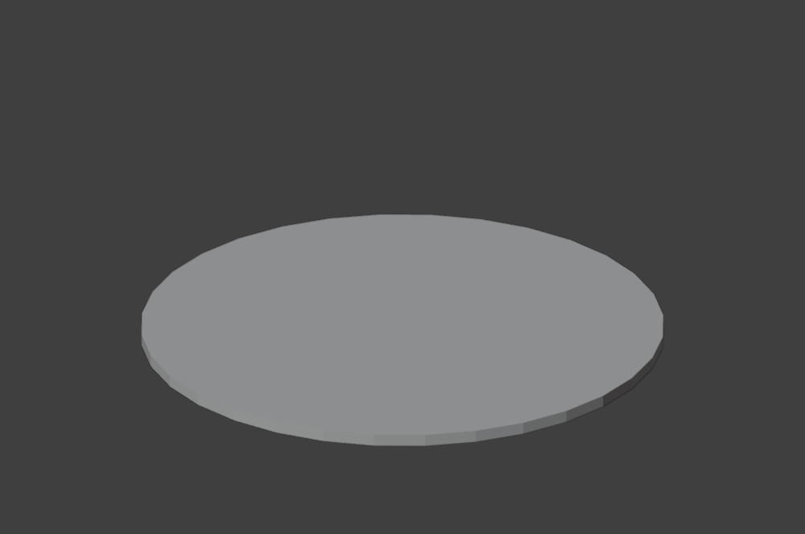

<code>03 · blender_set_material</code> — 海面圆盘已建好。给它上蓝绿色材质。

**Reasoning**

海面圆盘已建好。给它上蓝绿色材质。

**Arguments**

<pre><code>{
  &quot;object_name&quot;: &quot;Sea&quot;,
  &quot;color&quot;: [
    0.16,
    0.48,
    0.55,
    1
  ],
  &quot;metallic&quot;: 0,
  &quot;roughness&quot;: 0.3
}</code></pre>

**Observation**

<pre><code>Code executed successfully: material updated Sea</code></pre>

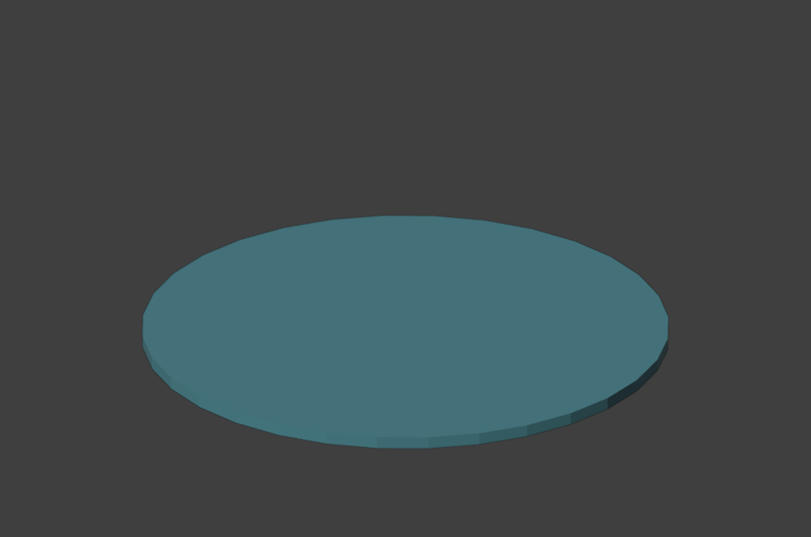

<code>04 · blender_create_primitive</code> — 海面颜色不错。现在建小岛主体：沙色圆柱，半径3.8，顶面在 z=0.85。

**Reasoning**

海面颜色不错。现在建小岛主体：沙色圆柱，半径3.8，顶面在 z=0.85。

**Arguments**

<pre><code>{
  &quot;primitive&quot;: &quot;cylinder&quot;,
  &quot;name&quot;: &quot;Island&quot;,
  &quot;location&quot;: [
    0,
    0,
    0.35
  ],
  &quot;scale&quot;: [
    3.8,
    3.8,
    0.5
  ]
}</code></pre>

**Observation**

<pre><code>Code executed successfully: created Island</code></pre>

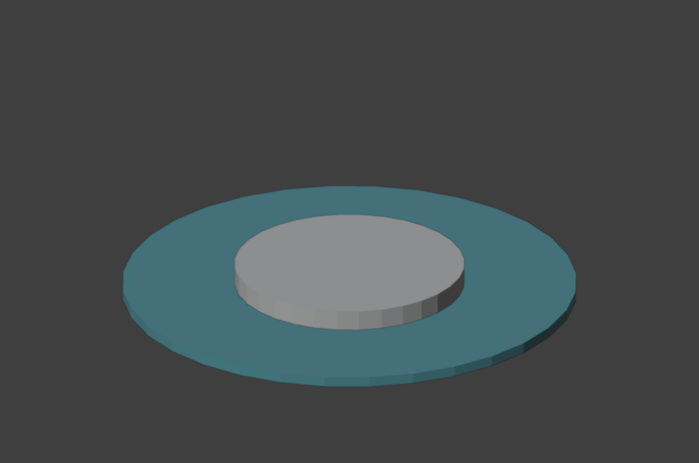

<code>05 · blender_set_material</code> — 小岛主体已建好，给它上沙色材质。

**Reasoning**

小岛主体已建好，给它上沙色材质。

**Arguments**

<pre><code>{
  &quot;object_name&quot;: &quot;Island&quot;,
  &quot;color&quot;: [
    0.86,
    0.75,
    0.55,
    1
  ],
  &quot;metallic&quot;: 0,
  &quot;roughness&quot;: 0.85
}</code></pre>

**Observation**

<pre><code>Code executed successfully: material updated Island</code></pre>

<code>06 · blender_create_primitive</code> — 加一圈略宽、更浅的沙滩边缘，让小岛轮廓有层次。

**Reasoning**

加一圈略宽、更浅的沙滩边缘，让小岛轮廓有层次。

**Arguments**

<pre><code>{
  &quot;primitive&quot;: &quot;cylinder&quot;,
  &quot;name&quot;: &quot;Beach&quot;,
  &quot;location&quot;: [
    0,
    0,
    0.1
  ],
  &quot;scale&quot;: [
    4.15,
    4.15,
    0.125
  ]
}</code></pre>

**Observation**

<pre><code>Code executed successfully: created Beach</code></pre>

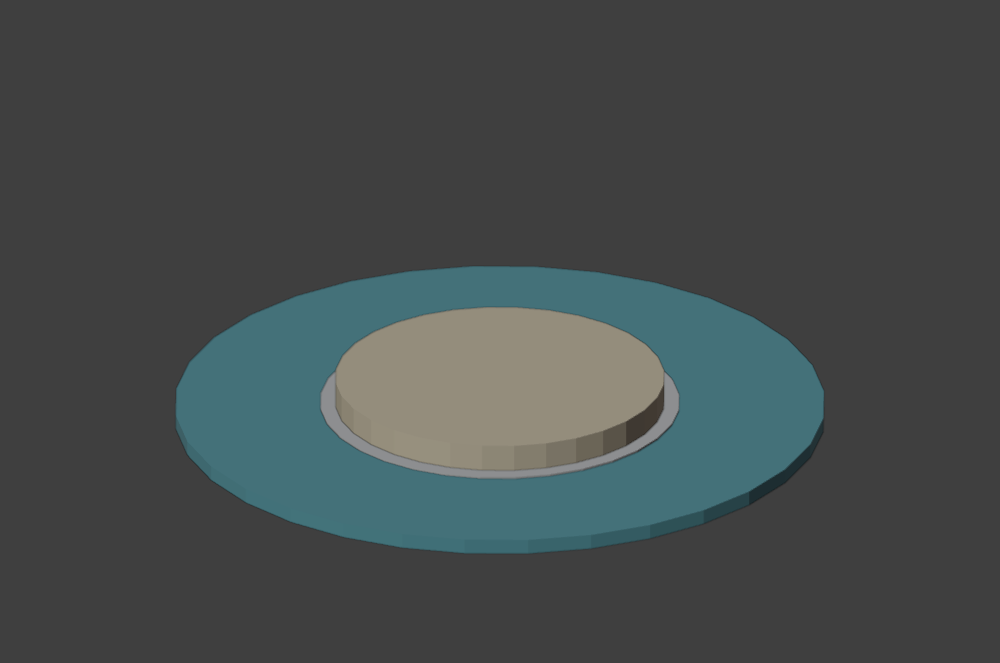

<code>07 · blender_set_material</code> — 沙滩边缘已建好，上浅沙色材质。

**Reasoning**

沙滩边缘已建好，上浅沙色材质。

**Arguments**

<pre><code>{
  &quot;object_name&quot;: &quot;Beach&quot;,
  &quot;color&quot;: [
    0.9,
    0.81,
    0.62,
    1
  ],
  &quot;metallic&quot;: 0,
  &quot;roughness&quot;: 0.85
}</code></pre>

**Observation**

<pre><code>Code executed successfully: material updated Beach</code></pre>

<code>08 · blender_create_primitive</code> — 底座完成。开始搭灯塔：位置 (-1.1, 0.7)，先放灯塔基座圆柱。

**Reasoning**

底座完成。开始搭灯塔：位置 (-1.1, 0.7)，先放灯塔基座圆柱。

**Arguments**

<pre><code>{
  &quot;primitive&quot;: &quot;cylinder&quot;,
  &quot;name&quot;: &quot;TowerBase&quot;,
  &quot;location&quot;: [
    -1.1,
    0.7,
    1.0
  ],
  &quot;scale&quot;: [
    0.95,
    0.95,
    0.15
  ]
}</code></pre>

**Observation**

<pre><code>Code executed successfully: created TowerBase</code></pre>

<code>09 · blender_set_material</code> — 灯塔基座已放置，给它上浅石灰材质。

**Reasoning**

灯塔基座已放置，给它上浅石灰材质。

**Arguments**

<pre><code>{
  &quot;object_name&quot;: &quot;TowerBase&quot;,
  &quot;color&quot;: [
    0.8,
    0.78,
    0.72,
    1
  ],
  &quot;metallic&quot;: 0,
  &quot;roughness&quot;: 0.8
}</code></pre>

**Observation**

<pre><code>Code executed successfully: material updated TowerBase</code></pre>

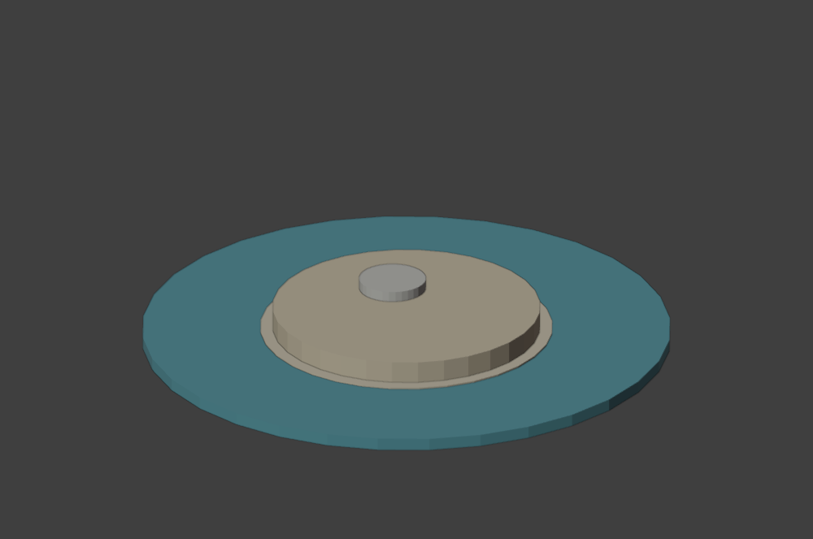

<code>10 · blender_create_primitive</code> — 基座完成。现在堆叠塔身第一段（奶白色），半径0.72，中心 z=1.775。

**Reasoning**

基座完成。现在堆叠塔身第一段（奶白色），半径0.72，中心 z=1.775。

**Arguments**

<pre><code>{
  &quot;primitive&quot;: &quot;cylinder&quot;,
  &quot;name&quot;: &quot;TowerA&quot;,
  &quot;location&quot;: [
    -1.1,
    0.7,
    1.775
  ],
  &quot;scale&quot;: [
    0.72,
    0.72,
    0.625
  ]
}</code></pre>

**Observation**

<pre><code>Code executed successfully: created TowerA</code></pre>

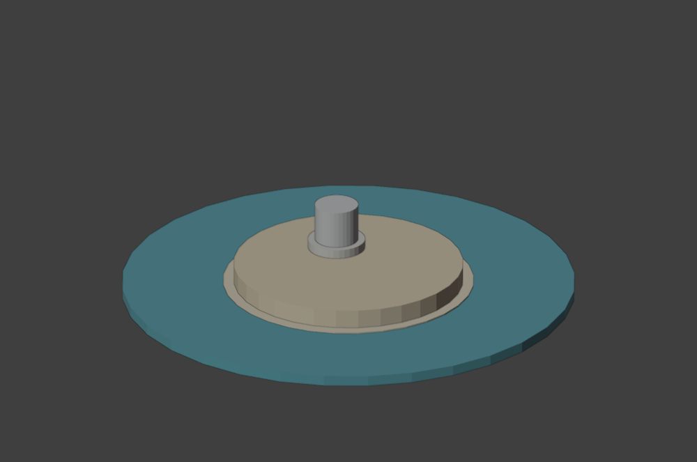

<code>11 · blender_set_material</code> — 塔身第一段已建好，上奶白色材质。

**Reasoning**

塔身第一段已建好，上奶白色材质。

**Arguments**

<pre><code>{
  &quot;object_name&quot;: &quot;TowerA&quot;,
  &quot;color&quot;: [
    0.93,
    0.89,
    0.8,
    1
  ],
  &quot;metallic&quot;: 0,
  &quot;roughness&quot;: 0.7
}</code></pre>

**Observation**

<pre><code>Code executed successfully: material updated TowerA</code></pre>

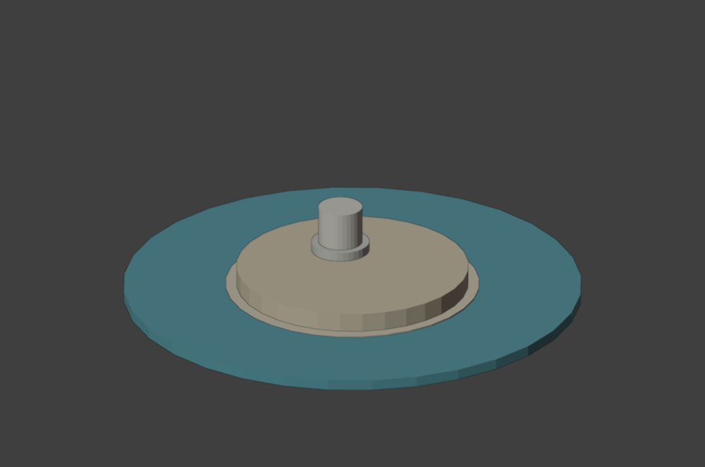

<code>12 · blender_create_primitive</code> — 第一条红色横条纹：半径0.68，中心 z=2.61。

**Reasoning**

第一条红色横条纹：半径0.68，中心 z=2.61。

**Arguments**

<pre><code>{
  &quot;primitive&quot;: &quot;cylinder&quot;,
  &quot;name&quot;: &quot;Stripe1&quot;,
  &quot;location&quot;: [
    -1.1,
    0.7,
    2.61
  ],
  &quot;scale&quot;: [
    0.68,
    0.68,
    0.21
  ]
}</code></pre>

**Observation**

<pre><code>Code executed successfully: created Stripe1</code></pre>

<code>13 · blender_set_material</code> — 条纹段已建好，上红色材质。

**Reasoning**

条纹段已建好，上红色材质。

**Arguments**

<pre><code>{
  &quot;object_name&quot;: &quot;Stripe1&quot;,
  &quot;color&quot;: [
    0.72,
    0.15,
    0.13,
    1
  ],
  &quot;metallic&quot;: 0,
  &quot;roughness&quot;: 0.6
}</code></pre>

**Observation**

<pre><code>Code executed successfully: material updated Stripe1</code></pre>

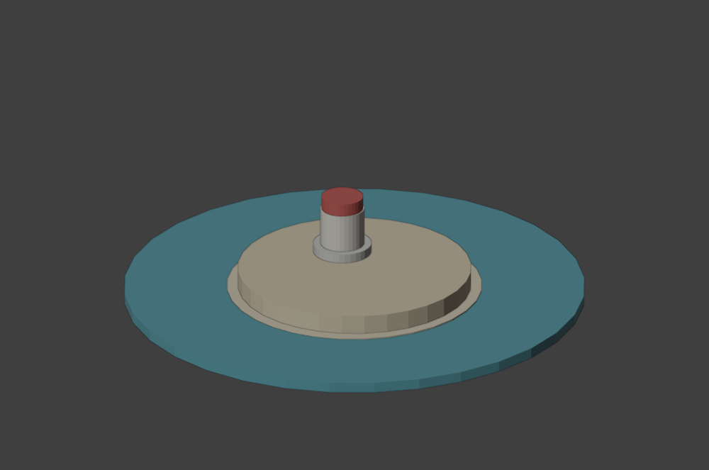

<code>14 · blender_create_primitive</code> — 塔身第二段（奶白），半径0.63，中心 z=3.37。

**Reasoning**

塔身第二段（奶白），半径0.63，中心 z=3.37。

**Arguments**

<pre><code>{
  &quot;primitive&quot;: &quot;cylinder&quot;,
  &quot;name&quot;: &quot;TowerB&quot;,
  &quot;location&quot;: [
    -1.1,
    0.7,
    3.37
  ],
  &quot;scale&quot;: [
    0.63,
    0.63,
    0.55
  ]
}</code></pre>

**Observation**

<pre><code>Code executed successfully: created TowerB</code></pre>

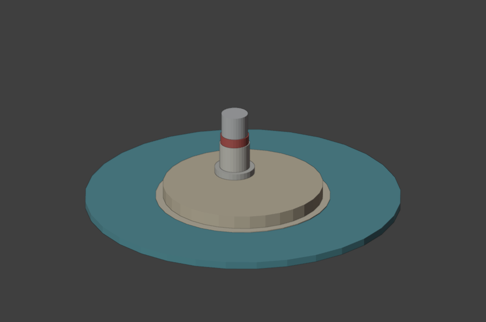

<code>15 · blender_set_material</code> — 第二段塔身已建好，上奶白色材质。

**Reasoning**

第二段塔身已建好，上奶白色材质。

**Arguments**

<pre><code>{
  &quot;object_name&quot;: &quot;TowerB&quot;,
  &quot;color&quot;: [
    0.93,
    0.89,
    0.8,
    1
  ],
  &quot;metallic&quot;: 0,
  &quot;roughness&quot;: 0.7
}</code></pre>

**Observation**

<pre><code>Code executed successfully: material updated TowerB</code></pre>

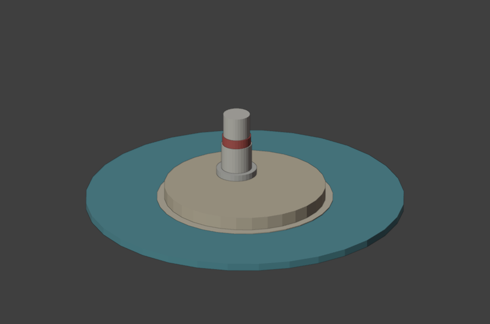

<code>16 · blender_create_primitive</code> — 第二条红色横条纹：半径0.59，中心 z=4.10。

**Reasoning**

第二条红色横条纹：半径0.59，中心 z=4.10。

**Arguments**

<pre><code>{
  &quot;primitive&quot;: &quot;cylinder&quot;,
  &quot;name&quot;: &quot;Stripe2&quot;,
  &quot;location&quot;: [
    -1.1,
    0.7,
    4.1
  ],
  &quot;scale&quot;: [
    0.59,
    0.59,
    0.18
  ]
}</code></pre>

**Observation**

<pre><code>Code executed successfully: created Stripe2</code></pre>

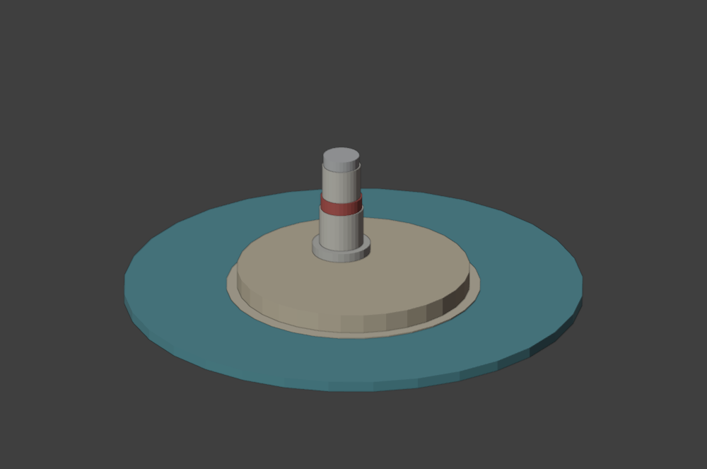

<code>17 · blender_set_material</code> — 第二条条纹已建好，上红色材质。

**Reasoning**

第二条条纹已建好，上红色材质。

**Arguments**

<pre><code>{
  &quot;object_name&quot;: &quot;Stripe2&quot;,
  &quot;color&quot;: [
    0.72,
    0.15,
    0.13,
    1
  ],
  &quot;metallic&quot;: 0,
  &quot;roughness&quot;: 0.6
}</code></pre>

**Observation**

<pre><code>Code executed successfully: material updated Stripe2</code></pre>

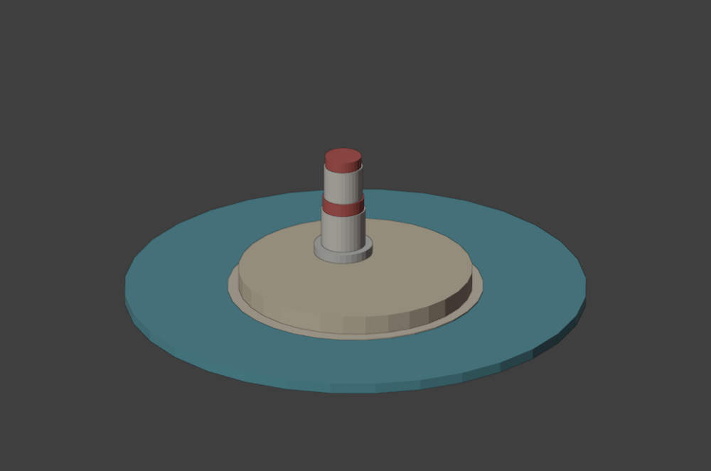

<code>18 · blender_create_primitive</code> — 塔顶小段（奶白）：半径0.55，中心 z=4.42。

**Reasoning**

塔顶小段（奶白）：半径0.55，中心 z=4.42。

**Arguments**

<pre><code>{
  &quot;primitive&quot;: &quot;cylinder&quot;,
  &quot;name&quot;: &quot;TowerC&quot;,
  &quot;location&quot;: [
    -1.1,
    0.7,
    4.42
  ],
  &quot;scale&quot;: [
    0.55,
    0.55,
    0.14
  ]
}</code></pre>

**Observation**

<pre><code>Code executed successfully: created TowerC</code></pre>

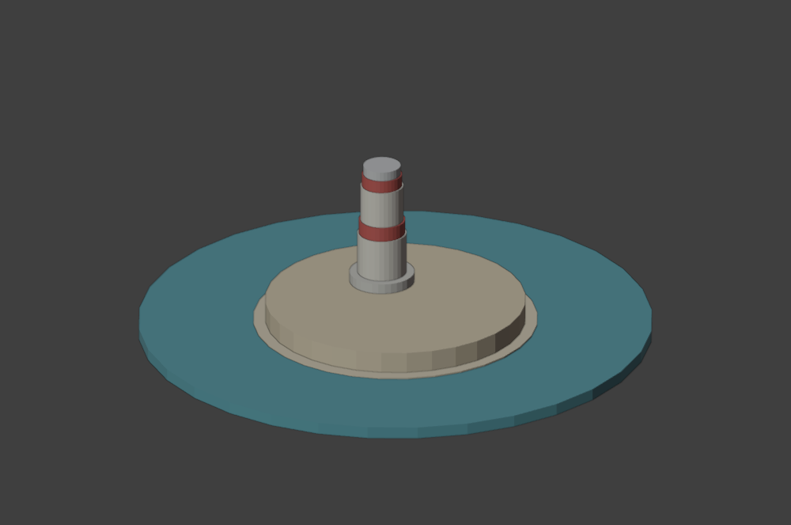

<code>19 · blender_set_material</code> — 塔顶小段已建好，上奶白色材质。

**Reasoning**

塔顶小段已建好，上奶白色材质。

**Arguments**

<pre><code>{
  &quot;object_name&quot;: &quot;TowerC&quot;,
  &quot;color&quot;: [
    0.93,
    0.89,
    0.8,
    1
  ],
  &quot;metallic&quot;: 0,
  &quot;roughness&quot;: 0.7
}</code></pre>

**Observation**

<pre><code>Code executed successfully: material updated TowerC</code></pre>

<code>20 · blender_create_primitive</code> — 加深色瞭望台（栏杆盘）：半径0.78，中心 z=4.62。

**Reasoning**

加深色瞭望台（栏杆盘）：半径0.78，中心 z=4.62。

**Arguments**

<pre><code>{
  &quot;primitive&quot;: &quot;cylinder&quot;,
  &quot;name&quot;: &quot;Balcony&quot;,
  &quot;location&quot;: [
    -1.1,
    0.7,
    4.62
  ],
  &quot;scale&quot;: [
    0.78,
    0.78,
    0.06
  ]
}</code></pre>

**Observation**

<pre><code>Code executed successfully: created Balcony</code></pre>

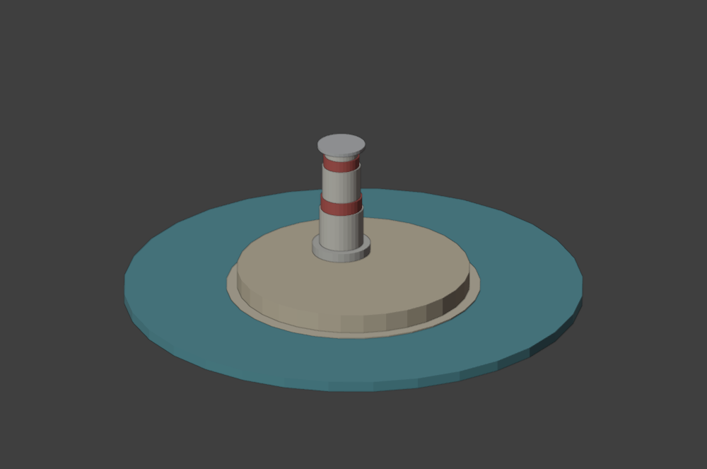

<code>21 · blender_set_material</code> — 瞭望台已建好，上深炭色材质。

**Reasoning**

瞭望台已建好，上深炭色材质。

**Arguments**

<pre><code>{
  &quot;object_name&quot;: &quot;Balcony&quot;,
  &quot;color&quot;: [
    0.15,
    0.17,
    0.21,
    1
  ],
  &quot;metallic&quot;: 0.1,
  &quot;roughness&quot;: 0.5
}</code></pre>

**Observation**

<pre><code>Code executed successfully: material updated Balcony</code></pre>

<code>22 · blender_create_primitive</code> — 加灯室（深色圆柱）：半径0.42，中心 z=4.955。

**Reasoning**

加灯室（深色圆柱）：半径0.42，中心 z=4.955。

**Arguments**

<pre><code>{
  &quot;primitive&quot;: &quot;cylinder&quot;,
  &quot;name&quot;: &quot;LampRoom&quot;,
  &quot;location&quot;: [
    -1.1,
    0.7,
    4.955
  ],
  &quot;scale&quot;: [
    0.42,
    0.42,
    0.275
  ]
}</code></pre>

**Observation**

<pre><code>Code executed successfully: created LampRoom</code></pre>

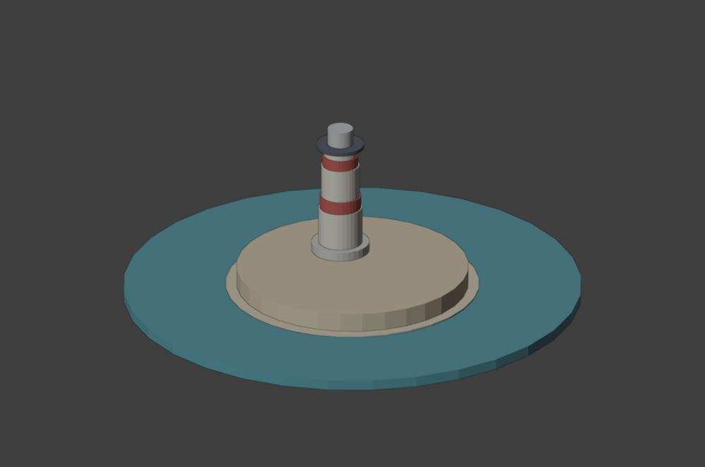

<code>23 · blender_set_material</code> — 灯室已建好，上深炭色材质。

**Reasoning**

灯室已建好，上深炭色材质。

**Arguments**

<pre><code>{
  &quot;object_name&quot;: &quot;LampRoom&quot;,
  &quot;color&quot;: [
    0.15,
    0.17,
    0.21,
    1
  ],
  &quot;metallic&quot;: 0.1,
  &quot;roughness&quot;: 0.4
}</code></pre>

**Observation**

<pre><code>Code executed successfully: material updated LampRoom</code></pre>

<code>24 · blender_create_primitive</code> — 加红色尖顶（圆锥）：半径0.58，中心 z=5.605。

**Reasoning**

加红色尖顶（圆锥）：半径0.58，中心 z=5.605。

**Arguments**

<pre><code>{
  &quot;primitive&quot;: &quot;cone&quot;,
  &quot;name&quot;: &quot;Roof&quot;,
  &quot;location&quot;: [
    -1.1,
    0.7,
    5.605
  ],
  &quot;scale&quot;: [
    0.58,
    0.58,
    0.375
  ]
}</code></pre>

**Observation**

<pre><code>Code executed successfully: created Roof</code></pre>

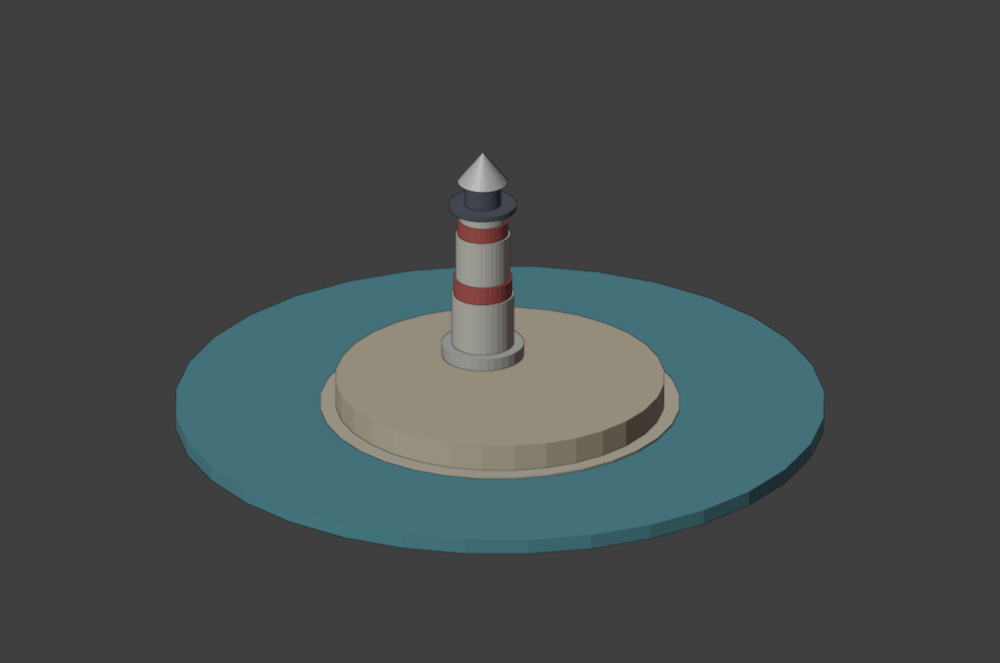

<code>25 · blender_set_material</code> — 尖顶已建好，上红色材质。

**Reasoning**

尖顶已建好，上红色材质。

**Arguments**

<pre><code>{
  &quot;object_name&quot;: &quot;Roof&quot;,
  &quot;color&quot;: [
    0.72,
    0.15,
    0.13,
    1
  ],
  &quot;metallic&quot;: 0,
  &quot;roughness&quot;: 0.55
}</code></pre>

**Observation**

<pre><code>Code executed successfully: material updated Roof</code></pre>

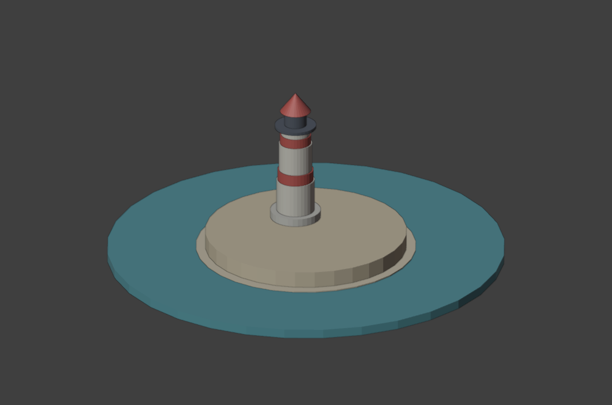

<code>26 · blender_create_primitive</code> — 灯塔完成了。现在建蓝灰色小屋：主体立方体，位置 (1.6, -0.5)，中心 z=1.47。

**Reasoning**

灯塔完成了。现在建蓝灰色小屋：主体立方体，位置 (1.6, -0.5)，中心 z=1.47。

**Arguments**

<pre><code>{
  &quot;primitive&quot;: &quot;cube&quot;,
  &quot;name&quot;: &quot;HouseBody&quot;,
  &quot;location&quot;: [
    1.6,
    -0.5,
    1.47
  ],
  &quot;scale&quot;: [
    1.05,
    0.85,
    0.62
  ]
}</code></pre>

**Observation**

<pre><code>Code executed successfully: created HouseBody</code></pre>

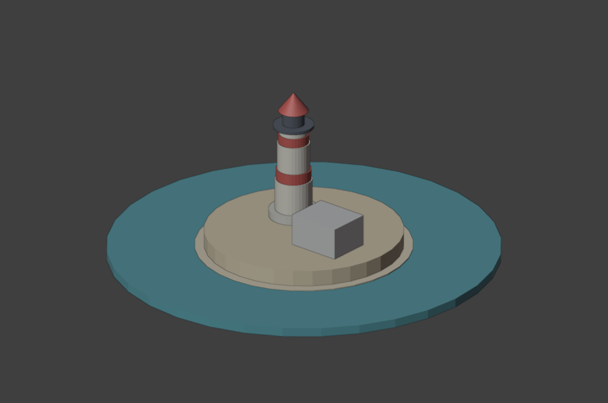

<code>27 · blender_set_material</code> — 小屋主体已建好，上蓝灰色材质。

**Reasoning**

小屋主体已建好，上蓝灰色材质。

**Arguments**

<pre><code>{
  &quot;object_name&quot;: &quot;HouseBody&quot;,
  &quot;color&quot;: [
    0.58,
    0.66,
    0.73,
    1
  ],
  &quot;metallic&quot;: 0,
  &quot;roughness&quot;: 0.8
}</code></pre>

**Observation**

<pre><code>Code executed successfully: material updated HouseBody</code></pre>

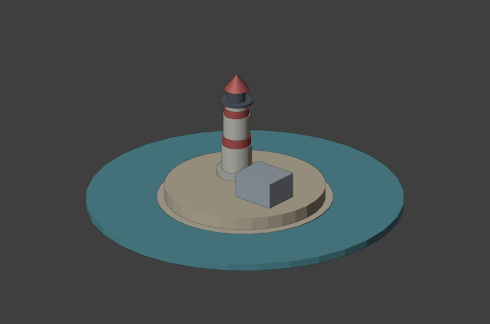

<code>28 · blender_create_primitive</code> — 小屋主体完成。加屋顶（圆锥）：半径1.45，中心 z=2.565。

**Reasoning**

小屋主体完成。加屋顶（圆锥）：半径1.45，中心 z=2.565。

**Arguments**

<pre><code>{
  &quot;primitive&quot;: &quot;cone&quot;,
  &quot;name&quot;: &quot;HouseRoof&quot;,
  &quot;location&quot;: [
    1.6,
    -0.5,
    2.565
  ],
  &quot;scale&quot;: [
    1.45,
    1.45,
    0.475
  ]
}</code></pre>

**Observation**

<pre><code>Code executed successfully: created HouseRoof</code></pre>

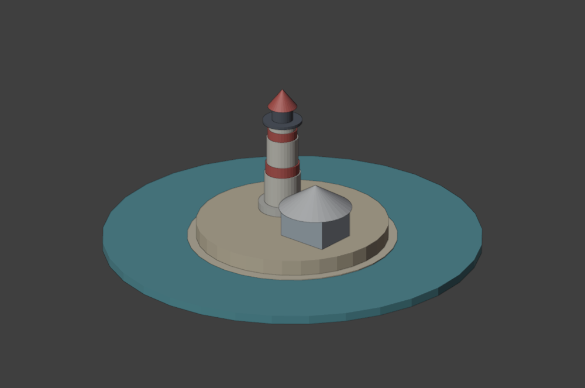

<code>29 · blender_set_material</code> — 屋顶已建好，上深石板蓝灰材质，与屋身拉开层次。

**Reasoning**

屋顶已建好，上深石板蓝灰材质，与屋身拉开层次。

**Arguments**

<pre><code>{
  &quot;object_name&quot;: &quot;HouseRoof&quot;,
  &quot;color&quot;: [
    0.36,
    0.43,
    0.51,
    1
  ],
  &quot;metallic&quot;: 0,
  &quot;roughness&quot;: 0.7
}</code></pre>

**Observation**

<pre><code>Code executed successfully: material updated HouseRoof</code></pre>

<code>30 · blender_create_primitive</code> — 小屋完成。给小屋加一扇深色的门，在朝灯塔那一面（-x 面）。

**Reasoning**

小屋完成。给小屋加一扇深色的门，在朝灯塔那一面（-x 面）。

**Arguments**

<pre><code>{
  &quot;primitive&quot;: &quot;cube&quot;,
  &quot;name&quot;: &quot;Door&quot;,
  &quot;location&quot;: [
    0.56,
    -0.75,
    1.19
  ],
  &quot;scale&quot;: [
    0.055,
    0.22,
    0.34
  ]
}</code></pre>

**Observation**

<pre><code>Code executed successfully: created Door</code></pre>

<code>31 · blender_set_material</code> — 门已放置，上深色石板材质。

**Reasoning**

门已放置，上深色石板材质。

**Arguments**

<pre><code>{
  &quot;object_name&quot;: &quot;Door&quot;,
  &quot;color&quot;: [
    0.22,
    0.26,
    0.32,
    1
  ],
  &quot;metallic&quot;: 0,
  &quot;roughness&quot;: 0.75
}</code></pre>

**Observation**

<pre><code>Code executed successfully: material updated Door</code></pre>

<code>32 · blender_create_primitive</code> — 门在背向镜头的一面。在同一面加一扇小暖窗，位置 (0.56, -0.1, 1.55)。

**Reasoning**

门在背向镜头的一面。在同一面加一扇小暖窗，位置 (0.56, -0.1, 1.55)。

**Arguments**

<pre><code>{
  &quot;primitive&quot;: &quot;cube&quot;,
  &quot;name&quot;: &quot;Window&quot;,
  &quot;location&quot;: [
    0.56,
    -0.1,
    1.55
  ],
  &quot;scale&quot;: [
    0.055,
    0.16,
    0.16
  ]
}</code></pre>

**Observation**

<pre><code>Code executed successfully: created Window</code></pre>

<code>33 · blender_set_material</code> — 窗户已放置，上暖黄色材质，像屋里透出灯光。

**Reasoning**

窗户已放置，上暖黄色材质，像屋里透出灯光。

**Arguments**

<pre><code>{
  &quot;object_name&quot;: &quot;Window&quot;,
  &quot;color&quot;: [
    0.98,
    0.88,
    0.62,
    1
  ],
  &quot;metallic&quot;: 0,
  &quot;roughness&quot;: 0.4
}</code></pre>

**Observation**

<pre><code>Code executed successfully: material updated Window</code></pre>

<code>34 · blender_create_primitive</code> — 小屋完成。现在铺石块小路：第一块踏脚石在屋门口 (0.35, -0.55)。

**Reasoning**

小屋完成。现在铺石块小路：第一块踏脚石在屋门口 (0.35, -0.55)。

**Arguments**

<pre><code>{
  &quot;primitive&quot;: &quot;cylinder&quot;,
  &quot;name&quot;: &quot;Stone1&quot;,
  &quot;location&quot;: [
    0.35,
    -0.55,
    0.9
  ],
  &quot;rotation_degrees&quot;: [
    0,
    0,
    15
  ],
  &quot;scale&quot;: [
    0.3,
    0.26,
    0.05
  ]
}</code></pre>

**Observation**

<pre><code>Code executed successfully: created Stone1</code></pre>

<code>35 · blender_set_material</code> — 第一块踏脚石已放置，上浅灰色材质。

**Reasoning**

第一块踏脚石已放置，上浅灰色材质。

**Arguments**

<pre><code>{
  &quot;object_name&quot;: &quot;Stone1&quot;,
  &quot;color&quot;: [
    0.66,
    0.65,
    0.6,
    1
  ],
  &quot;metallic&quot;: 0,
  &quot;roughness&quot;: 0.9
}</code></pre>

**Observation**

<pre><code>Code executed successfully: material updated Stone1</code></pre>

<code>36 · blender_create_primitive</code> — 继续铺第二块踏脚石，位置 (0.0, -0.28)，让小路微微弯曲。

**Reasoning**

继续铺第二块踏脚石，位置 (0.0, -0.28)，让小路微微弯曲。

**Arguments**

<pre><code>{
  &quot;primitive&quot;: &quot;cylinder&quot;,
  &quot;name&quot;: &quot;Stone2&quot;,
  &quot;location&quot;: [
    0.0,
    -0.28,
    0.9
  ],
  &quot;rotation_degrees&quot;: [
    0,
    0,
    40
  ],
  &quot;scale&quot;: [
    0.26,
    0.24,
    0.05
  ]
}</code></pre>

**Observation**

<pre><code>Code executed successfully: created Stone2</code></pre>

<code>37 · blender_set_material</code> — 第二块踏脚石已放置，上灰色材质。

**Reasoning**

第二块踏脚石已放置，上灰色材质。

**Arguments**

<pre><code>{
  &quot;object_name&quot;: &quot;Stone2&quot;,
  &quot;color&quot;: [
    0.62,
    0.61,
    0.57,
    1
  ],
  &quot;metallic&quot;: 0,
  &quot;roughness&quot;: 0.9
}</code></pre>

**Observation**

<pre><code>Code executed successfully: material updated Stone2</code></pre>

<code>38 · blender_create_primitive</code> — 第三块踏脚石，位置 (-0.35, 0.05)。

**Reasoning**

第三块踏脚石，位置 (-0.35, 0.05)。

**Arguments**

<pre><code>{
  &quot;primitive&quot;: &quot;cylinder&quot;,
  &quot;name&quot;: &quot;Stone3&quot;,
  &quot;location&quot;: [
    -0.35,
    0.05,
    0.9
  ],
  &quot;rotation_degrees&quot;: [
    0,
    0,
    70
  ],
  &quot;scale&quot;: [
    0.28,
    0.25,
    0.05
  ]
}</code></pre>

**Observation**

<pre><code>Code executed successfully: created Stone3</code></pre>

<code>39 · blender_set_material</code> — 第三块踏脚石已放置，上灰色材质。

**Reasoning**

第三块踏脚石已放置，上灰色材质。

**Arguments**

<pre><code>{
  &quot;object_name&quot;: &quot;Stone3&quot;,
  &quot;color&quot;: [
    0.66,
    0.65,
    0.6,
    1
  ],
  &quot;metallic&quot;: 0,
  &quot;roughness&quot;: 0.9
}</code></pre>

**Observation**

<pre><code>Code executed successfully: material updated Stone3</code></pre>

<code>40 · blender_create_primitive</code> — 第四块踏脚石，位置 (-0.62, 0.35)，接近灯塔基座。

**Reasoning**

第四块踏脚石，位置 (-0.62, 0.35)，接近灯塔基座。

**Arguments**

<pre><code>{
  &quot;primitive&quot;: &quot;cylinder&quot;,
  &quot;name&quot;: &quot;Stone4&quot;,
  &quot;location&quot;: [
    -0.62,
    0.35,
    0.9
  ],
  &quot;rotation_degrees&quot;: [
    0,
    0,
    25
  ],
  &quot;scale&quot;: [
    0.25,
    0.23,
    0.05
  ]
}</code></pre>

**Observation**

<pre><code>Code executed successfully: created Stone4</code></pre>

<code>41 · blender_set_material</code> — 第四块踏脚石已放置，上灰色材质。

**Reasoning**

第四块踏脚石已放置，上灰色材质。

**Arguments**

<pre><code>{
  &quot;object_name&quot;: &quot;Stone4&quot;,
  &quot;color&quot;: [
    0.62,
    0.61,
    0.57,
    1
  ],
  &quot;metallic&quot;: 0,
  &quot;roughness&quot;: 0.9
}</code></pre>

**Observation**

<pre><code>Code executed successfully: material updated Stone4</code></pre>

<code>42 · blender_create_primitive</code> — 第五块踏脚石，位置 (-0.45, 0.62)，接到灯塔基座边。

**Reasoning**

第五块踏脚石，位置 (-0.45, 0.62)，接到灯塔基座边。

**Arguments**

<pre><code>{
  &quot;primitive&quot;: &quot;cylinder&quot;,
  &quot;name&quot;: &quot;Stone5&quot;,
  &quot;location&quot;: [
    -0.45,
    0.62,
    0.9
  ],
  &quot;rotation_degrees&quot;: [
    0,
    0,
    55
  ],
  &quot;scale&quot;: [
    0.27,
    0.24,
    0.05
  ]
}</code></pre>

**Observation**

<pre><code>Code executed successfully: created Stone5</code></pre>

<code>43 · blender_set_material</code> — 第五块踏脚石已放置，上灰色材质，小路完成。

**Reasoning**

第五块踏脚石已放置，上灰色材质，小路完成。

**Arguments**

<pre><code>{
  &quot;object_name&quot;: &quot;Stone5&quot;,
  &quot;color&quot;: [
    0.66,
    0.65,
    0.6,
    1
  ],
  &quot;metallic&quot;: 0,
  &quot;roughness&quot;: 0.9
}</code></pre>

**Observation**

<pre><code>Code executed successfully: material updated Stone5</code></pre>

<code>44 · blender_create_primitive</code> — 小路完成。现在散落礁石：第一块在岛上 (2.6, 1.3)，用不规则缩放的球体。

**Reasoning**

小路完成。现在散落礁石：第一块在岛上 (2.6, 1.3)，用不规则缩放的球体。

**Arguments**

<pre><code>{
  &quot;primitive&quot;: &quot;sphere&quot;,
  &quot;name&quot;: &quot;Rock1&quot;,
  &quot;location&quot;: [
    2.6,
    1.3,
    1.13
  ],
  &quot;rotation_degrees&quot;: [
    0,
    0,
    30
  ],
  &quot;scale&quot;: [
    0.55,
    0.45,
    0.4
  ]
}</code></pre>

**Observation**

<pre><code>Code executed successfully: created Rock1</code></pre>

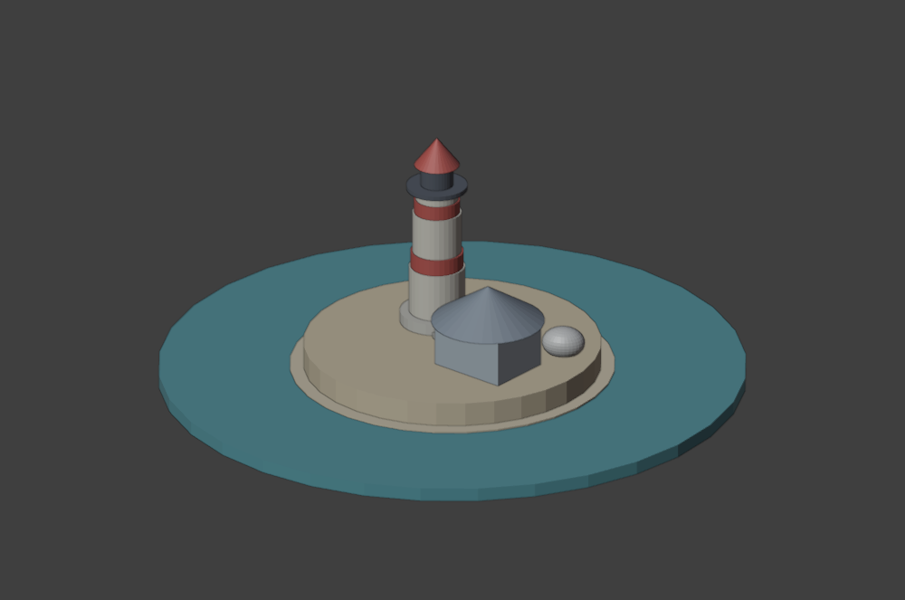

<code>45 · blender_set_material</code> — 第一块礁石已放置，上中灰色材质。

**Reasoning**

第一块礁石已放置，上中灰色材质。

**Arguments**

<pre><code>{
  &quot;object_name&quot;: &quot;Rock1&quot;,
  &quot;color&quot;: [
    0.5,
    0.52,
    0.55,
    1
  ],
  &quot;metallic&quot;: 0,
  &quot;roughness&quot;: 0.9
}</code></pre>

**Observation**

<pre><code>Code executed successfully: material updated Rock1</code></pre>

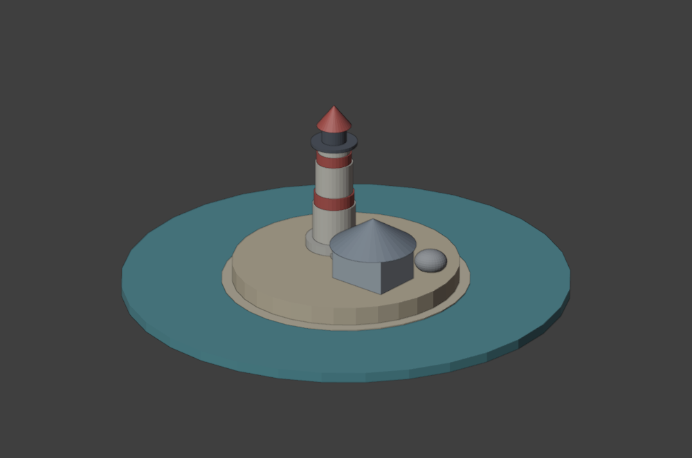

<code>46 · blender_create_primitive</code> — 第二块礁石在岛的另一侧 (-2.6, -1.4)，稍大一些。

**Reasoning**

第二块礁石在岛的另一侧 (-2.6, -1.4)，稍大一些。

**Arguments**

<pre><code>{
  &quot;primitive&quot;: &quot;sphere&quot;,
  &quot;name&quot;: &quot;Rock2&quot;,
  &quot;location&quot;: [
    -2.6,
    -1.4,
    1.05
  ],
  &quot;rotation_degrees&quot;: [
    0,
    0,
    60
  ],
  &quot;scale&quot;: [
    0.7,
    0.55,
    0.45
  ]
}</code></pre>

**Observation**

<pre><code>Code executed successfully: created Rock2</code></pre>

<code>47 · blender_set_material</code> — 第二块礁石已放置，上稍深的灰色材质。

**Reasoning**

第二块礁石已放置，上稍深的灰色材质。

**Arguments**

<pre><code>{
  &quot;object_name&quot;: &quot;Rock2&quot;,
  &quot;color&quot;: [
    0.45,
    0.47,
    0.5,
    1
  ],
  &quot;metallic&quot;: 0,
  &quot;roughness&quot;: 0.9
}</code></pre>

**Observation**

<pre><code>Code executed successfully: material updated Rock2</code></pre>

<code>48 · blender_create_primitive</code> — 第三块小礁石放在灯塔后方 (0.9, 2.6)，增加后景层次。

**Reasoning**

第三块小礁石放在灯塔后方 (0.9, 2.6)，增加后景层次。

**Arguments**

<pre><code>{
  &quot;primitive&quot;: &quot;sphere&quot;,
  &quot;name&quot;: &quot;Rock3&quot;,
  &quot;location&quot;: [
    0.9,
    2.6,
    1.0
  ],
  &quot;rotation_degrees&quot;: [
    0,
    0,
    10
  ],
  &quot;scale&quot;: [
    0.4,
    0.35,
    0.3
  ]
}</code></pre>

**Observation**

<pre><code>Code executed successfully: created Rock3</code></pre>

<code>49 · blender_set_material</code> — 第三块礁石已放置，上灰色材质。

**Reasoning**

第三块礁石已放置，上灰色材质。

**Arguments**

<pre><code>{
  &quot;object_name&quot;: &quot;Rock3&quot;,
  &quot;color&quot;: [
    0.5,
    0.52,
    0.55,
    1
  ],
  &quot;metallic&quot;: 0,
  &quot;roughness&quot;: 0.9
}</code></pre>

**Observation**

<pre><code>Code executed successfully: material updated Rock3</code></pre>

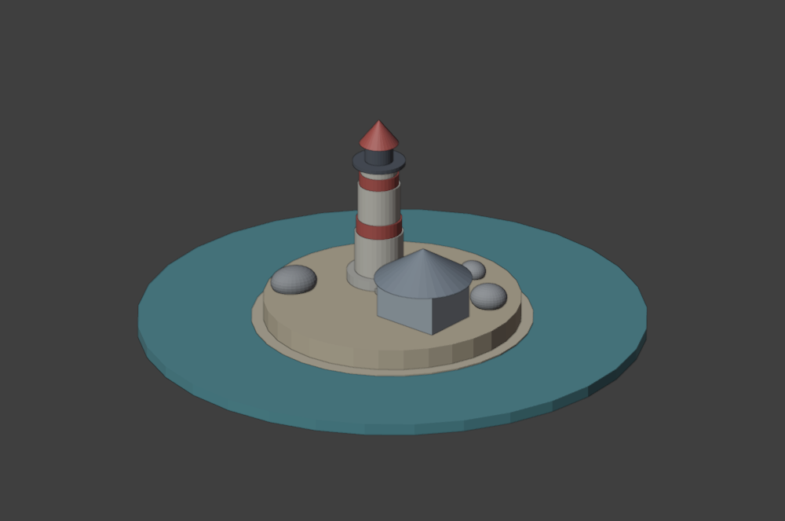

<code>50 · blender_create_primitive</code> — 第四块小礁石放在第二块旁边 (-2.0, -2.2)，形成小石组。

**Reasoning**

第四块小礁石放在第二块旁边 (-2.0, -2.2)，形成小石组。

**Arguments**

<pre><code>{
  &quot;primitive&quot;: &quot;sphere&quot;,
  &quot;name&quot;: &quot;Rock4&quot;,
  &quot;location&quot;: [
    -2.0,
    -2.2,
    0.95
  ],
  &quot;rotation_degrees&quot;: [
    0,
    0,
    45
  ],
  &quot;scale&quot;: [
    0.35,
    0.3,
    0.25
  ]
}</code></pre>

**Observation**

<pre><code>Code executed successfully: created Rock4</code></pre>

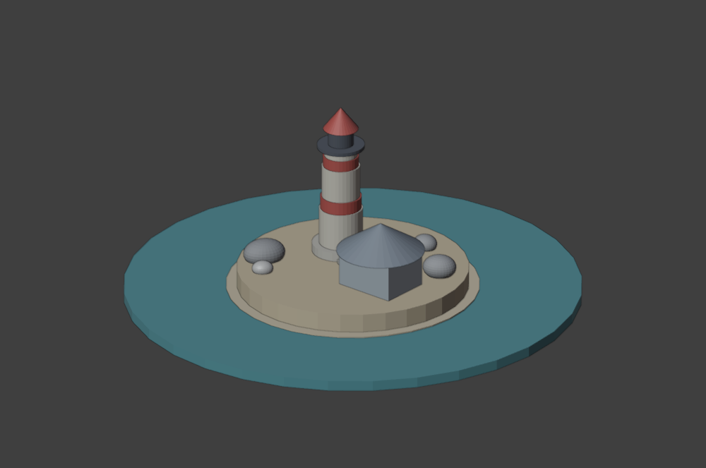

<code>51 · blender_set_material</code> — 第四块礁石已放置，上灰色材质。

**Reasoning**

第四块礁石已放置，上灰色材质。

**Arguments**

<pre><code>{
  &quot;object_name&quot;: &quot;Rock4&quot;,
  &quot;color&quot;: [
    0.5,
    0.52,
    0.55,
    1
  ],
  &quot;metallic&quot;: 0,
  &quot;roughness&quot;: 0.9
}</code></pre>

**Observation**

<pre><code>Code executed successfully: material updated Rock4</code></pre>

<code>52 · blender_create_primitive</code> — 岛上礁石完成。现在在海里加露出水面的礁石：第五块在 (4.6, 1.6)。

**Reasoning**

岛上礁石完成。现在在海里加露出水面的礁石：第五块在 (4.6, 1.6)。

**Arguments**

<pre><code>{
  &quot;primitive&quot;: &quot;sphere&quot;,
  &quot;name&quot;: &quot;Rock5&quot;,
  &quot;location&quot;: [
    4.6,
    1.6,
    0.25
  ],
  &quot;rotation_degrees&quot;: [
    0,
    0,
    20
  ],
  &quot;scale&quot;: [
    0.75,
    0.6,
    0.5
  ]
}</code></pre>

**Observation**

<pre><code>Code executed successfully: created Rock5</code></pre>

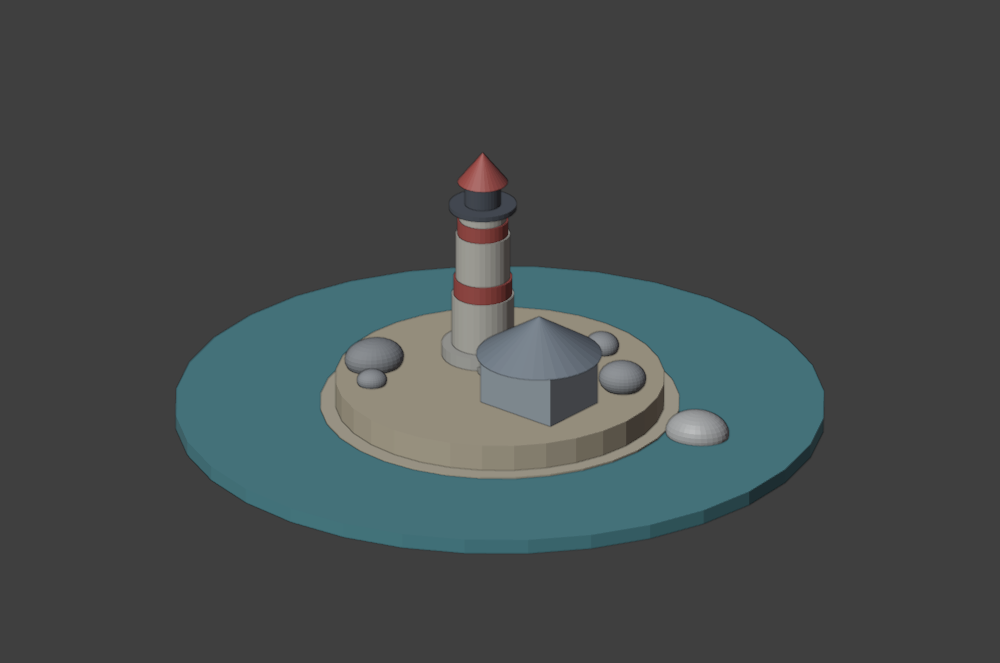

<code>53 · blender_set_material</code> — 海里的礁石已放置，上灰色材质。

**Reasoning**

海里的礁石已放置，上灰色材质。

**Arguments**

<pre><code>{
  &quot;object_name&quot;: &quot;Rock5&quot;,
  &quot;color&quot;: [
    0.48,
    0.5,
    0.53,
    1
  ],
  &quot;metallic&quot;: 0,
  &quot;roughness&quot;: 0.9
}</code></pre>

**Observation**

<pre><code>Code executed successfully: material updated Rock5</code></pre>

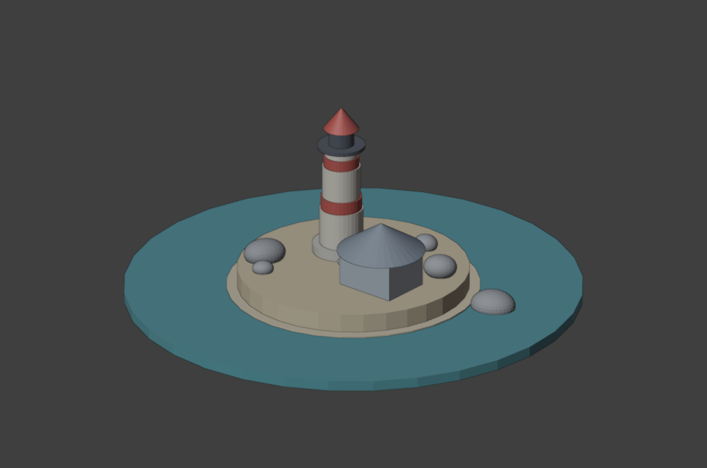

<code>54 · blender_create_primitive</code> — 再在海里加一块礁石，位置 (-4.4, -2.6)，与右侧礁石呼应。

**Reasoning**

再在海里加一块礁石，位置 (-4.4, -2.6)，与右侧礁石呼应。

**Arguments**

<pre><code>{
  &quot;primitive&quot;: &quot;sphere&quot;,
  &quot;name&quot;: &quot;Rock6&quot;,
  &quot;location&quot;: [
    -4.4,
    -2.6,
    0.2
  ],
  &quot;rotation_degrees&quot;: [
    0,
    0,
    50
  ],
  &quot;scale&quot;: [
    0.6,
    0.5,
    0.45
  ]
}</code></pre>

**Observation**

<pre><code>Code executed successfully: created Rock6</code></pre>

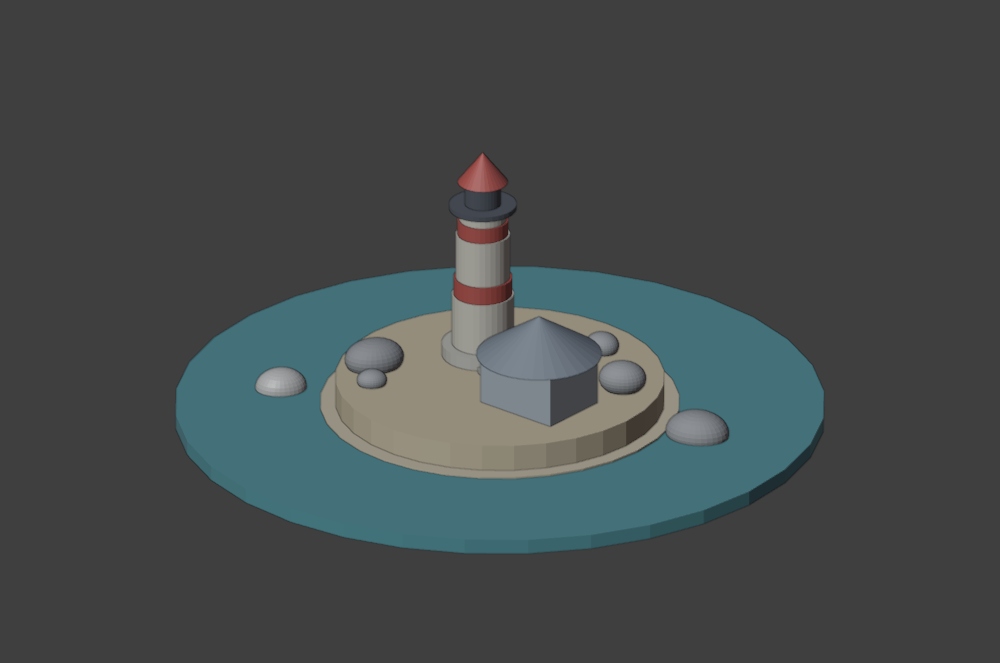

<code>55 · blender_set_material</code> — 左侧海中礁石已放置，上灰色材质。

**Reasoning**

左侧海中礁石已放置，上灰色材质。

**Arguments**

<pre><code>{
  &quot;object_name&quot;: &quot;Rock6&quot;,
  &quot;color&quot;: [
    0.45,
    0.47,
    0.5,
    1
  ],
  &quot;metallic&quot;: 0,
  &quot;roughness&quot;: 0.9
}</code></pre>

**Observation**

<pre><code>Code executed successfully: material updated Rock6</code></pre>

<code>56 · blender_create_primitive</code> — 礁石完成。加一点浪花泡沫：浅色扁圆盘贴在岛边水面，位置 (3.9, -1.2)。

**Reasoning**

礁石完成。加一点浪花泡沫：浅色扁圆盘贴在岛边水面，位置 (3.9, -1.2)。

**Arguments**

<pre><code>{
  &quot;primitive&quot;: &quot;cylinder&quot;,
  &quot;name&quot;: &quot;Foam1&quot;,
  &quot;location&quot;: [
    3.9,
    -1.2,
    0.19
  ],
  &quot;scale&quot;: [
    0.5,
    0.42,
    0.03
  ]
}</code></pre>

**Observation**

<pre><code>Code executed successfully: created Foam1</code></pre>

<code>57 · blender_set_material</code> — 第一处泡沫已放置，上淡白泡沫色材质。

**Reasoning**

第一处泡沫已放置，上淡白泡沫色材质。

**Arguments**

<pre><code>{
  &quot;object_name&quot;: &quot;Foam1&quot;,
  &quot;color&quot;: [
    0.9,
    0.94,
    0.92,
    1
  ],
  &quot;metallic&quot;: 0,
  &quot;roughness&quot;: 0.5
}</code></pre>

**Observation**

<pre><code>Code executed successfully: material updated Foam1</code></pre>

<code>58 · blender_create_primitive</code> — 第二处泡沫放在岛的另一侧水面 (-3.5, 2.2)。

**Reasoning**

第二处泡沫放在岛的另一侧水面 (-3.5, 2.2)。

**Arguments**

<pre><code>{
  &quot;primitive&quot;: &quot;cylinder&quot;,
  &quot;name&quot;: &quot;Foam2&quot;,
  &quot;location&quot;: [
    -3.5,
    2.2,
    0.19
  ],
  &quot;scale&quot;: [
    0.42,
    0.36,
    0.03
  ]
}</code></pre>

**Observation**

<pre><code>Code executed successfully: created Foam2</code></pre>

<code>59 · blender_set_material</code> — 第二处泡沫已放置，上淡白泡沫色材质。

**Reasoning**

第二处泡沫已放置，上淡白泡沫色材质。

**Arguments**

<pre><code>{
  &quot;object_name&quot;: &quot;Foam2&quot;,
  &quot;color&quot;: [
    0.9,
    0.94,
    0.92,
    1
  ],
  &quot;metallic&quot;: 0,
  &quot;roughness&quot;: 0.5
}</code></pre>

**Observation**

<pre><code>Code executed successfully: material updated Foam2</code></pre>

<code>60 · blender_create_primitive</code> — 第三处泡沫放在右侧海中礁石旁 (5.5, 2.2)。

**Reasoning**

第三处泡沫放在右侧海中礁石旁 (5.5, 2.2)。

**Arguments**

<pre><code>{
  &quot;primitive&quot;: &quot;cylinder&quot;,
  &quot;name&quot;: &quot;Foam3&quot;,
  &quot;location&quot;: [
    5.5,
    2.2,
    0.19
  ],
  &quot;scale&quot;: [
    0.35,
    0.3,
    0.03
  ]
}</code></pre>

**Observation**

<pre><code>Code executed successfully: created Foam3</code></pre>

<code>61 · blender_set_material</code> — 第三处泡沫已放置，上淡白泡沫色材质。

**Reasoning**

第三处泡沫已放置，上淡白泡沫色材质。

**Arguments**

<pre><code>{
  &quot;object_name&quot;: &quot;Foam3&quot;,
  &quot;color&quot;: [
    0.9,
    0.94,
    0.92,
    1
  ],
  &quot;metallic&quot;: 0,
  &quot;roughness&quot;: 0.5
}</code></pre>

**Observation**

<pre><code>Code executed successfully: material updated Foam3</code></pre>

<code>62 · blender_add_light</code> — 所有物体就位。现在加一盏太阳光，从前上方斜照，让造型有明暗层次。

**Reasoning**

所有物体就位。现在加一盏太阳光，从前上方斜照，让造型有明暗层次。

**Arguments**

<pre><code>{
  &quot;light_type&quot;: &quot;sun&quot;,
  &quot;name&quot;: &quot;Sun&quot;,
  &quot;rotation_degrees&quot;: [
    55,
    -15,
    -30
  ],
  &quot;power&quot;: 4,
  &quot;color&quot;: [
    1,
    0.97,
    0.9
  ]
}</code></pre>

**Observation**

<pre><code>Code executed successfully: light created Sun</code></pre>

<code>63 · blender_transform_object</code> — 整体已经很紧凑了。微调一下踏脚石位置，让小路从前视角更清晰可见：第一块移近屋门口前方。

**Reasoning**

整体已经很紧凑了。微调一下踏脚石位置，让小路从前视角更清晰可见：第一块移近屋门口前方。

**Arguments**

<pre><code>{
  &quot;object_name&quot;: &quot;Stone1&quot;,
  &quot;location&quot;: [
    0.3,
    -0.85,
    0.9
  ]
}</code></pre>

**Observation**

<pre><code>Code executed successfully: transformed Stone1</code></pre>

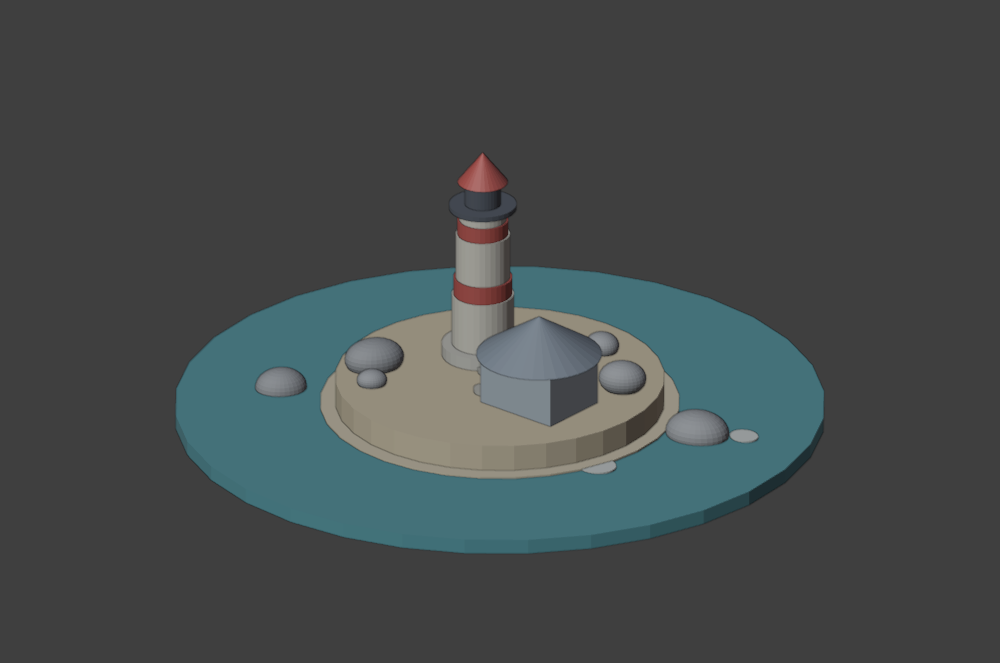

<code>64 · blender_transform_object</code> — 第一块就位。移动第二块到 (-0.1, -0.55)，让路径更靠前。

**Reasoning**

第一块就位。移动第二块到 (-0.1, -0.55)，让路径更靠前。

**Arguments**

<pre><code>{
  &quot;object_name&quot;: &quot;Stone2&quot;,
  &quot;location&quot;: [
    -0.1,
    -0.55,
    0.9
  ]
}</code></pre>

**Observation**

<pre><code>Code executed successfully: transformed Stone2</code></pre>

## Final answer

No final answer was recorded.

## Evaluation

- ReplayVerify: **not_applicable**
- Judge: **0.9375**
- Replay detail: task has no replay verifier

Task-owned rubric range: 0.0–10.0. Overall is the arithmetic mean of range-normalized criterion scores.

| Criterion | Raw score | Normalized score |
| --- | ---: | ---: |
| `scene_content` | 9.5 | 0.95 |
| `spatial_quality` | 9.5 | 0.95 |
| `visual_finish` | 9.0 | 0.9 |
| `coherence` | 9.5 | 0.95 |

Task judge_ref used for this evaluation

<pre><code>{
  &quot;score_range&quot;: {
    &quot;min&quot;: 0.0,
    &quot;max&quot;: 10.0
  },
  &quot;criteria&quot;: [
    {
      &quot;id&quot;: &quot;scene_content&quot;,
      &quot;description&quot;: &quot;完成可辨认的海岛灯塔微缩景观，包含红白灯塔、深色灯室、红色尖顶、小屋、石路、礁石与海面。不规定几何体类型、对象命名或石块数量。&quot;
    },
    {
      &quot;id&quot;: &quot;spatial_quality&quot;,
      &quot;description&quot;: &quot;灯塔为视觉中心，小屋和前景形成层次，整体紧凑而不拥挤、尺度协调，物体有合理的支撑关系，无明显无意穿插或悬空。&quot;
    },
    {
      &quot;id&quot;: &quot;visual_finish&quot;,
      &quot;description&quot;: &quot;最终场景呈现奶白/红/沙色/蓝绿色为主的克制配色，轮廓干净，具有低多边形桌面摆件感与安静的童话氛围；依据实际可见效果，不要求正式渲染或复杂纹理。&quot;
    },
    {
      &quot;id&quot;: &quot;coherence&quot;,
      &quot;description&quot;: &quot;场景作为一件完整作品有连贯构图和完成度，各元素自然融合而非零散堆放；实际产物与用户请求一致，最终说明不虚构不存在的成品。&quot;
    }
  ]
}</code></pre>

Judge rationale

核验过程：
1. scene_content：从工具调用与 observation 可见，Agent 创建了海面圆盘（Sea，蓝绿色）、小岛（Island，沙色）、沙滩边缘（Beach，浅沙色）、灯塔基座与塔身（TowerBase、TowerA、TowerB、TowerC，奶白色配红色条纹 Stripe1/Stripe2）、深色瞭望台（Balcony）与灯室（LampRoom）、红色尖顶（Roof）、蓝灰色小屋（HouseBody、HouseRoof、Door、Window）、石块小路（Stone1–Stone5）、礁石（Rock1–Rock6，岛上与海里均有）、浪花泡沫（Foam1–Foam3），并添加了太阳光。所有请求元素（红白灯塔、深色灯室、红色尖顶、小屋、石路、礁石、海面）均已在场景中可辨认。该标准满足度极高。

2. spatial_quality：灯塔位于小岛中后略偏左，高度明显最高，是视觉中心；小屋在右侧偏前，低矮且体积较小，与灯塔形成前后层次；礁石分布在岛周及海里，不拥挤；踏脚石从屋前蜿蜒至灯塔基座，有合理路径；所有物体均坐落在海面或岛面上，无悬空或明显无意穿插。整体紧凑、比例协调。该标准满足度高。

3. visual_finish：配色以奶白（塔身）、红（条纹与尖顶）、深炭（灯室/瞭望台）、沙色（岛屿）、蓝绿（海面）、蓝灰（小屋）为主，色调克制；低多边形风格明显，轮廓干净；小屋暖窗增添童话感；整体氛围安静且具摆件感。该标准满足度高。

4. coherence：场景作为一件完整桌面微缩摆件，构图连贯，元素自然融合而非零散堆放；最终 observation 与 Agent 描述一致，未虚构不存在物体。该标准满足度高。

结论：四项标准均达到优秀水平，但石块小路因视角和尺寸原因在最终图中辨识度略低，且未做正式渲染，故 visual_finish 与 scene_content 略留微小余量。最终评分：scene_content 9.5，spatial_quality 9.5，visual_finish 9.0，coherence 9.5。

