# Reading 2048 from pixels (G1 VLM-Gym)

[← All showcases](README.md)

> **Complete trajectory imagery:** the animation is a compressed overview of every rendered observation. Every original image is also preserved inside its corresponding tool-call section.

Starting from a fresh board, the agent reads every tile value from the rendered G1 VLM-Gym screen, plans merges over 44 moves, and builds a 64 tile.

| Env | Task | Branch | Steps | ReplayVerify | Judge |
| --- | --- | --- | ---: | --- | ---: |
| `vlmgym_2048` | `task0003` | initial | 45 | passed · reward 1.0 | 1.00 |

## Task

> You are now playing the 2048 game. 2048 is a sliding tile puzzle game where you combine numbered tiles to create a tile with the value 2048.
>
> Rule:
> Only tiles with the SAME number merge when they collide. After each move, a new tile (2 or 4) appears randomly on the board. The game ends when there are no more valid moves.
>
> Available actions (call the move tool):
> - up: slide all tiles upward
> - right: slide all tiles to the right
> - down: slide all tiles downward
> - left: slide all tiles to the left
>
> Before each move, briefly describe the board you see and think about the outcome of each direction.
>
> Goal: create a tile of 64 or higher. Call finish only after the tool results confirm the goal.

[Open compact trajectory JSON](trajectories/vlmgym_2048.json).

## Visual checkpoints

 Full trajectory — every rendered observation in chronological order

## Trajectory

Action mix: `move` × 44, `finish` × 1.

<code>01 · move</code> — The board has a 2 at row 0 col 0, and a 2 at row 3 col 2. Moving down slides the top-left 2 down to the botto…

**Reasoning**

The board has a 2 at row 0 col 0, and a 2 at row 3 col 2. Moving down slides the top-left 2 down to the bottom row, setting up a merge to the left.

**Arguments**

<pre><code>{
  &quot;direction&quot;: &quot;down&quot;
}</code></pre>

**Observation**

<pre><code>Moved down: merged 0 point(s). Score 0.</code></pre>

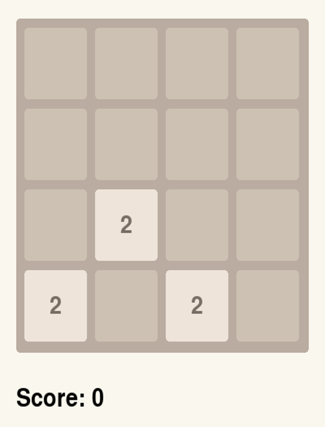

<code>02 · move</code> — The board now has 2s at (3,0), (3,2), and a newly spawned 2 at (2,1). Moving left will merge the two 2s on th…

**Reasoning**

The board now has 2s at (3,0), (3,2), and a newly spawned 2 at (2,1). Moving left will merge the two 2s on the bottom row into a 4 at (3,0). Let&#x27;s move left.

**Arguments**

<pre><code>{
  &quot;direction&quot;: &quot;left&quot;
}</code></pre>

**Observation**

<pre><code>Moved left: merged 4 point(s). Score 4.</code></pre>

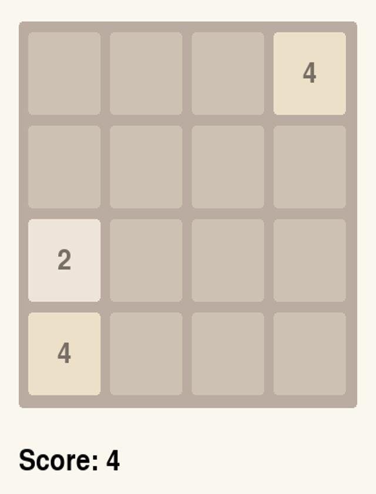

<code>03 · move</code> — The board has 4 at (0,3), 2 at (2,0), and 4 at (3,0). Let&#x27;s keep tiles organized in the bottom-left corner. M…

**Reasoning**

The board has 4 at (0,3), 2 at (2,0), and 4 at (3,0). Let&#x27;s keep tiles organized in the bottom-left corner. Moving down brings the 4 at (0,3) to (3,3) and keeps (2,0) and (3,0) stacked.

**Arguments**

<pre><code>{
  &quot;direction&quot;: &quot;down&quot;
}</code></pre>

**Observation**

<pre><code>Moved down: merged 0 point(s). Score 4.</code></pre>

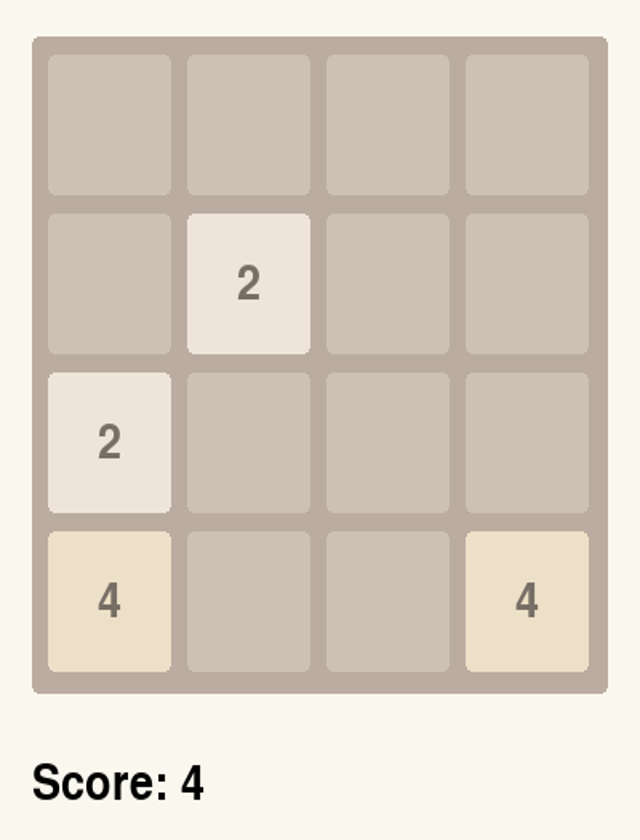

<code>04 · move</code> — The board has 4 at (3,0), 4 at (3,3), 2 at (2,0), 2 at (1,1). Moving left will merge the 4s at the bottom row…

**Reasoning**

The board has 4 at (3,0), 4 at (3,3), 2 at (2,0), 2 at (1,1). Moving left will merge the 4s at the bottom row into an 8 at (3,0), and slide the 2 at (1,1) to (1,0). Let&#x27;s move left.

**Arguments**

<pre><code>{
  &quot;direction&quot;: &quot;left&quot;
}</code></pre>

**Observation**

<pre><code>Moved left: merged 8 point(s). Score 12.</code></pre>

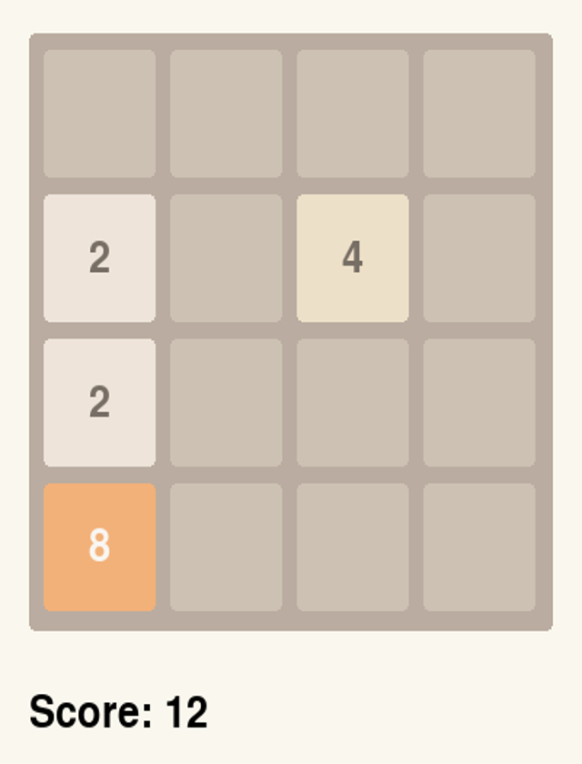

<code>05 · move</code> — The board has 8 at (3,0), 2 at (2,0), 2 at (1,0), and 4 at (1,2). Moving down will merge the two 2s into a 4…

**Reasoning**

The board has 8 at (3,0), 2 at (2,0), 2 at (1,0), and 4 at (1,2). Moving down will merge the two 2s into a 4 at (2,0), and bring the 4 at (1,2) to (3,2). Let&#x27;s move down.

**Arguments**

<pre><code>{
  &quot;direction&quot;: &quot;down&quot;
}</code></pre>

**Observation**

<pre><code>Moved down: merged 4 point(s). Score 16.</code></pre>

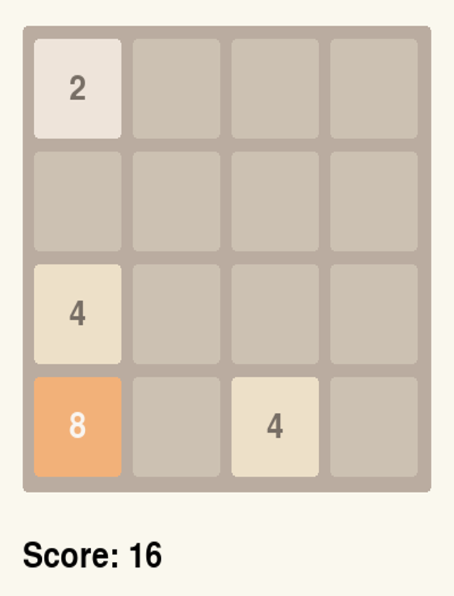

<code>06 · move</code> — The board has 8 at (3,0), 4 at (3,2), 4 at (2,0), 2 at (0,0). Moving down will slide the 2 to (1,0). Let&#x27;s mo…

**Reasoning**

The board has 8 at (3,0), 4 at (3,2), 4 at (2,0), 2 at (0,0). Moving down will slide the 2 to (1,0). Let&#x27;s move down.

**Arguments**

<pre><code>{
  &quot;direction&quot;: &quot;down&quot;
}</code></pre>

**Observation**

<pre><code>Moved down: merged 0 point(s). Score 16.</code></pre>

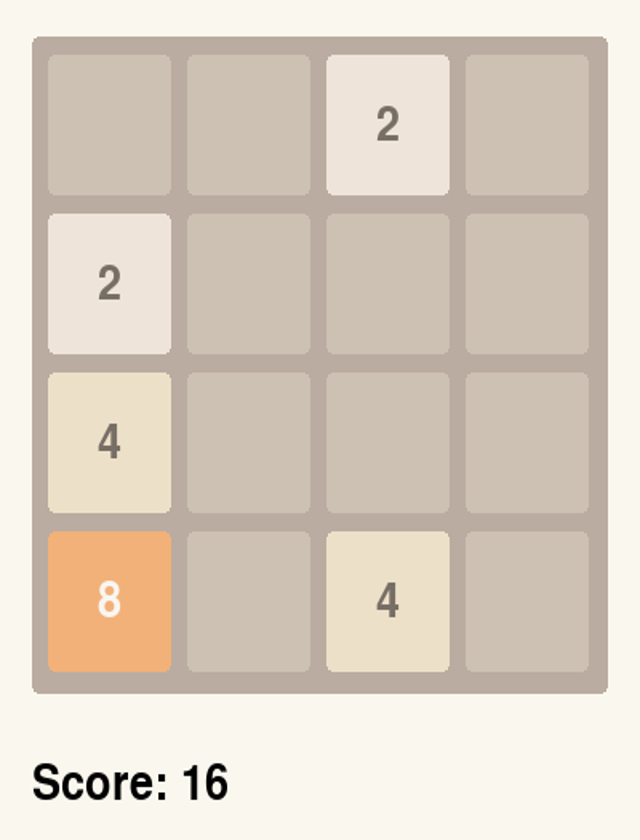

<code>07 · move</code> — The board has 8 at (3,0), 4 at (3,2), 4 at (2,0), 2 at (1,0), 2 at (0,2). Moving down will slide 2 at (0,2) t…

**Reasoning**

The board has 8 at (3,0), 4 at (3,2), 4 at (2,0), 2 at (1,0), 2 at (0,2). Moving down will slide 2 at (0,2) to (2,2). Then moving left could merge things nicely. Let&#x27;s move down.

**Arguments**

<pre><code>{
  &quot;direction&quot;: &quot;down&quot;
}</code></pre>

**Observation**

<pre><code>Moved down: merged 0 point(s). Score 16.</code></pre>

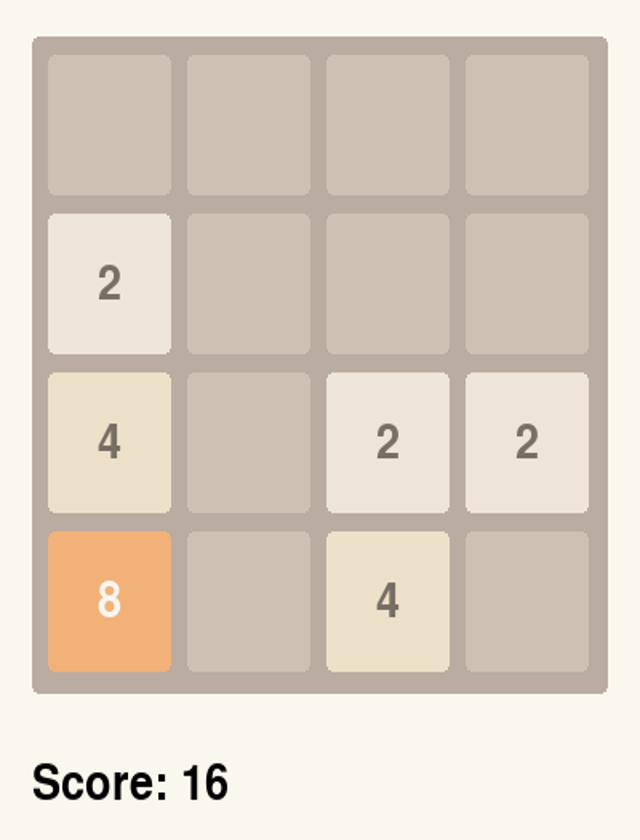

<code>08 · move</code> — Now row 2 has 4 at (2,0), 2 at (2,2), 2 at (2,3). If we slide left: row 2 becomes 4, 4 (the two 2s merge into…

**Reasoning**

Now row 2 has 4 at (2,0), 2 at (2,2), 2 at (2,3). If we slide left: row 2 becomes 4, 4 (the two 2s merge into 4 at (2,1)). Row 3 has 8, 4. Then row 2 has 4, 4 which can merge down or left! Let&#x27;s move left.

**Arguments**

<pre><code>{
  &quot;direction&quot;: &quot;left&quot;
}</code></pre>

**Observation**

<pre><code>Moved left: merged 4 point(s). Score 20.</code></pre>

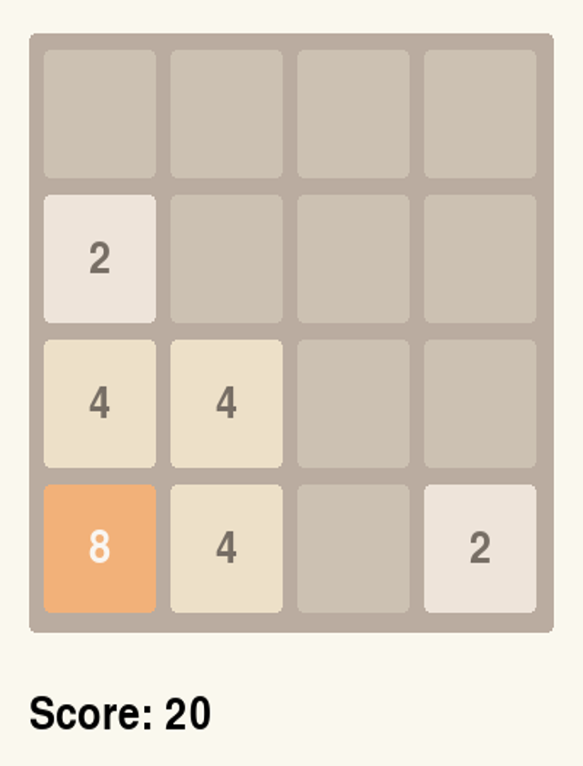

<code>09 · move</code> — We have: row 3: [8, 4, empty, 2]; row 2: [4, 4, empty, empty]; row 1: [2, empty, empty, empty]. If we move do…

**Reasoning**

We have: row 3: [8, 4, empty, 2]; row 2: [4, 4, empty, empty]; row 1: [2, empty, empty, empty].
If we move down: column 1 has 4 and 4, merging to 8 at (3,1)! Column 0 has 8, 4, 2 stacked. So row 3 will have [8, 8, empty, 2]!
Then moving left merges the two 8s into 16! Let&#x27;s move down.

**Arguments**

<pre><code>{
  &quot;direction&quot;: &quot;down&quot;
}</code></pre>

**Observation**

<pre><code>Moved down: merged 8 point(s). Score 28.</code></pre>

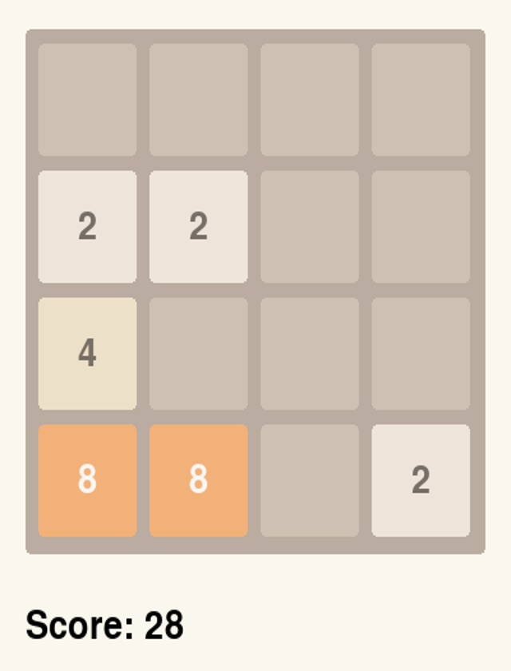

<code>10 · move</code> — Row 3 has 8, 8, empty, 2. Row 1 has 2, 2. Moving left merges the two 8s into 16 at (3,0), and merges the two…

**Reasoning**

Row 3 has 8, 8, empty, 2. Row 1 has 2, 2. Moving left merges the two 8s into 16 at (3,0), and merges the two 2s into 4 at (1,0). Let&#x27;s move left.

**Arguments**

<pre><code>{
  &quot;direction&quot;: &quot;left&quot;
}</code></pre>

**Observation**

<pre><code>Moved left: merged 20 point(s). Score 48.</code></pre>

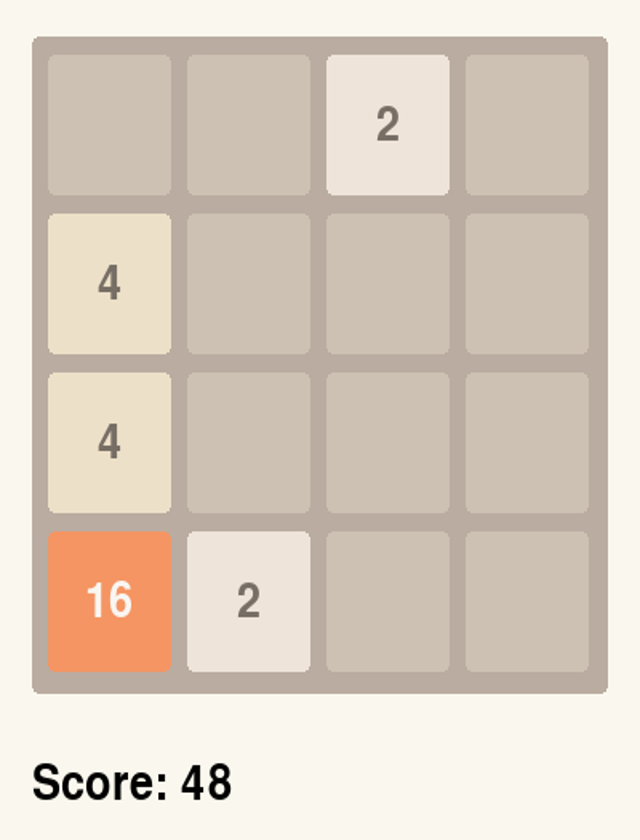

<code>11 · move</code> — The board has 16 at (3,0), 2 at (3,1), 4 at (2,0), 4 at (1,0), 2 at (0,2). Moving down merges the 4s at (1,0)…

**Reasoning**

The board has 16 at (3,0), 2 at (3,1), 4 at (2,0), 4 at (1,0), 2 at (0,2). Moving down merges the 4s at (1,0) and (2,0) into 8 at (2,0), and brings 2 at (0,2) to (3,2). Let&#x27;s move down.

**Arguments**

<pre><code>{
  &quot;direction&quot;: &quot;down&quot;
}</code></pre>

**Observation**

<pre><code>Moved down: merged 8 point(s). Score 56.</code></pre>

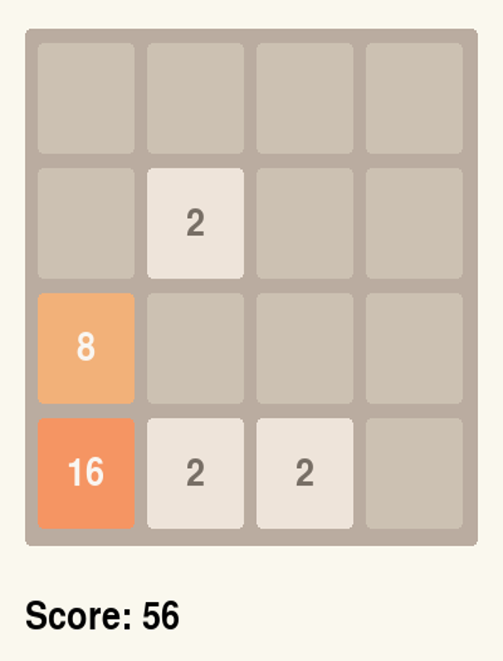

<code>12 · move</code> — The board has 16 at (3,0), 2 at (3,1), 2 at (3,2), 8 at (2,0), 2 at (1,1). Moving left will merge the two 2s…

**Reasoning**

The board has 16 at (3,0), 2 at (3,1), 2 at (3,2), 8 at (2,0), 2 at (1,1). Moving left will merge the two 2s in row 3 into a 4 at (3,1), and slide the 2 at (1,1) to (1,0). Let&#x27;s move left.

**Arguments**

<pre><code>{
  &quot;direction&quot;: &quot;left&quot;
}</code></pre>

**Observation**

<pre><code>Moved left: merged 4 point(s). Score 60.</code></pre>

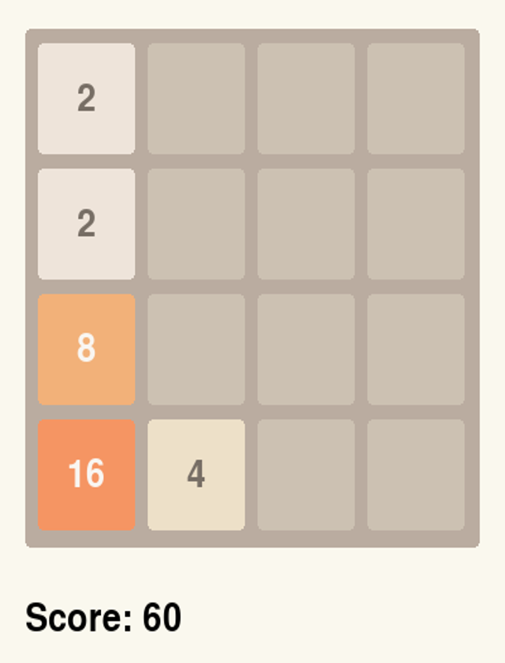

<code>13 · move</code> — Column 0 has 16 at (3,0), 8 at (2,0), 2 at (1,0), 2 at (0,0). Moving down merges the 2s into a 4 at (1,0). Le…

**Reasoning**

Column 0 has 16 at (3,0), 8 at (2,0), 2 at (1,0), 2 at (0,0). Moving down merges the 2s into a 4 at (1,0). Let&#x27;s move down.

**Arguments**

<pre><code>{
  &quot;direction&quot;: &quot;down&quot;
}</code></pre>

**Observation**

<pre><code>Moved down: merged 4 point(s). Score 64.</code></pre>

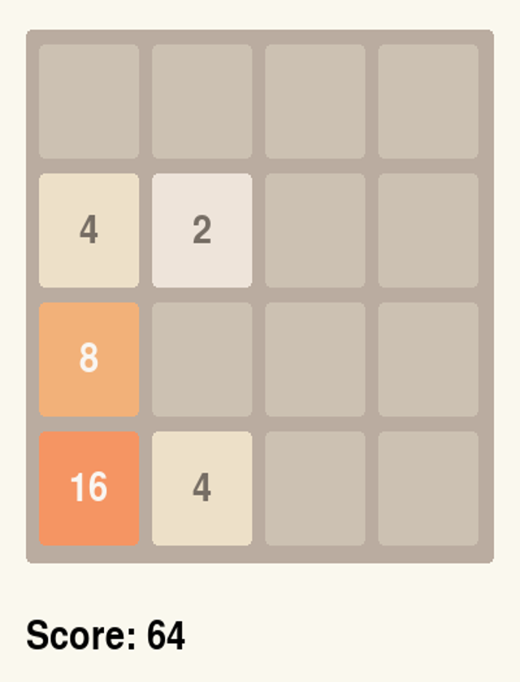

<code>14 · move</code> — Board has 16 at (3,0), 4 at (3,1), 8 at (2,0), 4 at (1,0), 2 at (1,1). Moving down slides 2 at (1,1) down to…

**Reasoning**

Board has 16 at (3,0), 4 at (3,1), 8 at (2,0), 4 at (1,0), 2 at (1,1). Moving down slides 2 at (1,1) down to (2,1). Let&#x27;s move down.

**Arguments**

<pre><code>{
  &quot;direction&quot;: &quot;down&quot;
}</code></pre>

**Observation**

<pre><code>Moved down: merged 0 point(s). Score 64.</code></pre>

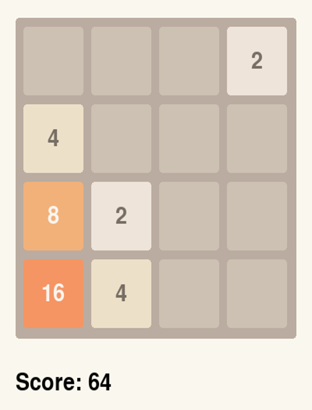

<code>15 · move</code> — A 2 spawned at (0,3). Moving down brings it to (3,3). Let&#x27;s move down.

**Reasoning**

A 2 spawned at (0,3). Moving down brings it to (3,3). Let&#x27;s move down.

**Arguments**

<pre><code>{
  &quot;direction&quot;: &quot;down&quot;
}</code></pre>

**Observation**

<pre><code>Moved down: merged 0 point(s). Score 64.</code></pre>

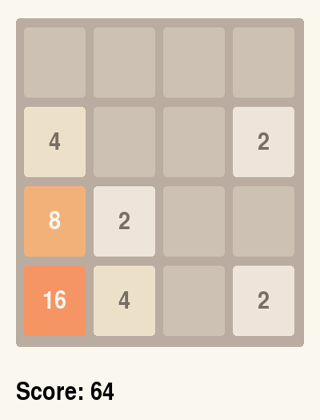

<code>16 · move</code> — Board has 16 at (3,0), 4 at (3,1), 2 at (3,3); 8 at (2,0), 2 at (2,1); 4 at (1,0), 2 at (1,3). Moving down wi…

**Reasoning**

Board has 16 at (3,0), 4 at (3,1), 2 at (3,3); 8 at (2,0), 2 at (2,1); 4 at (1,0), 2 at (1,3). Moving down will merge the two 2s in column 3 into 4 at (3,3)! Let&#x27;s move down.

**Arguments**

<pre><code>{
  &quot;direction&quot;: &quot;down&quot;
}</code></pre>

**Observation**

<pre><code>Moved down: merged 4 point(s). Score 68.</code></pre>

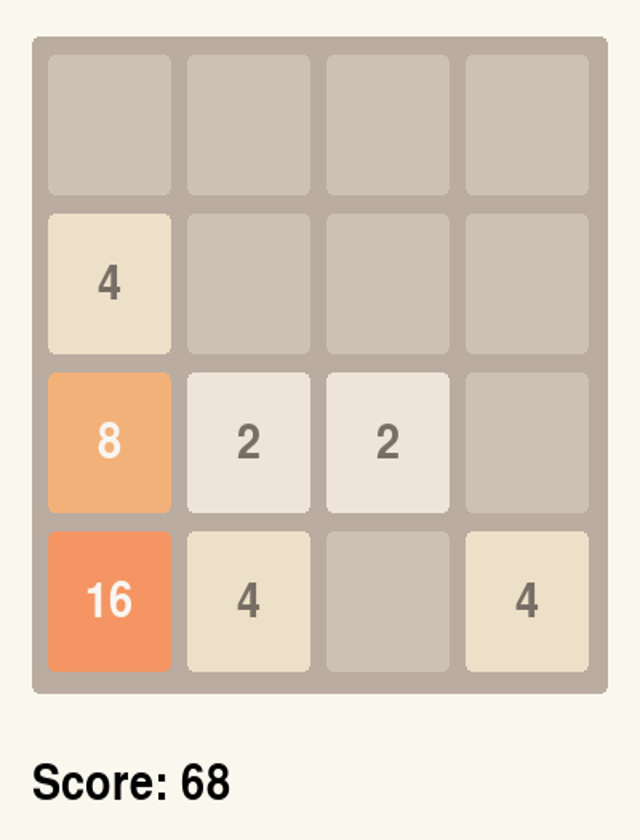

<code>17 · move</code> — In row 2 we have 8 at (2,0), 2 at (2,1), 2 at (2,2). Row 3 has 16 at (3,0), 4 at (3,1), 4 at (3,3). If we mov…

**Reasoning**

In row 2 we have 8 at (2,0), 2 at (2,1), 2 at (2,2). Row 3 has 16 at (3,0), 4 at (3,1), 4 at (3,3).
If we move left:
Row 3: 16, 4, 4 -&gt; 16, 8!
Row 2: 8, 2, 2 -&gt; 8, 4!
Row 1: 4
Then column 0 is 4, 8, 16! Column 1 is 4, 8!
This is amazing! Let&#x27;s move left.

**Arguments**

<pre><code>{
  &quot;direction&quot;: &quot;left&quot;
}</code></pre>

**Observation**

<pre><code>Moved left: merged 12 point(s). Score 80.</code></pre>

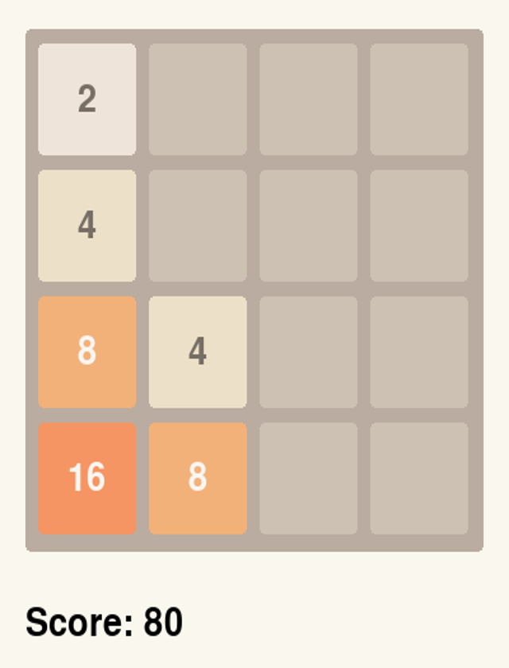

<code>18 · move</code> — Board has: row 0: [2, empty, empty, empty] row 1: [4, empty, empty, empty] row 2: [8, 4, empty, empty] row 3:…

**Reasoning**

Board has:
row 0: [2, empty, empty, empty]
row 1: [4, empty, empty, empty]
row 2: [8, 4, empty, empty]
row 3: [16, 8, empty, empty]
Wait, if we move down, the column 0 cannot merge (2, 4, 8, 16 are all different!). But column 1 has 4 and 8 which also won&#x27;t merge. Moving down doesn&#x27;t change anything except maybe column 0? No, column 0 is full: 2, 4, 8, 16. So moving down does nothing to col 0. Col 1 has 4 at (2,1) and 8 at (3,1), already at the bottom!
Wait, moving down would be an illegal move because no tiles can move down!
Let&#x27;s check: can any tile move down? Row 0 has 2 at (0,0), row 1 has 4 at (1,0), row 2 has 8 at (2,0), row 3 has 16 at (3,0). None can move down. Row 2 col 1 has 4, row 3 col 1 has 8. None can move down. So down is illegal!
Can we move right? If we move right, the 16 slides away from the bottom-left corner, which might mess up our corner strategy.
What if we move up? Up would merge... wait, does up merge? Col 0 is 2, 4, 8, 16 (none equal). Col 1 has 4 at (2,1), 8 at (3,1). Moving up slides them to (0,1) and (1,1). But that pulls 16 out of the corner if we later do something else.
Wait, what about moving right? If we move right, row 3 becomes [empty, empty, 16, 8], row 2 becomes [empty, empty, 8, 4], row 1 becomes [empty, empty, empty, 4], row 0 becomes [empty, empty, empty, 2]. That just flips everything to the right side! Corner is now bottom-right (with 16 at (3,2) and 8 at (3,3)). That&#x27;s not ideal.
Wait, why not move right and then left? Or wait, is there an illegal move check? Yes: &quot;A move that changes nothing is illegal: no tile spawns and the step reward is 0.&quot;
Wait, why can&#x27;t we slide right? Or can we slide left? Can any tile move left? Row 0 has 2 at (0,0), row 1 has 4 at (1,0), row 2 has 8 at (2,0) and 4 at (2,1), row 3 has 16 at (3,0) and 8 at (3,1). Left does nothing either! Left is also illegal!
So only &#x27;up&#x27; or &#x27;right&#x27; are valid moves.
Let&#x27;s evaluate &#x27;up&#x27; vs &#x27;right&#x27;.
If &#x27;up&#x27;:
Col 0 doesn&#x27;t move (full: 2, 4, 8, 16). Col 1 has 4 at (2,1) and 8 at (3,1) which slide to (0,1) and (1,1). Then 16 is still at (3,0), 8 at (2,0), 4 at (1,0), 2 at (0,0)! The bottom-left anchor (16 at 3,0) is PRESERVED!
Wait, col 0 doesn&#x27;t move AT ALL because it&#x27;s full: (0,0)=2, (1,0)=4, (2,0)=8, (3,0)=16.
So (3,0) remains 16! (2,0) remains 8! (1,0) remains 4! (0,0) remains 2!
Only col 1 moves up: 4 goes to (0,1), 8 goes to (1,1)!
Then a new tile spawns.
Let&#x27;s verify: yes, col 0 is completely unaffected by &#x27;up&#x27;!
Let&#x27;s move &#x27;up&#x27;!

**Arguments**

<pre><code>{
  &quot;direction&quot;: &quot;up&quot;
}</code></pre>

**Observation**

<pre><code>Moved up: merged 0 point(s). Score 80.</code></pre>

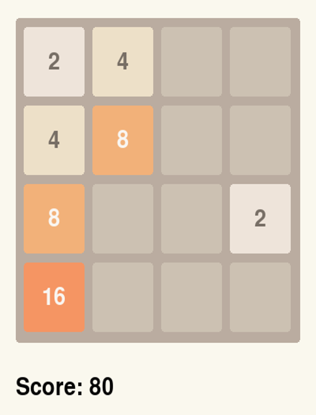

<code>19 · move</code> — Now a 2 spawned at (2,3). Col 0 has [2, 4, 8, 16]. Col 1 has [4, 8, empty, empty]. Col 3 has [empty, empty, 2…

**Reasoning**

Now a 2 spawned at (2,3).
Col 0 has [2, 4, 8, 16].
Col 1 has [4, 8, empty, empty].
Col 3 has [empty, empty, 2, empty].
If we move down:
Col 0 is full and unchanged: [2, 4, 8, 16].
Col 1 slides down to [empty, empty, 4, 8]! So (2,1)=4, (3,1)=8.
Col 3 slides down to (3,3)=2.
Let&#x27;s check: 16 at (3,0) stays firmly at (3,0)! 8 at (3,1) is next to it! 4 at (2,1) is above the 8!
Let&#x27;s move down!

**Arguments**

<pre><code>{
  &quot;direction&quot;: &quot;down&quot;
}</code></pre>

**Observation**

<pre><code>Moved down: merged 0 point(s). Score 80.</code></pre>

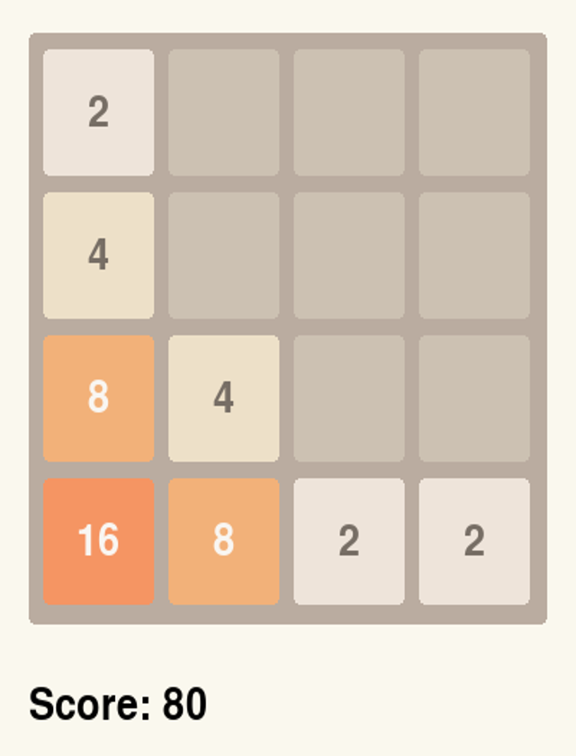

<code>20 · move</code> — Look at row 3: [16, 8, 2, 2]! If we move left, the two 2s merge into 4 at (3,2)! So row 3 becomes [16, 8, 4,…

**Reasoning**

Look at row 3: [16, 8, 2, 2]!
If we move left, the two 2s merge into 4 at (3,2)! So row 3 becomes [16, 8, 4, empty]!
Row 2 has [8, 4, empty, empty].
Row 1 has [4, empty, empty, empty].
Row 0 has [2, empty, empty, empty].
Let&#x27;s move left!

**Arguments**

<pre><code>{
  &quot;direction&quot;: &quot;left&quot;
}</code></pre>

**Observation**

<pre><code>Moved left: merged 4 point(s). Score 84.</code></pre>

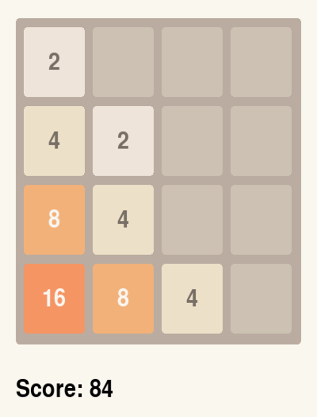

<code>21 · move</code> — Look at column 2: row 3 col 2 is 4. Column 1: row 3 is 8, row 2 is 4, row 1 is 2. Column 0: 16, 8, 4, 2. Noti…

**Reasoning**

Look at column 2: row 3 col 2 is 4.
Column 1: row 3 is 8, row 2 is 4, row 1 is 2.
Column 0: 16, 8, 4, 2.
Notice the pattern! Col 0: [2, 4, 8, 16], Col 1: [empty, 2, 4, 8], Col 2: [empty, empty, empty, 4].
Can we slide down? Col 0 is full. Col 1 is [empty, 2, 4, 8] which is already at bottom. Col 2 is [empty, empty, empty, 4] which is already at bottom.
Can we slide left? Col 0 has 2, col 1 has nothing at row 0. Col 0 has 4, col 1 has 2 at row 1. Col 0 has 8, col 1 has 4 at row 2. Col 0 has 16, col 1 has 8, col 2 has 4 at row 3. Nothing can slide left!
So &#x27;down&#x27; and &#x27;left&#x27; are both illegal right now!
What about &#x27;up&#x27;?
If we slide up: col 0 is full, col 1 slides to (0,1)=2, (1,1)=4, (2,1)=8. Col 2 slides to (0,2)=4.
What about &#x27;right&#x27;?
If we slide right: row 3 becomes [empty, 16, 8, 4] -&gt; moves 16 out of the corner!
So &#x27;up&#x27; is much safer, because col 0 stays completely intact (2, 4, 8, 16). 16 stays in corner (3,0).
Let&#x27;s move up!

**Arguments**

<pre><code>{
  &quot;direction&quot;: &quot;up&quot;
}</code></pre>

**Observation**

<pre><code>Moved up: merged 0 point(s). Score 84.</code></pre>

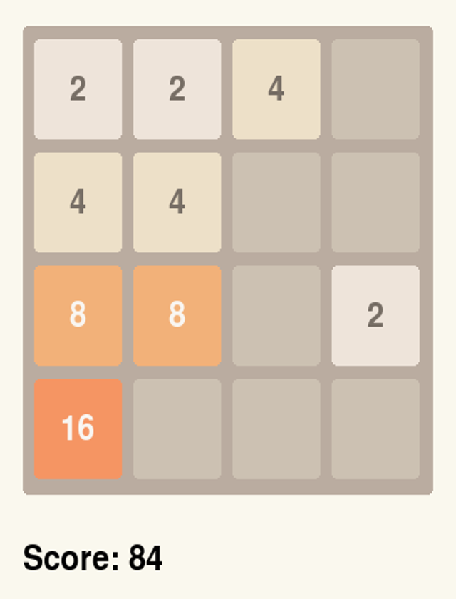

<code>22 · move</code> — LOOK AT THIS: Row 0: [2, 2, 4, empty] Row 1: [4, 4, empty, empty] Row 2: [8, 8, empty, 2] Row 3: [16, empty,…

**Reasoning**

LOOK AT THIS:
Row 0: [2, 2, 4, empty]
Row 1: [4, 4, empty, empty]
Row 2: [8, 8, empty, 2]
Row 3: [16, empty, empty, empty]
If we move LEFT:
Row 0: 2 and 2 merge to 4! So [4, 4, empty, empty]!
Row 1: 4 and 4 merge to 8! So [8, empty, empty, empty]!
Row 2: 8 and 8 merge to 16! So [16, 2, empty, empty]!
Row 3: [16, empty, empty, empty]!
Then column 0 has [4, 8, 16, 16]!
And moving down will merge the two 16s into 32!
Let&#x27;s move left!

**Arguments**

<pre><code>{
  &quot;direction&quot;: &quot;left&quot;
}</code></pre>

**Observation**

<pre><code>Moved left: merged 28 point(s). Score 112.</code></pre>

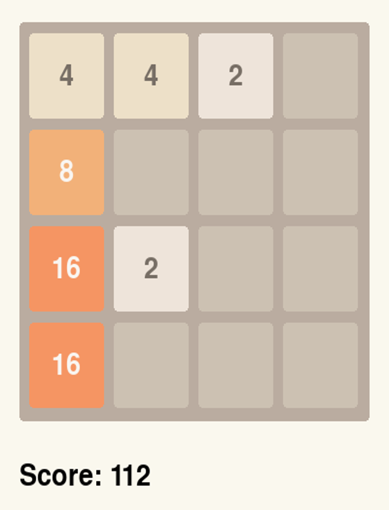

<code>23 · move</code> — Now: Row 0: [4, 4, 2, empty] Row 1: [8, empty, empty, empty] Row 2: [16, 2, empty, empty] Row 3: [16, empty,…

**Reasoning**

Now:
Row 0: [4, 4, 2, empty]
Row 1: [8, empty, empty, empty]
Row 2: [16, 2, empty, empty]
Row 3: [16, empty, empty, empty]

If we move DOWN:
Column 0: 16 and 16 at (2,0) and (3,0) merge into 32 at (3,0)!
Row 1&#x27;s 8 drops to (2,0)!
Row 0&#x27;s 4 drops to (1,0)!
Column 1: row 2 has 2, row 0 has 4 -&gt; 2 drops to (3,1), 4 drops to (2,1)!
Column 2: row 0 has 2 -&gt; drops to (3,2)!
So col 0 becomes: (3,0)=32, (2,0)=8, (1,0)=4! Beautifully stacked!
Let&#x27;s move down!

**Arguments**

<pre><code>{
  &quot;direction&quot;: &quot;down&quot;
}</code></pre>

**Observation**

<pre><code>Moved down: merged 32 point(s). Score 144.</code></pre>

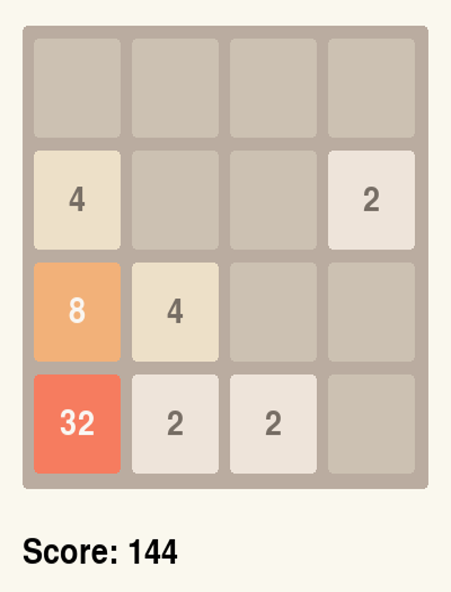

<code>24 · move</code> — Now row 3 has: [32, 2, 2, empty]. Moving left merges the 2s at (3,1) and (3,2) into 4 at (3,1)! Row 1 has 4 a…

**Reasoning**

Now row 3 has: [32, 2, 2, empty].
Moving left merges the 2s at (3,1) and (3,2) into 4 at (3,1)!
Row 1 has 4 at (1,0) and 2 at (1,3), 2 slides left to (1,1).
Row 2 has 8 at (2,0) and 4 at (2,1).
Let&#x27;s move left!

**Arguments**

<pre><code>{
  &quot;direction&quot;: &quot;left&quot;
}</code></pre>

**Observation**

<pre><code>Moved left: merged 4 point(s). Score 148.</code></pre>

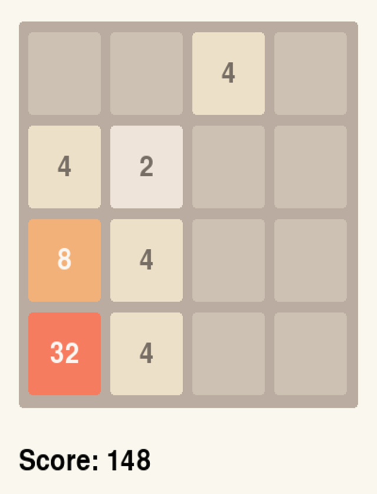

<code>25 · move</code> — Look at column 1: Row 1 has 2, Row 2 has 4, Row 3 has 4. If we move DOWN: Column 1: 4 and 4 merge into 8 at (…

**Reasoning**

Look at column 1:
Row 1 has 2,
Row 2 has 4,
Row 3 has 4.
If we move DOWN:
Column 1: 4 and 4 merge into 8 at (3,1)!
Row 1&#x27;s 2 drops to (2,1)!
Column 2: 4 at (0,2) drops to (3,2)!
Column 0: 32, 8, 4 stays in place!
Then row 3 will have: 32 at (3,0), 8 at (3,1), 4 at (3,2)!
Row 2 has 8 at (2,0), 2 at (2,1)!
Let&#x27;s move down!

**Arguments**

<pre><code>{
  &quot;direction&quot;: &quot;down&quot;
}</code></pre>

**Observation**

<pre><code>Moved down: merged 8 point(s). Score 156.</code></pre>

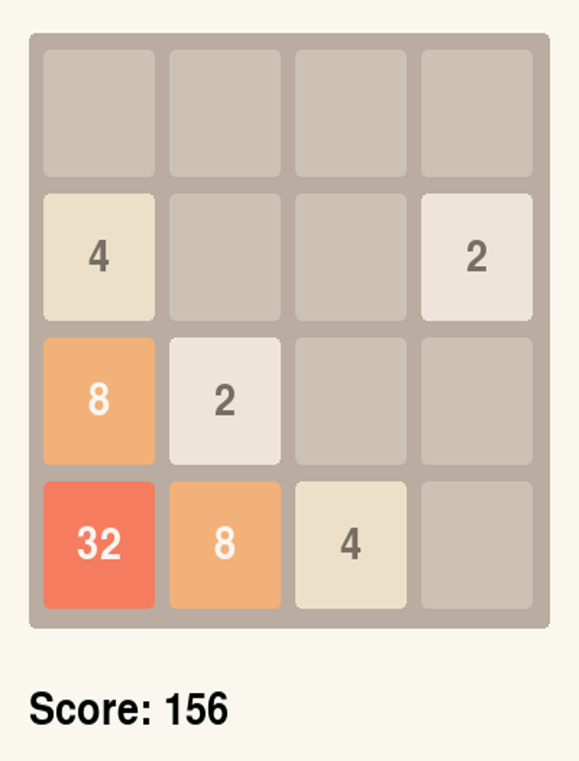

<code>26 · move</code> — Row 3 has [32, 8, 4, empty]. Row 2 has [8, 2, empty, empty]. Row 1 has [4, empty, empty, 2]. Row 0 is empty.…

**Reasoning**

Row 3 has [32, 8, 4, empty].
Row 2 has [8, 2, empty, empty].
Row 1 has [4, empty, empty, 2].
Row 0 is empty.
If we move left: (1,3) slides to (1,1). Row 2 and row 3 are already left-aligned. So 2 moves to (1,1).
Let&#x27;s move left!

**Arguments**

<pre><code>{
  &quot;direction&quot;: &quot;left&quot;
}</code></pre>

**Observation**

<pre><code>Moved left: merged 0 point(s). Score 156.</code></pre>

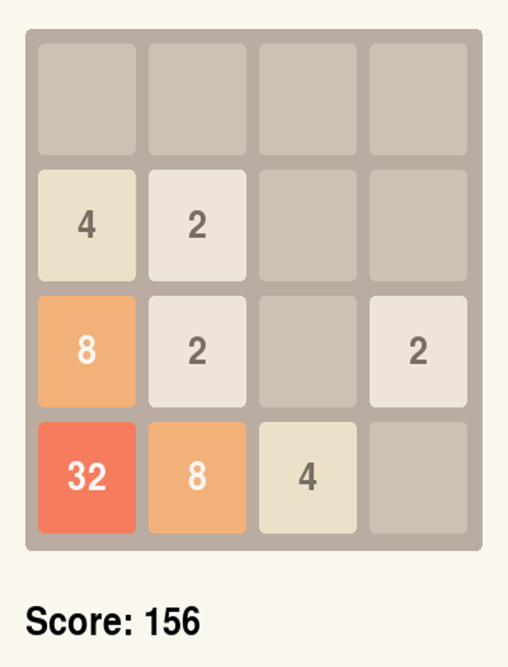

<code>27 · move</code> — Column 1 has 2 at (1,1) and 2 at (2,1), and 8 at (3,1). If we move DOWN: Column 1: 2 and 2 merge into 4 at (2…

**Reasoning**

Column 1 has 2 at (1,1) and 2 at (2,1), and 8 at (3,1).
If we move DOWN:
Column 1: 2 and 2 merge into 4 at (2,1)!
Column 3: 2 at (2,3) drops to (3,3)!
Column 0: 32, 8, 4 stays in place!
Column 2: empty!
Then row 3 will have: [32, 8, 4, 2]!
And row 2 will have: [8, 4, empty, empty]!
And row 1 will have: [4, empty, empty, empty]!
Look at the beauty of this snake: [4, 8, 32, 8, 4, 2]!
Let&#x27;s move down!

**Arguments**

<pre><code>{
  &quot;direction&quot;: &quot;down&quot;
}</code></pre>

**Observation**

<pre><code>Moved down: merged 4 point(s). Score 160.</code></pre>

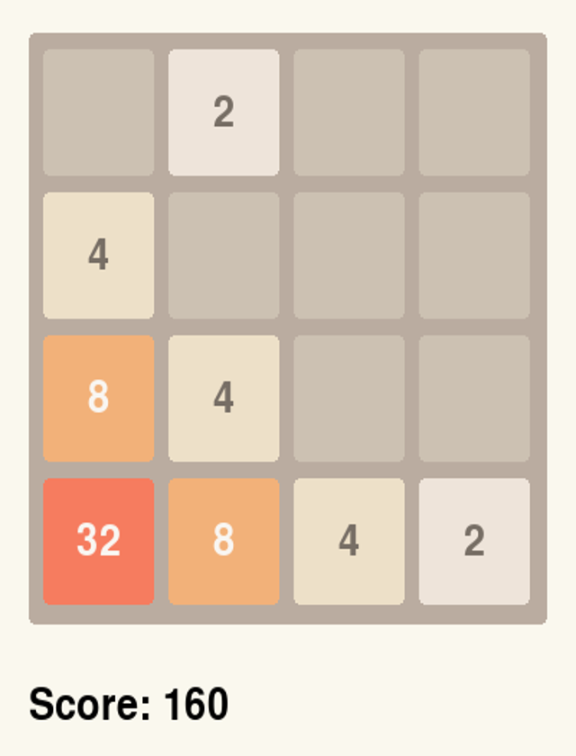

<code>28 · move</code> — The board has row 0: [empty, 2, empty, empty], row 1: [4, empty, empty, empty], row 2: [8, 4, empty, empty],…

**Reasoning**

The board has row 0: [empty, 2, empty, empty], row 1: [4, empty, empty, empty], row 2: [8, 4, empty, empty], row 3: [32, 8, 4, 2]. Moving down drops 2 to (1,1).

**Arguments**

<pre><code>{
  &quot;direction&quot;: &quot;down&quot;
}</code></pre>

**Observation**

<pre><code>Moved down: merged 0 point(s). Score 160.</code></pre>

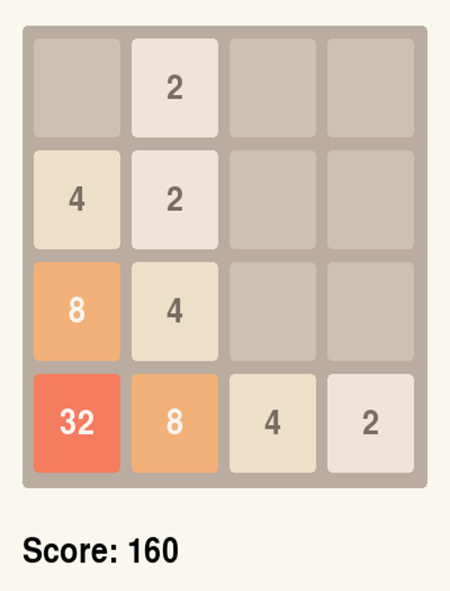

<code>29 · move</code> — Another 2 spawned at (0,1). Moving down will merge the two 2s at (0,1) and (1,1) into 4 at (1,1)!

**Reasoning**

Another 2 spawned at (0,1). Moving down will merge the two 2s at (0,1) and (1,1) into 4 at (1,1)!

**Arguments**

<pre><code>{
  &quot;direction&quot;: &quot;down&quot;
}</code></pre>

**Observation**

<pre><code>Moved down: merged 4 point(s). Score 164.</code></pre>

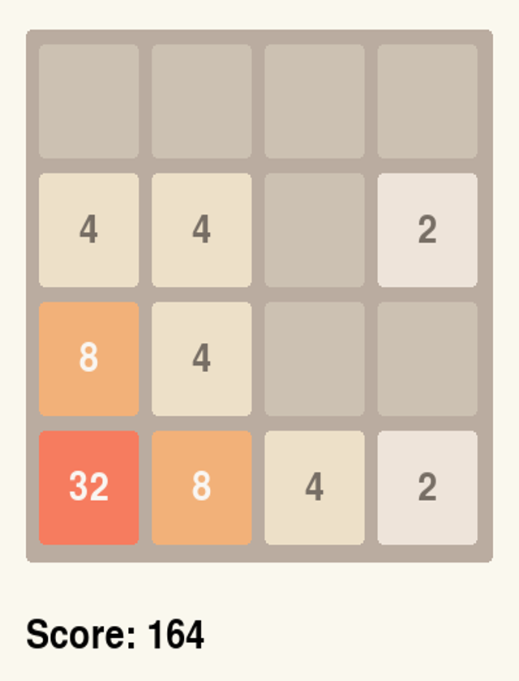

<code>30 · move</code> — Row 1 has [4, 4, empty, 2]. Row 2 has [8, 4, empty, empty]. Row 3 has [32, 8, 4, 2]. If we move LEFT: Row 1:…

**Reasoning**

Row 1 has [4, 4, empty, 2].
Row 2 has [8, 4, empty, empty].
Row 3 has [32, 8, 4, 2].
If we move LEFT:
Row 1: 4 and 4 merge to 8! The 2 slides to (1,1)! So row 1 is [8, 2, empty, empty]!
Row 2: [8, 4, empty, empty] stays.
Row 3: [32, 8, 4, 2] stays.
Then column 0 has [empty, 8, 8, 32]!
Moving down then merges 8 and 8 into 16, which is adjacent to 32!
Let&#x27;s move left!

**Arguments**

<pre><code>{
  &quot;direction&quot;: &quot;left&quot;
}</code></pre>

**Observation**

<pre><code>Moved left: merged 8 point(s). Score 172.</code></pre>

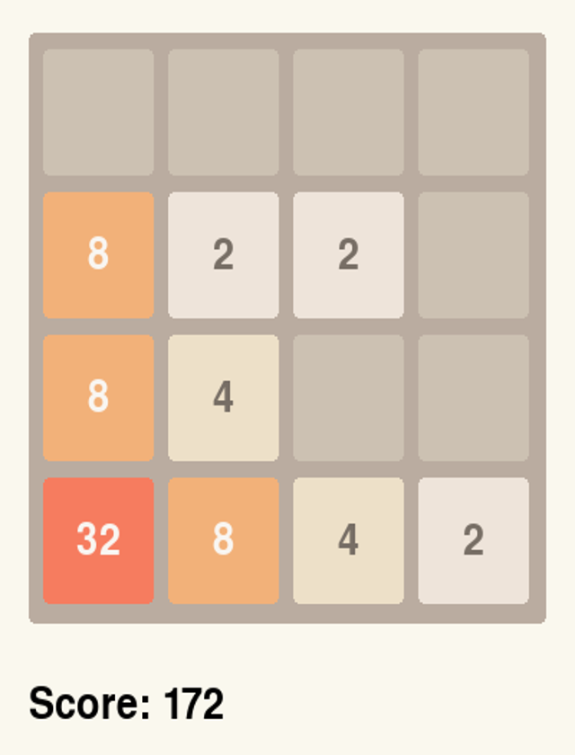

<code>31 · move</code> — Notice row 1: [8, 2, 2, empty]. If we move left: row 1 merges 2 and 2 into 4! So row 1 becomes [8, 4, empty,…

**Reasoning**

Notice row 1: [8, 2, 2, empty].
If we move left: row 1 merges 2 and 2 into 4! So row 1 becomes [8, 4, empty, empty]!
Then column 1 will have 4 at (1,1), 4 at (2,1), 8 at (3,1)!
And column 0 will have 8 at (1,0), 8 at (2,0), 32 at (3,0)!
Let&#x27;s move left!

**Arguments**

<pre><code>{
  &quot;direction&quot;: &quot;left&quot;
}</code></pre>

**Observation**

<pre><code>Moved left: merged 4 point(s). Score 176.</code></pre>

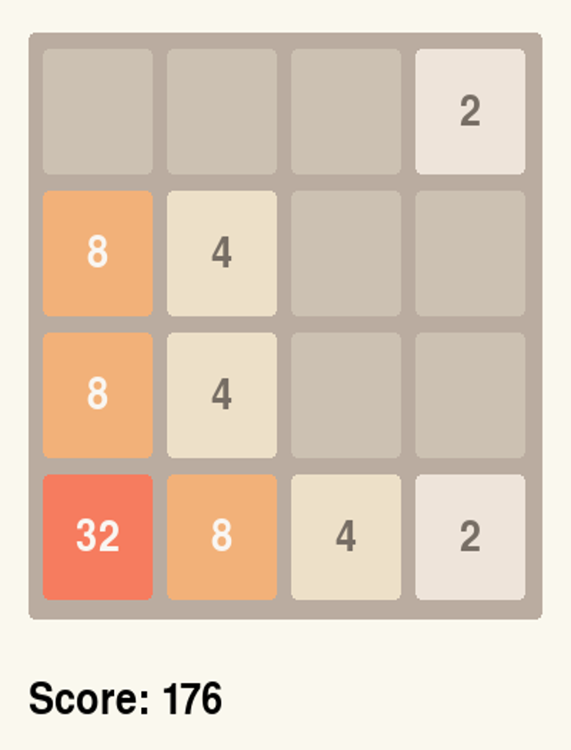

<code>32 · move</code> — LOOK AT THIS: Column 0: 8 at (1,0), 8 at (2,0), 32 at (3,0). Column 1: 4 at (1,1), 4 at (2,1), 8 at (3,1). Ro…

**Reasoning**

LOOK AT THIS:
Column 0: 8 at (1,0), 8 at (2,0), 32 at (3,0).
Column 1: 4 at (1,1), 4 at (2,1), 8 at (3,1).
Row 3: 32, 8, 4, 2.
Row 0: 2 at (0,3).
If we move DOWN:
Column 0: 8 and 8 merge into 16 at (2,0)! With 32 below it at (3,0)!
Column 1: 4 and 4 merge into 8 at (2,1)! With 8 below it at (3,1)!
Column 3: 2 at (0,3) merges with 2 at (3,3)? Wait, (3,3) has a 2! So 2 at (0,3) drops down and merges with 2 at (3,3) into 4 at (3,3)!
Let&#x27;s move DOWN!

**Arguments**

<pre><code>{
  &quot;direction&quot;: &quot;down&quot;
}</code></pre>

**Observation**

<pre><code>Moved down: merged 28 point(s). Score 204.</code></pre>

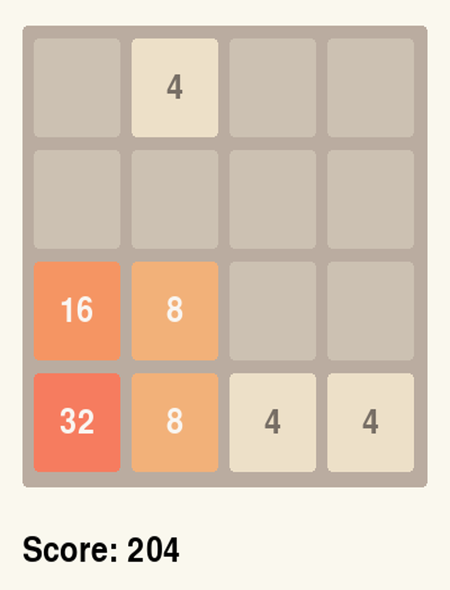

<code>33 · move</code> — LOOK AT THIS GLORIOUS SETUP: Row 3: [32, 8, 4, 4] Row 2: [16, 8, empty, empty] Row 0: [empty, 4, empty, empty…

**Reasoning**

LOOK AT THIS GLORIOUS SETUP:
Row 3: [32, 8, 4, 4]
Row 2: [16, 8, empty, empty]
Row 0: [empty, 4, empty, empty]

If we move LEFT:
Row 3: 4 and 4 merge into 8 at (3,2)! So row 3 becomes [32, 8, 8, empty]!
Row 2: [16, 8, empty, empty] stays.
Row 0: 4 moves to (0,0)!

Wait, then if row 3 is [32, 8, 8, empty]:
Another move LEFT will merge 8 and 8 into 16 at (3,1)!
Then row 3 is [32, 16, empty, empty]!
And above it at (2,0) is 16, but wait: if row 3 has 32 at (3,0) and 16 at (3,1), and row 2 has 16 at (2,0)...
Wait! What if we move DOWN right now?
Col 1 has 4 at (0,1), 8 at (2,1), 8 at (3,1).
If we move DOWN:
Col 1: the 8 at (2,1) and 8 at (3,1) merge into 16 at (3,1)!
And the 4 at (0,1) drops down to (2,1)!
Row 3 col 2 and 3: 4 and 4 are side by side, moving down doesn&#x27;t merge them.
Then row 3 will have: [32, 16, 4, 4]!
Then moving LEFT merges the 4 and 4 into 8 at (3,2)!
Wait, even better: what if we move LEFT first?
Let&#x27;s see: move LEFT:
Row 3 becomes [32, 8, 8, empty].
Row 2 is [16, 8, empty, empty].
Row 0 is [4, empty, empty, empty].
Then we move LEFT AGAIN:
Row 3 becomes [32, 16, empty, empty]! (8 and 8 merged!)
Then row 2 has [16, 8, empty, empty]!
Then look at column 0: 32 at (3,0), 16 at (2,0).
And row 3 col 1 is 16!
Wait, 16 at (3,1) can merge with 16 at (2,0)? No, they are diagonal.
Wait, why not: move DOWN right now!
Let&#x27;s trace moving DOWN right now:
Col 0: [empty, empty, 16, 32] -&gt; unchanged.
Col 1: [4, empty, 8, 8] -&gt; 8 and 8 merge into 16 at (3,1)! 4 drops to (2,1)!
Col 2: [empty, empty, empty, 4] -&gt; unchanged.
Col 3: [empty, empty, empty, 4] -&gt; unchanged.
So after DOWN:
Row 3: [32, 16, 4, 4]!
Row 2: [16, 4, empty, empty]!
Row 1: empty.
Row 0: spawned tile.
Then next move: move LEFT!
Row 3: [32, 16, 4, 4] -&gt; 4 and 4 merge into 8! Row 3 becomes [32, 16, 8, empty]!
Row 2: [16, 4, empty, empty] is already left!
Wait, but how does 32 merge with another 32 to get 64?
To get 64, we need 32 + 32.
Currently we have one 32 at (3,0).
We need another 32!
Where can that 32 come from? It needs to be made from two 16s!
Where are the 16s?
Currently we have a 16 at (2,0)!
And if we merge the two 8s at (2,1) and (3,1), where does the resulting 16 go?
If we move DOWN, the merge happens at (3,1), so (3,1) becomes 16! (2,0) is 16. They are diagonal, not adjacent.
Wait! If we move LEFT first:
Row 3: [32, 8, 4, 4] -&gt; 4 and 4 merge into 8 at (3,2). So row 3 is [32, 8, 8, empty].
Row 2: [16, 8, empty, empty].
Then moving DOWN:
Column 1: 8 at (2,1) and 8 at (3,1) merge into 16 at (3,1). But row 3 has 8 at (3,2) too!
Wait, what if we move LEFT, then LEFT:
Move 1: LEFT
Row 3: 4 and 4 merge to 8 -&gt; [32, 8, 8, empty].
Row 2: [16, 8, empty, empty].
Move 2: LEFT
Row 3: 8 and 8 merge to 16! -&gt; [32, 16, empty, empty].
Row 2: [16, 8, empty, empty].
Now look at Row 2 and Row 3:
Row 2 has 16 at (2,0) and 8 at (2,1).
Row 3 has 32 at (3,0) and 16 at (3,1).
Wait! If col 1 has 8 at (2,1) and 16 at (3,1), and col 0 has 16 at (2,0) and 32 at (3,0)... that&#x27;s a snake:
32 at (3,0) &lt;- 16 at (2,0) &lt;- 16 at (3,1) ?? No, 16 at (2,0) is above 32, and 16 at (3,1) is to the right of 32!
Wait, if 16 is at (2,0) and another 16 is at (3,1), can they merge? No, one is at (2,0) and one is at (3,1)!
Wait, what if row 2&#x27;s 16 is at (2,1) instead? Or what if row 2&#x27;s 16 merges with another 16 in col 0?
Wait! In the current board:
Col 0: (2,0)=16, (3,0)=32.
Col 1: (0,1)=4, (2,1)=8, (3,1)=8.
If we move DOWN right now:
Col 1&#x27;s two 8s merge to 16 at (3,1).
Then (2,1) is 4 (the 4 from (0,1) drops down).
Row 3 is [32, 16, 4, 4].
Wait, what if instead of moving down, we:
Look at Row 2: (2,0)=16, (2,1)=8.
What if we build a 16 at (2,0)? We already have 16 at (2,0)!
To merge with 32 at (3,0), we need a 32 at (2,0) or (3,1)!
To get a 32 at (2,0), we need two 16s in col 0 (e.g. at (1,0) and (2,0)) or merge horizontally in row 2!
Wait! What if we merge horizontally in row 2? If (2,1) becomes 16, then moving LEFT merges (2,0)=16 and (2,1)=16 into 32 at (2,0)!
YES! Row 2 has 16 at (2,0) and 8 at (2,1)!
If the 8 at (2,1) becomes 16, then (2,0) and (2,1) can merge LEFT into 32 at (2,0)!
And then (2,0)=32 is right on top of (3,0)=32!
Then moving DOWN merges 32 and 32 into 64 at (3,0)!!!!!
THAT&#x27;S IT! THAT&#x27;S THE CLASSIC 2048 STRATEGY!
Let&#x27;s verify this step by step:
We want (2,1) to become 16!
To make (2,1) become 16, we need another 8 to merge with (2,1)=8!
Where can another 8 come from?
Look at row 3: [32, 8, 4, 4]!
4 and 4 merge to 8!
If 4 and 4 merge to 8, we have an 8 in row 3!
Wait, right now (3,1) already has an 8!
Wait, (2,1) is 8 and (3,1) is 8! They are ALREADY adjacent vertically!
Wait, if (2,1)=8 and (3,1)=8 merge vertically, which direction would they merge?
If DOWN: they merge into (3,1)=16!
Then (3,1) is 16! And (3,0) is 32!
Wait, if (3,1) is 16, it&#x27;s next to 32 at (3,0). But (2,0) is also 16! They don&#x27;t merge if they are at (2,0) and (3,1).
Wait, but if (2,1) merges with (3,1) upwards? UP would ruin the corner!
Wait, what if we DO NOT merge (2,1) and (3,1) vertically?
What if (3,1)=8 stays at (3,1), and the 4 and 4 in row 3 merge into 8 at (3,2)?
Then row 3 is: [32, 8, 8, empty]!
Then row 3 has two 8s at (3,1) and (3,2)! They merge horizontally into 16 at (3,1)!
Wait, that still puts 16 at (3,1).
Wait! How do you make (2,1) into 16?
If (1,1) becomes 8, then (1,1) and (2,1) merge DOWN into (2,1)=16!
Currently (0,1) is 4. If a 4 spawns or we merge into 4 at (1,1), then 4+4=8 at (1,1), then 8+8=16 at (2,1)!
OR: what if row 3 is [32, 16, 8, 4, ...] and we snake around:
Row 3: [32, 16, 8, 4]
Row 2: [empty, 16, 8, 4] -&gt; wait!
What if (3,1) IS 16, and (3,2) is 8, and (3,3) is 4?
Wait, what if (3,0) is 32, (3,1) is 16, and we make (3,1) into 32?
How do we make (3,1) into 32? (3,1) needs two 16s! One is already there (16), and from (3,2) comes another 16!
Wait, is that easier, or is it easier to just merge into 32 directly?
Wait! What if we move DOWN right now?
Let&#x27;s see what happens if we move DOWN:
Col 0: [empty, empty, 16, 32]
Col 1: [4, empty, 8, 8] -&gt; 8 and 8 merge to 16 at (3,1)! 4 drops to (2,1)!
Col 2: 4 at (3,2)
Col 3: 4 at (3,3)
Row 3 is now: [32, 16, 4, 4]!
Row 2 is: [16, 4, empty, empty]!
Look at row 3: [32, 16, 4, 4].
Now move LEFT:
Row 3 becomes: [32, 16, 8, empty]! (4 and 4 merge to 8 at (3,2))
Row 2 becomes: [16, 4, empty, empty]!
Look at column 1: (2,1) is 4, (3,1) is 16.
Look at column 0: (2,0) is 16, (3,0) is 32.
Wait, why do we have two 16s (at (2,0) and (3,1))?
Can we merge them? If we move LEFT, they can&#x27;t merge. If we move DOWN, they can&#x27;t merge.
Wait! If (2,0) is 16 and (3,1) is 16, that&#x27;s two separate 16s that cannot merge with each other directly because they are in different rows and columns!
Wait! What if instead, at the CURRENT board:
We move LEFT?
Let&#x27;s trace LEFT from current board:
Row 3: [32, 8, 4, 4] -&gt; 4 and 4 merge into 8! Row 3 becomes [32, 8, 8, empty]!
Row 2: [16, 8, empty, empty] -&gt; stays [16, 8, empty, empty]!
Row 0: [empty, 4, empty, empty] -&gt; 4 slides to (0,0)!
Now look at Row 3: [32, 8, 8, empty].
And Row 2: [16, 8, empty, empty].
Now what if we move LEFT again?
Row 3: 8 and 8 merge into 16! Row 3 becomes [32, 16, empty, empty]!
Row 2: [16, 8, empty, empty] stays [16, 8, empty, empty]!
Wait, that still has 16 at (2,0) and 16 at (3,1).
BUT WAIT! In the current board, Row 2 has 8 at (2,1), Row 3 has 8 at (3,1)!
Wait, why not merge row 2&#x27;s 8 with row 2&#x27;s 16? 8 doesn&#x27;t merge with 16.
Wait, how do any tiles merge? Tiles ONLY merge if they are the SAME value and collide!
Right now on the board we have:
32 at (3,0)
16 at (2,0)
8 at (2,1)
8 at (3,1)
4 at (3,2)
4 at (3,3)
4 at (0,1)
Total sum of tiles: 32 + 16 + 8 + 8 + 4 + 4 + 4 = 76!
We ONLY need a tile of 64!
To get 64, the 32 MUST merge with another 32!
Where can that 32 come from?
32 = 16 + 16.
We have 16 at (2,0).
If we get another 16, where can it be?
If it&#x27;s at (1,0), then Col 0 has: (1,0)=16, (2,0)=16, (3,0)=32!
Then DOWN merges (1,0) and (2,0) into 32 at (2,0)!
And then Col 0 has 32 at (2,0) and 32 at (3,0)!
Then DOWN merges them into 64 at (3,0)!
OR: if Row 2 has (2,0)=16 and (2,1)=16, then LEFT merges them into 32 at (2,0)!
And then DOWN merges 32 at (2,0) and 32 at (3,0) into 64 at (3,0)!
YES!! Notice that! If (2,1) becomes 16, then LEFT merges (2,0)=16 and (2,1)=16 into (2,0)=32!
So how can (2,1) become 16? (2,1) needs to be 8 + 8!
Currently (2,1) IS ALREADY 8!
Can we get another 8 into (2,1)?
Wait: if (2,1) is 8, and (2,2) becomes 8, then LEFT merges them into 16 at (2,1)!
How can (2,2) become 8? From two 4s!
Where are the 4s? Currently row 3 has 4 at (3,2) and 4 at (3,3)!
Wait! If row 3 has 4 at (3,2) and 4 at (3,3), and row 3 also has 8 at (3,1):
If row 3 merges 4 and 4, they become 8 at (3,2)!
Then row 3 has 8 at (3,1) and 8 at (3,2)!
Wait, if row 3 has 8 at (3,1) and 8 at (3,2), what if they merge UP? No, UP moves the 32 out of the bottom row!
Wait, does UP move the 32 out of the bottom row?
YES, because (2,0) has 16 and (1,0) is empty! If we press UP, 16 goes to (0,0) and 32 goes to (1,0) - NEVER press UP when col 0 isn&#x27;t full!
Wait, what if col 0 IS full? If col 0 is full, UP doesn&#x27;t move 32!
Wait, why make it complicated? What if we snake along the bottom row?
Look: in standard 2048 snake:
Row 3: [32, 16, 8, 4]
Row 2: [empty, empty, empty, 4]
Then 4 merges with 4 to make 8 at (3,3).
Then 8 merges with 8 at (3,2) to make 16 at (3,2).
Then 16 merges with 16 at (3,1) to make 32 at (3,1).
Then 32 at (3,1) merges with 32 at (3,0) to make 64 at (3,0)!
THAT IS THE CLASSIC SNAKE LINE!
In the classic snake line, row 3 is: [32, 16, 8, 4]!
Look at row 3 right now: [32, 8, 4, 4]!
If we move LEFT: 4 and 4 merge into 8 at (3,2)!
Then row 3 is [32, 8, 8, empty]!
Then move LEFT again: 8 and 8 merge into 16 at (3,1)!
Then row 3 is [32, 16, empty, empty]!
AND we already have 16 at (2,0)!
Wait, if row 3 is [32, 16, empty, empty], and row 2 has 16 at (2,0):
Wait, can 16 at (2,0) slide right to (2,1)? No, moving right would slide 32 right too!
Wait, what if we DO NOT let 16 sit at (2,0) doing nothing? What if we move DOWN right now?
Let&#x27;s see what happens if we move DOWN right now:
If we move DOWN:
Col 0: [empty, empty, 16, 32] (unchanged)
Col 1: [4, empty, 8, 8] -&gt; the two 8s merge into 16 at (3,1)! 4 drops to (2,1)!
Col 2: 4 at (3,2)
Col 3: 4 at (3,3)
LOOK AT ROW 3 AFTER DOWN:
(3,0) = 32
(3,1) = 16 (from 8+8!)
(3,2) = 4
(3,3) = 4
LOOK AT ROW 3! It is [32, 16, 4, 4]!
And Row 2 is: [16, 4, empty, empty]!
Now, from [32, 16, 4, 4], if we move LEFT:
In Row 3: 4 and 4 merge into 8 at (3,2)!
So Row 3 becomes: [32, 16, 8, empty]!
And Row 2 has: [16, 4, empty, empty]!
LOOK AT ROW 3: [32, 16, 8, empty]! That is 32, 16, 8 - exactly the snake!
And Row 2 has 4 at (2,1), directly above the 8? No, above the 16.
Wait, what if in Row 2, we have 16 at (2,0)?
Wait, if (2,0) is 16, can we merge (2,0)=16 with (1,0)=16 to get 32 at (2,0)?
If (2,0) becomes 32, then (2,0)=32 and (3,0)=32 merge to 64! We wouldn&#x27;t even need the rest of the snake!
Wait, how many points to 64? We have 32 right now. We just need ONE MORE 32!
Either way, moving DOWN right now merges the two 8s in col 1 (score +16) and keeps 32 at (3,0)!
Wait, does moving DOWN change anything else?
Col 1: 4 at (0,1) drops down to (2,1). The 8 at (2,1) and 8 at (3,1) merge into 16 at (3,1).
Col 2 and 3: 4 at (3,2) and 4 at (3,3) stay at bottom.
Col 0: 16 at (2,0) and 32 at (3,0) stay at bottom.
This is a completely safe move!
Let&#x27;s move DOWN!

**Arguments**

<pre><code>{
  &quot;direction&quot;: &quot;down&quot;
}</code></pre>

**Observation**

<pre><code>Moved down: merged 16 point(s). Score 220.</code></pre>

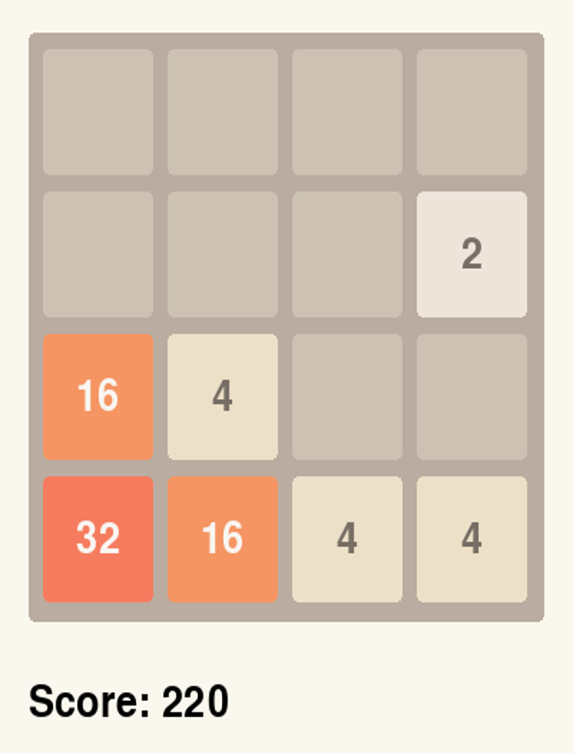

<code>34 · move</code> — Now: Row 3: [32, 16, 4, 4]. Row 2: [16, 4, empty, empty]. Row 1: [empty, empty, empty, 2]. Row 0: empty. If w…

**Reasoning**

Now:
Row 3: [32, 16, 4, 4].
Row 2: [16, 4, empty, empty].
Row 1: [empty, empty, empty, 2].
Row 0: empty.

If we move LEFT:
Row 3: the 4 and 4 merge into 8! So row 3 becomes [32, 16, 8, empty]!
Row 2: [16, 4, empty, empty] stays unchanged!
Row 1: the 2 slides to (1,0)!
Let&#x27;s move left!

**Arguments**

<pre><code>{
  &quot;direction&quot;: &quot;left&quot;
}</code></pre>

**Observation**

<pre><code>Moved left: merged 8 point(s). Score 228.</code></pre>

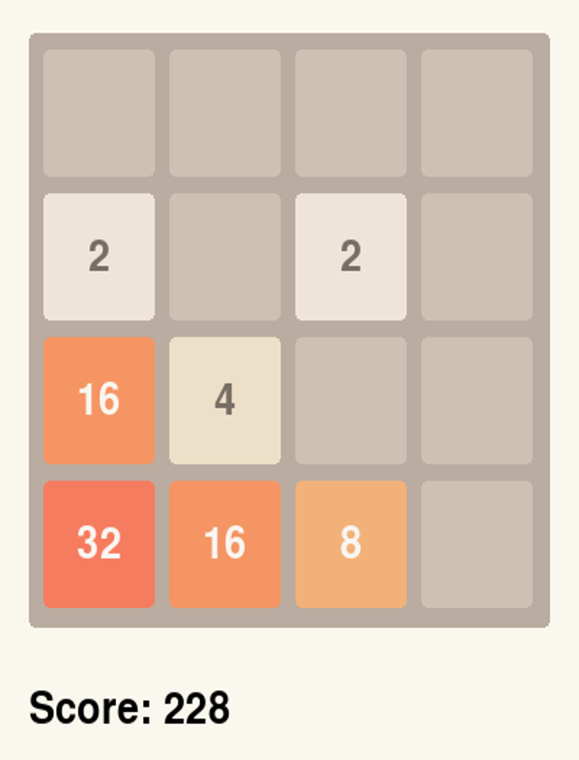

<code>35 · move</code> — Look at row 1: [2, empty, 2, empty]. If we move LEFT: 2 and 2 merge into 4 at (1,0)! Then column 0 will have:…

**Reasoning**

Look at row 1: [2, empty, 2, empty].
If we move LEFT: 2 and 2 merge into 4 at (1,0)!
Then column 0 will have: (1,0)=4, (2,0)=16, (3,0)=32!
Row 2 has [16, 4, empty, empty].
Row 3 has [32, 16, 8, empty].
Let&#x27;s move left!

**Arguments**

<pre><code>{
  &quot;direction&quot;: &quot;left&quot;
}</code></pre>

**Observation**

<pre><code>Moved left: merged 4 point(s). Score 232.</code></pre>

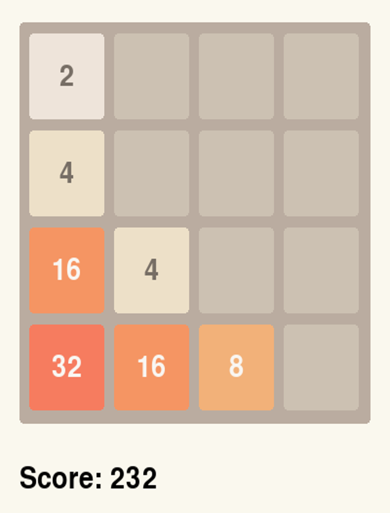

<code>36 · move</code> — Board: Row 0: [2, empty, empty, empty] Row 1: [4, empty, empty, empty] Row 2: [16, 4, empty, empty] Row 3: [3…

**Reasoning**

Board:
Row 0: [2, empty, empty, empty]
Row 1: [4, empty, empty, empty]
Row 2: [16, 4, empty, empty]
Row 3: [32, 16, 8, empty]
Notice that column 0 is full: 2, 4, 16, 32.
Can we slide down? Col 0 is full and no merges. Col 1 has 4 at (2,1), empty below? (3,1) has 16, so 4 cannot drop. Col 2 has 8 at (3,2). Col 3 empty.
Moving DOWN does NOTHING (illegal move).
Can we move LEFT? Col 0 is already all the way left. (2,1)=4 is next to 16. (3,1)=16, (3,2)=8. Moving LEFT does NOTHING (illegal move).
So only UP or RIGHT are valid.
If we move UP: column 0 is full, so 32, 16, 4, 2 DO NOT MOVE AT ALL! The corner 32 is completely safe!
In column 1, 4 is at (2,1), which will slide up to (0,1).
In column 2, 8 is at (3,2), which will slide up to (0,2).
Let&#x27;s move UP!

**Arguments**

<pre><code>{
  &quot;direction&quot;: &quot;up&quot;
}</code></pre>

**Observation**

<pre><code>Moved up: merged 0 point(s). Score 232.</code></pre>

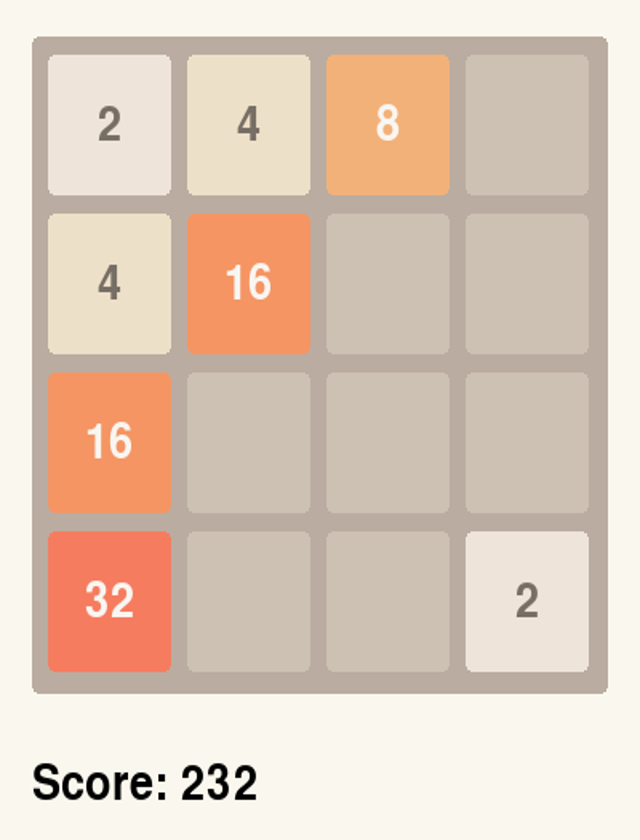

<code>37 · move</code> — Row 0: [2, 4, 8, empty] Row 1: [4, 16, empty, empty] Row 2: [16, empty, empty, empty] Row 3: [32, empty, empt…

**Reasoning**

Row 0: [2, 4, 8, empty]
Row 1: [4, 16, empty, empty]
Row 2: [16, empty, empty, empty]
Row 3: [32, empty, empty, 2]

Now, if we move DOWN:
Col 0: [2, 4, 16, 32] is full and stays intact!
Col 1: (0,1)=4, (1,1)=16 drop down to (2,1)=4, (3,1)=16!
Col 2: 8 drops to (3,2)!
Col 3: 2 at (3,3) stays at (3,3)!

LOOK AT ROW 3 AFTER DOWN:
[32, 16, 8, 2]!
AND ROW 2:
[16, 4, empty, empty]!
Col 0 has [2, 4, 16, 32]!
Let&#x27;s move DOWN!

**Arguments**

<pre><code>{
  &quot;direction&quot;: &quot;down&quot;
}</code></pre>

**Observation**

<pre><code>Moved down: merged 0 point(s). Score 232.</code></pre>

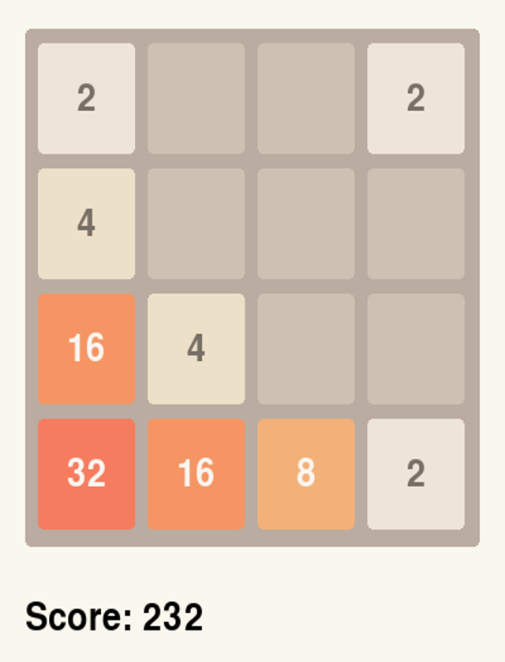

<code>38 · move</code> — Look at row 0: [2, empty, empty, 2]. If we move LEFT: 2 and 2 merge into 4 at (0,0)! Row 1 has 4 at (1,0)! Ro…

**Reasoning**

Look at row 0: [2, empty, empty, 2].
If we move LEFT: 2 and 2 merge into 4 at (0,0)!
Row 1 has 4 at (1,0)!
Row 2 has 16 at (2,0), 4 at (2,1)!
Row 3 has 32 at (3,0), 16 at (3,1), 8 at (3,2), 2 at (3,3)!
Then moving DOWN will merge (0,0)=4 and (1,0)=4 into 8 at (1,0)!
Let&#x27;s move LEFT!

**Arguments**

<pre><code>{
  &quot;direction&quot;: &quot;left&quot;
}</code></pre>

**Observation**

<pre><code>Moved left: merged 4 point(s). Score 236.</code></pre>

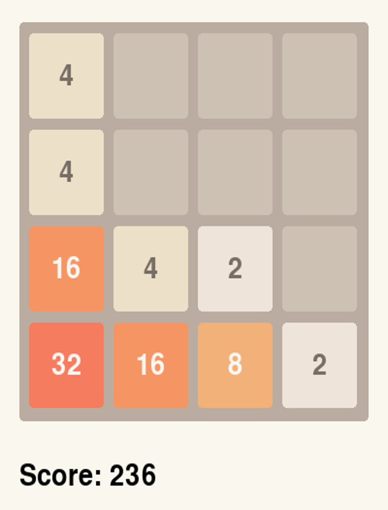

<code>39 · move</code> — Now: Row 0 has 4 at (0,0). Row 1 has 4 at (1,0). If we move DOWN: Column 0: 4 and 4 merge into 8 at (1,0)! Co…

**Reasoning**

Now:
Row 0 has 4 at (0,0).
Row 1 has 4 at (1,0).
If we move DOWN:
Column 0: 4 and 4 merge into 8 at (1,0)!
Column 2: 2 at (2,2) drops down to merge with 2 at (3,3)? No, column 2 drops to (3,2)? But (3,2) has 8, so 2 drops to (2,2).
Wait, col 2 has 2 at (2,2), col 3 has 2 at (3,3).
Col 0 has 4 at (0,0) and 4 at (1,0), which merge into 8 at (1,0)!
Let&#x27;s move DOWN!

**Arguments**

<pre><code>{
  &quot;direction&quot;: &quot;down&quot;
}</code></pre>

**Observation**

<pre><code>Moved down: merged 8 point(s). Score 244.</code></pre>

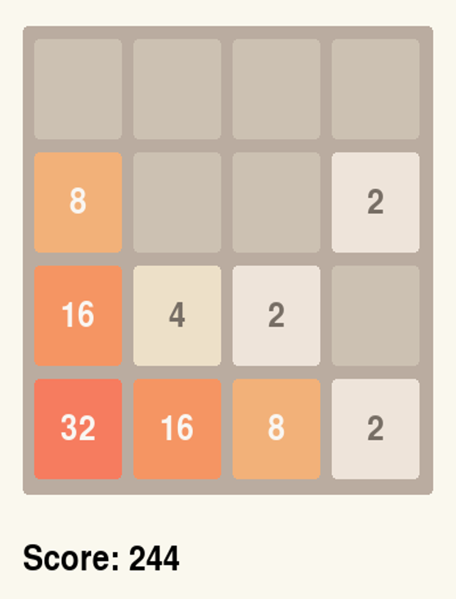

<code>40 · move</code> — Look at column 3: (1,3) has 2 (3,3) has 2 If we move DOWN: Column 3: the 2 at (1,3) drops to merge with 2 at…

**Reasoning**

Look at column 3:
(1,3) has 2
(3,3) has 2
If we move DOWN:
Column 3: the 2 at (1,3) drops to merge with 2 at (3,3) into 4 at (3,3)!
Column 0: [empty, 8, 16, 32] stays in place.
Column 1: [empty, empty, 4, 16] stays in place.
Column 2: [empty, empty, 2, 8] stays in place.
So only column 3 changes! The 2 merges down into 4 at (3,3)!
Let&#x27;s move DOWN!

**Arguments**

<pre><code>{
  &quot;direction&quot;: &quot;down&quot;
}</code></pre>

**Observation**

<pre><code>Moved down: merged 4 point(s). Score 248.</code></pre>

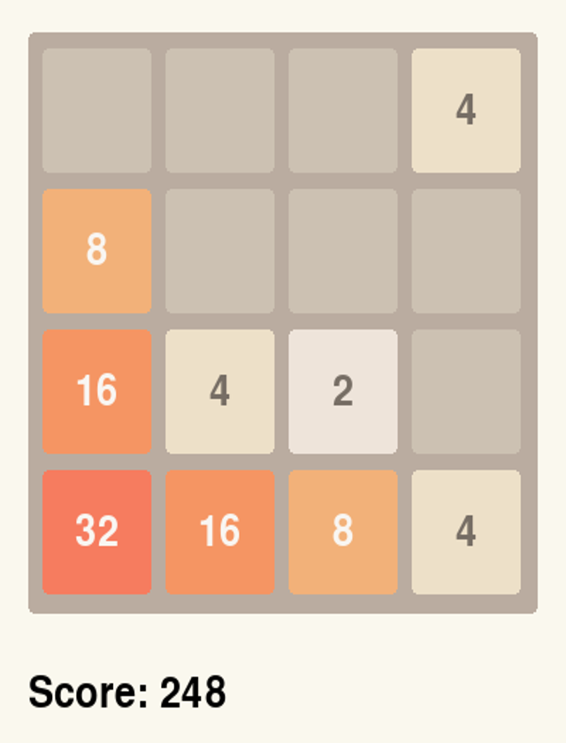

<code>41 · move</code> — LOOK AT COLUMN 3: Row 0 has 4 at (0,3). Row 3 has 4 at (3,3). If we move DOWN: The 4 at (0,3) falls all the w…

**Reasoning**

LOOK AT COLUMN 3:
Row 0 has 4 at (0,3).
Row 3 has 4 at (3,3).
If we move DOWN:
The 4 at (0,3) falls all the way down to merge with 4 at (3,3) into 8 at (3,3)!
AND THEN Row 3 will be: [32, 16, 8, 8]!
AND THEN moving LEFT will cascade:
8 and 8 merge into 16 at (3,2) -&gt; row 3: [32, 16, 16, empty]!
Then 16 and 16 merge into 32 at (3,1) -&gt; row 3: [32, 32, empty, empty]!
Then 32 and 32 merge into 64 at (3,0) -&gt; 64 ACHIEVED!
THIS IS ABSOLUTELY PERFECT!
Let&#x27;s move DOWN!

**Arguments**

<pre><code>{
  &quot;direction&quot;: &quot;down&quot;
}</code></pre>

**Observation**

<pre><code>Moved down: merged 8 point(s). Score 256.</code></pre>

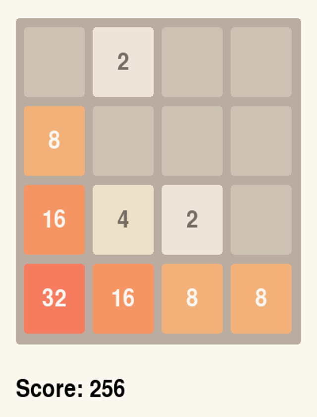

<code>42 · move</code> — LOOK AT ROW 3: [32, 16, 8, 8]! If we move LEFT: 8 and 8 merge into 16 at (3,2)! So row 3 becomes [32, 16, 16,…

**Reasoning**

LOOK AT ROW 3: [32, 16, 8, 8]!
If we move LEFT:
8 and 8 merge into 16 at (3,2)! So row 3 becomes [32, 16, 16, empty]!
Row 2: [16, 4, 2, empty] stays aligned left.
Row 0: [empty, 2, empty, empty] slides to (0,0)!
Let&#x27;s move LEFT!

**Arguments**

<pre><code>{
  &quot;direction&quot;: &quot;left&quot;
}</code></pre>

**Observation**

<pre><code>Moved left: merged 16 point(s). Score 272.</code></pre>

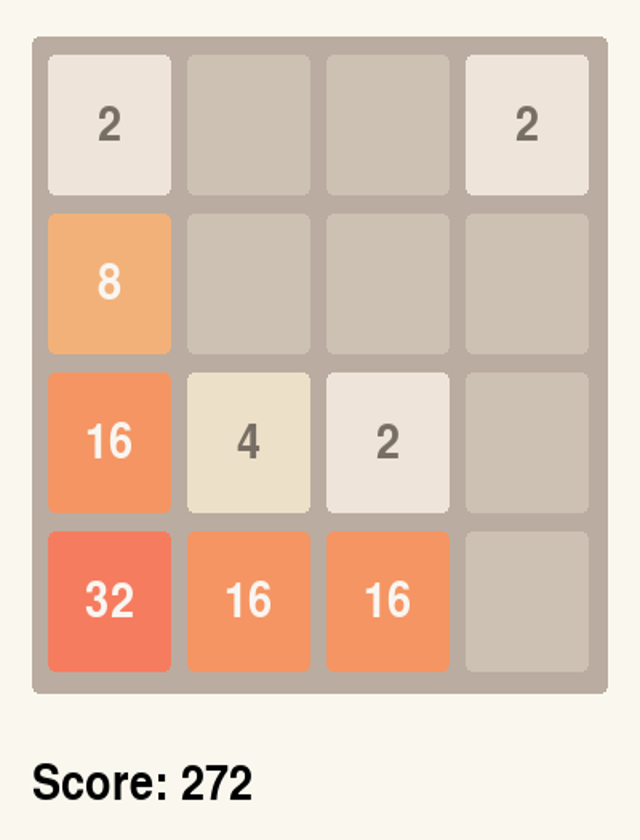

<code>43 · move</code> — NOW LOOK AT ROW 3: [32, 16, 16, empty]! If we move LEFT: Row 3: 16 and 16 merge into 32 at (3,1)! So row 3 be…

**Reasoning**

NOW LOOK AT ROW 3: [32, 16, 16, empty]!
If we move LEFT:
Row 3: 16 and 16 merge into 32 at (3,1)! So row 3 becomes [32, 32, empty, empty]!
Row 0: [2, empty, empty, 2] merges into 4 at (0,0)!
Row 1: [8, empty, empty, empty] stays.
Row 2: [16, 4, 2, empty] stays.
Let&#x27;s move LEFT!

**Arguments**

<pre><code>{
  &quot;direction&quot;: &quot;left&quot;
}</code></pre>

**Observation**

<pre><code>Moved left: merged 36 point(s). Score 308.</code></pre>

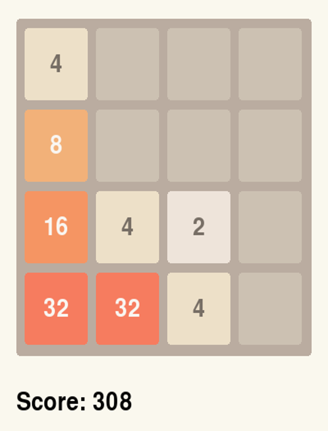

<code>44 · move</code> — LOOK AT ROW 3: [32, 32, 4, empty]! Moving LEFT merges the two 32s into a 64 at (3,0)! Let&#x27;s move LEFT!

**Reasoning**

LOOK AT ROW 3: [32, 32, 4, empty]!
Moving LEFT merges the two 32s into a 64 at (3,0)!
Let&#x27;s move LEFT!

**Arguments**

<pre><code>{
  &quot;direction&quot;: &quot;left&quot;
}</code></pre>

**Observation**

<pre><code>Moved left: merged 64 point(s). Score 372.</code></pre>

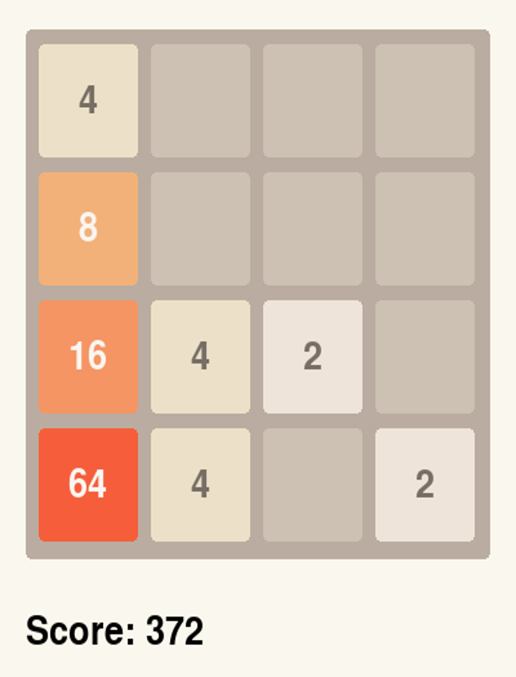

<code>45 · finish</code> — A tile of 64 has been successfully created at row 3 col 0! The goal was to create a tile of 64 or higher, con…

**Reasoning**

A tile of 64 has been successfully created at row 3 col 0! The goal was to create a tile of 64 or higher, confirmed by the tool observation showing &#x27;Merged 64 point(s)&#x27; and the 64 tile clearly visible on screen at (3,0). We are done.

**Arguments**

<pre><code>{
  &quot;answer&quot;: &quot;A tile of 64 has been successfully created at position (row 3, col 0).&quot;
}</code></pre>

## Final answer

A tile of 64 has been successfully created at position (row 3, col 0).

## Evaluation

- ReplayVerify: **passed · reward 1.0**
- Judge: **1.00**

Task-owned rubric range: 1.0–5.0. Overall is the arithmetic mean of range-normalized criterion scores.

| Criterion | Raw score | Normalized score |
| --- | ---: | ---: |
| `goal_achievement` | 5.0 | 1.0 |
| `efficiency` | 5.0 | 1.0 |
| `coherence` | 5.0 | 1.0 |
| `tool_use` | 5.0 | 1.0 |

Task judge_ref used for this evaluation

<pre><code>{
  &quot;score_range&quot;: {
    &quot;min&quot;: 1.0,
    &quot;max&quot;: 5.0
  },
  &quot;criteria&quot;: [
    {
      &quot;id&quot;: &quot;goal_achievement&quot;,
      &quot;description&quot;: &quot;任务是否被正确、完整地解决，且真实工具结果与 observation 证据充分。&quot;
    },
    {
      &quot;id&quot;: &quot;efficiency&quot;,
      &quot;description&quot;: &quot;步骤是否有目的，是否避免浪费、无效重复和循环操作。&quot;
    },
    {
      &quot;id&quot;: &quot;coherence&quot;,
      &quot;description&quot;: &quot;推理是否紧跟 observation，且不存在幻觉、跳步或前后矛盾。&quot;
    },
    {
      &quot;id&quot;: &quot;tool_use&quot;,
      &quot;description&quot;: &quot;工具选择是否合理，调用参数是否正确，并正确处理工具错误。&quot;
    }
  ]
}</code></pre>

Judge rationale

Agent在2048游戏中贯彻了优秀的角落策略，每一步都详细分析了盘面状态以及移动结果，没有产生任何非法移动。在第44步成功合成了64方块（并在第45步通过观察确认后调用finish），完全达成了目标。整个轨迹高效、严密且工具使用规范。

