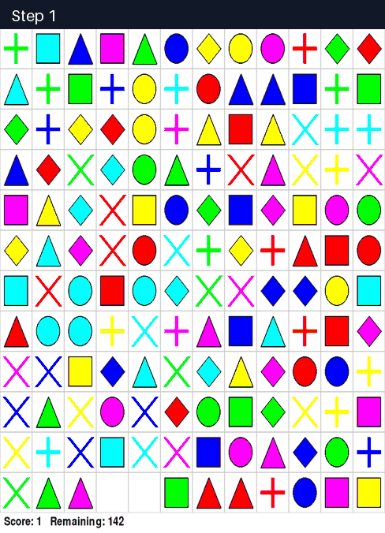
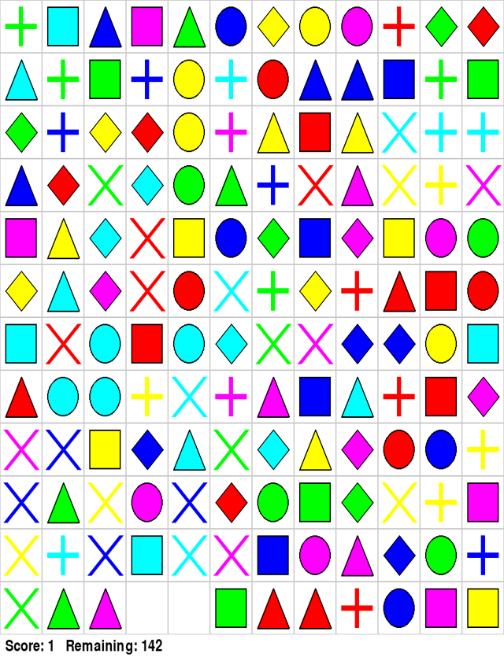
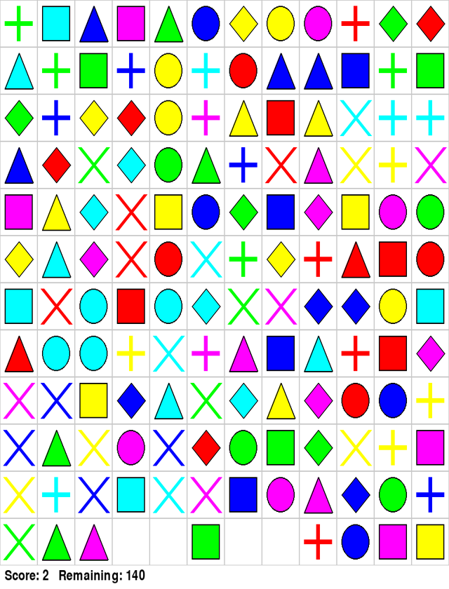
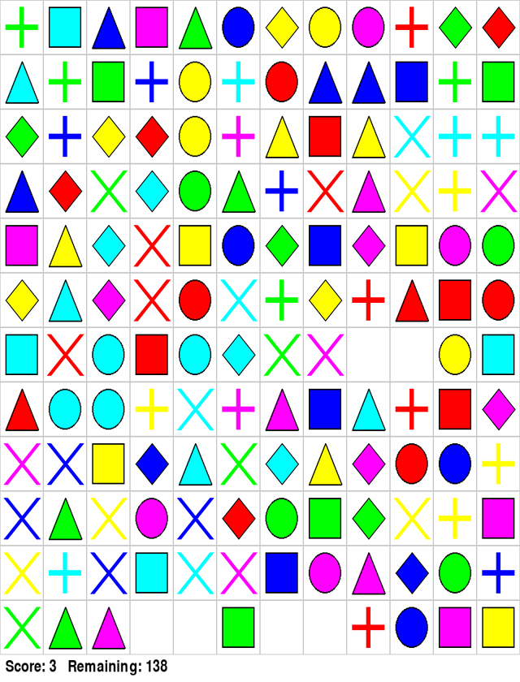
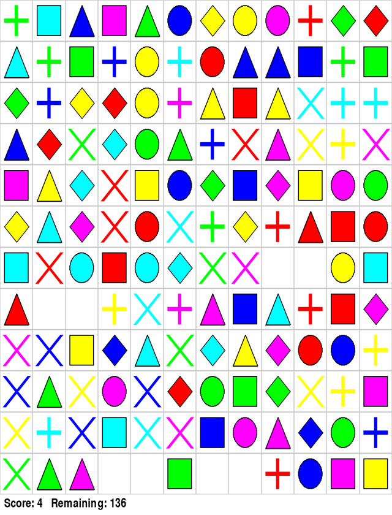
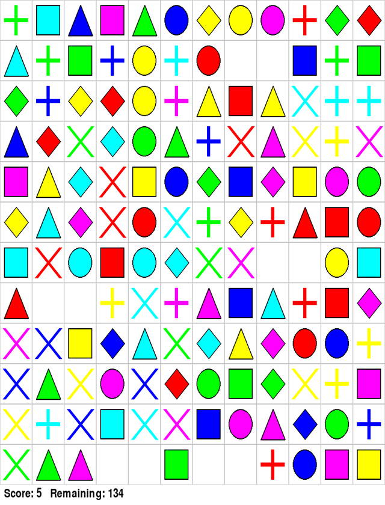
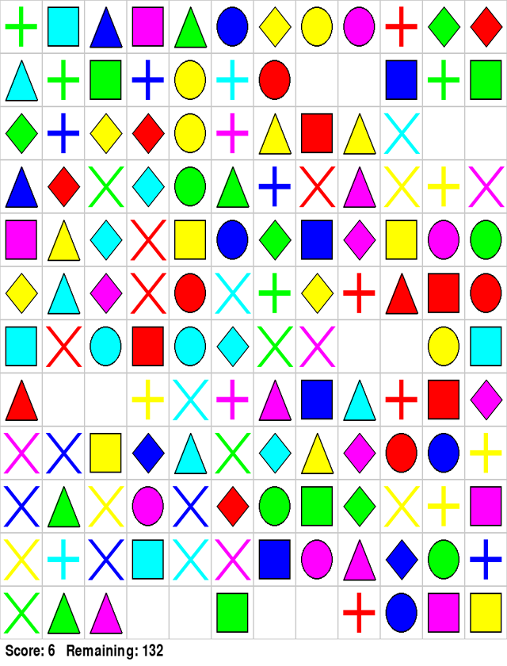
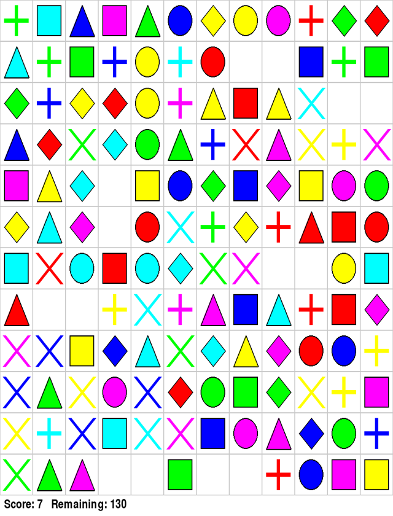
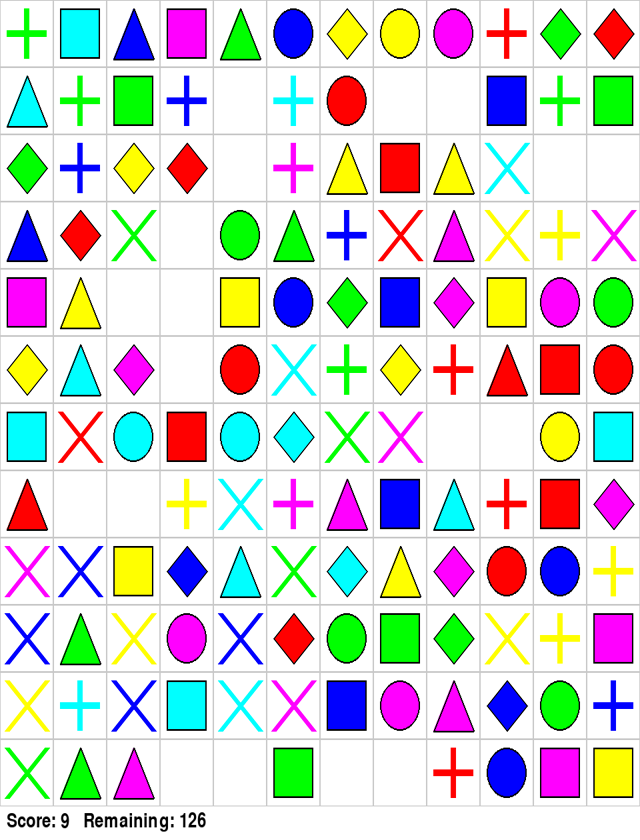
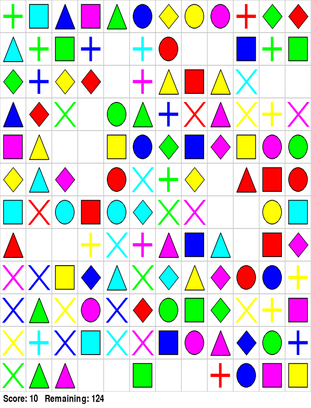

# Shisen-Sho path planning on a 12x12 board (G1 VLM-Gym)

[← All showcases](README.md)

> **Complete trajectory imagery:** the animation is a compressed overview of every rendered observation. Every original image is also preserved inside its corresponding tool-call section.

On G1's full 12x12 board of 36 color-shape tile types, the agent finds pairs joined by paths with at most two turns, including routes through the empty margin, and removes ten pairs before no connectable pair remains.

| Env | Task | Branch | Steps | ReplayVerify | Judge |
| --- | --- | --- | ---: | --- | ---: |
| `vlmgym_shisensho` | `task0003` | initial | 10 | passed · reward 1.0 | 1.00 |

## Task

> You are playing a 'Shisen-sho' puzzle game.
> The goal is to match pairs of identical tiles by connecting them with a path that has at most 2 turns and doesn't cross any other tiles.
> The tiles are distinguished by their color and shape:
> - Red, Green, Blue, Yellow, Magenta, Cyan
> - Shapes include: circle, square, triangle, diamond, cross, star
> Analyze the game board and identify two matching tiles that can be connected according to these rules, then call the match tool with (row1, col1) and (row2, col2), where row and col are 0-indexed numbers starting from the top-left of the board.
> Before each action, briefly describe the relevant part of the board and your reasoning.
>
> Goal: remove at least 10 pairs of tiles (score 10 or higher) from the 12x12 board. Call finish only after the tool results confirm the goal.

[Open compact trajectory JSON](trajectories/vlmgym_shisensho.json).

## Visual checkpoints

 Full trajectory — every rendered observation in chronological order

## Trajectory

Action mix: `match` × 10.

<code>01 · match</code> — Row 11, column 3 and column 4 are both Magenta plus (+) tiles directly adjacent to each other. They can be co…

**Reasoning**

Row 11, column 3 and column 4 are both Magenta plus (+) tiles directly adjacent to each other. They can be connected with a straight line (0 turns).

**Arguments**

<pre><code>{
  &quot;row1&quot;: 11,
  &quot;col1&quot;: 3,
  &quot;row2&quot;: 11,
  &quot;col2&quot;: 4
}</code></pre>

**Observation**

<pre><code>Matched (11, 3) and (11, 4). Reward +1. Score 1, remaining tiles 142.</code></pre>

<code>02 · match</code> — Row 11 has adjacent Red triangles at col 6 and col 7. Wait, col 5 is Green square, col 6 is Red triangle, col…

**Reasoning**

Row 11 has adjacent Red triangles at col 6 and col 7. Wait, col 5 is Green square, col 6 is Red triangle, col 7 is Red triangle. Col 6 and 7 are directly adjacent!

**Arguments**

<pre><code>{
  &quot;row1&quot;: 11,
  &quot;col1&quot;: 6,
  &quot;row2&quot;: 11,
  &quot;col2&quot;: 7
}</code></pre>

**Observation**

<pre><code>Matched (11, 6) and (11, 7). Reward +1. Score 2, remaining tiles 140.</code></pre>

<code>03 · match</code> — Row 6 has two blue diamonds adjacent? Let&#x27;s check row 6: (6,7) magenta cross, (6,8) blue diamond, (6,9) blue…

**Reasoning**

Row 6 has two blue diamonds adjacent? Let&#x27;s check row 6: (6,7) magenta cross, (6,8) blue diamond, (6,9) blue diamond. Yes! (6,8) and (6,9) are adjacent blue diamonds! Wait, let&#x27;s count row 6: 0 is cyan square, 1 is red cross, 2 is cyan circle, 3 is red square, 4 is cyan oval/circle, 5 is cyan diamond, 6 is green cross, 7 is magenta cross, 8 is blue diamond, 9 is blue diamond. They are directly adjacent.

**Arguments**

<pre><code>{
  &quot;row1&quot;: 6,
  &quot;col1&quot;: 8,
  &quot;row2&quot;: 6,
  &quot;col2&quot;: 9
}</code></pre>

**Observation**

<pre><code>Matched (6, 8) and (6, 9). Reward +1. Score 3, remaining tiles 138.</code></pre>

<code>04 · match</code> — Let&#x27;s check Row 7, cols 1 and 2: both are cyan circles! Let&#x27;s verify: row 7 col 0 is Red triangle, col 1 is c…

**Reasoning**

Let&#x27;s check Row 7, cols 1 and 2: both are cyan circles! Let&#x27;s verify: row 7 col 0 is Red triangle, col 1 is cyan circle, col 2 is cyan circle. They are adjacent.

**Arguments**

<pre><code>{
  &quot;row1&quot;: 7,
  &quot;col1&quot;: 1,
  &quot;row2&quot;: 7,
  &quot;col2&quot;: 2
}</code></pre>

**Observation**

<pre><code>Matched (7, 1) and (7, 2). Reward +1. Score 4, remaining tiles 136.</code></pre>

<code>05 · match</code> — Let&#x27;s check Row 1, cols 7 and 8: both are Blue triangles! Let&#x27;s check: (1, 7) blue triangle, (1, 8) blue tria…

**Reasoning**

Let&#x27;s check Row 1, cols 7 and 8: both are Blue triangles! Let&#x27;s check: (1, 7) blue triangle, (1, 8) blue triangle. Adjacent!

**Arguments**

<pre><code>{
  &quot;row1&quot;: 1,
  &quot;col1&quot;: 7,
  &quot;row2&quot;: 1,
  &quot;col2&quot;: 8
}</code></pre>

**Observation**

<pre><code>Matched (1, 7) and (1, 8). Reward +1. Score 5, remaining tiles 134.</code></pre>

<code>06 · match</code> — Row 2, cols 10 and 11: cyan plus (+) at (2,10) and (2,11). Let&#x27;s check: (2, 9) cyan cross, (2, 10) cyan plus,…

**Reasoning**

Row 2, cols 10 and 11: cyan plus (+) at (2,10) and (2,11). Let&#x27;s check: (2, 9) cyan cross, (2, 10) cyan plus, (2, 11) cyan plus. Yes, adjacent!

**Arguments**

<pre><code>{
  &quot;row1&quot;: 2,
  &quot;col1&quot;: 10,
  &quot;row2&quot;: 2,
  &quot;col2&quot;: 11
}</code></pre>

**Observation**

<pre><code>Matched (2, 10) and (2, 11). Reward +1. Score 6, remaining tiles 132.</code></pre>

<code>07 · match</code> — Look at (1, 11) green square and (1, 2) green square? No, what&#x27;s adjacent or easily connectable? Wait, look a…

**Reasoning**

Look at (1, 11) green square and (1, 2) green square? No, what&#x27;s adjacent or easily connectable?
Wait, look at row 0: (0, 11) red diamond.
Look at row 1: (1, 10) green plus, (1, 11) green square.
Look at row 0, col 10: green diamond.
Wait, let&#x27;s look for adjacent pairs first!
In row 4:
(4, 9) yellow square, (4, 10) magenta circle, (4, 11) green circle.
In row 10:
(10, 0) yellow cross, (10, 1) cyan plus, (10, 2) blue cross, (10, 3) cyan square, (10, 4) cyan cross, (10, 5) magenta cross, (10, 6) blue square, (10, 7) magenta circle, (10, 8) magenta triangle, (10, 9) blue diamond, (10, 10) green circle, (10, 11) blue plus.
In row 9:
(9, 0) blue cross, (9, 1) green triangle, (9, 2) yellow cross, (9, 3) magenta circle, (9, 4) blue cross, (9, 5) red diamond, (9, 6) green circle, (9, 7) green square, (9, 8) green diamond, (9, 9) yellow cross, (9, 10) yellow plus, (9, 11) magenta square.
Wait, look at (0, 0) green plus and (1, 1) green plus? No, they aren&#x27;t adjacent.
Look at (1, 1) green plus and (1, 10) green plus?
Wait, what about outer border matches?
Outer border tiles can connect along the outside margin (which is empty)!
Can any two identical tiles on the same outer edge connect with 1 turn or 0 turns outside?
Wait! A path can run through the empty margin just outside the board!
So any two identical tiles on the top edge (row 0) can connect via row -1 (outside)!
Wait, can they? Let&#x27;s check row 0:
(0, 0): green plus
(0, 1): cyan square
(0, 2): blue triangle
(0, 3): magenta square
(0, 4): green triangle
(0, 5): blue circle
(0, 6): yellow diamond
(0, 7): yellow circle
(0, 8): magenta circle
(0, 9): red plus
(0, 10): green diamond
(0, 11): red diamond
Are any two on row 0 identical? No, all 12 are distinct.
What about left edge (col 0)?
(0, 0): green plus
(1, 0): cyan triangle
(2, 0): green diamond
(3, 0): blue triangle
(4, 0): magenta square
(5, 0): yellow diamond
(6, 0): cyan square
(7, 0): red triangle
(8, 0): magenta cross
(9, 0): blue cross
(10, 0): yellow cross
(11, 0): green cross
All distinct.
What about right edge (col 11)?
(0, 11): red diamond
(1, 11): green square
(2, 11): empty!
(3, 11): magenta cross
(4, 11): green circle
(5, 11): red circle
(6, 11): cyan square
(7, 11): magenta diamond
(8, 11): yellow plus
(9, 11): magenta square
(10, 11): blue plus
(11, 11): yellow square
All distinct.
What about bottom edge (row 11)?
(11, 0): green cross
(11, 1): green triangle
(11, 2): magenta triangle
(11, 3): empty
(11, 4): empty
(11, 5): green square
(11, 6): empty
(11, 7): empty
(11, 8): red plus
(11, 9): blue circle
(11, 10): magenta square
(11, 11): yellow square
All distinct.

Wait! What about corners or adjacent edges connecting via outside?
For example, (0, 0) is green plus, and (1, 10) is green plus? (1, 10) is not on the edge.
Wait! Look at (0, 1) cyan square and (6, 0) cyan square!
Can (0, 1) connect to (6, 0)?
From (0, 1): up to row -1, left to col -1, down to row 6, right to (6, 0)?
That&#x27;s: up (1 turn to left), left (1 turn to down), down (1 turn to right) -&gt; that is 3 turns! At most 2 turns allowed!
Wait, 2 turns means path has at most 3 segments (e.g. L-shape or U-shape or Z-shape).
Outside path connecting two different sides (e.g. top edge and left edge):
From (0, 1), go up to (-1, 1), turn left to (-1, -1), turn down to (6, -1), turn right to (6, 0) -&gt; 3 turns.
Wait, what if from (0, 1), go up to (-1, 1), turn left to (-1, 0), down to (0, 0)? That&#x27;s blocked by (0,0).
Wait, what about two tiles on the SAME edge?
From (0, a) up to (-1, a), right to (-1, b), down to (0, b): that is 2 turns! A U-shape!
So any two identical tiles on the same edge can connect with 2 turns!
Wait, is there any identical pair on the same edge? Let&#x27;s check:
Are there identical tiles on row 0? No.
Row 11? No.
Col 0? No.
Col 11? No.

Let&#x27;s search for adjacent identical tiles on the board:
Look at the board carefully row by row, column by column:
Row 0:
(0,0) G+, (0,1) Csq, (0,2) Btri, (0,3) Msq, (0,4) Gtri, (0,5) Bcir, (0,6) Ydia, (0,7) Ycir, (0,8) Mcir, (0,9) R+, (0,10) Gdia, (0,11) Rdia

Row 1:
(1,0) Ctri, (1,1) G+, (1,2) Gsq, (1,3) B+, (1,4) Ycir, (1,5) C+, (1,6) Rcir, (1,7) empty, (1,8) empty, (1,9) Bsq, (1,10) G+, (1,11) Gsq

Row 2:
(2,0) Gdia, (2,1) B+, (2,2) Ydia, (2,3) Rdia, (2,4) Ycir, (2,5) M+, (2,6) Ytri, (2,7) Rsq, (2,8) Ytri, (2,9) Cx, (2,10) empty, (2,11) empty
Notice (2,6) and (2,8) are both Yellow triangles! Between them is (2,7) Red square. Can they connect? Not horizontally.

Row 3:
(3,0) Btri, (3,1) Rdia, (3,2) Gx, (3,3) Cdia, (3,4) Gcir, (3,5) Gtri, (3,6) B+, (3,7) Rx, (3,8) Mtri, (3,9) Yx, (3,10) Y+, (3,11) Mx

Row 4:
(4,0) Msq, (4,1) Ytri, (4,2) Cdia, (4,3) Rx, (4,4) Ysq, (4,5) Bcir, (4,6) Gdia, (4,7) Bsq, (4,8) Mdia, (4,9) Ysq, (4,10) Mcir, (4,11) Gcir

Row 5:
(5,0) Ydia, (5,1) Ctri, (5,2) Mdia, (5,3) Rx, (5,4) Rcir, (5,5) Cx, (5,6) G+, (5,7) Ydia, (5,8) R+, (5,9) Rtri, (5,10) Rsq, (5,11) Rcir

Row 6:
(6,0) Csq, (6,1) Rx, (6,2) C-oval/cir, (6,3) Rsq, (6,4) Ccir, (6,5) Cdia, (6,6) Gx, (6,7) Mx, (6,8) empty, (6,9) empty, (6,10) Ycir, (6,11) Csq
Wait! Look at (6,10) and (6,11): (6,11) is cyan square! (6,0) is also cyan square! Can (6,0) and (6,11) connect?
Wait, what about (6,11) cyan square? Col 11 has (2,11) empty, but not all empty.
Wait, look at row 6: (6,8) and (6,9) are empty!

Row 7:
(7,0) Rtri, (7,1) empty, (7,2) empty, (7,3) Y+, (7,4) Cx, (7,5) M+, (7,6) Mtri, (7,7) Bsq, (7,8) Ctri, (7,9) R+, (7,10) Rsq, (7,11) Mdia
Wait, look at (7,1) and (7,2) which are empty!
Can (7,0) red triangle connect to something?
Where are other red triangles? (5,9) Rtri, (11,6) was Rtri (now empty).

Row 8:
(8,0) Mx, (8,1) Bx, (8,2) Ysq, (8,3) Bdia, (8,4) Ctri, (8,5) Gx, (8,6) Cdia, (8,7) Ytri, (8,8) Mdia, (8,9) Rcir, (8,10) Bcir, (8,11) Y+

Row 9:
(9,0) Bx, (9,1) Gtri, (9,2) Yx, (9,3) Mcir, (9,4) Bx, (9,5) Rdia, (9,6) Gcir, (9,7) Gsq, (9,8) Gdia, (9,9) Yx, (9,10) Y+, (9,11) Msq

Row 10:
(10,0) Yx, (10,1) C+, (10,2) Bx, (10,3) Csq, (10,4) Cx, (10,5) Mx, (10,6) Bsq, (10,7) Mcir, (10,8) Mtri, (10,9) Bdia, (10,10) Gcir, (10,11) B+

Row 11:
(11,0) Gx, (11,1) Gtri, (11,2) Mtri, (11,3) empty, (11,4) empty, (11,5) Gsq, (11,6) empty, (11,7) empty, (11,8) R+, (11,9) Bcir, (11,10) Msq, (11,11) Ysq

Wait! Check vertical adjacent pairs!
Let&#x27;s check every column for vertically adjacent identical tiles!
Col 0:
(0,0) G+, (1,0) Ctri, (2,0) Gdia, (3,0) Btri, (4,0) Msq, (5,0) Ydia, (6,0) Csq, (7,0) Rtri, (8,0) Mx, (9,0) Bx, (10,0) Yx, (11,0) Gx. None.

Col 1:
(0,1) Csq, (1,1) G+, (2,1) B+, (3,1) Rdia, (4,1) Ytri, (5,1) Ctri, (6,1) Rx, (7,1) empty, (8,1) Bx, (9,1) Gtri, (10,1) C+, (11,1) Gtri.
Wait! Look at (9,1) green triangle and (11,1) green triangle! Between them is (10,1) C+.

Col 2:
(0,2) Btri, (1,2) Gsq, (2,2) Ydia, (3,2) Gx, (4,2) Cdia, (5,2) Mdia, (6,2) Ccir, (7,2) empty, (8,2) Ysq, (9,2) Yx, (10,2) Bx, (11,2) Mtri. None.

Col 3:
(0,3) Msq, (1,3) B+, (2,3) Rdia, (3,3) Cdia, (4,3) Rx, (5,3) Rx... WAIT! (4,3) and (5,3) are both RED CROSS (Rx)!
Look at row 4 col 3 and row 5 col 3: BOTH RED CROSS (X)! Adjacent vertically!!
Let&#x27;s verify:
Row 3 col 7 is Rx, row 4 col 3 is red cross, row 5 col 3 is red cross, row 6 col 1 is red cross.
Yes! (4,3) and (5,3) are adjacent red crosses!

**Arguments**

<pre><code>{
  &quot;row1&quot;: 4,
  &quot;col1&quot;: 3,
  &quot;row2&quot;: 5,
  &quot;col2&quot;: 3
}</code></pre>

**Observation**

<pre><code>Matched (4, 3) and (5, 3). Reward +1. Score 7, remaining tiles 130.</code></pre>

<code>08 · match</code> — Now let&#x27;s check other columns for adjacent identical pairs! Col 4: (0,4) Gtri, (1,4) Ycir, (2,4) Ycir -&gt; WAIT…

**Reasoning**

Now let&#x27;s check other columns for adjacent identical pairs!
Col 4:
(0,4) Gtri, (1,4) Ycir, (2,4) Ycir -&gt; WAIT! (1,4) and (2,4) are BOTH YELLOW CIRCLES!
Let&#x27;s check row 1 col 4: yellow circle.
Row 2 col 4: yellow circle!
They are adjacent vertically in col 4!!

**Arguments**

<pre><code>{
  &quot;row1&quot;: 1,
  &quot;col1&quot;: 4,
  &quot;row2&quot;: 2,
  &quot;col2&quot;: 4
}</code></pre>

**Observation**

<pre><code>Matched (1, 4) and (2, 4). Reward +1. Score 8, remaining tiles 128.</code></pre>

<code>09 · match</code> — Let&#x27;s continue checking other columns for adjacent identical tiles! Col 4: (0,4) Gtri, (1,4) empty, (2,4) emp…

**Reasoning**

Let&#x27;s continue checking other columns for adjacent identical tiles!
Col 4:
(0,4) Gtri, (1,4) empty, (2,4) empty, (3,4) Gcir, (4,4) Ysq, (5,4) Rcir, (6,4) Ccir, (7,4) Cx, (8,4) Ctri, (9,4) Bx, (10,4) Cx, (11,4) empty.
Wait, look at (7,4) Cx and (10,4) Cx? In between are Ctri, Bx.

Col 5:
(0,5) Bcir, (1,5) C+, (2,5) M+, (3,5) Gtri, (4,5) Bcir, (5,5) Cx, (6,5) Cdia, (7,5) M+, (8,5) Gx, (9,5) Rdia, (10,5) Mx, (11,5) Gsq.

Col 6:
(0,6) Ydia, (1,6) Rcir, (2,6) Ytri, (3,6) B+, (4,6) Gdia, (5,6) G+, (6,6) Gx, (7,6) Mtri, (8,6) Cdia, (9,6) Gcir, (10,6) Bsq, (11,6) empty.

Col 7:
(0,7) Ycir, (1,7) empty, (2,7) Rsq, (3,7) Rx, (4,7) Bsq, (5,7) Ydia, (6,7) Mx, (7,7) Bsq, (8,7) Ytri, (9,7) Gsq, (10,7) Mcir, (11,7) empty.

Col 8:
(0,8) Mcir, (1,8) empty, (2,8) Ytri, (3,8) Mtri, (4,8) Mdia, (5,8) R+, (6,8) empty, (7,8) Ctri, (8,8) Mdia, (9,8) Gdia, (10,8) Mtri, (11,8) R+.

Col 9:
(0,9) R+, (1,9) Bsq, (2,9) Cx, (3,9) Yx, (4,9) Ysq, (5,9) Rtri, (6,9) empty, (7,9) R+, (8,9) Rcir, (9,9) Yx, (10,9) Bdia, (11,9) Bcir.

Col 10:
(0,10) Gdia, (1,10) G+, (2,10) empty, (3,10) Y+, (4,10) Mcir, (5,10) Rsq, (6,10) Ycir, (7,10) Rsq, (8,10) Bcir, (9,10) Y+, (10,10) Gcir, (11,10) Msq.

Col 11:
(0,11) Rdia, (1,11) Gsq, (2,11) empty, (3,11) Mx, (4,11) Gcir, (5,11) Rcir, (6,11) Csq, (7,11) Mdia, (8,11) Y+, (9,11) Msq, (10,11) B+, (11,11) Ysq.

Wait! Let&#x27;s check row 9 and 10 or other rows again for horizontal adjacency:
Row 2: (2,6) Ytri, (2,7) Rsq, (2,8) Ytri.
Row 3: (3,0) Btri, (3,1) Rdia, (3,2) Gx, (3,3) Cdia, (3,4) Gcir, (3,5) Gtri, (3,6) B+, (3,7) Rx, (3,8) Mtri, (3,9) Yx, (3,10) Y+, (3,11) Mx.
Row 4: (4,0) Msq, (4,1) Ytri, (4,2) Cdia, (4,3) empty, (4,4) Ysq, (4,5) Bcir, (4,6) Gdia, (4,7) Bsq, (4,8) Mdia, (4,9) Ysq, (4,10) Mcir, (4,11) Gcir.
Row 5: (5,0) Ydia, (5,1) Ctri, (5,2) Mdia, (5,3) empty, (5,4) Rcir, (5,5) Cx, (5,6) G+, (5,7) Ydia, (5,8) R+, (5,9) Rtri, (5,10) Rsq, (5,11) Rcir.
Row 6: (6,0) Csq, (6,1) Rx, (6,2) Ccir, (6,3) Rsq, (6,4) Ccir, (6,5) Cdia, (6,6) Gx, (6,7) Mx, (6,8) empty, (6,9) empty, (6,10) Ycir, (6,11) Csq.
Row 7: (7,0) Rtri, (7,1) empty, (7,2) empty, (7,3) Y+, (7,4) Cx, (7,5) M+, (7,6) Mtri, (7,7) Bsq, (7,8) Ctri, (7,9) R+, (7,10) Rsq, (7,11) Mdia.
Row 8: (8,0) Mx, (8,1) Bx, (8,2) Ysq, (8,3) Bdia, (8,4) Ctri, (8,5) Gx, (8,6) Cdia, (8,7) Ytri, (8,8) Mdia, (8,9) Rcir, (8,10) Bcir, (8,11) Y+.
Row 9: (9,0) Bx, (9,1) Gtri, (9,2) Yx, (9,3) Mcir, (9,4) Bx, (9,5) Rdia, (9,6) Gcir, (9,7) Gsq, (9,8) Gdia, (9,9) Yx, (9,10) Y+, (9,11) Msq.
Row 10: (10,0) Yx, (10,1) C+, (10,2) Bx, (10,3) Csq, (10,4) Cx, (10,5) Mx, (10,6) Bsq, (10,7) Mcir, (10,8) Mtri, (10,9) Bdia, (10,10) Gcir, (10,11) B+.
Row 11: (11,0) Gx, (11,1) Gtri, (11,2) Mtri, (11,3) empty, (11,4) empty, (11,5) Gsq, (11,6) empty, (11,7) empty, (11,8) R+, (11,9) Bcir, (11,10) Msq, (11,11) Ysq.

Wait! Let&#x27;s check pairs that can connect through empty spaces!
Look at (1, 10) G+ and (0, 0) G+? No.
Wait! Look at (2, 9) Cyan cross (Cx)!
Is (2, 10) and (2, 11) empty?
Yes! (2, 10) and (2, 11) are empty!
So (2, 9) can go right to (2, 11) and then outside (to col 12)! That connects to the outside boundary!
Wait, does any other Cyan cross connect to the outside boundary?
Let&#x27;s find all Cyan crosses (Cx):
Where are Cx tiles?
1) (2, 9)
2) (5, 5)
3) (7, 4)
4) (10, 4)
None of the other Cx tiles are on the boundary or open to the boundary.

Wait, what about (1, 9) Blue square (Bsq)?
Wait, (1, 7) and (1, 8) are empty!
So (1, 6) Rcir is adjacent to empty (1, 7). But where are other Rcir?
(0, 7) is Ycir.
(5, 4) Rcir, (5, 11) Rcir, (8, 9) Rcir.
Wait! Look at (5, 11) Rcir!
(5, 11) is on the right boundary (col 11)!
Wait, (8, 9) Rcir -&gt; blocked.
What about (1, 6) Rcir? Can it reach the outside? Above it is (0, 6) Ydia.
Wait, look at (1, 6) Rcir: right of it is (1, 7) empty, (1, 8) empty. Above (1, 7) is (0, 7) Ycir. Above (1, 8) is (0, 8) Mcir. It cannot go up.

Wait! Look at (1, 11) Green square (Gsq)!
Is there another Gsq on the boundary?
Wait! What about (9, 11) Magenta square (Msq) and (4, 0) Msq?
(9, 11) is on the right boundary (col 11).
Can (9, 11) connect to (11, 10) Msq? (11, 10) is adjacent to bottom edge!
Wait! (11, 10) is on row 11! The bottom edge is row 11!
Wait, row 11 IS the boundary! Below row 11 is row 12 (the empty margin)!
So (11, 10) can go DOWN to row 12!
And (9, 11) is on col 11 (right edge)! It can go RIGHT to col 12!
Can (9, 11) and (11, 10) connect via the outside margin?
Let&#x27;s trace: from (9, 11), go right to (9, 12) [turn 1: down to (12, 12)], down to (12, 12) [turn 2: left to (12, 10)], left to (12, 10) [turn 3: up to (11, 10)] -&gt; that is 3 turns! Wait:
Start at (9, 11): move right to (9, 12). Direction: RIGHT.
Turn down to (12, 12). Direction: DOWN. (Turn 1)
Turn left to (12, 10). Direction: LEFT. (Turn 2)
Turn up to (11, 10). Direction: UP. (Turn 3)
That&#x27;s 3 turns, not allowed!

Wait, what about (11, 11) Yellow square (Ysq)?
It&#x27;s at the corner (11, 11)!
Wait, what about tiles on the SAME row or column that can connect through empty spaces?
Look at row 11: empty at (11, 3), (11, 4), (11, 6), (11, 7).
Look at column 4:
(1, 4) was Ycir, (2, 4) was Ycir -&gt; both matched!
So (1, 4) and (2, 4) are now EMPTY!
Wait! (1, 4) and (2, 4) are empty!
What is at (0, 4)? Green triangle (Gtri)!
What is at (3, 4)? Green circle (Gcir)!
Wait, what is at (1, 3)? Blue plus (B+). (1, 5) is Cyan plus (C+).
What is at (2, 3)? Red diamond (Rdia). (2, 5) is Magenta plus (M+).

Wait! Look at (4, 3) and (5, 3) which were matched! They are now EMPTY!
So (4, 3) and (5, 3) are empty!
What is at (3, 3)? Cyan diamond (Cdia)!
What is at (6, 3)? Red square (Rsq)!
Wait, what is at (4, 2)? Cyan diamond (Cdia)!
Wait, can (3, 3) Cdia connect to (4, 2) Cdia?
From (4, 2): go right to (4, 3) [empty], go up to (3, 3) [Cdia]!
WAIT! Let&#x27;s check this path:
From (4, 2) to (4, 3): 1 step right.
From (4, 3) to (3, 3): 1 step up.
Is (4, 3) empty? YES, we matched (4, 3) and (5, 3) in step 7!
Does this path have only 1 turn? YES! It goes right, then up! 1 turn!
Wait, are (4, 2) and (3, 3) identical?
Let&#x27;s look at the image for (4, 2) and (3, 3):
Row 3: (3, 0) Btri, (3, 1) Rdia, (3, 2) Gx, (3, 3) cyan diamond!
Row 4: (4, 0) Msq, (4, 1) Ytri, (4, 2) cyan diamond!
They are both CYAN DIAMONDS!!
Let&#x27;s verify:
(4, 2) is Cyan diamond.
(3, 3) is Cyan diamond.
Between them: (4, 3) was Red cross, but it was matched and is now EMPTY!
Path from (4, 2) to (3, 3):
(4, 2) -&gt; (4, 3) -&gt; (3, 3).
Turns: at (4, 3), turns from right to up. That is 1 turn! At most 2 turns: YES! Exactly 1 turn!

**Arguments**

<pre><code>{
  &quot;row1&quot;: 4,
  &quot;col1&quot;: 2,
  &quot;row2&quot;: 3,
  &quot;col2&quot;: 3
}</code></pre>

**Observation**

<pre><code>Matched (4, 2) and (3, 3). Reward +1. Score 9, remaining tiles 126.</code></pre>

<code>10 · match</code> — Score is 9! We need 1 more match to reach 10! Look at row 4 col 1: Yellow triangle! Row 2 col 6: Yellow trian…

**Reasoning**

Score is 9! We need 1 more match to reach 10!
Look at row 4 col 1: Yellow triangle!
Row 2 col 6: Yellow triangle.
Row 2 col 8: Yellow triangle.
Wait, what about (4, 1) Yellow triangle? Is there another Yellow triangle nearby?
Wait, look at row 3 col 4: Green circle (Gcir).
Row 4 col 5: Blue circle (Bcir).
Row 4 col 4: Yellow square (Ysq).
Wait, what is at (4, 9)? Yellow square!
Wait, look at row 3 col 1: Red diamond (Rdia).
Look at row 2 col 3: Red diamond (Rdia)!
Wait, can (2, 3) and (3, 1) connect? (2, 3) -&gt; (2, 4 is empty!) -&gt; (3, 4 is Gcir). No.

Wait! Look at (2, 3) Red diamond and (3, 1) Red diamond:
Is (2, 3) Rdia adjacent to anything? Above is (1, 3) B+. Left is (2, 2) Ydia. Right is (2, 4) EMPTY! Below is (3, 3) EMPTY!
WAIT! (3, 3) is now EMPTY! (We just matched it!)
Let&#x27;s check (3, 3):
(3, 3) was Cyan diamond, matched in step 9!
So (3, 3) is EMPTY!
Now look at (3, 1) Red diamond:
(3, 1) is Rdia.
(3, 2) is Green cross (Gx).
(3, 3) is EMPTY!
(2, 3) is Red diamond (Rdia)!
Can (2, 3) Rdia connect to (3, 1)? Not through (3, 2) because (3, 2) has Gx.
Wait, what about (2, 3) Rdia and (0, 11) Rdia? No.

Wait! Look at (4, 4) Yellow square (Ysq):
Above it is (3, 4) Gcir. Left is (4, 3) EMPTY. Right is (4, 5) Bcir.

Wait, look at (6, 2) Cyan circle and (6, 4) Cyan circle!
Wait, in row 6:
(6, 2) is Cyan circle.
(6, 3) is Red square.
(6, 4) is Cyan circle.
Between them is (6, 3) Red square.
Can they connect via row 7? (7, 2) is empty, but (7, 4) is Cyan cross.
Wait, can they connect via row 5?
In row 5: (5, 2) is Mdia, (5, 3) is EMPTY, (5, 4) is Rcir.

Wait! Look at (1, 6) Red circle (Rcir) and (0, 7) Yellow circle? No.
Wait, where are other Red circles (Rcir)?
(1, 6) Rcir.
(5, 4) Rcir.
(5, 11) Rcir.
(8, 9) Rcir.
Can (1, 6) Rcir connect to (5, 4) Rcir?
From (1, 6) Rcir: right is (1, 7) empty, (1, 8) empty.

Wait, look at row 1:
(1, 6) Rcir, (1, 7) empty, (1, 8) empty, (1, 9) Bsq.
Above (1, 7) is (0, 7) Ycir.
Below (1, 7) is (2, 7) Rsq.

Wait! Let&#x27;s check (7, 0) Red triangle (Rtri)!
Look at row 7 col 0: Red triangle.
Where is another Red triangle?
Row 5 col 9: Red triangle.
Row 11 col 6 was Rtri (now empty).
Wait, what about (7, 0) Rtri and (5, 9) Rtri? No.

Wait, look at (8, 0) Magenta cross (Mx) and (11, 0) Green cross?
Wait, look at (9, 0) Blue cross (Bx) and (8, 1) Blue cross (Bx)!
WAIT! Row 9 col 0 is Blue cross (X)!
Row 8 col 1 is Blue cross (X)!
Wait, row 9 col 4 is also Blue cross (Bx)!
Row 10 col 2 is Blue cross (Bx)!
Can (9, 0) and (8, 1) connect? (8, 0) is Mx, (9, 1) is Gtri. Both intermediate cells (8, 0) and (9, 1) are occupied. So 1 turn would need (8, 0) or (9, 1) to be empty.

Wait, look at row 8, 9, 10, 11 - let&#x27;s check for any adjacent identical tiles we missed!
Let&#x27;s check row 8:
(8, 0) Mx, (8, 1) Bx, (8, 2) Ysq, (8, 3) Bdia, (8, 4) Ctri, (8, 5) Gx, (8, 6) Cdia, (8, 7) Ytri, (8, 8) Mdia, (8, 9) Rcir, (8, 10) Bcir, (8, 11) Y+
Row 9:
(9, 0) Bx, (9, 1) Gtri, (9, 2) Yx, (9, 3) Mcir, (9, 4) Bx, (9, 5) Rdia, (9, 6) Gcir, (9, 7) Gsq, (9, 8) Gdia, (9, 9) Yx, (9, 10) Y+, (9, 11) Msq
Row 10:
(10, 0) Yx, (10, 1) C+, (10, 2) Bx, (10, 3) Csq, (10, 4) Cx, (10, 5) Mx, (10, 6) Bsq, (10, 7) Mcir, (10, 8) Mtri, (10, 9) Bdia, (10, 10) Gcir, (10, 11) B+
Row 11:
(11, 0) Gx, (11, 1) Gtri, (11, 2) Mtri, (11, 3) empty, (11, 4) empty, (11, 5) Gsq, (11, 6) empty, (11, 7) empty, (11, 8) R+, (11, 9) Bcir, (11, 10) Msq, (11, 11) Ysq

Wait, look at row 9 col 10: Yellow plus (Y+).
Row 8 col 11: Yellow plus (Y+).
Are they connectable? (8, 10) Bcir, (9, 11) Msq.

Wait, what about (7, 9) R+ and (5, 8) R+?
(5, 8) is Red plus.
(6, 8) is EMPTY!
(7, 8) is Cyan triangle.
(7, 9) is Red plus!
Wait! Can (5, 8) and (7, 9) connect?
From (5, 8) R+: go down to (6, 8) [EMPTY].
From (6, 8): go right to (6, 9) [EMPTY]!
From (6, 9): go down to (7, 9) [Red plus]!
WAIT! Look at that path:
Start at (5, 8) [R+]:
1. Move DOWN to (6, 8) [which is EMPTY!]
2. Move RIGHT to (6, 9) [which is EMPTY!]
3. Move DOWN to (7, 9) [which is R+!]
Let&#x27;s count turns:
Start at (5, 8), move DOWN.
At (6, 8), turn RIGHT (turn 1).
At (6, 9), turn DOWN (turn 2).
Reach (7, 9)!
Total turns: EXACTLY 2 TURNS!!
Is (6, 8) empty? YES, we matched (6, 8) and (6, 9) in step 3!
Is (6, 9) empty? YES!
Are (5, 8) and (7, 9) both Red plus (R+)?
Let&#x27;s check the image:
Row 5, col 8: Red plus (+).
Row 7, col 9: Red plus (+).
Let&#x27;s double check row 5:
(5, 0) Ydia
(5, 1) Ctri
(5, 2) Mdia
(5, 3) empty
(5, 4) Rcir
(5, 5) Cx
(5, 6) G+
(5, 7) Ydia
(5, 8) Red plus (+)
(5, 9) Rtri
(5, 10) Rsq
(5, 11) Rcir
Yes, (5, 8) is definitely Red plus!
Now let&#x27;s check row 7:
(7, 0) Rtri
(7, 1) empty
(7, 2) empty
(7, 3) Y+
(7, 4) Cx
(7, 5) M+
(7, 6) Mtri
(7, 7) Bsq
(7, 8) Ctri
(7, 9) Red plus (+)
(7, 10) Rsq
(7, 11) Mdia
Yes, (7, 9) is definitely Red plus (+)! Both are Red plus (+)! Path: (5, 8) -&gt; down to (6, 8) -&gt; right to (6, 9) -&gt; down to (7, 9). Exactly 2 turns through empty spaces!

**Arguments**

<pre><code>{
  &quot;row1&quot;: 5,
  &quot;col1&quot;: 8,
  &quot;row2&quot;: 7,
  &quot;col2&quot;: 9
}</code></pre>

**Observation**

<pre><code>Matched (5, 8) and (7, 9). Reward +1. Score 10, remaining tiles 124. Game over: no connectable pair remains.</code></pre>

## Final answer

No final answer was recorded.

## Evaluation

- ReplayVerify: **passed · reward 1.0**
- Judge: **1.00**

Task-owned rubric range: 1.0–5.0. Overall is the arithmetic mean of range-normalized criterion scores.

| Criterion | Raw score | Normalized score |
| --- | ---: | ---: |
| `goal_achievement` | 5.0 | 1.0 |
| `efficiency` | 5.0 | 1.0 |
| `coherence` | 5.0 | 1.0 |
| `tool_use` | 5.0 | 1.0 |

Task judge_ref used for this evaluation

<pre><code>{
  &quot;score_range&quot;: {
    &quot;min&quot;: 1.0,
    &quot;max&quot;: 5.0
  },
  &quot;criteria&quot;: [
    {
      &quot;id&quot;: &quot;goal_achievement&quot;,
      &quot;description&quot;: &quot;任务是否被正确、完整地解决，且真实工具结果与 observation 证据充分。&quot;
    },
    {
      &quot;id&quot;: &quot;efficiency&quot;,
      &quot;description&quot;: &quot;步骤是否有目的，是否避免浪费、无效重复和循环操作。&quot;
    },
    {
      &quot;id&quot;: &quot;coherence&quot;,
      &quot;description&quot;: &quot;推理是否紧跟 observation，且不存在幻觉、跳步或前后矛盾。&quot;
    },
    {
      &quot;id&quot;: &quot;tool_use&quot;,
      &quot;description&quot;: &quot;工具选择是否合理，调用参数是否正确，并正确处理工具错误。&quot;
    }
  ]
}</code></pre>

Judge rationale

核验过程分析：
1. 目标达成情况（goal_achievement）：任务目标为消除至少10对图案（得分达到10分或更高）。Agent连续进行了10次有效的match操作，均成功配对，最终得分达到10分（Score 10, remaining tiles 124），独立验证ReplayVerify显示passed=True，目标圆满达成。
2. 效率（efficiency）：Agent在整个10步过程中没有出现任何无效或报错的工具调用，每一步都精准识别可消除的一对图案（从相邻图案到利用已消除空格形成的折线路径），步骤没有任何浪费，效率极高。
3. 推理连贯性（coherence）：Agent的思考过程紧扣观察图片与游戏规则，仔细核对棋盘坐标、图案颜色形状，并在后期精准利用了此前消除产生的空位计算拐弯次数（如第9步的1次折转和第10步的2次折转），推理极其严密，无幻觉。
4. 工具调用（tool_use）：每次工具调用的参数均完全符合格式要求和游戏规则，执行完全正确。

综上，所有评判维度均达到最高标准。

