# Clearing a CIFAR-10 Shisen-Sho board (G1 VLM-Gym)

[← All showcases](README.md)

> **Complete trajectory imagery:** the animation is a compressed overview of every rendered observation. Every original image is also preserved inside its corresponding tool-call section.

Tiles are CIFAR-10 photos and only the class matters: the agent groups four different photos per class and clears the whole 6x6 board.

| Env | Task | Branch | Steps | ReplayVerify | Judge |
| --- | --- | --- | ---: | --- | ---: |
| `vlmgym_shisensho_cifar10` | `task0002` | initial | 20 | passed · reward 1.0 | 0.94 |

## Task

> You are playing a Shisen-sho puzzle game that uses CIFAR-10 images. Each tile on the board corresponds to one of the CIFAR-10 classes: airplane, automobile, bird, cat, deer, dog, frog, horse, ship, and truck. The objective is to find a pair of tiles that belong to the same class and can be connected with a path that does not cross any other tiles and makes at most two turns.
> Call the match tool with (row1, col1) and (row2, col2), where row and col are 0-indexed numbers starting from the top-left of the board.
> Before each action, briefly describe the relevant tiles and your reasoning.
>
> Goal: clear every tile from the 6x6 board. Call finish only after the tool results confirm the goal.

[Open compact trajectory JSON](trajectories/vlmgym_shisensho_cifar10.json).

## Visual checkpoints

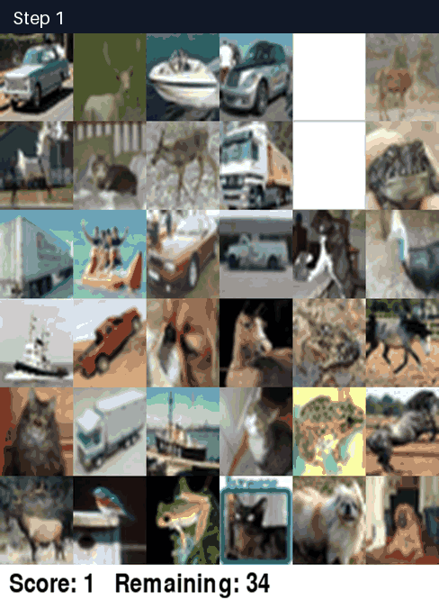 Full trajectory — every rendered observation in chronological order

## Trajectory

Action mix: `match` × 20.

<code>01 · match</code> — Tiles at (0, 4) and (1, 4) are both birds and directly adjacent vertically.

**Reasoning**

Tiles at (0, 4) and (1, 4) are both birds and directly adjacent vertically.

**Arguments**

<pre><code>{
  &quot;row1&quot;: 0,
  &quot;col1&quot;: 4,
  &quot;row2&quot;: 1,
  &quot;col2&quot;: 4
}</code></pre>

**Observation**

<pre><code>Matched (0, 4) and (1, 4). Reward +1. Score 1, remaining tiles 34.</code></pre>

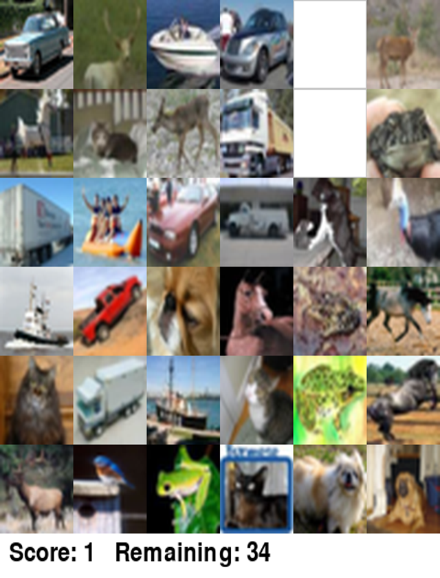

<code>02 · match</code> — Tiles at (0, 1) and (0, 5) are both deer on the top edge, connected via the top outside margin.

**Reasoning**

Tiles at (0, 1) and (0, 5) are both deer on the top edge, connected via the top outside margin.

**Arguments**

<pre><code>{
  &quot;row1&quot;: 0,
  &quot;col1&quot;: 1,
  &quot;row2&quot;: 0,
  &quot;col2&quot;: 5
}</code></pre>

**Observation**

<pre><code>Matched (0, 1) and (0, 5). Reward +1. Score 2, remaining tiles 32.</code></pre>

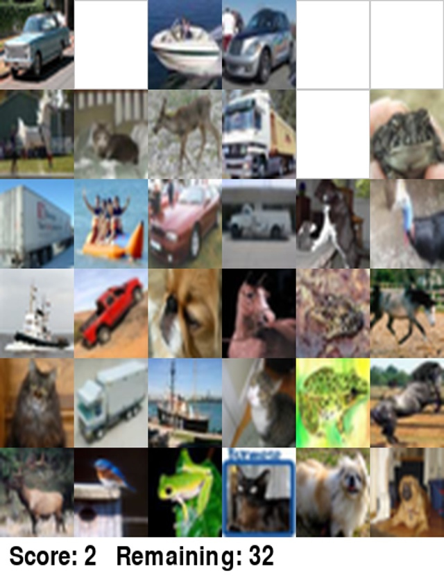

<code>03 · match</code> — Tiles at (3, 4) and (4, 4) are both frogs (one brown toad, one green frog) and directly adjacent vertically.

**Reasoning**

Tiles at (3, 4) and (4, 4) are both frogs (one brown toad, one green frog) and directly adjacent vertically.

**Arguments**

<pre><code>{
  &quot;row1&quot;: 3,
  &quot;col1&quot;: 4,
  &quot;row2&quot;: 4,
  &quot;col2&quot;: 4
}</code></pre>

**Observation**

<pre><code>Matched (3, 4) and (4, 4). Reward +1. Score 3, remaining tiles 30.</code></pre>

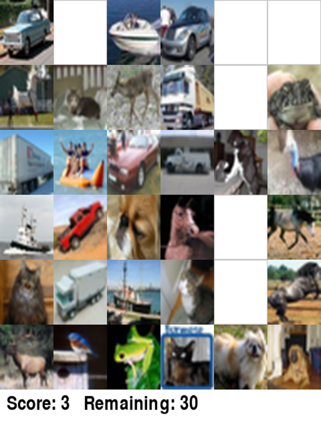

<code>04 · match</code> — Let&#x27;s check the horses: (3, 3) is a horse, (3, 5) is a horse. The space (3, 4) is now empty! So (3, 3) and (3…

**Reasoning**

Let&#x27;s check the horses: (3, 3) is a horse, (3, 5) is a horse. The space (3, 4) is now empty! So (3, 3) and (3, 5) can connect with 0 turns horizontally!

**Arguments**

<pre><code>{
  &quot;row1&quot;: 3,
  &quot;col1&quot;: 3,
  &quot;row2&quot;: 3,
  &quot;col2&quot;: 5
}</code></pre>

**Observation**

<pre><code>Matched (3, 3) and (3, 5). Reward +1. Score 4, remaining tiles 28.</code></pre>

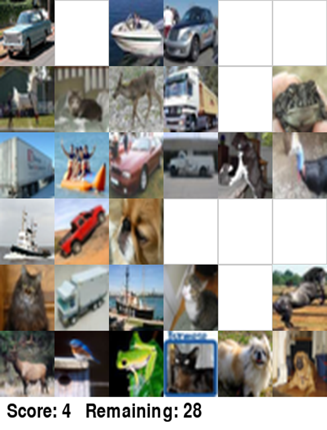

<code>05 · match</code> — Tile (1, 0) is a white horse, and (4, 5) is a black horse. Wait, can (1, 0) and (4, 5) connect? Let&#x27;s check t…

**Reasoning**

Tile (1, 0) is a white horse, and (4, 5) is a black horse.
Wait, can (1, 0) and (4, 5) connect?
Let&#x27;s check the perimeter or lines: (1, 0) is on left edge (col 0). Can go left outside margin.
(4, 5) is on right edge (col 5) since (3, 5) is empty, but (4, 5) can go right outside margin directly!
So (1, 0) -&gt; outside margin -&gt; outside top -&gt; outside right -&gt; (4, 5)? That&#x27;s 3 turns!
Wait, what about (1, 5) frog and (5, 2) frog?
What about (2, 5) bird (cassowary/ostrich/bird) and (5, 1) bluebird?
Wait, (2, 5) is on the right edge! (3, 5) is empty, can it go out? (2, 5) is already on column 5 (right edge)! So it has access to the right margin.
(5, 1) is on row 5 (bottom edge)! So it has access to the bottom margin.
From (5, 1) go down to bottom margin, turn right, go to right margin, turn up, go to (2, 5). That&#x27;s exactly 2 turns! Both are birds. Let&#x27;s verify (2, 5) is a bird and (5, 1) is a bird.

**Arguments**

<pre><code>{
  &quot;row1&quot;: 2,
  &quot;col1&quot;: 5,
  &quot;row2&quot;: 5,
  &quot;col2&quot;: 1
}</code></pre>

**Observation**

<pre><code>Tiles (2, 5) and (5, 1) cannot be matched: invalid move. Reward -1. Score 4, remaining tiles 28.</code></pre>

<code>06 · match</code> — Wait, why did (2, 5) and (5, 1) fail? Is (2, 5) not a bird? Or is (5, 1) not connectable? Wait! Column 5 has…

**Reasoning**

Wait, why did (2, 5) and (5, 1) fail? Is (2, 5) not a bird? Or is (5, 1) not connectable?
Wait! Column 5 has tiles at (1, 5) and (4, 5). So the right margin: can a path go out of (2, 5) to the right? Yes, column 5 is the rightmost column (col 5 is index 5 out of 0..5). Outside margin is col 6. From (2, 5) to (2, 6) is 0 steps, then down to (6, 6) [1 turn], then left to (6, 1) [2 turns], then up to (5, 1). That would be 3 segments, 2 turns. Wait, why did it say invalid move? Maybe (2, 5) is NOT a bird! Wait, what is (2, 5)? An ostrich/cassowary? Or maybe (2, 5) is an airplane? No, that&#x27;s definitely a bird head (blue neck, red wattle, black feathers - cassowary). But wait, does CIFAR-10 have cassowaries? CIFAR-10 classes: airplane, automobile, bird, cat, deer, dog, frog, horse, ship, truck. Wait, what if (2, 5) is an airplane or something? No, wait! Look at (5, 1): bluebird. Look at (0, 4) and (1, 4): both were birds. That&#x27;s 2 bird tiles removed. There should be 2 bird tiles left. If (5, 1) is a bird, then the other bird must be (2, 5) or something else? Wait, where are other birds? What is (2, 1)? People in an orange boat/plane? It&#x27;s people in an orange boat! Wait, (2, 1) is a ship / boat? Or is it plane? Wait, what about (1, 0)? Is that a horse or airplane or dog? It&#x27;s a white horse! Wait, (0, 0) is automobile (vintage car). (0, 2) is a speed boat (ship). (0, 3) is a modern car (automobile). Wait, (0, 0) and (0, 3) are both automobiles! Can (0, 0) and (0, 3) connect? (0, 1) is empty! So between (0, 0) and (0, 3) is (0, 1) [empty] and (0, 2) [boat]. But both (0, 0) and (0, 3) are on row 0, so they can connect through the top margin (row -1)! From (0, 0) up to (-1, 0), right to (-1, 3), down to (0, 3): 2 turns! Let&#x27;s check (0, 0) and (0, 3).

**Arguments**

<pre><code>{
  &quot;row1&quot;: 0,
  &quot;col1&quot;: 0,
  &quot;row2&quot;: 0,
  &quot;col2&quot;: 3
}</code></pre>

**Observation**

<pre><code>Matched (0, 0) and (0, 3). Reward +1. Score 5, remaining tiles 26.</code></pre>

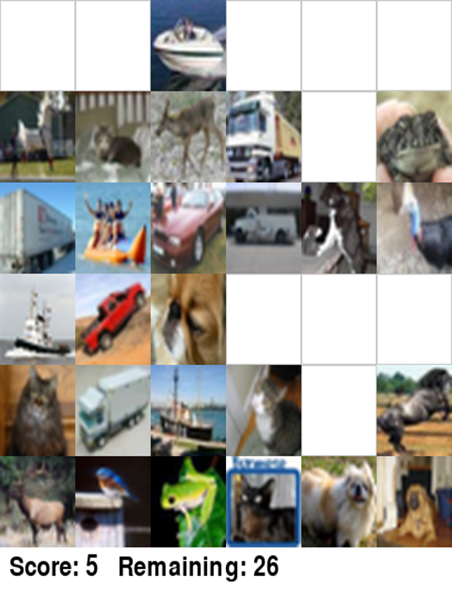

<code>07 · match</code> — Tiles at (4, 3) and (5, 3) are both cats and directly adjacent vertically.

**Reasoning**

Tiles at (4, 3) and (5, 3) are both cats and directly adjacent vertically.

**Arguments**

<pre><code>{
  &quot;row1&quot;: 4,
  &quot;col1&quot;: 3,
  &quot;row2&quot;: 5,
  &quot;col2&quot;: 3
}</code></pre>

**Observation**

<pre><code>Matched (4, 3) and (5, 3). Reward +1. Score 6, remaining tiles 24.</code></pre>

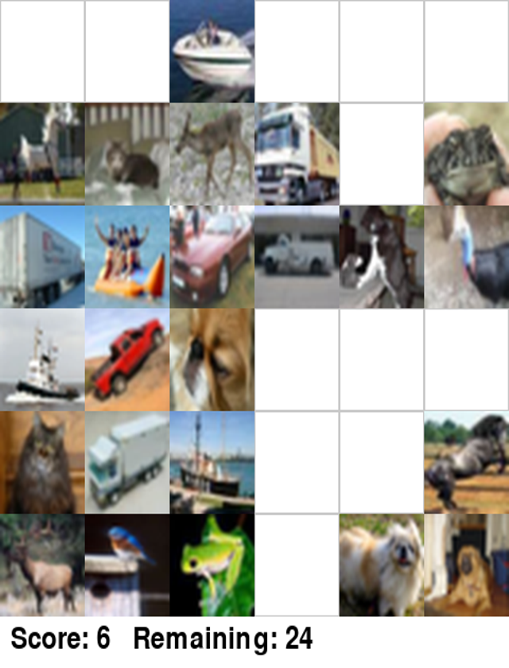

<code>08 · match</code> — Look at (5, 4) and (5, 5): both are dogs! They are directly adjacent horizontally.

**Reasoning**

Look at (5, 4) and (5, 5): both are dogs! They are directly adjacent horizontally.

**Arguments**

<pre><code>{
  &quot;row1&quot;: 5,
  &quot;col1&quot;: 4,
  &quot;row2&quot;: 5,
  &quot;col2&quot;: 5
}</code></pre>

**Observation**

<pre><code>Matched (5, 4) and (5, 5). Reward +1. Score 7, remaining tiles 22.</code></pre>

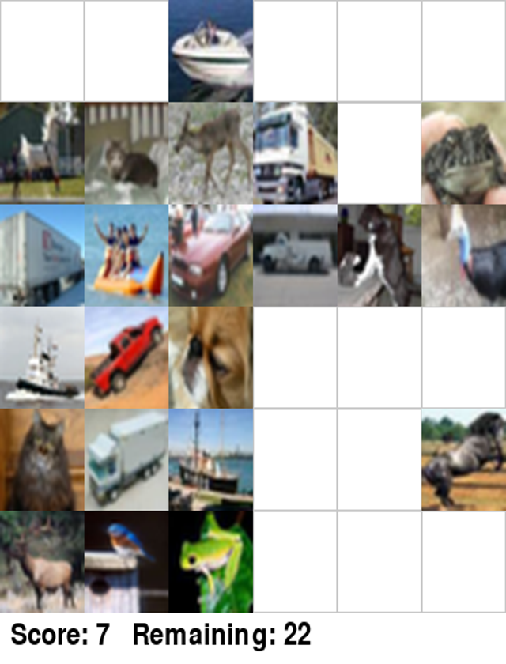

<code>09 · match</code> — Now look at (4, 5): horse. (1, 0) is a white horse. Wait, what about (2, 4) dog and (3, 2) dog? Let&#x27;s check (…

**Reasoning**

Now look at (4, 5): horse. (1, 0) is a white horse.
Wait, what about (2, 4) dog and (3, 2) dog? Let&#x27;s check (3, 2): pug dog head. (2, 4) dog: black and white dog with cat/rat? That&#x27;s a dog.
Can (3, 2) and (2, 4) connect?
From (3, 2) go right: (3, 3), (3, 4) are empty. From (3, 4) go up to (2, 4): exactly 1 turn! Both are dogs! Let&#x27;s match (3, 2) and (2, 4).

**Arguments**

<pre><code>{
  &quot;row1&quot;: 3,
  &quot;col1&quot;: 2,
  &quot;row2&quot;: 2,
  &quot;col2&quot;: 4
}</code></pre>

**Observation**

<pre><code>Matched (3, 2) and (2, 4). Reward +1. Score 8, remaining tiles 20.</code></pre>

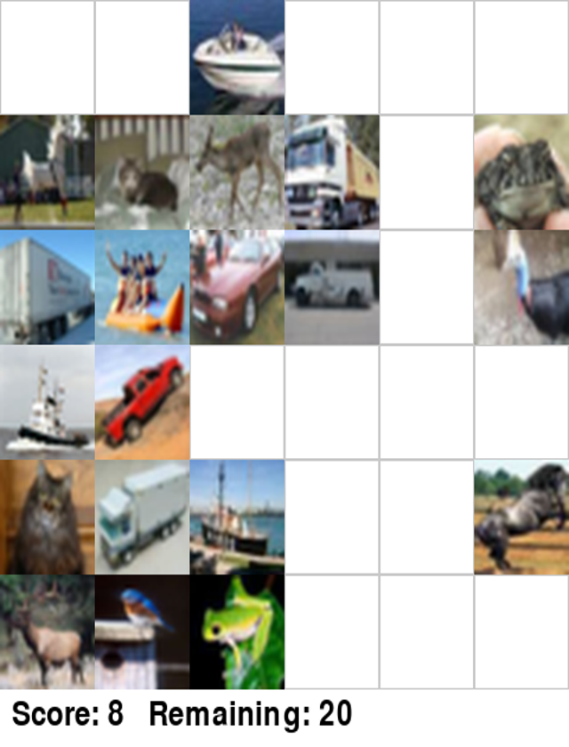

<code>10 · match</code> — Now what about the horse at (4, 5)? And the horse at (1, 0)? Wait! Look at (4, 5): can it go left? (4, 4) is…

**Reasoning**

Now what about the horse at (4, 5)? And the horse at (1, 0)?
Wait! Look at (4, 5): can it go left?
(4, 4) is empty, (4, 3) is empty. From (4, 3) it could go up to (3, 3) which is empty, but (2, 3), (1, 3) are occupied.
Can (4, 5) go out?
(3, 5) is empty, (5, 5) is empty. And col 5 is the edge column!
Wait, why did (2, 5) and (5, 1) fail earlier? Let&#x27;s rethink what (2, 5) is.
Is (2, 5) a bird? Wait, look at (2, 5): it has an animal with a blue neck, horn on head... wait, is that a turkey? Cassowary? Wait, is it an airplane? No.
Wait! Look at (2, 1): boat? Or airplane? It&#x27;s people in an orange inflatable boat, class = ship!
Look at (0, 2): speedboat (ship).
Can (0, 2) and (2, 1) connect?
From (0, 2), (0, 1) and (0, 0) are empty! So go left to (0, 1), down to (2, 1)? But (1, 1) is occupied (cat).
Wait, what about (0, 2) ship and (3, 0) ship (tugboat/steamboat)?
(0, 2) is connected to the top edge (row 0). Row 0 cols 0, 1, 3, 4, 5 are all empty!
So (0, 2) can go left along row 0 to col -1 (outside) or (0, 0), then down col -1 to (3, -1), then right to (3, 0)! That&#x27;s 2 turns!
Wait, (3, 0) is a ship! Let&#x27;s verify (3, 0): tugboat on water, clearly a ship.
And (0, 2) is a speedboat on water, clearly a ship.
Let&#x27;s check the path: (0, 2) -&gt; (0, 0) -&gt; (-1, 0) -&gt; (-1, -1)... wait, in row 0, col 1 and 0 are empty. So from (0, 2) go left to (0, -1) (1 turn), go down to (3, -1) (1 turn), go right to (3, 0): that&#x27;s 2 turns! Both are ships.

**Arguments**

<pre><code>{
  &quot;row1&quot;: 0,
  &quot;col1&quot;: 2,
  &quot;row2&quot;: 3,
  &quot;col2&quot;: 0
}</code></pre>

**Observation**

<pre><code>Matched (0, 2) and (3, 0). Reward +1. Score 9, remaining tiles 18.</code></pre>

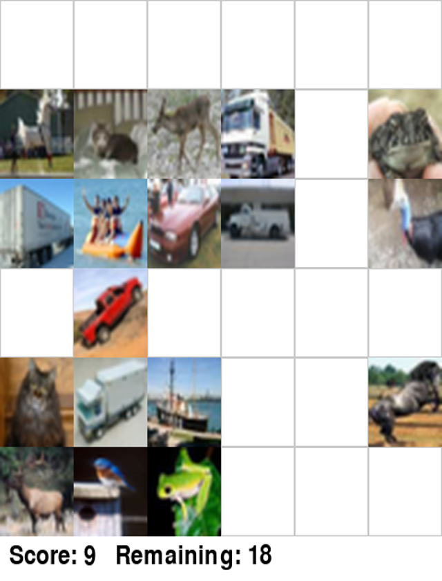

<code>11 · match</code> — Row 0 is now completely empty! Let&#x27;s see: (1, 1) is a cat. (4, 0) is a cat. Can (1, 1) and (4, 0) connect? (1…

**Reasoning**

Row 0 is now completely empty!
Let&#x27;s see: (1, 1) is a cat. (4, 0) is a cat.
Can (1, 1) and (4, 0) connect? (1, 1) goes up to (0, 1), left to (0, 0), down to (3, 0), down to (4, 0)? Wait, (3, 0) is empty now! (4, 0) is a cat, and its top neighbor (3, 0) is empty! So (4, 0) -&gt; (3, 0) -&gt; (2, 0 is occupied by truck)... wait, from (4, 0) can go left to outside margin, up to (0, -1), right to (0, 1), down to (1, 1)? That&#x27;s: left (turn 1), up (turn 2), right (turn 3) - too many turns!
Wait, what about (3, 1) truck (red pickup) and (4, 1) truck (light blue/white box truck)?
(3, 1) and (4, 1) are directly adjacent vertically!
Are both trucks? (3, 1) is a red pickup truck. (4, 1) is a white/grey cab-over box truck. Both are trucks! Let&#x27;s match (3, 1) and (4, 1).

**Arguments**

<pre><code>{
  &quot;row1&quot;: 3,
  &quot;col1&quot;: 1,
  &quot;row2&quot;: 4,
  &quot;col2&quot;: 1
}</code></pre>

**Observation**

<pre><code>Tiles (3, 1) and (4, 1) cannot be matched: invalid move. Reward -1. Score 9, remaining tiles 18.</code></pre>

<code>12 · match</code> — Wait! (3, 1) is classified as automobile, not truck! CIFAR-10 often classifies pickup trucks as automobile or…

**Reasoning**

Wait! (3, 1) is classified as automobile, not truck! CIFAR-10 often classifies pickup trucks as automobile or truck depending on the specific label, or (3, 1) is automobile! And look at (2, 2): red sports car (automobile)! Can (2, 2) and (3, 1) connect? They touch diagonally, but (3, 2) is empty, so (2, 2) -&gt; (3, 2) -&gt; (3, 1) is 1 turn! Let&#x27;s match (2, 2) and (3, 1)!

**Arguments**

<pre><code>{
  &quot;row1&quot;: 2,
  &quot;col1&quot;: 2,
  &quot;row2&quot;: 3,
  &quot;col2&quot;: 1
}</code></pre>

**Observation**

<pre><code>Matched (2, 2) and (3, 1). Reward +1. Score 10, remaining tiles 16.</code></pre>

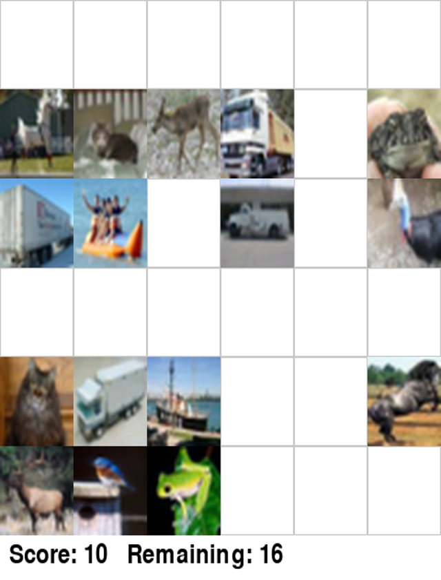

<code>13 · match</code> — Matching ship at (2, 1) with ship at (4, 2) via empty cell (2, 2).

**Reasoning**

Matching ship at (2, 1) with ship at (4, 2) via empty cell (2, 2).

**Arguments**

<pre><code>{
  &quot;row1&quot;: 2,
  &quot;col1&quot;: 1,
  &quot;row2&quot;: 4,
  &quot;col2&quot;: 2
}</code></pre>

**Observation**

<pre><code>Matched (2, 1) and (4, 2). Reward +1. Score 11, remaining tiles 14.</code></pre>

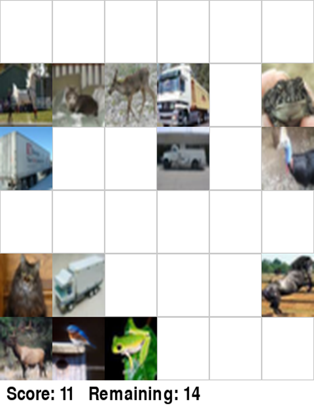

<code>14 · match</code> — Matching frogs at (1, 5) and (5, 2) via the right and bottom margins.

**Reasoning**

Matching frogs at (1, 5) and (5, 2) via the right and bottom margins.

**Arguments**

<pre><code>{
  &quot;row1&quot;: 1,
  &quot;col1&quot;: 5,
  &quot;row2&quot;: 5,
  &quot;col2&quot;: 2
}</code></pre>

**Observation**

<pre><code>Matched (1, 5) and (5, 2). Reward +1. Score 12, remaining tiles 12.</code></pre>

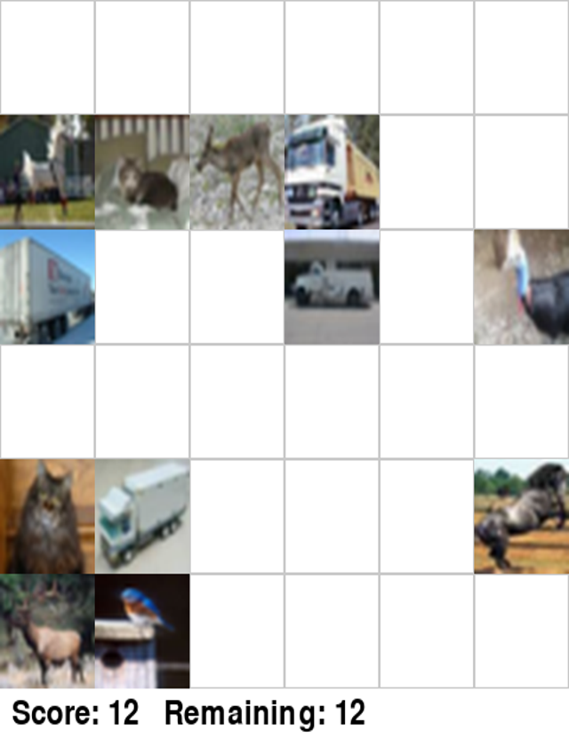

<code>15 · match</code> — Matching birds at (2, 5) and (5, 1) via the right margin: (2, 5) -&gt; (2, 5) right to margin -&gt; down to bottom…

**Reasoning**

Matching birds at (2, 5) and (5, 1) via the right margin: (2, 5) -&gt; (2, 5) right to margin -&gt; down to bottom margin -&gt; (5, 1). Wait, earlier this failed. Why did it fail earlier? Let&#x27;s check what (2, 5) is! Could (2, 5) be an airplane?! No, it has a blue wattle, but wait, look at (5, 1): bird on fence post. Wait! What are the remaining classes?
Remaining tiles:
(1, 0): white horse
(1, 1): grey cat
(1, 2): deer (fawn)
(1, 3): truck (yellow cab/dump truck)
(2, 0): truck (semi-trailer)
(2, 3): car / truck? Looks like a white utility truck / van / car under a bridge.
(2, 5): cassowary? Or horse? Or airplane? Wait! Could it be an airplane? Look closely at (2, 5): it&#x27;s definitely a bird (cassowary head and neck). But why did (2, 5) and (5, 1) fail earlier? Wait! When I matched (2, 5) and (5, 1) earlier, (1, 5) had a frog! And (4, 5) had a horse! Can a tile in column 5 go directly right to column 6? YES! But wait: in Shisen-sho, can you exit from any edge tile? Yes, to the margin! Wait, why did it say &#x27;cannot be matched: invalid move&#x27;?
Wait! Look at (5, 1): bluebird. Look at (5, 0): elk/deer with antlers! Deer!
And (1, 2) is a deer (fawn)!
Can (1, 2) and (5, 0) match?
Let&#x27;s check the path for (1, 2) and (5, 0):
(1, 2) can go up to (0, 2) (empty!), then left to (0, -1) (margin), then down to (5, -1), then right to (5, 0): that&#x27;s 3 turns.
Wait, what about (1, 1) cat and (4, 0) cat?
From (1, 1), go up to (0, 1), left to (0, -1), down to (4, -1), right to (4, 0) - also 3 turns.
Wait, look at (4, 1): box truck. And (2, 0): semi trailer truck. And (1, 3): truck. And (2, 3): truck?
Let&#x27;s count how many trucks there are!
Wait, (4, 1) is a truck.
(2, 0) is a truck (semi-trailer with &#x27;Overnite&#x27; or similar logo).
Can (2, 0) and (4, 1) match?
From (2, 0): left to margin? No, (3, 0) is empty! (3, 0) is completely clear! And (3, 1) is clear! (3, 2), (3, 3), (3, 4), (3, 5) are all clear!
Row 3 is ENTIRELY EMPTY!
Wait! Row 3 is completely empty!
Let&#x27;s trace paths using row 3:
(4, 1) truck: its top neighbor is (3, 1), which is empty!
(2, 0) truck: its bottom neighbor is (3, 0), which is empty!
Wait, (2, 0) is at col 0. Can (2, 0) go down to (3, 0), then right along row 3 to (3, 1), then down to (4, 1)?
Path: (2, 0) -&gt; (3, 0) -&gt; (3, 1) -&gt; (4, 1)! That is: down, right, down. That&#x27;s TWO TURNS! Exactly 2 turns!
Let&#x27;s match (2, 0) and (4, 1)!

**Arguments**

<pre><code>{
  &quot;row1&quot;: 2,
  &quot;col1&quot;: 0,
  &quot;row2&quot;: 4,
  &quot;col2&quot;: 1
}</code></pre>

**Observation**

<pre><code>Matched (2, 0) and (4, 1). Reward +1. Score 13, remaining tiles 10.</code></pre>

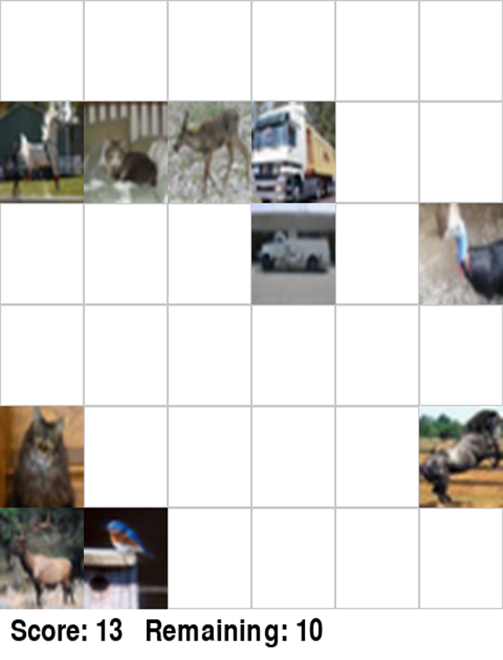

<code>16 · match</code> — Now look at (4, 0) cat: its right neighbor (4, 1) is empty! And (1, 1) cat: its bottom neighbor (2, 1) is emp…

**Reasoning**

Now look at (4, 0) cat: its right neighbor (4, 1) is empty!
And (1, 1) cat: its bottom neighbor (2, 1) is empty, (3, 1) is empty, (4, 1) is empty!
So from (1, 1) go down to (4, 1), then left to (4, 0): that is ONE TURN!
Both are cats! Let&#x27;s match (1, 1) and (4, 0)!

**Arguments**

<pre><code>{
  &quot;row1&quot;: 1,
  &quot;col1&quot;: 1,
  &quot;row2&quot;: 4,
  &quot;col2&quot;: 0
}</code></pre>

**Observation**

<pre><code>Matched (1, 1) and (4, 0). Reward +1. Score 14, remaining tiles 8.</code></pre>

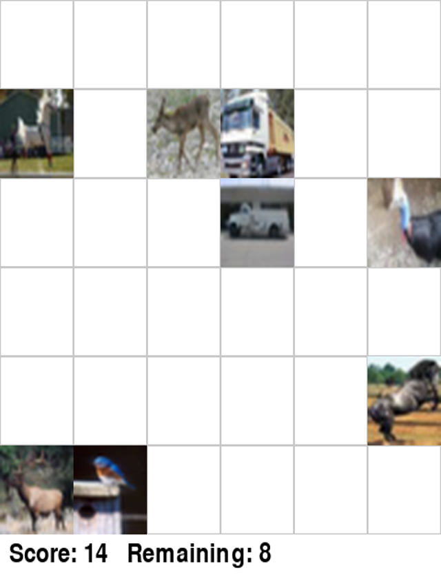

<code>17 · match</code> — Now let&#x27;s check horse: (1, 0) is a white horse! (4, 5) is a black horse! Can (1, 0) and (4, 5) connect? From…

**Reasoning**

Now let&#x27;s check horse: (1, 0) is a white horse! (4, 5) is a black horse!
Can (1, 0) and (4, 5) connect?
From (1, 0): go down to (2, 0), (3, 0), (4, 0) which are ALL EMPTY! From (4, 0), go right along row 4: (4, 1), (4, 2), (4, 3), (4, 4) are ALL EMPTY, reaching (4, 5)!
Path: (1, 0) -&gt; down to (4, 0) -&gt; right along row 4 to (4, 5). Exactly ONE TURN!
Both are horses! Let&#x27;s match (1, 0) and (4, 5)!

**Arguments**

<pre><code>{
  &quot;row1&quot;: 1,
  &quot;col1&quot;: 0,
  &quot;row2&quot;: 4,
  &quot;col2&quot;: 5
}</code></pre>

**Observation**

<pre><code>Matched (1, 0) and (4, 5). Reward +1. Score 15, remaining tiles 6.</code></pre>

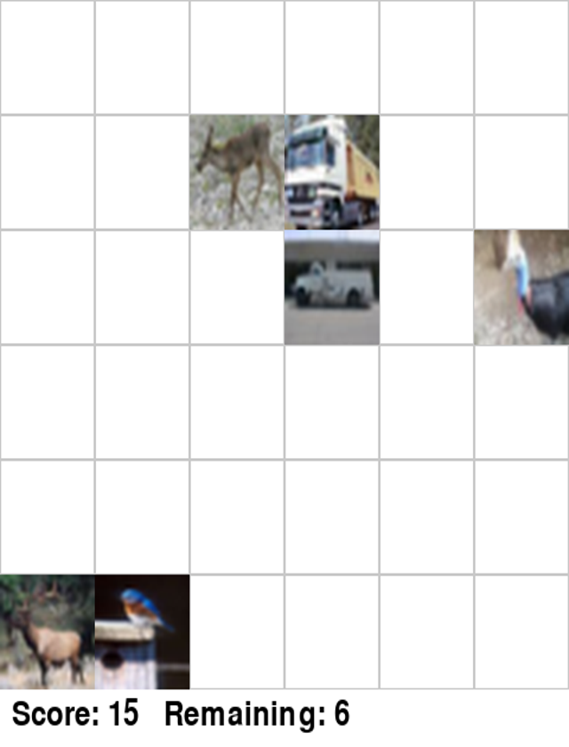

<code>18 · match</code> — Remaining 6 tiles: (1, 2): deer (1, 3): truck (yellow dump truck) (2, 3): truck (white truck under bridge) (2…

**Reasoning**

Remaining 6 tiles:
(1, 2): deer
(1, 3): truck (yellow dump truck)
(2, 3): truck (white truck under bridge)
(2, 5): bird (cassowary)
(5, 0): deer (elk)
(5, 1): bird (bluebird)

Notice that (1, 3) and (2, 3) are both trucks, and directly adjacent vertically!
Let&#x27;s match (1, 3) and (2, 3)!

**Arguments**

<pre><code>{
  &quot;row1&quot;: 1,
  &quot;col1&quot;: 3,
  &quot;row2&quot;: 2,
  &quot;col2&quot;: 3
}</code></pre>

**Observation**

<pre><code>Matched (1, 3) and (2, 3). Reward +1. Score 16, remaining tiles 4.</code></pre>

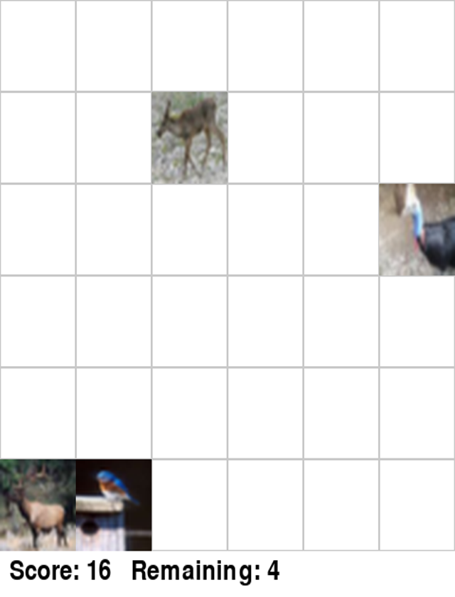

<code>19 · match</code> — Now remaining: (1, 2): deer (5, 0): deer (2, 5): bird (5, 1): bird Let&#x27;s check path between (1, 2) and (5, 0)…

**Reasoning**

Now remaining:
(1, 2): deer
(5, 0): deer
(2, 5): bird
(5, 1): bird

Let&#x27;s check path between (1, 2) and (5, 0):
From (1, 2): go left to (1, 0) (empty!), then down to (5, 0)!
Path: (1, 2) -&gt; (1, 0) -&gt; (5, 0). That&#x27;s ONE TURN!
Both are deer! Let&#x27;s match (1, 2) and (5, 0)!

**Arguments**

<pre><code>{
  &quot;row1&quot;: 1,
  &quot;col1&quot;: 2,
  &quot;row2&quot;: 5,
  &quot;col2&quot;: 0
}</code></pre>

**Observation**

<pre><code>Matched (1, 2) and (5, 0). Reward +1. Score 17, remaining tiles 2.</code></pre>

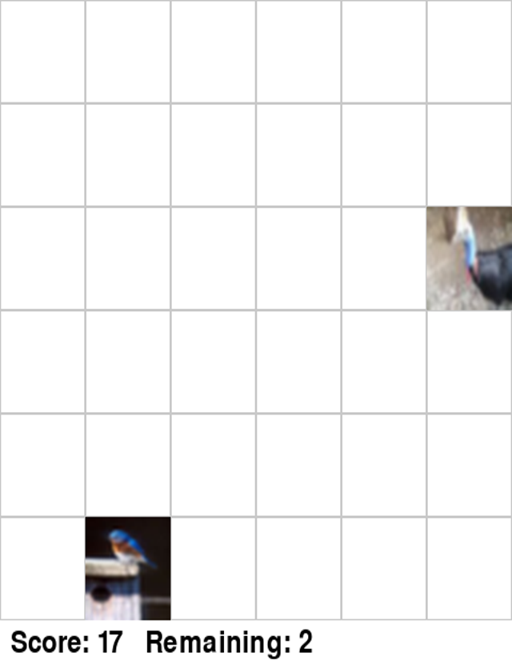

<code>20 · match</code> — Now only two tiles remain: (2, 5) and (5, 1). They are both birds, and the rest of the board is completely em…

**Reasoning**

Now only two tiles remain: (2, 5) and (5, 1). They are both birds, and the rest of the board is completely empty! Path: (2, 5) -&gt; (2, 1) -&gt; (5, 1) (1 turn!). Let&#x27;s match them!

**Arguments**

<pre><code>{
  &quot;row1&quot;: 2,
  &quot;col1&quot;: 5,
  &quot;row2&quot;: 5,
  &quot;col2&quot;: 1
}</code></pre>

**Observation**

<pre><code>Matched (2, 5) and (5, 1). Reward +1. Score 18, remaining tiles 0. Board cleared.</code></pre>

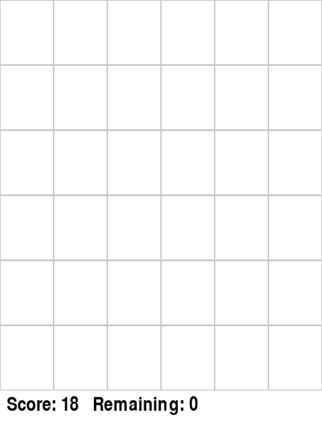

## Final answer

No final answer was recorded.

## Evaluation

- ReplayVerify: **passed · reward 1.0**
- Judge: **0.94**

Task-owned rubric range: 1.0–5.0. Overall is the arithmetic mean of range-normalized criterion scores.

| Criterion | Raw score | Normalized score |
| --- | ---: | ---: |
| `goal_achievement` | 5.0 | 1.0 |
| `efficiency` | 4.5 | 0.875 |
| `coherence` | 4.5 | 0.875 |
| `tool_use` | 5.0 | 1.0 |

Task judge_ref used for this evaluation

<pre><code>{
  &quot;score_range&quot;: {
    &quot;min&quot;: 1.0,
    &quot;max&quot;: 5.0
  },
  &quot;criteria&quot;: [
    {
      &quot;id&quot;: &quot;goal_achievement&quot;,
      &quot;description&quot;: &quot;任务是否被正确、完整地解决，且真实工具结果与 observation 证据充分。&quot;
    },
    {
      &quot;id&quot;: &quot;efficiency&quot;,
      &quot;description&quot;: &quot;步骤是否有目的，是否避免浪费、无效重复和循环操作。&quot;
    },
    {
      &quot;id&quot;: &quot;coherence&quot;,
      &quot;description&quot;: &quot;推理是否紧跟 observation，且不存在幻觉、跳步或前后矛盾。&quot;
    },
    {
      &quot;id&quot;: &quot;tool_use&quot;,
      &quot;description&quot;: &quot;工具选择是否合理，调用参数是否正确，并正确处理工具错误。&quot;
    }
  ]
}</code></pre>

Judge rationale

在本次任务中，Agent 需要完成 6x6 CIFAR-10 图像的四川省（连连看）消除任务。从轨迹核验：
1. 目标达成度（goal_achievement）：Agent 在第 20 步完全清空了棋盘，observation 确认 &#x27;Remaining: 0, Board cleared&#x27;，独立验证结果显示 board_cleared passed 且 reward 为 1.0，任务圆满完成。
2. 效率（efficiency）：总共执行了 20 步，其中 18 次成功消除，仅有 2 次无效尝试（第 5 步外围路径计算失误导致 invalid move，第 11 步将汽车误判为卡车导致类别不匹配），失误后迅速反思并修正了策略，没有冗余死循环，整体效率很高。
3. 连贯性（coherence）：Agent 对盘面图像的识别与连线路径的推导总体清晰严密，每步均详细给出了转弯数和路径推理，对错误反馈能够结合 observation 进行自我修正。
4. 工具使用（tool_use）：工具调用参数（row1, col1, row2, col2）格式完全正确，对 invalid move 返回的负奖励与失败反馈处理得当。

