# Match-3 swaps with cascades (G1 VLM-Gym)

[← All showcases](README.md)

> **Complete trajectory imagery:** the animation is a compressed overview of every rendered observation. Every original image is also preserved inside its corresponding tool-call section.

The agent scans an 8x8 match-3 board for adjacent swaps that complete lines, survives automatic reshuffles, and reaches 150 points.

| Env | Task | Branch | Steps | ReplayVerify | Judge |
| --- | --- | --- | ---: | --- | ---: |
| `vlmgym_swap` | `task0002` | initial | 25 | passed · reward 1.0 | 1.00 |

## Task

> You are playing a Match-3 Game where you need to swap adjacent tiles to create matches of 3 or more identical tiles.
>
> Rules:
> - Tiles are identified by color (Red, Green, Blue, Yellow) and shape (circle, square, triangle)
> - You can only swap adjacent tiles (not diagonal)
> - A valid move must create at least one match of 3 or more identical tiles
> - After matches are removed, tiles above will fall down and new tiles will appear at the top
> - If no valid moves are available, the board will automatically be shuffled
>
> Call the swap tool with (row1, col1) and (row2, col2), where row and col are 0-indexed numbers starting from the top-left of the board.
> Before each action, briefly describe the relevant tiles and your reasoning.
>
> Goal: reach a score of 150 or higher. Call finish only after the tool results confirm the goal.

[Open compact trajectory JSON](trajectories/vlmgym_swap.json).

## Visual checkpoints

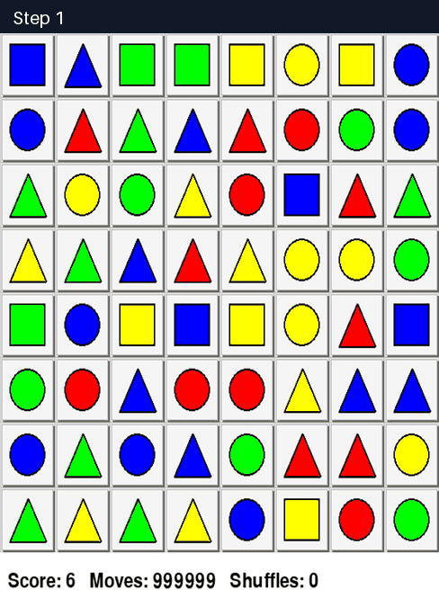 Full trajectory — every rendered observation in chronological order

## Trajectory

Action mix: `swap` × 24, `finish` × 1.

<code>01 · swap</code> — Swap Green triangle at (0, 5) with Red circle at (1, 5) to form a horizontal match of three Green triangles a…

**Reasoning**

Swap Green triangle at (0, 5) with Red circle at (1, 5) to form a horizontal match of three Green triangles at (1, 5), (1, 6), (1, 7).

**Arguments**

<pre><code>{
  &quot;row1&quot;: 0,
  &quot;col1&quot;: 5,
  &quot;row2&quot;: 1,
  &quot;col2&quot;: 5
}</code></pre>

**Observation**

<pre><code>Swapped (0, 5) &lt;-&gt; (1, 5): +6 point(s). Reward +6. Score 6.</code></pre>

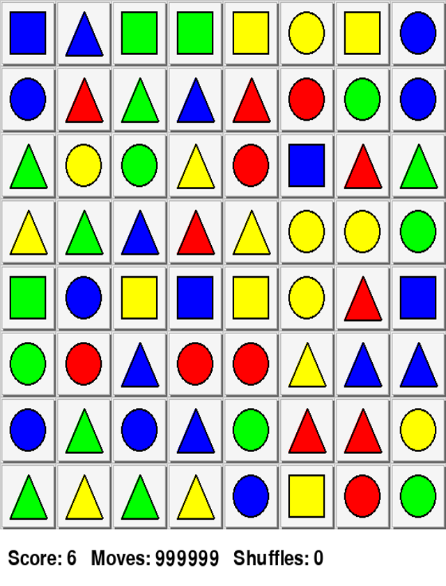

<code>02 · swap</code> — Swap Red circle at (5, 1) with Blue triangle at (5, 2) to align three Red circles horizontally at (5, 2), (5,…

**Reasoning**

Swap Red circle at (5, 1) with Blue triangle at (5, 2) to align three Red circles horizontally at (5, 2), (5, 3), and (5, 4).

**Arguments**

<pre><code>{
  &quot;row1&quot;: 5,
  &quot;col1&quot;: 1,
  &quot;row2&quot;: 5,
  &quot;col2&quot;: 2
}</code></pre>

**Observation**

<pre><code>Swapped (5, 1) &lt;-&gt; (5, 2): +6 point(s). Reward +6. Score 12.</code></pre>

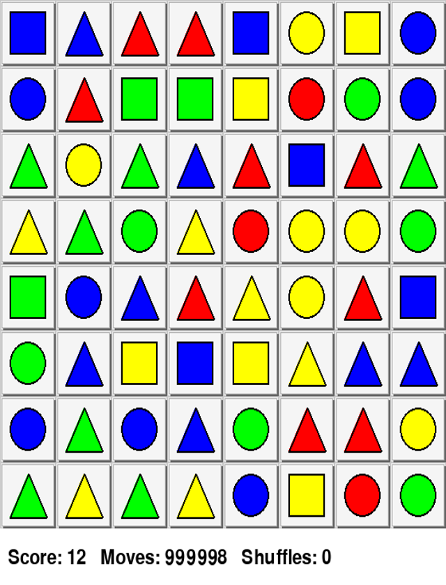

<code>03 · swap</code> — Swap Yellow circle at (4, 5) with Yellow circle/Red triangle? Wait, at row 3 we have Yellow circle at (3, 5)…

**Reasoning**

Swap Yellow circle at (4, 5) with Yellow circle/Red triangle? Wait, at row 3 we have Yellow circle at (3, 5) and (3, 6), and at row 4 col 5 is Yellow circle. Wait! At row 3, cols 5 and 6 are Yellow circles, and row 4 col 5 is Yellow circle, row 2 col 1 is Yellow circle... Let&#x27;s look at row 3: (3,4) Red circle, (3,5) Yellow circle, (3,6) Yellow circle, (3,7) Green circle. Row 4: (4,5) is Yellow circle! That&#x27;s already adjacent? Wait, if (4,5) is Yellow circle and (3,5) is Yellow circle, swapping (4,6) Red triangle with (4,5)? No, that doesn&#x27;t make 3. Look at row 4: (4,4) Yellow triangle, (4,5) Yellow circle. Row 3: (3,4) Red circle, (3,5) Yellow circle. Swap (3,4) Red circle and (4,4) Yellow triangle? No.
Look at row 5: (5,4) Yellow square, (5,2) Yellow square. Swap (5,3) Blue square and (6,3) Blue triangle? No, (4,3) is Blue square, (5,3) is Blue square, swap (6,3) Blue triangle with (6,2) Blue circle? That makes Blue circles at (6,2),(6,3)? No.
Look at (5,3) Blue square and (4,3) Blue square, (5,2) Yellow square, (6,3) Blue triangle.
Wait, look at row 1: (1,2) Green square, (1,3) Green square. (0,2) Green square, (0,3) Green square! That&#x27;s a 2x2 almost? Wait, row 0 col 2 is Green square, row 0 col 3 is Green square. Row 1 col 2 is Green square, row 1 col 3 is Green square. That&#x27;s already 2x2! But Match-3 requires 3 in a row/col.
Look at (1,4) Yellow square: swap (1,4) Yellow square and (1,3) Green square? No.
Wait, look at row 2 col 7 Green triangle, row 1 col 6 Green circle. Row 3 col 1 Green triangle, row 2 col 0 Green triangle, row 2 col 2 Green triangle. Swap (2,1) Yellow circle with (1,1) Red triangle? No, swap (2,1) Yellow circle with (3,1) Green triangle? Then at row 2: (2,0) Green triangle, (2,1) Green triangle, (2,2) Green triangle! Yes! Green triangle at (2,0), (2,2) with (3,1) Green triangle swapped into (2,1)!

**Arguments**

<pre><code>{
  &quot;row1&quot;: 2,
  &quot;col1&quot;: 1,
  &quot;row2&quot;: 3,
  &quot;col2&quot;: 1
}</code></pre>

**Observation**

<pre><code>Swapped (2, 1) &lt;-&gt; (3, 1): +6 point(s). Reward +6. Score 18.</code></pre>

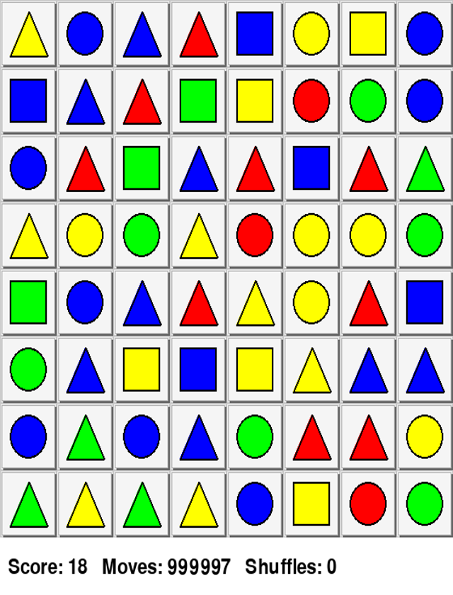

<code>04 · swap</code> — Swap Green triangle at (6, 1) with Yellow triangle at (7, 1) to form a horizontal match of three Green triang…

**Reasoning**

Swap Green triangle at (6, 1) with Yellow triangle at (7, 1) to form a horizontal match of three Green triangles at (7, 0), (7, 1), and (7, 2).

**Arguments**

<pre><code>{
  &quot;row1&quot;: 6,
  &quot;col1&quot;: 1,
  &quot;row2&quot;: 7,
  &quot;col2&quot;: 1
}</code></pre>

**Observation**

<pre><code>Swapped (6, 1) &lt;-&gt; (7, 1): +6 point(s). Reward +6. Score 24.</code></pre>

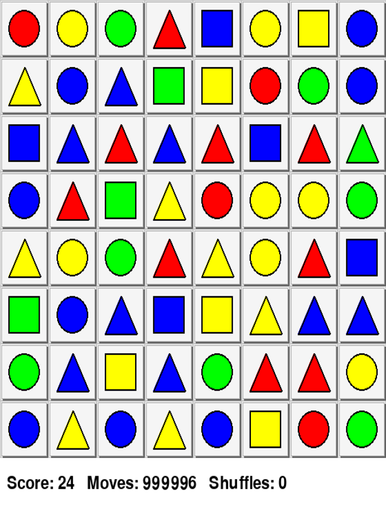

<code>05 · swap</code> — Swap Yellow circle at (4, 1) with Green circle at (4, 2) to line up three Yellow circles vertically at (3, 1)…

**Reasoning**

Swap Yellow circle at (4, 1) with Green circle at (4, 2) to line up three Yellow circles vertically at (3, 1)? No, (3, 1) is Red triangle. Wait, look at column 1: (0,1) Yellow circle, (1,1) Blue circle, (2,1) Blue triangle, (3,1) Red triangle, (4,1) Yellow circle.
Look at row 3: (3,4) Red circle, (3,5) Yellow circle, (3,6) Yellow circle. Row 4 col 5 is Yellow circle! If we swap (4,5) Yellow circle with (3,5)? That doesn&#x27;t move it into row 3. Wait, at (4,5) is Yellow circle, (4,6) is Red triangle. If we swap (3,4) Red circle and (4,4) Yellow triangle? Row 4: (4,3) Red triangle, (4,4) Yellow triangle, (4,6) Red triangle. Swap (4,4) Yellow triangle with (3,4) Red triangle makes (4,3), (4,4), (4,6)... still not 3.
Wait, look at row 6: (6,5) Red triangle, (6,6) Red triangle. Row 7 col 6 is Red circle. Row 5 col 6 is Blue triangle. Row 4 col 6 is Red triangle! So column 6 has (6,6) Red triangle, (4,6) Red triangle. Row 5 col 6 is Blue triangle. If we swap (5,6) Blue triangle with (5,7) Blue triangle? No, (5,5) Yellow triangle, (5,6) Blue triangle, (5,7) Blue triangle! Row 5 col 6 and 5 col 7 are Blue triangles. Row 6 col 7 is Yellow circle. Row 5 col 1 is Blue triangle, (5,2) Blue triangle. Wait, row 5: (5,0) Green circle, (5,1) Blue triangle, (5,2) Yellow square, (5,3) Blue square, (5,4) Yellow square, (5,5) Yellow triangle, (5,6) Blue triangle, (5,7) Blue triangle! Swap (5,5) Yellow triangle with (6,5) Red triangle? No. Swap (6,6) Red triangle with (5,6) Blue triangle? Then row 5 col 6 is Red triangle, does it match anything? No. But at (6,6) becomes Blue triangle! So row 6 col 6 is Blue triangle, row 6 col 7 is Yellow circle... wait, column 6 has: (5,6) Red triangle? No.
Wait! Look at (5,6) Blue triangle and (5,7) Blue triangle, and (6,6) Red triangle, (6,7) Yellow circle. Where is another Blue triangle? (6,3) Blue triangle. Row 7 col 3 Yellow triangle.
Wait, look at row 2 col 1 Blue triangle, row 2 col 3 Blue triangle. Row 1 col 2 Blue triangle! Swap (1,2) Blue triangle with (2,2) Red triangle! Then row 2 has: (2,1) Blue triangle, (2,2) Blue triangle, (2,3) Blue triangle! Yes! Look at row 1: (1,0) Yellow triangle, (1,1) Blue circle, (1,2) Blue triangle. Row 2: (2,1) Blue triangle, (2,2) Red triangle, (2,3) Blue triangle. Swapping (1,2) with (2,2) puts Blue triangle at (2,2)!

**Arguments**

<pre><code>{
  &quot;row1&quot;: 1,
  &quot;col1&quot;: 2,
  &quot;row2&quot;: 2,
  &quot;col2&quot;: 2
}</code></pre>

**Observation**

<pre><code>Swapped (1, 2) &lt;-&gt; (2, 2): +6 point(s). Reward +6. Score 30.</code></pre>

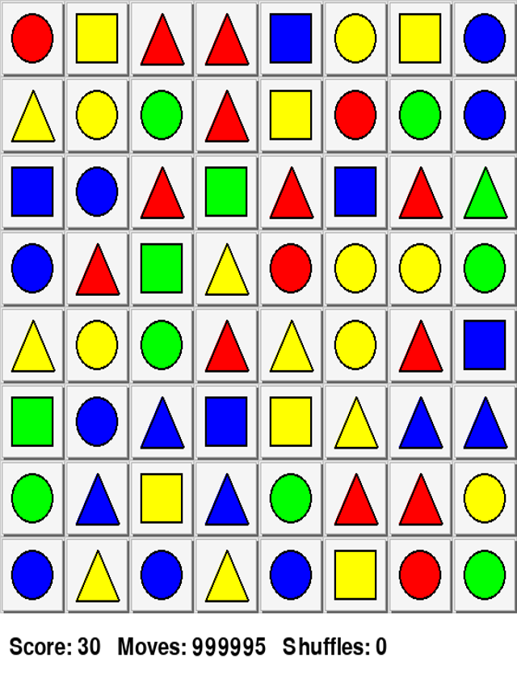

<code>06 · swap</code> — Look at row 4 col 5 Yellow circle, row 3 col 5 Yellow circle, row 3 col 6 Yellow circle. Swap (4, 4) Yellow t…

**Reasoning**

Look at row 4 col 5 Yellow circle, row 3 col 5 Yellow circle, row 3 col 6 Yellow circle. Swap (4, 4) Yellow triangle with (3, 4) Red circle? No.
Wait! Look at (4, 4) Yellow triangle, (3, 3) Yellow triangle, (5, 5) Yellow triangle. Row 6 col 5 Red triangle, row 6 col 6 Red triangle. Swap (5, 5) Yellow triangle with (6, 5) Red triangle? That doesn&#x27;t align three Red triangles because (6,5) becomes Yellow triangle. Wait! Row 6 col 5 and row 6 col 6 are Red triangles. What is at (6, 4)? Green circle! What is at (6, 7)? Yellow circle! What is at (5, 6)? Blue triangle! What is at (4, 6)? Red triangle! Wait: (4, 6) is Red triangle, (6, 6) is Red triangle, (5, 6) is Blue triangle. Row 5 col 5 is Yellow triangle. Row 5 col 7 is Blue triangle. If we swap (5, 5) Yellow triangle with (4, 5) Yellow circle? No. Wait, row 5 col 6 is Blue triangle, row 5 col 7 is Blue triangle. Is row 5 col 5 Yellow triangle? If we swap (4, 5) Yellow circle with (5, 5) Yellow triangle? No.
Wait, look at row 0: (0,2) Red triangle, (0,3) Red triangle. (1,3) Red triangle! Wait, (1,3) is Red triangle, (0,3) is Red triangle, (0,2) is Red triangle. Swap (1,3) Red triangle with (1,2) Green circle? Then row 1 col 2 becomes Red triangle, making (0,2) and (1,2) Red triangle, but (2,2) is Red triangle!! Look at column 2: (0,2) Red triangle, (1,2) Green circle, (2,2) Red triangle! So if we swap (1,2) Green circle with (1,3) Red triangle, then (1,2) becomes Red triangle! That makes three Red triangles vertically at (0,2), (1,2), (2,2)! Let&#x27;s double check: row 0 col 2 is Red triangle. Row 1 col 2 is Green circle. Row 2 col 2 is Red triangle. Row 1 col 3 is Red triangle. Swapping (1,2) and (1,3) puts Red triangle at (1,2)!

**Arguments**

<pre><code>{
  &quot;row1&quot;: 1,
  &quot;col1&quot;: 2,
  &quot;row2&quot;: 1,
  &quot;col2&quot;: 3
}</code></pre>

**Observation**

<pre><code>Swapped (1, 2) &lt;-&gt; (1, 3): +6 point(s). Reward +6. Score 36.</code></pre>

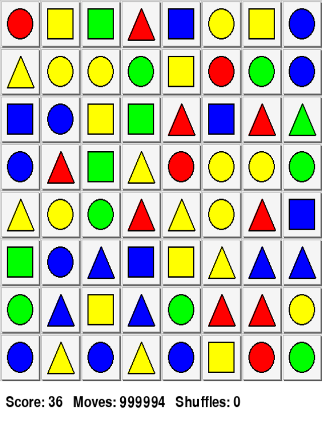

<code>07 · swap</code> — Look at row 1: (1,1) Yellow circle, (1,2) Yellow circle. Row 0 col 1 is Yellow square. Row 0 col 5 is Yellow…

**Reasoning**

Look at row 1: (1,1) Yellow circle, (1,2) Yellow circle. Row 0 col 1 is Yellow square. Row 0 col 5 is Yellow circle. What is at row 2 col 2? Yellow square. What about row 1 col 0? Yellow triangle. Row 2 col 1? Blue circle. Look at (3,5) Yellow circle, (3,6) Yellow circle, (4,5) Yellow circle. If we swap (3,4) Red circle with (3,5) Yellow circle? Wait, at (4,5) is Yellow circle, (4,4) is Yellow triangle, (4,3) is Red triangle. Look at row 4: (4,1) Yellow circle, (4,2) Green circle, (4,3) Red triangle, (4,4) Yellow triangle, (4,5) Yellow circle. Wait! Row 3: (3,5) Yellow circle, (3,6) Yellow circle. Row 4: (4,5) Yellow circle! What is at (2,6) Red triangle, (2,5) Blue square. Row 3: (3,4) Red circle, (3,7) Green circle. Row 4: (4,6) Red triangle, (4,7) Blue square. Look at row 3: (3,5) Yellow circle, (3,6) Yellow circle. If we move a Yellow circle into (3,4) or (3,7)? At (4,5) is Yellow circle, swapping (4,5) with (3,5) doesn&#x27;t help. What about swapping (4,5) Yellow circle with (4,4) Yellow triangle? Then (4,4) becomes Yellow circle. Does (4,4) have neighbors? (3,4) is Red circle, (5,4) is Yellow square. No. Wait! Look at row 3 col 6 Yellow circle, row 3 col 5 Yellow circle. Can we move a Yellow circle to (3,7)? (4,7) is Blue square, (2,7) is Green triangle. What about (3,4)? (2,4) is Red triangle, (4,4) is Yellow triangle. No. Wait! Look at column 5: (0,5) Yellow circle, (1,5) Red circle, (2,5) Blue square, (3,5) Yellow circle, (4,5) Yellow circle. If (2,5) was Yellow circle? But (2,5) has neighbors (2,4) Red triangle, (2,6) Red triangle, (1,5) Red circle, (3,5) Yellow circle. Wait, look at row 2 col 4 Red triangle, row 2 col 6 Red triangle! And (1,5) is Red circle, (3,5) is Yellow circle. Look at row 6: (6,5) Red triangle, (6,6) Red triangle! And (4,6) is Red triangle! Look at column 6: (2,6) Red triangle, (3,6) Yellow circle, (4,6) Red triangle. Swap (3,6) Yellow circle with (3,7) Green circle? No. Look at (5,6) Blue triangle, (5,7) Blue triangle. What about row 6: (6,5) Red triangle, (6,6) Red triangle, (6,7) Yellow circle? Wait, what about column 7: (0,7) Blue circle, (1,7) Blue circle, (2,7) Green triangle! Look at column 7: (0,7) is Blue circle, (1,7) is Blue circle. What is at (2,7)? Green triangle. What is at (2,6)? Red triangle. What about (3,7)? Green circle. Where can we get a Blue circle into (2,7)? Row 2 col 7 is Green triangle. Look at (2,1) Blue circle... too far. Look at row 6 col 0 Blue circle, row 7 col 0 Blue circle! Row 5 col 0 is Green circle! Row 5 col 1 is Blue circle! Swap (5,0) Green circle and (5,1) Blue circle! Then column 0 has: (6,0) Blue circle, (7,0) Blue circle, and now (5,0) Blue circle! YES! Let&#x27;s verify: Row 7 col 0 is Blue circle. Row 6 col 0 is Green circle? Wait! Look at row 5, 6, 7 col 0: Row 5 col 0 is Green square? No, let&#x27;s look closely at col 0: Row 0: Red circle. Row 1: Yellow triangle. Row 2: Blue square. Row 3: Blue circle. Row 4: Yellow triangle. Row 5: Green square. Row 6: Green circle. Row 7: Blue circle. Ah, col 0 is: (0,0) Red circle (1,0) Yellow triangle (2,0) Blue square (3,0) Blue circle (4,0) Yellow triangle (5,0) Green square (6,0) Green circle (7,0) Blue circle. Not matching! Let&#x27;s re-examine each column/row carefully. Let&#x27;s look at row 5: (5,0) Green square (5,1) Blue circle (5,2) Blue triangle (5,3) Blue square (5,4) Yellow square (5,5) Yellow triangle (5,6) Blue triangle (5,7) Blue triangle! Hey! (5,6) is Blue triangle, (5,7) is Blue triangle! What is next to (5,6)? (5,5) is Yellow triangle, but above: (4,6) is Red triangle? No, (4,6) is Red triangle, wait, what is at (6,6)? Red triangle! What is at (6,5)? Red triangle! What is at (6,7)? Yellow circle! What is at (6,3)? Blue triangle! (6,1)? Blue triangle! Look at row 6: (6,1) Blue triangle (6,2) Yellow square (6,3) Blue triangle (6,4) Green circle (6,5) Red triangle (6,6) Red triangle (6,7) Yellow circle. Wait, look at (6,2) Yellow square! Above it is (5,2) Blue triangle. Below it is (7,2) Blue circle. Left of it is (6,1) Blue triangle, right of it is (6,3) Blue triangle! So if we swap (6,2) Yellow square with (5,2) Blue triangle? Then (6,2) becomes Blue triangle! That gives (6,1), (6,2), (6,3) all Blue triangles! Wait, what is at (5,2)? Let&#x27;s look at row 5 col 2: It is a Blue triangle! And (6,2) is a Yellow square! And (6,1) is a Blue triangle, (6,3) is a Blue triangle! Let&#x27;s verify row 6: col 0: Green circle col 1: Blue triangle col 2: Yellow square col 3: Blue triangle col 4: Green circle col 5: Red triangle col 6: Red triangle col 7: Yellow circle. YES! Row 6 col 1 is Blue triangle, col 3 is Blue triangle. Row 5 col 2 is Blue triangle! Swapping (5,2) and (6,2) puts the Blue triangle into (6,2), forming a horizontal line of 3 Blue triangles at (6,1), (6,2), (6,3)!

**Arguments**

<pre><code>{
  &quot;row1&quot;: 5,
  &quot;col1&quot;: 2,
  &quot;row2&quot;: 6,
  &quot;col2&quot;: 2
}</code></pre>

**Observation**

<pre><code>Swapped (5, 2) &lt;-&gt; (6, 2): +6 point(s). Reward +6. Score 42.</code></pre>

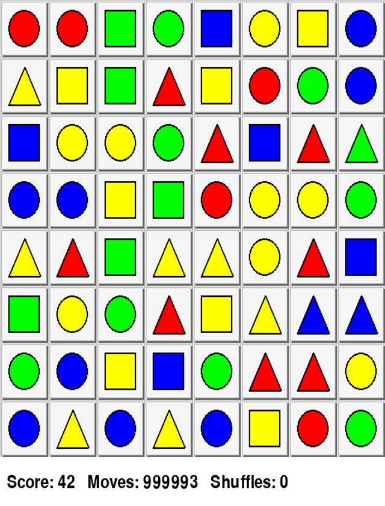

<code>08 · swap</code> — Look at row 4 col 2 Green square, row 3 col 3 Green square, row 1 col 2 Green square. Row 0 col 2 Green squar…

**Reasoning**

Look at row 4 col 2 Green square, row 3 col 3 Green square, row 1 col 2 Green square. Row 0 col 2 Green square. Row 0 col 0, 0 col 1 are Red circles! And row 1 col 5 Red circle, row 3 col 4 Red circle. Look at row 2: (2,1) Yellow circle, (2,2) Yellow circle! What is at (2,0)? Blue square. What is at (2,3)? Green circle. Where is another Yellow circle? Row 3 col 5, 3 col 6. Row 4 col 5. Row 5 col 1 Yellow circle! Look at column 1: (2,1) Yellow circle, (3,1) Blue circle, (4,1) Red triangle, (5,1) Yellow circle. Row 1 col 1 is Yellow square. But look at (2,1) and (2,2): both are Yellow circles! Can we bring a Yellow circle to (2,0) or (2,3)? No Yellow circle adjacent to (2,0) or (2,3). Wait, look at row 3: (3,0) Blue circle, (3,1) Blue circle! And row 2 col 1 is Yellow circle, row 4 col 1 is Red triangle. Row 3 col 2 is Yellow square. What about (1,1)? Yellow square. Look at column 0: (6,0) Green circle, (7,0) Blue circle, (3,0) Blue circle. Look at row 6: (6,5) Red triangle, (6,6) Red triangle. Row 4 col 6 is Red triangle! Row 5 col 6 is Blue triangle. Row 5 col 5 is Yellow triangle, row 5 col 7 is Blue triangle. Look at column 6: (1,6) Green circle, (2,6) Red triangle, (3,6) Yellow circle, (4,6) Red triangle, (5,6) Blue triangle, (6,6) Red triangle. Wait! Look at row 6: (6,5) Red triangle, (6,6) Red triangle. Can we swap (7,5) Yellow square and (7,6) Red circle? No. Can we swap (6,4) Green circle and (5,4) Yellow square? Wait! Look at row 5 col 3 Red triangle, row 4 col 3 Yellow triangle, row 3 col 3 Green square. Look at column 2: (0,2) Green square, (1,2) Green square, (2,2) Yellow circle, (3,2) Yellow square, (4,2) Green square. Row 4: (4,2) Green square. Row 3: (3,3) Green square. Row 1: (1,2) Green square. Look at row 3: (3,5) Yellow circle, (3,6) Yellow circle. Row 4 col 5 is Yellow circle! If we swap (4,5) Yellow circle with (4,6) Red triangle, then row 4 col 6 becomes Yellow circle... wait! Column 6: (2,6) Red triangle, (3,6) Yellow circle, (4,6) Red triangle! Swapping (4,6) with (4,5)? Then row 4 col 6 becomes Yellow circle! And column 6 would have (3,6) Yellow circle, (4,6) Yellow circle... is (5,6) Yellow circle? No, (5,6) is Blue triangle. But wait! Row 3: (3,5) Yellow circle, (3,6) Yellow circle. If we swap (4,6) and (3,6)? No. What about row 3 col 5, row 3 col 6, and row 3 col 7 is Green circle? Swap (3,7) Green circle and (2,7) Green triangle? Look at column 7: (0,7) Blue circle, (1,7) Blue circle, (2,7) Green triangle, (3,7) Green circle, (4,7) Blue square, (5,7) Blue triangle, (6,7) Yellow circle, (7,7) Green circle. Look at row 5: (5,0) Green square, (5,1) Yellow circle, (5,2) Green circle, (5,3) Red triangle, (5,4) Yellow square, (5,5) Yellow triangle, (5,6) Blue triangle, (5,7) Blue triangle. Row 6: (6,0) Green circle, (6,1) Blue circle, (6,2) Yellow square, (6,3) Blue square, (6,4) Green circle, (6,5) Red triangle, (6,6) Red triangle, (6,7) Yellow circle. Look at (6,1) Blue circle, (7,0) Blue circle, (7,2) Blue circle! Swap (7,1) Yellow triangle with (6,1) Blue circle! Then row 7 has: (7,0) Blue circle, (7,1) Blue circle, (7,2) Blue circle! WOW! Look at row 7: col 0 is Blue circle, col 1 is Yellow triangle, col 2 is Blue circle! And row 6 col 1 is Blue circle! If we swap (6,1) Blue circle and (7,1) Yellow triangle, row 7 gets: (7,0) Blue circle, (7,1) Blue circle, (7,2) Blue circle! PERFECT!

**Arguments**

<pre><code>{
  &quot;row1&quot;: 6,
  &quot;col1&quot;: 1,
  &quot;row2&quot;: 7,
  &quot;col2&quot;: 1
}</code></pre>

**Observation**

<pre><code>Swapped (6, 1) &lt;-&gt; (7, 1): +6 point(s). Reward +6. Score 48.</code></pre>

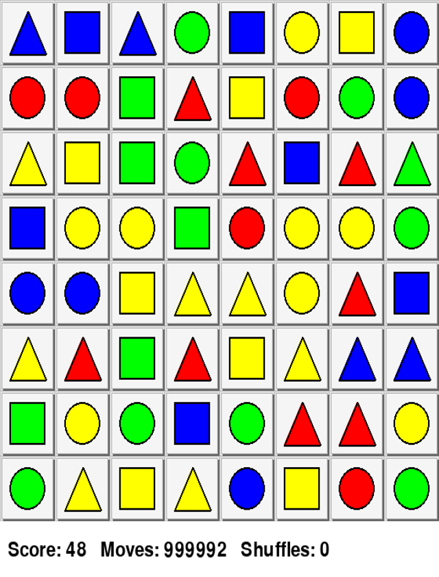

<code>09 · swap</code> — Let&#x27;s find the next match. Look at column 2: (1,2) Green square, (2,2) Green square. Row 0 col 2 is Blue tria…

**Reasoning**

Let&#x27;s find the next match.
Look at column 2: (1,2) Green square, (2,2) Green square. Row 0 col 2 is Blue triangle. Row 3 col 2 is Yellow circle. Row 3 col 3 is Green square!
Wait, look at row 3: (3,0) Blue square, (3,1) Yellow circle, (3,2) Yellow circle, (3,3) Green square! If we swap (3,3) Green square with (2,3) Green circle? Then (3,3) doesn&#x27;t help col 2.
Wait! Look at (2,2) Green square, (1,2) Green square, and (3,3) Green square. Can (3,3) move to (3,2)? Swap (3,2) Yellow circle and (3,3) Green square! Then column 2 has: (1,2) Green square, (2,2) Green square, (3,2) Green square! YES!
Let&#x27;s check: (1,2) is Green square. (2,2) is Green square. (3,2) is Yellow circle. (3,3) is Green square. Swapping (3,2) and (3,3) puts the Green square at (3,2), completing a vertical line of three Green squares at (1,2), (2,2), (3,2)!

**Arguments**

<pre><code>{
  &quot;row1&quot;: 3,
  &quot;col1&quot;: 2,
  &quot;row2&quot;: 3,
  &quot;col2&quot;: 3
}</code></pre>

**Observation**

<pre><code>Swapped (3, 2) &lt;-&gt; (3, 3): +6 point(s). Reward +6. Score 54.</code></pre>

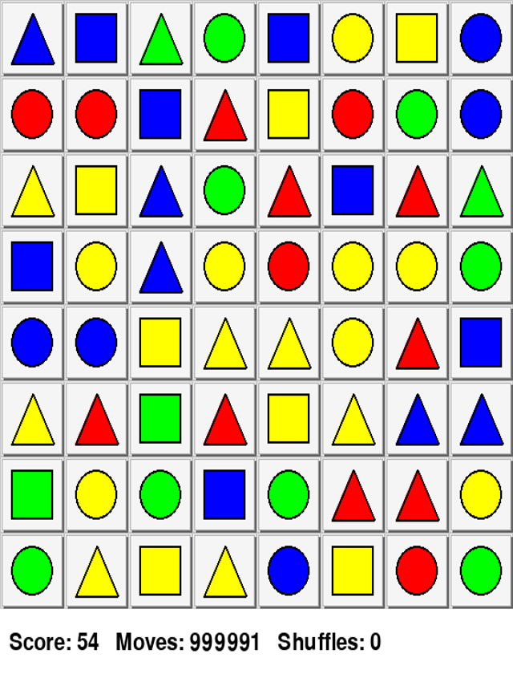

<code>10 · swap</code> — Score is 54. Look at row 3: (3,3) Yellow circle, (3,5) Yellow circle, (3,6) Yellow circle. Row 3 col 4 is Red…

**Reasoning**

Score is 54.
Look at row 3: (3,3) Yellow circle, (3,5) Yellow circle, (3,6) Yellow circle. Row 3 col 4 is Red circle! And row 4 col 5 is Yellow circle! Swap (3,4) Red circle and (4,4) Yellow triangle? Wait, (4,4) is Yellow triangle. What about (2,4) Red triangle? What about swapping (3,4) Red circle with (3,3) Yellow circle? Then row 3 col 4 is Yellow circle, but col 3 is Red circle. Does that make 3 Yellow circles? Col 4 is Yellow circle, col 5 is Yellow circle, col 6 is Yellow circle! YES! Look at row 3: (3,3) Yellow circle, (3,4) Red circle, (3,5) Yellow circle, (3,6) Yellow circle. If we swap (3,4) Red circle with (3,3) Yellow circle, then (3,4) becomes Yellow circle, and cols 4, 5, 6 will be Yellow circles! Wait, what about (3,3)? It becomes Red circle. Does it match anything? It doesn&#x27;t matter as long as (3,4), (3,5), (3,6) forms a match of 3! But wait, swapping (3,3) and (3,4) moves the Yellow circle from (3,3) into (3,4), which joins (3,5) and (3,6) to make 3 Yellow circles! Let&#x27;s verify: (3,3) is Yellow circle, (3,4) is Red circle, (3,5) is Yellow circle, (3,6) is Yellow circle. Yes, exactly!

**Arguments**

<pre><code>{
  &quot;row1&quot;: 3,
  &quot;col1&quot;: 3,
  &quot;row2&quot;: 3,
  &quot;col2&quot;: 4
}</code></pre>

**Observation**

<pre><code>Swapped (3, 3) &lt;-&gt; (3, 4): +6 point(s). Reward +6. Score 60.</code></pre>

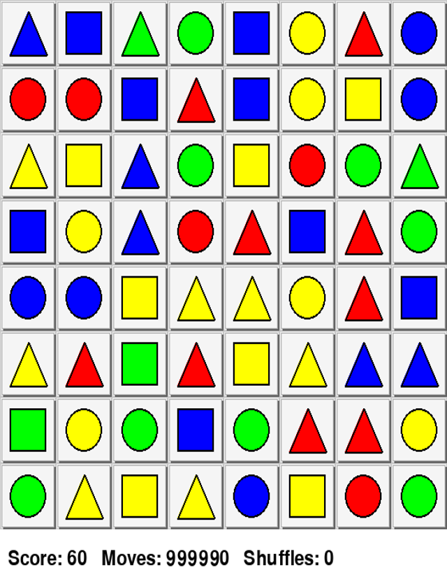

<code>11 · swap</code> — Score is 60. Let&#x27;s find the next move. Look at column 5: (0,5) Yellow circle, (1,5) Yellow circle, (2,5) Red…

**Reasoning**

Score is 60.
Let&#x27;s find the next move.
Look at column 5: (0,5) Yellow circle, (1,5) Yellow circle, (2,5) Red circle, (3,5) Blue square, (4,5) Yellow circle. Wait! If we swap (2,5) Red circle and (1,5) Yellow circle? That doesn&#x27;t match 3. But wait! (0,5) is Yellow circle, (1,5) is Yellow circle! What is at (2,5)? Red circle. What is adjacent to (2,5)? (2,4) Yellow square, (2,6) Green circle, (3,5) Blue square. None of them are Yellow circle.
Wait, look at row 0: (0,5) Yellow circle, row 1: (1,5) Yellow circle. Row 2 col 4 is Yellow square.
Look at row 4: (4,3) Yellow triangle, (4,4) Yellow triangle, (4,5) Yellow circle. Swap (4,5) Yellow circle and (5,5) Yellow triangle? Then (4,5) becomes Yellow triangle, completing (4,3), (4,4), (4,5) Yellow triangles! Let&#x27;s check: row 4 col 3 is Yellow triangle, row 4 col 4 is Yellow triangle, row 4 col 5 is Yellow circle. Row 5 col 5 is Yellow triangle! YES! Swapping (4,5) and (5,5) moves Yellow triangle to (4,5), creating a horizontal line of three Yellow triangles at (4,3), (4,4), (4,5)!

**Arguments**

<pre><code>{
  &quot;row1&quot;: 4,
  &quot;col1&quot;: 5,
  &quot;row2&quot;: 5,
  &quot;col2&quot;: 5
}</code></pre>

**Observation**

<pre><code>Swapped (4, 5) &lt;-&gt; (5, 5): +6 point(s). Reward +6. Score 66.</code></pre>

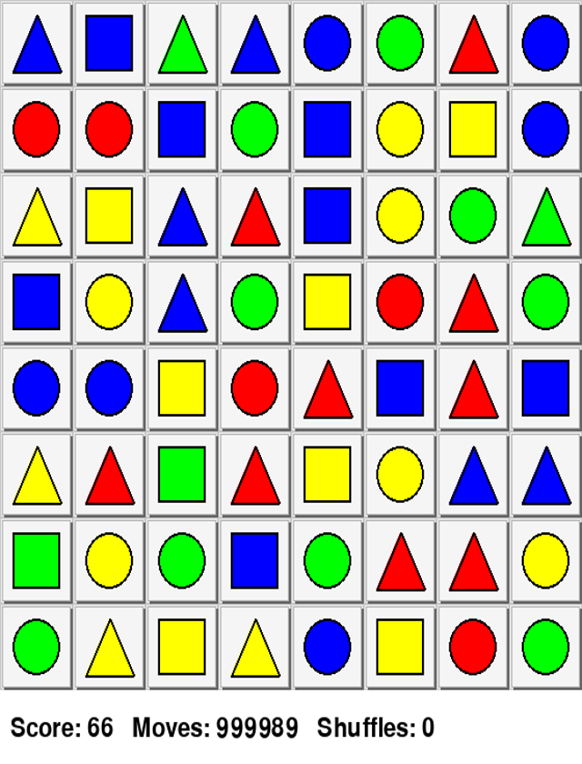

<code>12 · swap</code> — Score is 66. Look at column 5: (1,5) Yellow circle, (2,5) Yellow circle! What is at (3,5)? Red circle. What i…

**Reasoning**

Score is 66.
Look at column 5: (1,5) Yellow circle, (2,5) Yellow circle! What is at (3,5)? Red circle. What is at (0,5)? Green circle? Wait, look at column 5: row 0 is Green circle, row 1 is Yellow circle, row 2 is Yellow circle, row 3 is Red circle, row 4 is Blue square, row 5 is Yellow circle! If we swap (3,5) Red circle and (3,4) Yellow square? Wait, (4,5) is Blue square, (5,5) is Yellow circle. What is adjacent to (3,5)? Left is (3,4) Yellow square, right is (3,6) Red triangle. Wait! Look at row 3: (3,4) Yellow square, (3,5) Red circle, (3,6) Red triangle. Row 4 col 6 is Red triangle. Row 2 col 6 is Green circle.
Look at column 4: (1,4) Blue square, (2,4) Blue square, (3,4) Yellow square, (4,4) Red triangle, (5,4) Yellow square. Wait! (1,4) is Blue square, (2,4) is Blue square, and what is at (0,4)? Blue circle. What is at (3,4)? Yellow square. What is adjacent to (3,4)? Left is (3,3) Green circle, right is (3,5) Red circle, below is (4,4) Red triangle. What about row 4 col 5? Blue square! Swap (4,4) Red triangle and (4,5) Blue square? Then (4,4) becomes Blue square! But that doesn&#x27;t put Blue square at (3,4).
Wait, what about (3,4) Yellow square and (4,5) Blue square? Can&#x27;t swap diagonal.
Look at column 6: (3,6) Red triangle, (4,6) Red triangle! And (5,6) is Blue triangle. Row 6 col 6 is Red triangle! Row 6 col 5 is Red triangle! Look at row 6: (6,5) Red triangle, (6,6) Red triangle. What about row 5 col 6? Blue triangle. If we swap (5,6) Blue triangle with (5,5) Yellow circle? Wait, if we swap (5,6) Blue triangle with (4,6) Red triangle? That breaks (3,6) and (4,6). But what if we swap (5,6) Blue triangle with (6,6) Red triangle? Then (5,6) becomes Red triangle, making column 6 have: (3,6) Red triangle, (4,6) Red triangle, (5,6) Red triangle! Three Red triangles in column 6! Let&#x27;s check: row 3 col 6 is Red triangle, row 4 col 6 is Red triangle, row 5 col 6 is Blue triangle, row 6 col 6 is Red triangle. If we swap (5,6) and (6,6), row 5 col 6 becomes Red triangle, connecting with (3,6) and (4,6) to form three Red triangles vertically at (3,6), (4,6), (5,6)! YES!

**Arguments**

<pre><code>{
  &quot;row1&quot;: 5,
  &quot;col1&quot;: 6,
  &quot;row2&quot;: 6,
  &quot;col2&quot;: 6
}</code></pre>

**Observation**

<pre><code>Swapped (5, 6) &lt;-&gt; (6, 6): +6 point(s). No moves available - board shuffled! Reward +6. Score 72.</code></pre>

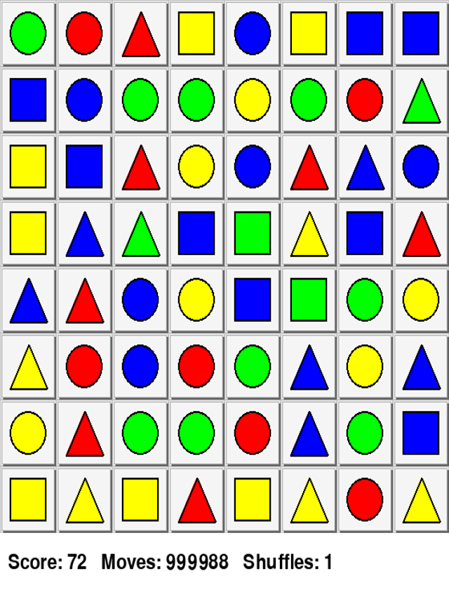

<code>13 · swap</code> — Score is 72. Board was shuffled. Let&#x27;s find valid moves on this freshly shuffled board. Look at row 1: (1,2)…

**Reasoning**

Score is 72. Board was shuffled.
Let&#x27;s find valid moves on this freshly shuffled board.
Look at row 1: (1,2) Green circle, (1,3) Green circle. Row 1 col 5 is Green circle! (1,4) is Yellow circle. Can we swap (1,4) Yellow circle with (2,4) Blue circle? No. Swap (1,4) with (0,4) Blue circle? No. Swap (0,3) Yellow square and (1,3)? No.
Look at row 6: (6,2) Green circle, (6,3) Green circle. (5,4) Green circle. (6,6) Green circle. (6,4) is Red circle! Can we swap (6,4) Red circle and (5,4) Green circle? Then row 6 has: (6,2) Green circle, (6,3) Green circle, (6,4) Green circle! YES! Look at row 6: (6,2) Green circle, (6,3) Green circle, (6,4) Red circle. Above (6,4) is (5,4) Green circle! Swapping (5,4) and (6,4) brings Green circle to (6,4), forming a horizontal match of 3 Green circles at (6,2), (6,3), (6,4)!

**Arguments**

<pre><code>{
  &quot;row1&quot;: 5,
  &quot;col1&quot;: 4,
  &quot;row2&quot;: 6,
  &quot;col2&quot;: 4
}</code></pre>

**Observation**

<pre><code>Swapped (5, 4) &lt;-&gt; (6, 4): +6 point(s). No moves available - board shuffled! Reward +6. Score 78.</code></pre>

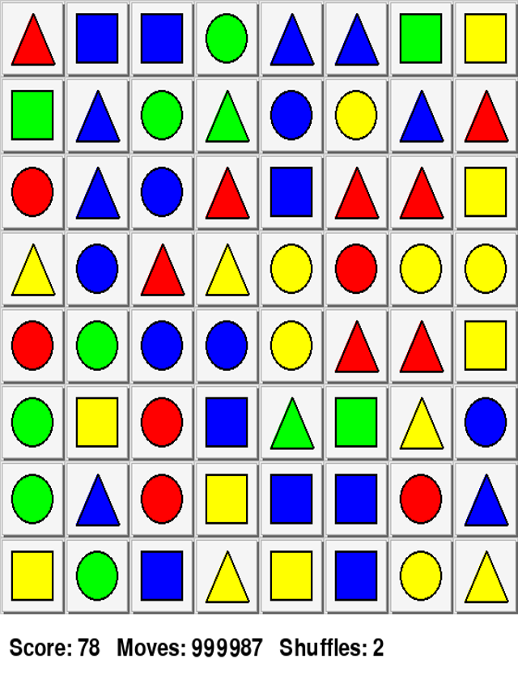

<code>14 · swap</code> — Score is 78. Board was shuffled again. Let&#x27;s find valid moves: Look at row 3: (3,4) Yellow circle, (3,5) Red…

**Reasoning**

Score is 78. Board was shuffled again.
Let&#x27;s find valid moves:
Look at row 3: (3,4) Yellow circle, (3,5) Red circle, (3,6) Yellow circle, (3,7) Yellow circle. Swap (3,5) Red circle with (2,5) Red triangle? Wait, (4,4) is Yellow circle! Look at row 3 col 6 Yellow circle, row 3 col 7 Yellow circle. If we swap (3,5) Red circle with (4,5) Red triangle? No, (4,4) is Yellow circle, (3,4) is Yellow circle. What about swapping (3,5) Red circle with something else? If we swap (3,5) Red circle and (4,5) Red triangle, neither is Yellow circle.
Wait! Look at (3,6) Yellow circle, (3,7) Yellow circle, and (3,4) Yellow circle! What is at (3,5)? Red circle! Can we put a Yellow circle at (3,5)? Look at neighbors of (3,5): above is (2,5) Red triangle, below is (4,5) Red triangle, left is (3,4) Yellow circle, right is (3,6) Yellow circle. None of above/below are Yellow circle.
Wait! Look at column 6: (3,6) Yellow circle. (2,6) Red triangle, (4,6) Red triangle! And (1,6) Blue triangle. What about (2,5) Red triangle, (3,5) Red circle, (4,5) Red triangle? Swapping (3,5) Red circle and (3,4) Yellow circle? Then row 3 col 4 becomes Red circle, col 5 becomes Yellow circle! And row 3 now has (3,5) Yellow circle, (3,6) Yellow circle, (3,7) Yellow circle! YES! Three Yellow circles horizontally at (3,5), (3,6), (3,7)!
Let&#x27;s verify: Row 3 is currently: (3,0) Yellow triangle, (3,1) Blue circle, (3,2) Red triangle, (3,3) Yellow triangle, (3,4) Yellow circle, (3,5) Red circle, (3,6) Yellow circle, (3,7) Yellow circle. If we swap (3,4) Yellow circle with (3,5) Red circle, then (3,5) becomes Yellow circle! So (3,5), (3,6), (3,7) are all Yellow circles! Valid match of 3!

**Arguments**

<pre><code>{
  &quot;row1&quot;: 3,
  &quot;col1&quot;: 4,
  &quot;row2&quot;: 3,
  &quot;col2&quot;: 5
}</code></pre>

**Observation**

<pre><code>Swapped (3, 4) &lt;-&gt; (3, 5): +6 point(s). Reward +6. Score 84.</code></pre>

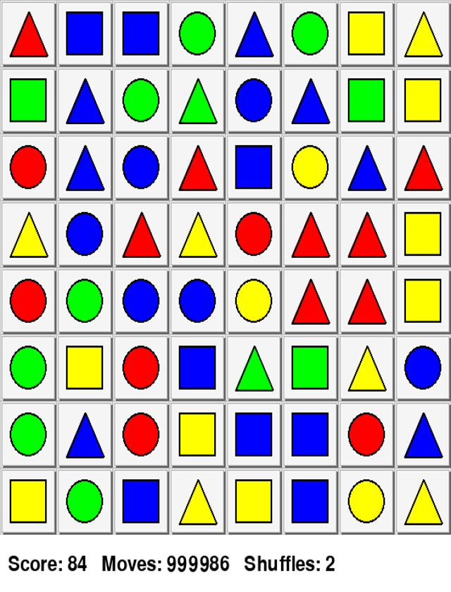

<code>15 · swap</code> — Score is 84. Let&#x27;s find the next move. Look at row 3: (3,5) Red triangle, (3,6) Red triangle! What is at (3,7…

**Reasoning**

Score is 84.
Let&#x27;s find the next move.
Look at row 3: (3,5) Red triangle, (3,6) Red triangle! What is at (3,7)? Yellow square. What is at (4,6)? Red triangle! Wait, look at column 6: (2,6) Blue triangle, (3,6) Red triangle, (4,6) Red triangle! Row 3 col 5 is Red triangle! So (3,5) is Red triangle, (3,6) is Red triangle, (4,6) is Red triangle. And (4,5) is Red triangle! Wait! Look at row 4: (4,5) Red triangle, (4,6) Red triangle! And row 3: (3,5) Red triangle, (3,6) Red triangle! That&#x27;s a 2x2 square of Red triangles: (3,5), (3,6), (4,5), (4,6)! Can we make a 3-in-a-row? Look at (2,5): Yellow circle. Can we swap (2,5) Yellow circle with something to put Red triangle there? Look at (2,7) Red triangle! Swap (2,7) Red triangle and (2,6) Blue triangle? Then (2,6) becomes Red triangle! That would give column 6: (2,6) Red triangle, (3,6) Red triangle, (4,6) Red triangle! YES! Look at row 2: (2,5) Yellow circle, (2,6) Blue triangle, (2,7) Red triangle. If we swap (2,6) and (2,7), then (2,6) becomes Red triangle! And below (2,6) are (3,6) Red triangle and (4,6) Red triangle! That completes a vertical line of three Red triangles at (2,6), (3,6), (4,6)! Let&#x27;s verify: Row 2 col 6 is Blue triangle, Row 2 col 7 is Red triangle. Row 3 col 6 is Red triangle. Row 4 col 6 is Red triangle. Swapping (2,6) and (2,7) puts Red triangle at (2,6)!

**Arguments**

<pre><code>{
  &quot;row1&quot;: 2,
  &quot;col1&quot;: 6,
  &quot;row2&quot;: 2,
  &quot;col2&quot;: 7
}</code></pre>

**Observation**

<pre><code>Swapped (2, 6) &lt;-&gt; (2, 7): +6 point(s). Reward +6. Score 90.</code></pre>

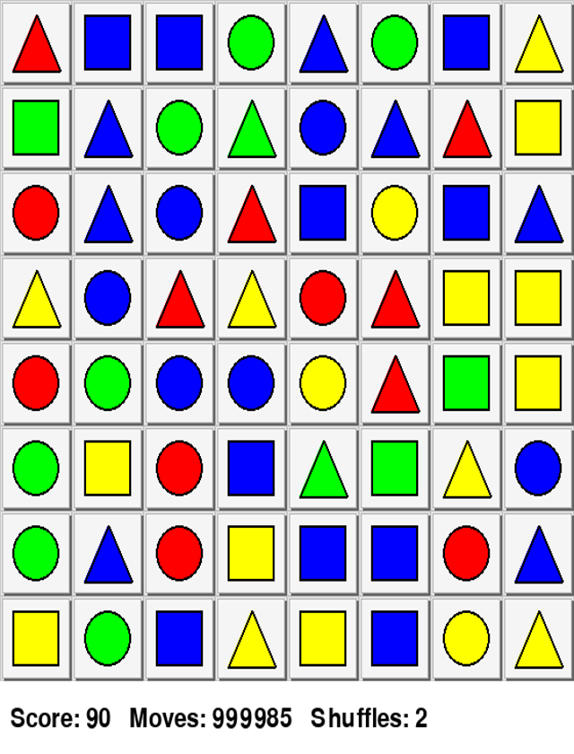

<code>16 · swap</code> — Score is 90. Let&#x27;s find the next move. Look at row 3: (3,6) Yellow square, (3,7) Yellow square! And row 4 col…

**Reasoning**

Score is 90.
Let&#x27;s find the next move.
Look at row 3: (3,6) Yellow square, (3,7) Yellow square! And row 4 col 7 is Yellow square! What is at row 4 col 6? Green square. Row 2 col 7 is Blue triangle. Row 5 col 7 is Blue circle. Row 1 col 7 is Yellow square! Column 7 has: (1,7) Yellow square, (3,7) Yellow square, (4,7) Yellow square! Between them is (2,7) Blue triangle! And adjacent to (2,7) is (2,6) Blue square! What about row 3 col 6 Yellow square? We can swap (2,6) Blue square and (3,6) Yellow square? Wait, if we swap (2,7) Blue triangle with (3,7) Yellow square? Then (2,7) is Yellow square, but row 3 loses (3,7). Wait, column 7: (1,7) Yellow square, (2,7) Blue triangle, (3,7) Yellow square, (4,7) Yellow square! If we move a Yellow square into (2,7)? (1,7) is Yellow square, so if (2,7) is Yellow square, we get (1,7), (2,7), (3,7), (4,7) - 4 in a column! Where is a Yellow square adjacent to (2,7)? Row 2 col 6 is Blue square, row 3 col 7 is Yellow square! If we swap (2,7) Blue triangle and (3,7) Yellow square, (2,7) becomes Yellow square! Then (1,7) is Yellow square, (2,7) is Yellow square... wait, what is at (3,7)? It becomes Blue triangle! Then (4,7) is Yellow square, so col 7 has Yellow square at (1,7) and (2,7), but not (3,7)! That&#x27;s only 2! But wait! What about row 3? Row 3 has (3,6) Yellow square! If (3,7) becomes Blue triangle, that doesn&#x27;t match. But wait! Look at (3,6) Yellow square! What is at (4,6)? Green square. What is at (4,7)? Yellow square! What is at (3,7)? Yellow square! What about (5,6)? Yellow triangle. Look at row 4: (4,2) Blue circle, (4,3) Blue circle! And row 4 col 1 is Green circle, row 4 col 4 is Yellow circle. Look at (3,1) Blue circle, (2,2) Blue circle. Swap (3,1) Blue circle and (4,1) Green circle? Then row 4 has: (4,1) Blue circle, (4,2) Blue circle, (4,3) Blue circle! Three Blue circles horizontally at (4,1), (4,2), (4,3)! Let&#x27;s check: (4,1) is Green circle, (4,2) is Blue circle, (4,3) is Blue circle. Row 3 col 1 is Blue circle! If we swap (3,1) Blue circle and (4,1) Green circle, then (4,1) becomes Blue circle! This creates a horizontal match of three Blue circles at (4,1), (4,2), (4,3)! YES!

**Arguments**

<pre><code>{
  &quot;row1&quot;: 3,
  &quot;col1&quot;: 1,
  &quot;row2&quot;: 4,
  &quot;col2&quot;: 1
}</code></pre>

**Observation**

<pre><code>Swapped (3, 1) &lt;-&gt; (4, 1): +6 point(s). Reward +6. Score 96.</code></pre>

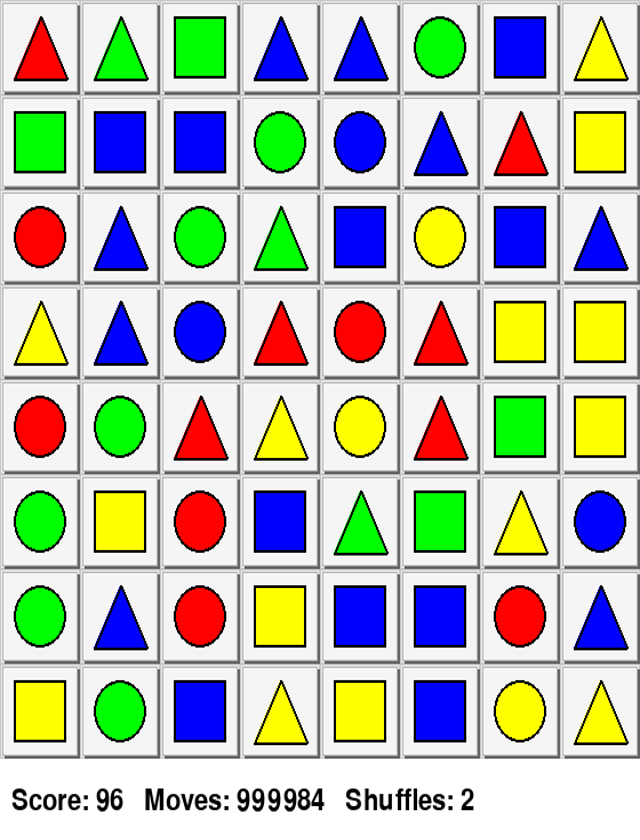

<code>17 · swap</code> — Score is 96. Look at column 1: (1,1) Blue square, (2,1) Blue triangle, (3,1) Blue triangle. Row 0 col 4 is Bl…

**Reasoning**

Score is 96.
Look at column 1: (1,1) Blue square, (2,1) Blue triangle, (3,1) Blue triangle. Row 0 col 4 is Blue triangle, row 1 col 5 is Blue triangle. Row 2 col 7 is Blue triangle. Row 6 col 1 is Blue triangle! Row 6 col 7 is Blue triangle.
Wait, look at row 3: (3,0) Yellow triangle, (3,1) Blue triangle, (3,2) Blue circle, (3,3) Red triangle, (3,4) Red circle, (3,5) Red triangle, (3,6) Yellow square, (3,7) Yellow square.
Wait, look at (3,3) Red triangle, (3,5) Red triangle, and (4,2) Red triangle! Wait, row 4 col 5 is Red triangle! So (3,5) is Red triangle, (4,5) is Red triangle! What is at (5,5)? Green square. What is at (2,5)? Yellow circle. What is at (3,4)? Red circle. What is at (3,6)? Yellow square. Look at row 4: (4,5) Red triangle, row 3: (3,5) Red triangle. Where is another Red triangle? Row 3 col 3, row 4 col 2, row 1 col 6, row 0 col 0.
Wait, look at row 4 col 7 Yellow square, row 3 col 6 Yellow square, row 3 col 7 Yellow square! Column 7 has: (1,7) Yellow square, (2,7) Blue triangle, (3,7) Yellow square, (4,7) Yellow square! Swap (2,7) Blue triangle and (2,6) Blue square? Then col 7 doesn&#x27;t change. Swap (2,7) Blue triangle with (1,7) Yellow square? Then (2,7) is Yellow square, so (2,7), (3,7), (4,7) are all Yellow squares! YES! Column 7 has: (1,7) Yellow square, (2,7) Blue triangle, (3,7) Yellow square, (4,7) Yellow square. Swapping (1,7) and (2,7) moves Yellow square to (2,7), completing a vertical line of three Yellow squares at (2,7), (3,7), (4,7)! Let&#x27;s verify: Row 1 col 7 is Yellow square, Row 2 col 7 is Blue triangle. Below (2,7) are (3,7) Yellow square and (4,7) Yellow square. So swapping (1,7) and (2,7) puts Yellow square at (2,7), matching with (3,7) and (4,7)!

**Arguments**

<pre><code>{
  &quot;row1&quot;: 1,
  &quot;col1&quot;: 7,
  &quot;row2&quot;: 2,
  &quot;col2&quot;: 7
}</code></pre>

**Observation**

<pre><code>Swapped (1, 7) &lt;-&gt; (2, 7): +6 point(s). Reward +6. Score 102.</code></pre>

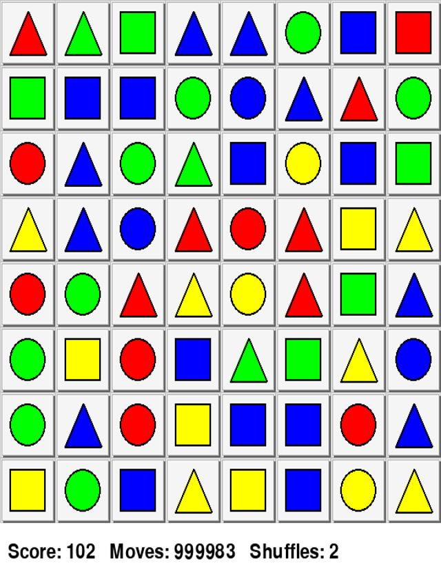

<code>18 · swap</code> — Score is 102. Moves left: 999983. Let&#x27;s find the next move. Look at row 1: (1,1) Blue square, (1,2) Blue squa…

**Reasoning**

Score is 102. Moves left: 999983.
Let&#x27;s find the next move.
Look at row 1: (1,1) Blue square, (1,2) Blue square. Row 2 col 4 is Blue square, row 2 col 6 is Blue square. Row 5 col 3 is Blue square. Row 6 col 4 is Blue square, row 6 col 5 is Blue square, row 7 col 2 is Blue square, row 7 col 5 is Blue square.
Wait, look at row 6: (6,4) Blue square, (6,5) Blue square! What is at (6,3)? Yellow square. What is at (6,6)? Red circle. What is at (7,5)? Blue square! What is at (5,4)? Green square, (5,5)? Green square. Wait! (6,4) Blue square, (6,5) Blue square, (7,5) Blue square. If we swap (7,5) Blue square and (7,4) Yellow square? Then (7,4) becomes Blue square, matching with (6,4) Blue square... wait, is (5,4) Blue square? No, (5,4) is Green square. What about (6,3) Yellow square? Above it is (5,3) Blue square! YES! Look at row 6: (6,3) is Yellow square, (6,4) is Blue square, (6,5) is Blue square. And (5,3) is Blue square! Swapping (5,3) Blue square and (6,3) Yellow square puts the Blue square at (6,3), creating a horizontal line of three Blue squares at (6,3), (6,4), (6,5)! Let&#x27;s verify: (5,3) is Blue square, (6,3) is Yellow square. Swapping them puts Blue square at (6,3), which aligns with (6,4) Blue square and (6,5) Blue square!

**Arguments**

<pre><code>{
  &quot;row1&quot;: 5,
  &quot;col1&quot;: 3,
  &quot;row2&quot;: 6,
  &quot;col2&quot;: 3
}</code></pre>

**Observation**

<pre><code>Swapped (5, 3) &lt;-&gt; (6, 3): +6 point(s). Reward +6. Score 108.</code></pre>

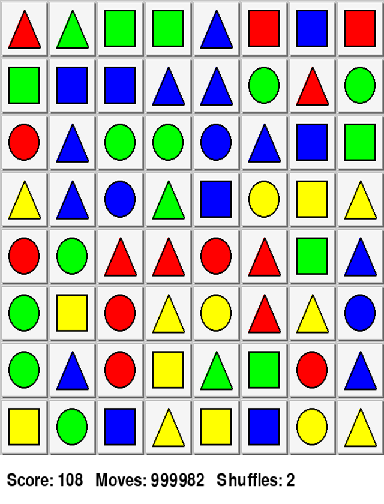

<code>19 · swap</code> — Score is 108. Let&#x27;s find the next move. Look at row 4: (4,2) Red triangle, (4,3) Red triangle, (4,4) Red circ…

**Reasoning**

Score is 108.
Let&#x27;s find the next move.
Look at row 4: (4,2) Red triangle, (4,3) Red triangle, (4,4) Red circle, (4,5) Red triangle! Wow, look at row 4: (4,2) Red triangle, (4,3) Red triangle, (4,4) Red circle, (4,5) Red triangle! What is below (4,4)? (5,4) Yellow circle. What is above (4,4)? (3,4) Blue square. What is below (4,5)? (5,5) Red triangle! Wait, (5,5) is Red triangle! Look at column 5: (4,5) Red triangle, (5,5) Red triangle! What is at (3,5)? Yellow circle. What is at (2,5)? Blue triangle. What is at (6,5)? Green square.
Wait! Look at (4,2) Red triangle, (4,3) Red triangle, (4,4) Red circle, (4,5) Red triangle. If we swap (4,4) Red circle and (5,5) Red triangle? No, they are diagonal.
Wait, look at row 5: (5,2) Red circle, (6,2) Red circle! Column 2 has (5,2) Red circle, (6,2) Red circle. What is at (7,2)? Blue square. What is at (4,2)? Red triangle. What is at (6,3)? Yellow square.
Wait, look at column 1: (1,1) Blue square, (2,1) Blue triangle, (3,1) Blue triangle, (4,1) Green circle, (5,1) Yellow square, (6,1) Blue triangle. Look at (2,1) Blue triangle, (3,1) Blue triangle. What is at (1,1)? Blue square. What is at (4,1)? Green circle.
Look at row 1: (1,1) Blue square, (1,2) Blue square. Row 0 col 2 is Green square, row 0 col 3 is Green square. Row 0 col 6 is Blue square, row 2 col 6 is Blue square.
Wait, look at (1,2) Blue square: above it is (0,2) Green square, right is (1,3) Blue triangle. Row 1 col 4 is Blue triangle! So row 1 has: (1,3) Blue triangle, (1,4) Blue triangle! And row 0 col 4 is Blue triangle! YES! Look at row 1 col 3 Blue triangle, row 1 col 4 Blue triangle, and row 0 col 4 Blue triangle! And row 2 col 5 is Blue triangle! Row 1 col 5 is Green circle! Swap (1,5) Green circle and (2,5) Blue triangle? Then (1,5) becomes Blue triangle! That gives (1,3), (1,4), (1,5) all Blue triangles! Let&#x27;s verify: row 1 col 3 is Blue triangle, row 1 col 4 is Blue triangle, row 1 col 5 is Green circle. Row 2 col 5 is Blue triangle! Swapping (1,5) and (2,5) puts Blue triangle at (1,5), creating a horizontal line of three Blue triangles at (1,3), (1,4), (1,5)!

**Arguments**

<pre><code>{
  &quot;row1&quot;: 1,
  &quot;col1&quot;: 5,
  &quot;row2&quot;: 2,
  &quot;col2&quot;: 5
}</code></pre>

**Observation**

<pre><code>Swapped (1, 5) &lt;-&gt; (2, 5): +6 point(s). Reward +6. Score 114.</code></pre>

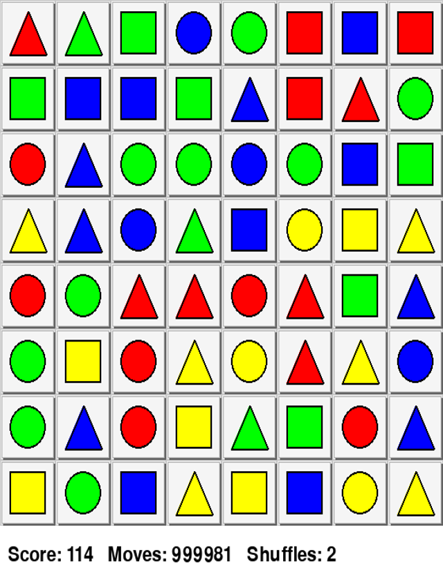

<code>20 · swap</code> — Score is 114. Let&#x27;s find the next move. Look at row 1: (1,1) Blue square, (1,2) Blue square. Row 0 col 6 is B…

**Reasoning**

Score is 114.
Let&#x27;s find the next move.
Look at row 1: (1,1) Blue square, (1,2) Blue square. Row 0 col 6 is Blue square, row 2 col 6 is Blue square. Row 7 col 2 is Blue square, row 7 col 5 is Blue square.
Look at row 2: (2,2) Green circle, (2,3) Green circle. Row 0 col 4 is Green circle. Row 2 col 5 is Green circle! Row 1 col 7 is Green circle! Look at row 2: (2,2) Green circle, (2,3) Green circle, (2,4) Blue circle, (2,5) Green circle. Swapping (2,4) Blue circle and (1,4) Blue triangle? Then (2,4) is Blue triangle. But what if we swap (2,4) Blue circle and (0,4) Green circle? Not adjacent.
Wait! Look at (2,4) Blue circle and (2,5) Green circle: if we swap (2,4) and (2,5), then (2,4) becomes Green circle! That makes (2,2) Green circle, (2,3) Green circle, (2,4) Green circle! YES! Look at row 2: (2,2) is Green circle, (2,3) is Green circle, (2,4) is Blue circle, (2,5) is Green circle. Swapping (2,4) and (2,5) puts Green circle at (2,4), completing a horizontal line of three Green circles at (2,2), (2,3), (2,4)! Let&#x27;s verify: Row 2 has (2,2)=Green circle, (2,3)=Green circle, (2,4)=Blue circle, (2,5)=Green circle. Swapping (2,4) and (2,5) makes row 2 cols 2, 3, 4 all Green circles!

**Arguments**

<pre><code>{
  &quot;row1&quot;: 2,
  &quot;col1&quot;: 4,
  &quot;row2&quot;: 2,
  &quot;col2&quot;: 5
}</code></pre>

**Observation**

<pre><code>Swapped (2, 4) &lt;-&gt; (2, 5): +6 point(s). Reward +6. Score 120.</code></pre>

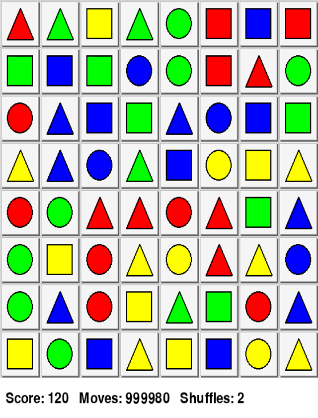

<code>21 · swap</code> — Score is 120. Need score &gt;= 150 (30 more points = 5 matches). Let&#x27;s find the next move. Look at column 4: (0,…

**Reasoning**

Score is 120. Need score &gt;= 150 (30 more points = 5 matches).
Let&#x27;s find the next move.
Look at column 4: (0,4) Green circle, (1,4) Green circle. What is at (2,4)? Blue triangle. What is at (3,4)? Blue square. What is at (4,4)? Red circle. Look at (0,4) Green circle, (1,4) Green circle, (2,4) Blue triangle. What is adjacent to (2,4)? Left is (2,3) Green square, right is (2,5) Blue circle, below is (3,4) Blue square. None of them are Green circle.
Wait! Look at (1,4) Green circle, (1,7) Green circle. Row 0 col 4 is Green circle. Row 4 col 1 is Green circle.
Look at row 4: (4,2) Red triangle, (4,3) Red triangle, (4,4) Red circle, (4,5) Red triangle! Wow, row 4 has: (4,2) Red triangle, (4,3) Red triangle, (4,4) Red circle, (4,5) Red triangle! Swapping (4,4) Red circle and (4,5) Red triangle puts Red triangle at (4,4), completing (4,2), (4,3), (4,4) Red triangles! YES! Look at row 4: (4,2)=Red triangle, (4,3)=Red triangle, (4,4)=Red circle, (4,5)=Red triangle. If we swap (4,4) and (4,5), then (4,4) becomes Red triangle, making (4,2), (4,3), (4,4) three Red triangles in a row! Let&#x27;s verify: Row 4 col 4 is Red circle, row 4 col 5 is Red triangle. Swapping them puts the Red triangle into (4,4), immediately forming a horizontal match of 3 Red triangles at (4,2), (4,3), (4,4)!

**Arguments**

<pre><code>{
  &quot;row1&quot;: 4,
  &quot;col1&quot;: 4,
  &quot;row2&quot;: 4,
  &quot;col2&quot;: 5
}</code></pre>

**Observation**

<pre><code>Swapped (4, 4) &lt;-&gt; (4, 5): +12 point(s). Reward +12. Score 132.</code></pre>

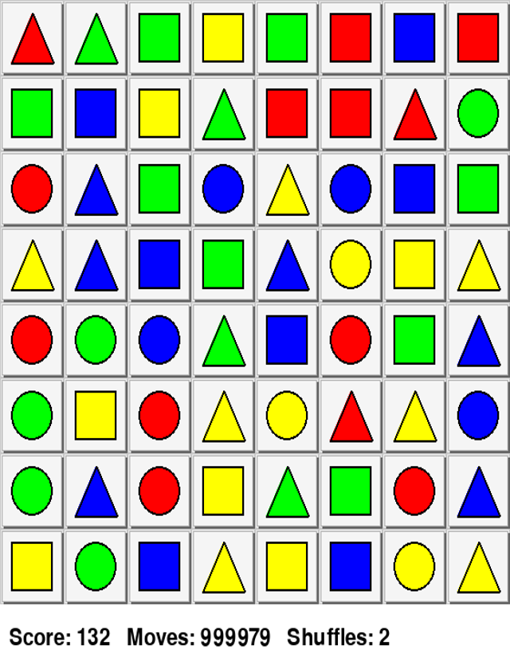

<code>22 · swap</code> — Score is 132 (+12 cascade!). Need &gt;= 150 (18 points left). Let&#x27;s find the next move. Look at row 1: (1,4) Red…

**Reasoning**

Score is 132 (+12 cascade!). Need &gt;= 150 (18 points left).
Let&#x27;s find the next move.
Look at row 1: (1,4) Red square, (1,5) Red square. Row 0 col 5 is Red square, row 0 col 7 is Red square! Column 5 has: (0,5) Red square, (1,5) Red square! What is at (2,5)? Blue circle. What is at (1,4)? Red square! If we swap (0,4) Green square and (1,4) Red square? No. What about row 1: (1,4) Red square, (1,5) Red square. What is at (1,6)? Red triangle. What is at (0,6)? Blue square. What is at (2,6)? Blue square. What is at (1,7)? Green circle. Where is another Red square? Row 0 col 5, row 0 col 7. If we swap (0,6) Blue square and (0,7) Red square? Then row 0 has: (0,5) Red square, (0,6) Red square! But what about (0,7)? Not 3 yet. Wait, look at column 5: (0,5) Red square, (1,5) Red square! What is at (2,5)? Blue circle. Adjacent to (2,5) are: (2,4) Yellow triangle, (2,6) Blue square, (3,5) Yellow circle. None are Red square.
Wait, look at row 3: (3,1) Blue triangle, (3,4) Blue triangle. What is at (3,2)? Blue square. What is at (3,3)? Green square.
Look at column 1: (1,1) Blue square, (2,1) Blue triangle, (3,1) Blue triangle. And (4,1) is Green circle, (5,1) is Yellow square, (6,1) is Blue triangle. Swap (6,1) Blue triangle and (7,1) Green circle? Then (7,1) is Blue triangle, row 7 col 2 is Blue square, row 7 col 3 is Yellow triangle.
Wait, look at row 5: (5,2) Red circle, (6,2) Red circle! Column 2 has (5,2) Red circle, (6,2) Red circle. What is at (4,2)? Blue circle! What is adjacent to (4,2)? (4,0) Red circle! (4,1) Green circle. Swap (4,1) Green circle and (4,2) Blue circle? No. Swap (4,0) Red circle and (5,0) Green circle? Wait, look at column 0: (2,0) Red circle, (4,0) Red circle. (3,0) Yellow triangle. If we swap (3,0) Yellow triangle and (3,1) Blue triangle? No.
Wait! Look at row 4: (4,0) Red circle, row 2: (2,0) Red circle. What is at (3,0)? Yellow triangle.
Wait! Look at (5,3) Yellow triangle, (6,3) Yellow square, (7,3) Yellow triangle. Swap (6,3) Yellow square and (6,2) Red circle? No.
Wait, look at row 6: (6,0) Green circle, (7,1) Green circle. What about (5,0) Green circle, (6,0) Green circle? Column 0 has (5,0) Green circle, (6,0) Green circle! What is at (7,0)? Yellow square! What is at (4,0)? Red circle! What is at (7,1)? Green circle! SWAP (7,0) Yellow square and (7,1) Green circle! Then column 0 has: (5,0) Green circle, (6,0) Green circle, (7,0) Green circle! YES! Look at column 0: (5,0) is Green circle, (6,0) is Green circle, (7,0) is Yellow square. Adjacent to (7,0) is (7,1) Green circle! Swapping (7,0) and (7,1) moves Green circle into (7,0), completing a vertical line of three Green circles at (5,0), (6,0), (7,0)! Let&#x27;s verify: row 5 col 0 is Green circle, row 6 col 0 is Green circle, row 7 col 0 is Yellow square. Row 7 col 1 is Green circle. Swapping (7,0) and (7,1) makes (7,0) Green circle!

**Arguments**

<pre><code>{
  &quot;row1&quot;: 7,
  &quot;col1&quot;: 0,
  &quot;row2&quot;: 7,
  &quot;col2&quot;: 1
}</code></pre>

**Observation**

<pre><code>Swapped (7, 0) &lt;-&gt; (7, 1): +6 point(s). Reward +6. Score 138.</code></pre>

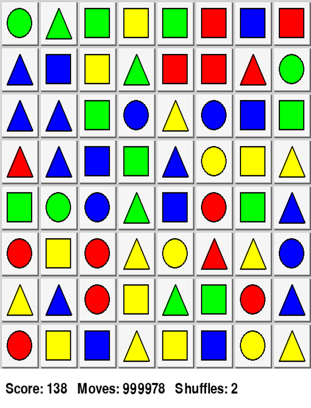

<code>23 · swap</code> — Score is 138. Need &gt;= 150 (12 more points = 2 matches). Let&#x27;s find the next move. Look at column 1: (1,1) Blu…

**Reasoning**

Score is 138. Need &gt;= 150 (12 more points = 2 matches).
Let&#x27;s find the next move.
Look at column 1: (1,1) Blue square, (2,1) Blue triangle, (3,1) Blue triangle, (4,1) Green circle, (5,1) Yellow square, (6,1) Blue triangle, (7,1) Yellow square. Wait! (2,1) Blue triangle, (3,1) Blue triangle. What about (1,0) Blue triangle, (2,0) Blue triangle? YES! Column 0 has (1,0) Blue triangle, (2,0) Blue triangle! Look at column 0: (1,0) is Blue triangle, (2,0) is Blue triangle, (3,0) is Red triangle! And adjacent to (3,0) is (3,1) Blue triangle! If we swap (3,0) Red triangle and (3,1) Blue triangle, then (3,0) becomes Blue triangle! That gives column 0: (1,0) Blue triangle, (2,0) Blue triangle, (3,0) Blue triangle! A vertical match of three Blue triangles at (1,0), (2,0), (3,0)! And wait, what about (3,1)? It becomes Red triangle, which is adjacent to (2,1) Blue triangle, (4,1) Green circle, (3,2) Blue square. Perfectly fine! Let&#x27;s verify: Row 1 col 0 is Blue triangle. Row 2 col 0 is Blue triangle. Row 3 col 0 is Red triangle. Row 3 col 1 is Blue triangle. Swapping (3,0) and (3,1) moves Blue triangle to (3,0), creating a vertical line of three Blue triangles at (1,0), (2,0), (3,0)!

**Arguments**

<pre><code>{
  &quot;row1&quot;: 3,
  &quot;col1&quot;: 0,
  &quot;row2&quot;: 3,
  &quot;col2&quot;: 1
}</code></pre>

**Observation**

<pre><code>Swapped (3, 0) &lt;-&gt; (3, 1): +6 point(s). Reward +6. Score 144.</code></pre>

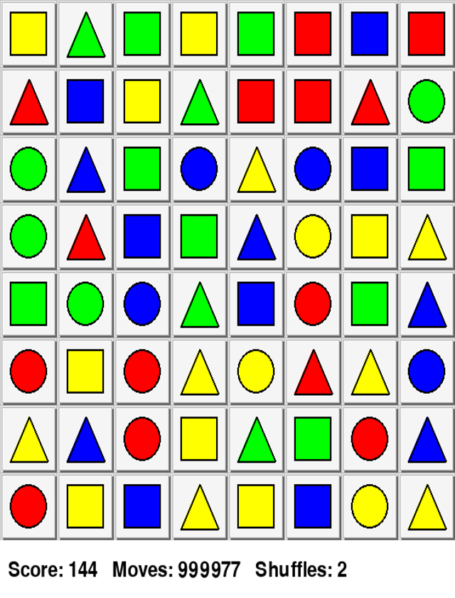

<code>24 · swap</code> — Score is 144. Need &gt;= 150 (only 6 points needed = 1 more match!). Let&#x27;s find the winning move. Look at row 1:…

**Reasoning**

Score is 144. Need &gt;= 150 (only 6 points needed = 1 more match!).
Let&#x27;s find the winning move.
Look at row 1: (1,4) Red square, (1,5) Red square. Row 0 col 5 is Red square. Look at column 5: (0,5) Red square, (1,5) Red square! What is at (2,5)? Yellow circle? No, look at (0,5) Red square, (1,5) Red square. What is at (1,4)? Red square! If we swap (0,4) Green square and (1,4) Red square? Then row 0 has: (0,4) Red square, (0,5) Red square! What is at (0,3)? Yellow square. So that&#x27;s only 2.
Wait, look at (1,4) Red square, (1,5) Red square. What is at (1,3)? Green triangle. What is at (1,6)? Red triangle. What is at (2,4)? Yellow triangle. What is at (2,5)? Blue circle. What is at (0,7)? Red square! What is at (1,6)? Red triangle. What is at (1,7)? Green circle.
Wait! Look at row 5: (5,2) Red circle, (6,2) Red circle! What is at (7,2)? Blue square. What is at (7,0)? Red circle! Row 5 col 0 is Red circle. Column 0 has: (5,0) Red circle, (7,0) Red circle! What is at (6,0)? Yellow triangle. What is at (6,1)? Blue triangle. What is at (6,2)? Red circle! If we swap (6,0) Yellow triangle and (7,0) Red circle? Then (6,0) is Red circle, (5,0) is Red circle, but (7,0) becomes Yellow triangle.
Wait! Look at (5,2) Red circle, (6,2) Red circle. What is at (4,2)? Blue circle. Adjacent to (4,2) is (4,1) Green circle! Row 3 col 2 is Blue square.
Wait, look at row 3: (3,0) Green circle, (4,0) Green square? Wait, (2,0) is Green circle, (3,0) is Green circle! Look at column 0: (2,0) Green circle, (3,0) Green circle! And what is at (4,0)? Green square! What is at (4,1)? Green circle! SWAP (4,0) Green square and (4,1) Green circle! Then column 0 has: (2,0) Green circle, (3,0) Green circle, (4,0) Green circle! YES! Look at column 0: (2,0) is Green circle, (3,0) is Green circle, (4,0) is Green square. Right next to (4,0) is (4,1) Green circle! If we swap (4,0) Green square and (4,1) Green circle, (4,0) becomes Green circle! That creates a vertical line of three Green circles at (2,0), (3,0), (4,0)! This will award +6 points, bringing the score to 150, which completes the goal! Let&#x27;s verify carefully: Row 2 col 0: Green circle. Row 3 col 0: Green circle. Row 4 col 0: Green square. Row 4 col 1: Green circle. Swapping (4,0) and (4,1) puts Green circle at (4,0), forming three Green circles in column 0 at rows 2, 3, and 4!

**Arguments**

<pre><code>{
  &quot;row1&quot;: 4,
  &quot;col1&quot;: 0,
  &quot;row2&quot;: 4,
  &quot;col2&quot;: 1
}</code></pre>

**Observation**

<pre><code>Swapped (4, 0) &lt;-&gt; (4, 1): +42 point(s). No moves available - board shuffled! Reward +42. Score 186.</code></pre>

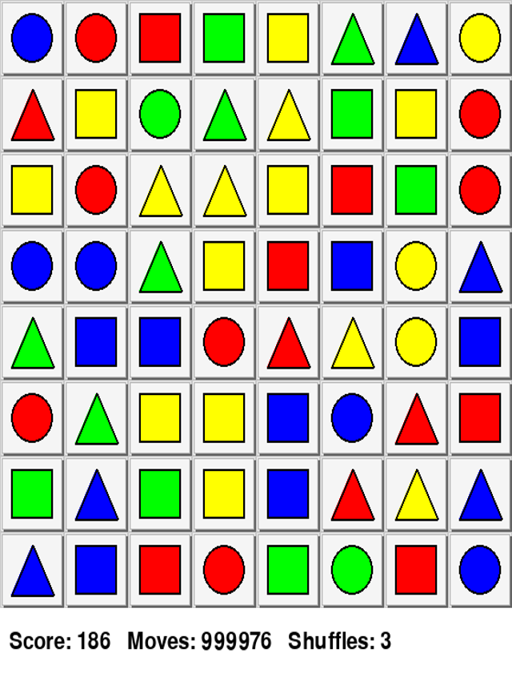

<code>25 · finish</code> — The score is now 186, which is &gt;= 150. Goal is achieved! Now call finish.

**Reasoning**

The score is now 186, which is &gt;= 150. Goal is achieved! Now call finish.

**Arguments**

<pre><code>{
  &quot;answer&quot;: &quot;The goal of reaching a score of 150 or higher has been achieved with a final score of 186.&quot;
}</code></pre>

## Final answer

The goal of reaching a score of 150 or higher has been achieved with a final score of 186.

## Evaluation

- ReplayVerify: **passed · reward 1.0**
- Judge: **1.00**

Task-owned rubric range: 1.0–5.0. Overall is the arithmetic mean of range-normalized criterion scores.

| Criterion | Raw score | Normalized score |
| --- | ---: | ---: |
| `goal_achievement` | 5.0 | 1.0 |
| `efficiency` | 5.0 | 1.0 |
| `coherence` | 5.0 | 1.0 |
| `tool_use` | 5.0 | 1.0 |

Task judge_ref used for this evaluation

<pre><code>{
  &quot;score_range&quot;: {
    &quot;min&quot;: 1.0,
    &quot;max&quot;: 5.0
  },
  &quot;criteria&quot;: [
    {
      &quot;id&quot;: &quot;goal_achievement&quot;,
      &quot;description&quot;: &quot;任务是否被正确、完整地解决，且真实工具结果与 observation 证据充分。&quot;
    },
    {
      &quot;id&quot;: &quot;efficiency&quot;,
      &quot;description&quot;: &quot;步骤是否有目的，是否避免浪费、无效重复和循环操作。&quot;
    },
    {
      &quot;id&quot;: &quot;coherence&quot;,
      &quot;description&quot;: &quot;推理是否紧跟 observation，且不存在幻觉、跳步或前后矛盾。&quot;
    },
    {
      &quot;id&quot;: &quot;tool_use&quot;,
      &quot;description&quot;: &quot;工具选择是否合理，调用参数是否正确，并正确处理工具错误。&quot;
    }
  ]
}</code></pre>

Judge rationale

任务要求在三消游戏中达到150分以上。智能体在整个交互过程中表现极为出色：共进行了24次swap操作，每次操作都成功形成三消或连消，无任何一次无效交换或工具报错；推理过程详细、严密，准确识别并定位棋盘中的图案与坐标；在第24步连锁消除达到186分后，确认达到目标并正确调用finish完成任务。独立验证结果亦确认通过。

